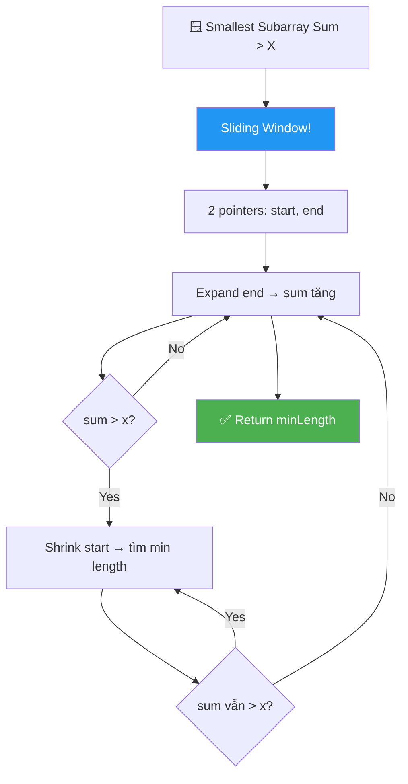
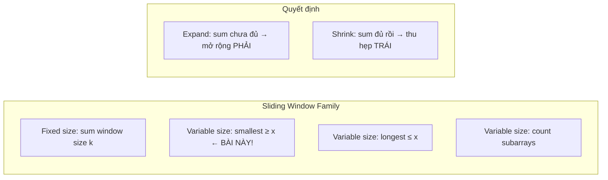
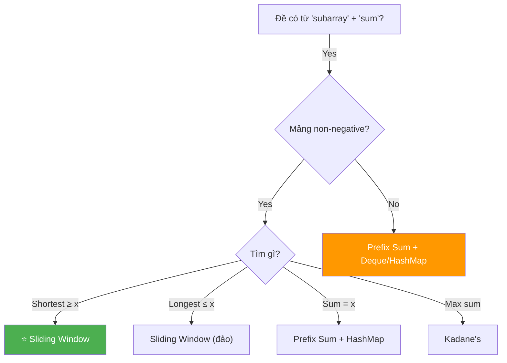

# 🪟 Smallest Subarray with Sum Greater Than X — GfG (Medium)

> 📖 Code: [Smallest Subarray Sum Greater Than X.js](./Smallest%20Subarray%20Sum%20Greater%20Than%20X.js)





---

## R — Repeat & Clarify

🧠 *"Tìm subarray NGẮN NHẤT có tổng STRICTLY lớn hơn x. Trả về LENGTH, không phải sum hay subarray."*

> 🎙️ *"Given an array of non-negative integers and a target x, find the minimum length subarray whose sum is strictly greater than x. Return 0 if no such subarray exists."*

### Clarification Questions

```
Q: "Greater than" hay "greater than or equal to"?
A: STRICTLY greater than! sum > x (KHÔNG PHẢI ≥)

Q: Mảng có số âm không?
A: Bài GfG gốc: toàn non-negative!
   → Sliding Window chỉ đúng với NON-NEGATIVE!
   → Nếu có số âm → cần approach khác (deque)!

Q: Không tìm được subarray nào thì sao?
A: Return 0 (hoặc -1 tùy đề)

Q: Return LENGTH hay subarray?
A: Chỉ LENGTH!

Q: Subarray rỗng có tính không?
A: KHÔNG! Ít nhất 1 phần tử.
```

### Tại sao bài này quan trọng?

```
  ⭐ Đây là BÀI KINH ĐIỂN của SLIDING WINDOW!

  BẠN PHẢI hiểu:
  1. Sliding Window = 2 con trỏ (start, end) di chuyển cùng chiều
  2. EXPAND end khi chưa đủ → SHRINK start khi dư
  3. CHỈ hoạt động với non-negative! (vì sum TĂNG khi expand)

  Pattern "Smallest subarray thỏa X":
  ┌───────────────────────────────────────────────────┐
  │  Smallest sum > x    → Sliding Window (bài này!) │
  │  Smallest sum ≥ x    → Sliding Window             │
  │  Longest sum ≤ x     → Sliding Window (đảo)       │
  │  Count subarrays ≤ x → Sliding Window + counting  │
  └───────────────────────────────────────────────────┘

  ⚠️ PREREQUISITE: Hiểu subarray + 2 vòng for!
     Xem: Generating All Subarrays.md
```

---

## 🧠 Bản chất bài toán — Hiểu để NHỚ, không chỉ để GIẢI

### Tưởng tượng: CỬA SỔ TRƯỢT trên dãy nhà!

```
  Mảng = dãy nhà, mỗi nhà có số tiền:
  [1, 4, 45, 6, 0, 19]

  Bạn cần tìm ĐOẠN NHÀ NGẮN NHẤT mà tổng tiền > 51.

  Cách làm: mở CỬA SỔ (window) trượt từ trái → phải!

  ① Bắt đầu: window = []
     → Mở rộng PHẢI: thêm nhà vào window
     → Sum tăng dần (vì toàn non-negative!)

  ② Khi sum > 51:
     → Thử thu hẹp TRÁI: bỏ nhà đầu tiên
     → Nếu sau khi bỏ, sum VẪN > 51 → bỏ tiếp!
     → Ghi nhận min length!

  ③ Khi sum ≤ 51:
     → Quay lại mở rộng PHẢI!

  CỬA SỔ chỉ TRƯỢT SANG PHẢI → mỗi phần tử vào/ra TỐI ĐA 1 lần!
  → O(n)!
```

### 2 thao tác: EXPAND và SHRINK

```
  ⭐ Sliding Window chỉ có 2 thao tác:

  EXPAND (mở rộng):
    → end++ → thêm arr[end] vào sum
    → Khi sum CHƯA đủ lớn

  SHRINK (thu hẹp):
    → start++ → bớt arr[start] khỏi sum
    → Khi sum ĐÃ đủ lớn → thử rút ngắn window!

  ┌─────────────────────────────────────────────────┐
  │  sum ≤ x  → EXPAND (cần thêm!)                  │
  │  sum > x  → SHRINK (thử rút ngắn!) + ghi min!  │
  └─────────────────────────────────────────────────┘

  ⚠️ Tại sao cả 2 chỉ đi SANG PHẢI?
     start LUÔN tăng, end LUÔN tăng → KHÔNG quay lại!
     → Mỗi phần tử vào window 1 lần, ra 1 lần!
     → Tổng operations ≤ 2n → O(n)!
```

### Tại sao Sliding Window chỉ đúng với NON-NEGATIVE?

```
  ⚠️ CRITICAL — Phải hiểu!

  NON-NEGATIVE (≥ 0):
    Thêm phần tử → sum TĂNG hoặc giữ nguyên
    Bỏ phần tử  → sum GIẢM hoặc giữ nguyên
    → MONOTONIC! expand luôn tăng sum, shrink luôn giảm sum!
    → Sliding Window ĐÚNG!

  CÓ SỐ ÂM:
    Thêm phần tử → sum có thể GIẢM!
    Bỏ phần tử  → sum có thể TĂNG!
    → KHÔNG monotonic! Shrink có thể LÀM TĂNG sum!
    → Sliding Window SAI!
    → Cần deque hoặc prefix sum approach!

  VÍ DỤ SAI với số âm:
    arr = [1, -1, 100], x = 50
    Window [1, -1, 100] sum=100 > 50 → shrink → bỏ 1
    Window [-1, 100] sum=99 > 50 → shrink → bỏ -1
    Window [100] sum=100 > 50 → length=1 ✅
    Nhưng nếu arr = [100, -1, 1], x = 50:
    Sliding window TÌM ĐƯỢC [100] length=1 ← may mắn đúng
    Cần CẨN THẬN: sliding window VẪN có thể sai nếu
    shrink bỏ qua window tốt hơn!
```



---

## 🧭 Luồng Suy Nghĩ — Từ đọc đề đến solution

> 💡 Phần này dạy bạn **CÁCH TƯ DUY** để tự giải bài, không chỉ biết đáp án.

### Bước 1: Đọc đề → Gạch chân KEYWORDS

```
  Đề: "Smallest subarray with sum strictly greater than x"

  Gạch chân:
    "smallest"    → MINIMIZE length → optimization!
    "subarray"    → LIÊN TIẾP!
    "sum > x"     → tổng phải VƯỢT x
    "non-negative"→ sliding window ĐÚNG!

  🧠 Tự hỏi: "Shortest subarray + sum condition + non-negative?"
    → SLIDING WINDOW! Kinh điển!

  📌 Kỹ năng chuyển giao:
    "Shortest/longest subarray + sum condition + non-negative"
    → Nghĩ ngay: SLIDING WINDOW!
```

### Bước 2: Vẽ ví dụ NHỎ bằng tay

```
  arr = [1, 4, 45, 6, 0, 19], x = 51

  Thử brute force (tất cả subarrays sum > 51):
    [1,4,45,6]     sum=56 > 51 → length 4
    [1,4,45,6,0]   sum=56 > 51 → length 5
    [1,4,45,6,0,19] sum=75 > 51 → length 6
    [4,45,6]       sum=55 > 51 → length 3 ⭐
    [4,45,6,0]     sum=55 > 51 → length 4
    [4,45,6,0,19]  sum=74 > 51 → length 5
    [45,6,0,19]    sum=70 > 51 → length 4

  → Min length = 3 (subarray [4, 45, 6]) ✅

  🧠 "Có cần thử TẤT CẢ subarrays?"
    → KHÔNG! Dùng sliding window, mỗi phần tử xử lý 1 lần!
```

### Bước 3: Brute Force → O(n²)

```
  🧠 "Cách naive?"
    for start = 0 → n-1:
      sum = 0
      for end = start → n-1:
        sum += arr[end]
        if (sum > x): update minLen, break!

  → O(n²) worst case
  → Tốt hơn O(n³) vì dùng incremental sum
  → Nhưng vẫn chậm!
```

### Bước 4: Optimize → Sliding Window O(n)

```
  🧠 "Tại sao O(n²) lãng phí?"
    Khi [1, 4, 45, 6] sum=56 > 51 → length 4
    Tôi biết [4, 45, 6] CHẮC CHẮN ≤ 56 (bỏ 1)
    → Nếu [4, 45, 6] vẫn > 51 → length 3 tốt hơn!
    → Không cần quay lại start=1 thử lại từ đầu!

  💡 INSIGHT: CỬA SỔ chỉ cần TRƯỢT SANG PHẢI!
    → start không bao giờ quay lại!
    → end không bao giờ quay lại!
    → O(n)!

  Algorithm:
    start = 0, sum = 0
    for end = 0 → n-1:
      sum += arr[end]          ← EXPAND
      while (sum > x):
        minLen = min(minLen, end - start + 1)
        sum -= arr[start]      ← SHRINK
        start++

  ✅ O(n) time, O(1) space!
```

---

## E — Examples

```
VÍ DỤ 1: arr = [1, 4, 45, 6, 0, 19], x = 51

  Window sliding:
    end=0: sum=1    ≤ 51
    end=1: sum=5    ≤ 51
    end=2: sum=50   ≤ 51
    end=3: sum=56   > 51! → min=4, shrink: sum-1=55 > 51!
                           → min=3, shrink: sum-4=51 ≤ 51 → stop
    end=4: sum=51   ≤ 51
    end=5: sum=70   > 51! → min=min(3,4)=3, shrink: sum-45=25 ≤ 51 → stop

  → minLen = 3 ✅ (subarray [4, 45, 6])
```

```
VÍ DỤ 2: arr = [1, 10, 5, 2, 7], x = 100

  Sum toàn mảng = 1+10+5+2+7 = 25 ≤ 100
  → Không có subarray nào sum > 100!
  → Return 0 ✅
```

```
VÍ DỤ 3: arr = [1, 11, 100, 1, 0, 200, 3, 2, 1, 250], x = 280

  Window:
    sum tích lũy... 100 tại index 2 → chưa đủ
    200 tại index 5 → sum lớn khi include 200...
    250 tại index 9 → sum lớn khi include 250...

  → Tìm window ngắn nhất sum > 280
  → Cần trace chi tiết (xem phần Code!)
```

### Minh họa CỬA SỔ TRƯỢT trực quan

```
  arr = [1, 4, 45, 6, 0, 19], x = 51

  Step 1: EXPAND
    [1]                sum=1    ≤ 51     expand →
    [1, 4]             sum=5    ≤ 51     expand →
    [1, 4, 45]         sum=50   ≤ 51     expand →
    [1, 4, 45, 6]      sum=56   > 51! ⭐  SHRINK!

  Step 2: SHRINK
    [1, 4, 45, 6]      sum=56   > 51     min=4, shrink →
       [4, 45, 6]      sum=55   > 51     min=3, shrink →
          [45, 6]      sum=51   ≤ 51     stop shrink!

  Step 3: EXPAND
          [45, 6, 0]   sum=51   ≤ 51     expand →
          [45, 6, 0, 19] sum=70 > 51! ⭐  SHRINK!

  Step 4: SHRINK
          [45, 6, 0, 19] sum=70 > 51   min=min(3,4)=3, shrink →
              [6, 0, 19]  sum=25 ≤ 51   stop!

  → End of array! minLen = 3 ✅

  BẢNG TÓM TẮT:
  ┌──────────────────────────────────────────────────────┐
  │  start  end    window          sum   > 51?  minLen   │
  │  0      0      [1]             1     No              │
  │  0      1      [1,4]           5     No              │
  │  0      2      [1,4,45]        50    No              │
  │  0      3      [1,4,45,6]      56    Yes!   4       │
  │  1      3      [4,45,6]        55    Yes!   3 ⭐    │
  │  2      3      [45,6]          51    No              │
  │  2      4      [45,6,0]        51    No              │
  │  2      5      [45,6,0,19]     70    Yes!   4→3     │
  │  3      5      [6,0,19]        25    No              │
  └──────────────────────────────────────────────────────┘
```

---

## A — Approach

### Approach 1: Brute Force — O(n²)

```
💡 Ý tưởng: Thử mọi start, tìm end sớm nhất mà sum > x

  for start = 0 → n-1:
    sum = 0
    for end = start → n-1:
      sum += arr[end]
      if (sum > x):
        minLen = min(minLen, end - start + 1)
        break     ← tìm NGẮN NHẤT từ start này → break!

  ✅ Đúng, O(n²) worst case
  ⚠️ break giúp tối ưu nhưng worst case vẫn O(n²)
```

### Approach 2: Sliding Window — O(n) ⭐

```
💡 Ý tưởng: 2 con trỏ start/end, cửa sổ chỉ trượt SANG PHẢI

  start = 0, sum = 0, minLen = Infinity

  for end = 0 → n-1:
    sum += arr[end]              ← EXPAND: thêm phần tử phải

    while (sum > x):             ← SHRINK: thử rút ngắn!
      minLen = min(minLen, end - start + 1)
      sum -= arr[start]
      start++

  return minLen === Infinity ? 0 : minLen

  ⚠️ while (không phải if) → shrink DẦN cho đến khi sum ≤ x!
```

### So sánh

```
  ┌──────────────────┬──────────┬──────────┬────────────────────┐
  │                  │ Time     │ Space    │ Ghi chú             │
  ├──────────────────┼──────────┼──────────┼────────────────────┤
  │ Brute Force      │ O(n²)    │ O(1)     │ 2 vòng for          │
  │ Sliding Window ⭐│ O(n)     │ O(1)     │ Amortized O(n)!     │
  └──────────────────┴──────────┴──────────┴────────────────────┘

  ⚠️ Tại sao Sliding Window là O(n)?
     start tăng TỐI ĐA n lần tổng (không bao giờ giảm!)
     end tăng ĐÚNG n lần
     → Tổng operations ≤ 2n → O(n)!
```

---

## C — Code

### Solution 1: Brute Force — O(n²)

```javascript
function smallestSubarrayBrute(arr, x) {
  const n = arr.length;
  let minLen = n + 1; // Initialize lớn hơn max possible

  for (let start = 0; start < n; start++) {
    let sum = 0;
    for (let end = start; end < n; end++) {
      sum += arr[end];
      if (sum > x) {
        minLen = Math.min(minLen, end - start + 1);
        break; // Tìm ngắn nhất từ start → break sớm!
      }
    }
  }

  return minLen > n ? 0 : minLen;
}
```

### Giải thích Brute Force

```
  for start: thử mọi điểm bắt đầu
  for end: mở rộng từ start

  Khi sum > x: GHI NHẬN length → BREAK!
    → Từ start này, subarray NGẮN NHẤT thỏa = đến end hiện tại
    → Không cần thử end lớn hơn (sẽ chỉ DÀI hơn!)

  minLen > n: không tìm thấy → return 0
```

### Solution 2: Sliding Window — O(n) ⭐

```javascript
function smallestSubarraySum(arr, x) {
  const n = arr.length;
  let start = 0;
  let sum = 0;
  let minLen = n + 1;

  for (let end = 0; end < n; end++) {
    sum += arr[end]; // ⭐ EXPAND: thêm phần tử bên phải

    // ⭐ SHRINK: thu hẹp từ trái khi sum đủ lớn
    while (sum > x) {
      minLen = Math.min(minLen, end - start + 1);
      sum -= arr[start]; // Bỏ phần tử bên trái
      start++;
    }
  }

  return minLen > n ? 0 : minLen;
}
```

### Giải thích Sliding Window — CHI TIẾT

```
  BIẾN:
    start = con trỏ TRÁI (bắt đầu window)
    end   = con trỏ PHẢI (kết thúc window) — for loop
    sum   = tổng window hiện tại
    minLen = độ dài min tìm được

  EXPAND: sum += arr[end]
    → MỖI vòng for, thêm 1 phần tử bên PHẢI
    → Sum tăng (hoặc giữ nguyên nếu arr[end]=0)

  SHRINK: while (sum > x)
    → Khi sum đủ lớn → THỬ rút ngắn!
    → Ghi nhận length TRƯỚC khi shrink
    → Bỏ arr[start], start++
    → Lặp lại cho đến khi sum ≤ x

  ⚠️ Tại sao WHILE chứ không phải IF?
     Có thể shrink NHIỀU LẦN liên tiếp!
     VD: arr = [1, 1, 1, 100], x = 3
     Khi end=3: sum=103 > 3
       → shrink: bỏ 1, sum=102 > 3 → tiếp!
       → shrink: bỏ 1, sum=101 > 3 → tiếp!
       → shrink: bỏ 1, sum=100 > 3 → tiếp!
       → shrink: bỏ 100, sum=0 ≤ 3 → stop!

  ⚠️ GHI NHẬN min TRƯỚC khi shrink!
     minLen = min(minLen, end - start + 1)
     → Window hiện tại [start..end] thỏa sum > x
     → Ghi nhận length CỦA window này!
     → RỒI MỚI shrink!
```

### Trace CHI TIẾT: arr = [1, 4, 45, 6, 0, 19], x = 51

```
  n = 6, start = 0, sum = 0, minLen = 7 (n+1)

  ═══ end=0: arr[0]=1 ════════════════════════════════════
  sum += 1 → sum = 1
  sum(1) ≤ 51 → no shrink

  ═══ end=1: arr[1]=4 ════════════════════════════════════
  sum += 4 → sum = 5
  sum(5) ≤ 51 → no shrink

  ═══ end=2: arr[2]=45 ═══════════════════════════════════
  sum += 45 → sum = 50
  sum(50) ≤ 51 → no shrink

  ═══ end=3: arr[3]=6 ════════════════════════════════════
  sum += 6 → sum = 56
  sum(56) > 51 → SHRINK!
    minLen = min(7, 3-0+1) = min(7, 4) = 4 ⭐
    sum -= arr[0]=1 → sum = 55, start = 1
  sum(55) > 51 → SHRINK!
    minLen = min(4, 3-1+1) = min(4, 3) = 3 ⭐⭐
    sum -= arr[1]=4 → sum = 51, start = 2
  sum(51) ≤ 51 → stop shrink

  ═══ end=4: arr[4]=0 ════════════════════════════════════
  sum += 0 → sum = 51
  sum(51) ≤ 51 → no shrink

  ═══ end=5: arr[5]=19 ═══════════════════════════════════
  sum += 19 → sum = 70
  sum(70) > 51 → SHRINK!
    minLen = min(3, 5-2+1) = min(3, 4) = 3
    sum -= arr[2]=45 → sum = 25, start = 3
  sum(25) ≤ 51 → stop shrink

  ═══ KẾT QUẢ ═══════════════════════════════════════════
  minLen = 3, 3 ≤ 6 → return 3 ✅

  📊 Tổng operations:
    end tăng: 6 lần
    start tăng: 3 lần (0→1, 1→2, 2→3)
    Tổng: 9 < 2n = 12 → O(n)! ✅
```

### Trace Edge Case: arr = [1, 10, 5, 2, 7], x = 100

```
  n = 5, sum = 0, minLen = 6

  end=0: sum=1   ≤ 100
  end=1: sum=11  ≤ 100
  end=2: sum=16  ≤ 100
  end=3: sum=18  ≤ 100
  end=4: sum=25  ≤ 100

  → minLen = 6 > n=5 → return 0 ✅
  (Không có subarray nào sum > 100!)
```

### Trace: arr = [100], x = 50

```
  n = 1, sum = 0, minLen = 2

  end=0: sum=100 > 50 → SHRINK!
    minLen = min(2, 0-0+1) = min(2, 1) = 1
    sum -= 100 → sum = 0, start = 1
  sum(0) ≤ 50 → stop

  → return 1 ✅ (1 phần tử đủ!)
```

> 🎙️ *"I use a variable-size sliding window with two pointers. The right pointer expands the window by adding elements to the sum. When the sum exceeds x, I try shrinking from the left — recording the minimum length each time — until the sum drops to x or below. Each element enters and leaves the window at most once, giving O(n) total."*

---

## O — Optimize

```
                    Time      Space     Ghi chú
  ─────────────────────────────────────────────────
  Brute Force       O(n²)     O(1)      2 vòng for
  Sliding Window ⭐ O(n)      O(1)      Amortized O(n)

  ⚠️ Tại sao O(n) là ĐÚNG?
    AMORTIZED ANALYSIS:
    → start tăng TỐI ĐA n lần (0 → n-1)
    → end tăng ĐÚNG n lần (for loop)
    → Mỗi phần tử: vào window 1 lần + ra 1 lần = 2 ops
    → Tổng: 2n operations → O(n)!

  ⚠️ "while loop bên trong for → O(n²)?"
    → KHÔNG! Vì start KHÔNG BAO GIỜ QUAY LẠI!
    → Total shrink operations ≤ n!
    → Giống amortized analysis của Cyclic Sort!

  ⚠️ Giới hạn: CHỈ đúng với non-negative!
    Có số âm → cần O(n log n) với deque!
```

---

## T — Test

```
Test Cases:
  [1, 4, 45, 6, 0, 19],  x=51   → 3     ✅ [4, 45, 6]
  [1, 10, 5, 2, 7],      x=100  → 0     ✅ không tìm thấy
  [100],                  x=50   → 1     ✅ 1 phần tử đủ
  [1, 2, 3, 4, 5],       x=11   → 3     ✅ [3, 4, 5]
  [5, 1, 3, 5, 10, 7, 4, 9, 2, 8], x=15 → 2  ✅ [10, 7]
  [1, 1, 1, 1, 1],       x=3    → 4     ✅ [1,1,1,1]
  [0, 0, 0, 0],          x=0    → 0     ✅ toàn 0, không có sum > 0
  [10, 20, 30],           x=5   → 1     ✅ [10] đủ
```

---

## 🗣️ Interview Script

> 🎙️ *"I recognize this as a classic sliding window problem since we need the shortest subarray with sum exceeding a threshold, and the array has non-negative elements. I maintain two pointers — expanding the right to grow the sum, and shrinking the left whenever the sum exceeds x to find the minimum length. Each element enters and exits the window at most once, so it's O(n) amortized."*

### Think Out Loud — Quá trình suy nghĩ

```
  🧠 BƯỚC 1: Đọc đề → phát hiện keywords
    "smallest subarray" + "sum > x" + "non-negative"
    → SLIDING WINDOW! Classic!

  🧠 BƯỚC 2: Brute force
    "2 vòng for: thử mọi start, expand end đến sum > x"
    → O(n²)

  🧠 BƯỚC 3: Optimize
    "start không cần quay lại! Khi sum > x, shrink từ trái"
    "→ Mỗi phần tử vào/ra tối đa 1 lần → O(n)!"

  🧠 BƯỚC 4: Edge cases
    "Không tìm thấy? → return 0"
    "1 phần tử > x? → return 1"
    "Toàn 0? → return 0 (0 > 0 = false!)"

  🧠 BƯỚC 5: Giới hạn
    "Chỉ đúng với non-negative!"
    "Có số âm → cần deque approach"

  🎙️ Interview phrasing:
    "This is a variable-size sliding window. I expand from the
     right until sum exceeds x, then shrink from the left to
     minimize length. Because elements are non-negative, expanding
     always increases sum and shrinking always decreases it — so
     both pointers only move right. Amortized O(n) time, O(1) space."
```

### Biến thể & Mở rộng

```
  Biến thể phổ biến:

  1. Smallest subarray sum ≥ x (LeetCode #209)
     → Giống! Đổi > thành ≥
     → while (sum >= x)

  2. LONGEST subarray sum ≤ x
     → ĐẢO CHIỀU sliding window!
     → Expand khi sum ≤ x → ghi max length
     → Shrink khi sum > x

  3. Count subarrays sum ≤ x
     → Khi window [start..end] thỏa: có (end-start+1) subarrays!
     → count += end - start + 1

  4. Smallest subarray sum > x VỚI SỐ ÂM
     → Sliding Window KHÔNG ĐÚNG!
     → Dùng Prefix Sum + Monotonic Deque → O(n)
     → Hoặc sort prefix sums → O(n log n)

  5. Fixed-size window sum
     → Window size = k → chỉ cần 1 vòng for!
     → sum = sum - arr[i-k] + arr[i]
```

### So sánh với bài liên quan

```
  ┌──────────────────────────────────────────────────────────┐
  │  Bài toán              Technique           Complexity    │
  │  ────────────────────────────────────────────────        │
  │  Smallest sum > x ⭐   Sliding Window      O(n)         │
  │  Longest sum ≤ x       Sliding Window      O(n)         │
  │  Subarray sum = k      Prefix + HashMap    O(n)         │
  │  Max subarray sum      Kadane's            O(n)         │
  │  Min window substring  Sliding Window      O(n)         │
  │  Longest no repeat     Sliding Window + Set O(n)         │
  └──────────────────────────────────────────────────────────┘

  KEY INSIGHT:
  → "Shortest/longest subarray" + "non-negative" → Sliding Window!
  → 2 con trỏ cùng hướng → amortized O(n)!
  → Expand khi CHƯA ĐỦ, Shrink khi ĐÃ ĐỦ!
```

### Kiến thức liên quan

```
  SMALLEST SUBARRAY SUM > X → Sliding Window!

  Lộ trình học (progression):
  ┌───────────────────────────────────────────────────────────┐
  │  Generate All Subarrays (hiểu subarray)                   │
  │         ↓                                                  │
  │  Kadane's Algorithm (max sum → 1 pass)                    │
  │         ↓                                                  │
  │  ⭐ Smallest Subarray Sum > X (bài này!)                  │
  │         ↓                                                  │
  │  Longest Substring Without Repeating (SW + Set)            │
  │         ↓                                                  │
  │  Minimum Window Substring (SW + HashMap)                   │
  └───────────────────────────────────────────────────────────┘

  ⭐ QUY TẮC VÀNG:
    Variable-size Sliding Window = 2 pointers cùng chiều!
    EXPAND: chưa đủ → mở rộng phải
    SHRINK: đã đủ → thu hẹp trái + ghi nhận!
    Mỗi phần tử vào/ra max 1 lần → O(n)!
```

---

## 🧩 Sai lầm phổ biến

```
❌ SAI LẦM #1: Dùng IF thay vì WHILE cho shrink!

   SAI:
   if (sum > x) {           ← chỉ shrink 1 LẦN!
     minLen = ...
     sum -= arr[start++];
   }

   ĐÚNG:
   while (sum > x) {        ← shrink CHO ĐẾN KHI không thỏa!
     minLen = ...
     sum -= arr[start++];
   }

   VÍ DỤ: arr = [1, 1, 1, 100], x = 3
   Khi sum = 103 → cần shrink 3 lần (bỏ 3 số 1)!
   IF chỉ bỏ 1 → MISS minimum length!

─────────────────────────────────────────────────────

❌ SAI LẦM #2: Ghi nhận minLen SAU khi shrink!

   SAI:
   while (sum > x) {
     sum -= arr[start++];
   }
   minLen = min(minLen, end - start + 1);  ← SAU shrink → sum ≤ x!
   → Window hiện tại KHÔNG thỏa sum > x nữa!

   ĐÚNG:
   while (sum > x) {
     minLen = min(minLen, end - start + 1);  ← TRƯỚC shrink!
     sum -= arr[start++];
   }

─────────────────────────────────────────────────────

❌ SAI LẦM #3: Dùng Sliding Window cho mảng CÓ SỐ ÂM!

   arr = [2, -1, 100], x = 50
   Sliding window có thể BỎ QUA window tốt!
   Vì shrink có thể LÀM TĂNG sum (bỏ số âm)!

   → Chỉ dùng Sliding Window cho NON-NEGATIVE!

─────────────────────────────────────────────────────

❌ SAI LẦM #4: Quên return 0 khi không tìm thấy!

   minLen = n + 1 (sentinel value)
   Nếu KHÔNG có subarray sum > x → minLen vẫn = n + 1

   return minLen > n ? 0 : minLen;  ← CHECK!

   Hoặc: minLen = Infinity → return minLen === Infinity ? 0 : minLen

─────────────────────────────────────────────────────

❌ SAI LẦM #5: Nhầm > với ≥ !

   Đề: "strictly greater than" → sum > x
   Nếu ≥: while (sum >= x)
   Nếu >: while (sum > x)

   VÍ DỤ: x=51, sum=51
   > :  51 > 51 = false → KHÔNG shrink ← ĐÚNG cho bài này!
   ≥ :  51 ≥ 51 = true → shrink        ← cho biến thể khác!
```

---

## 📝 Flashcard — Tự kiểm tra

| ❓ Câu hỏi | ✅ Đáp án |
|---|---|
| Bài này dùng technique gì? | **Sliding Window** (variable size) |
| 2 thao tác chính? | **EXPAND** (end++) và **SHRINK** (start++) |
| Khi nào expand? | Khi sum ≤ x (chưa đủ) |
| Khi nào shrink? | Khi sum > x (đã đủ, thử rút ngắn!) |
| Tại sao O(n)? | Mỗi phần tử vào/ra window TỐI ĐA 1 lần → 2n |
| Tại sao WHILE không phải IF? | Có thể shrink NHIỀU LẦN liên tiếp |
| Ghi nhận min TRƯỚC hay SAU shrink? | **TRƯỚC!** (window hiện tại thỏa sum > x) |
| Chỉ đúng với mảng gì? | **Non-negative** (≥ 0)! |
| Không tìm thấy → return? | **0** |
| Bài tương tự trên LeetCode? | **#209** Minimum Size Subarray Sum |
