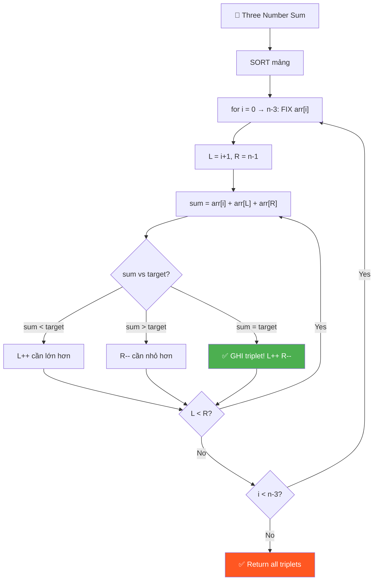
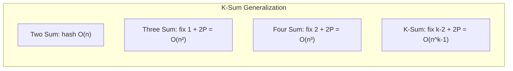
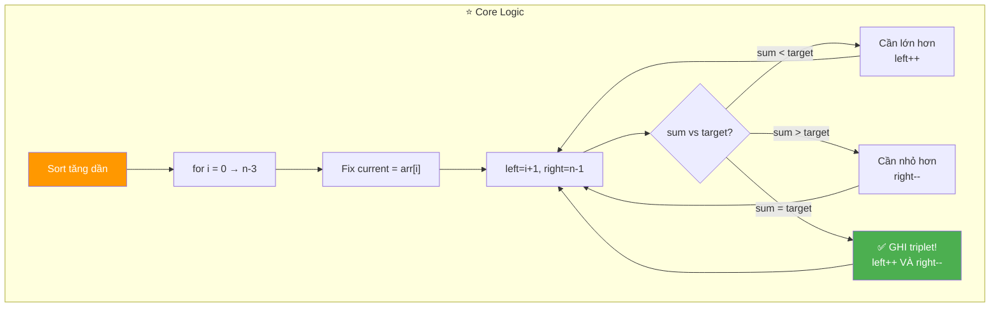
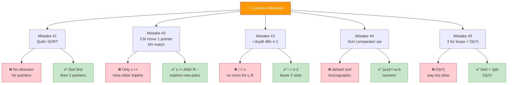
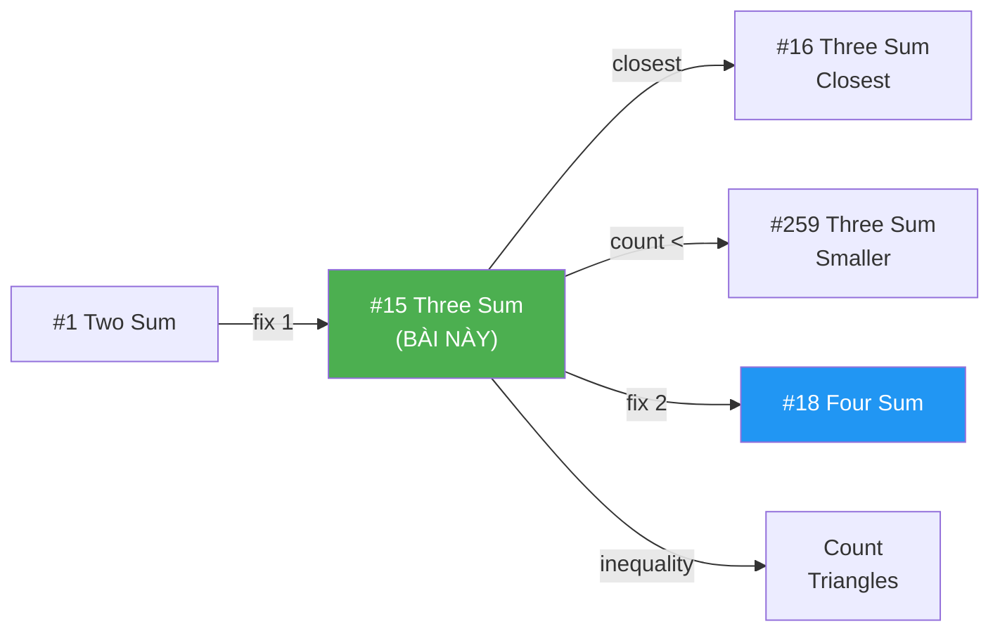
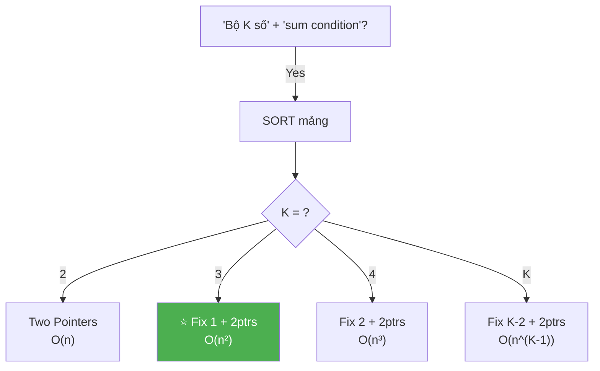
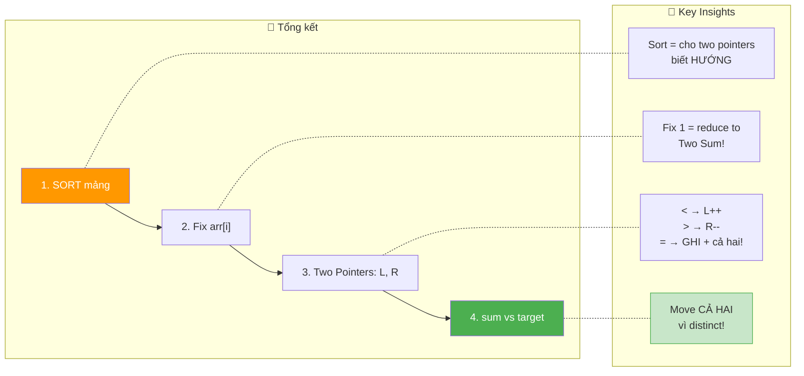

# 🔢 Three Number Sum (AlgoExpert / LeetCode #15)

> 📖 Code: [Three Number Sum.js](./Three%20Number%20Sum.js)





---

## 🧠 Bản chất bài toán — Hiểu để NHỚ, không chỉ để GIẢI

> ⚡ **Đọc phần này TRƯỚC. Nếu bạn chỉ nhớ 1 thứ, nhớ phần này.**

### 1️⃣ Analogy — Ví dụ đời thường

```
🎯 GỌI 3 NGƯỜI LÊN SÂN KHẤU — đây là TẤT CẢ bạn cần nhớ!

  Mỗi người có 1 SỐ trên áo. MC cần 3 người TỔNG = 0.

  Cách ngu: thử TẤT CẢ bộ 3 → O(n³) → quá chậm!

  Cách khôn: XẾP HÀNG theo số (sort!), rồi:
    ① Cố định 1 người (current number)
    ② Đặt L ở ĐẦU hàng, R ở CUỐI hàng
    ③ Tổng < target? → L tiến phải (cần LỚN hơn!)
       Tổng > target? → R tiến trái (cần NHỎ hơn!)
       Tổng = target? → GHI LẠI! Cả L và R tiến vào!

  Giống Two Sum, nhưng FIX 1 số → chạy Two Sum cho 2 số còn lại!
```

### 2️⃣ Recipe — Sort + Fix + Two Pointers

```
📝 RECIPE:

  Bước 1: SORT mảng (ascending)
  Bước 2: Duyệt i từ 0 → n-3 (fix current number)
  Bước 3: left = i+1, right = n-1
  Bước 4: While left < right:
           sum = arr[i] + arr[left] + arr[right]
           sum < target → left++
           sum > target → right--
           sum = target → GHI! left++ VÀ right--
```

```javascript
// BẢN CHẤT:
function threeNumberSum(array, targetSum) {
  array.sort((a, b) => a - b);
  const triplets = [];
  for (let i = 0; i < array.length - 2; i++) {
    let left = i + 1;
    let right = array.length - 1;
    while (left < right) {
      const sum = array[i] + array[left] + array[right];
      if (sum === targetSum) {
        triplets.push([array[i], array[left], array[right]]);
        left++;
        right--;
      } else if (sum < targetSum) {
        left++;
      } else {
        right--;
      }
    }
  }
  return triplets;
}
```

### 3️⃣ Visual — Hình ảnh ghi vào đầu

```
array = [12, 3, 1, 2, -6, 5, -8, 6]    targetSum = 0
sorted = [-8, -6, 1, 2, 3, 5, 6, 12]

Fix i=0 (current = -8):
  [-8, -6, 1, 2, 3, 5, 6, 12]
    i   L                   R

  sum = -8 + (-6) + 12 = -2 < 0    → L++
  [-8, -6, 1, 2, 3, 5, 6, 12]
    i      L                R

  sum = -8 + 1 + 12 = 5 > 0        → R--
  [-8, -6, 1, 2, 3, 5, 6, 12]
    i      L           R

  sum = -8 + 1 + 6 = -1 < 0        → L++
  [-8, -6, 1, 2, 3, 5, 6, 12]
    i         L        R

  sum = -8 + 2 + 6 = 0 = target!   → GHI [-8, 2, 6]! L++ R--
  [-8, -6, 1, 2, 3, 5, 6, 12]
    i            L  R

  sum = -8 + 3 + 5 = 0 = target!   → GHI [-8, 3, 5]! L++ R--
  L >= R → XONG vòng i=0!

Fix i=1 (current = -6):
  [-8, -6, 1, 2, 3, 5, 6, 12]
        i  L                R

  sum = -6 + 1 + 12 = 7 > 0        → R--
  sum = -6 + 1 + 6 = 1 > 0         → R--
  sum = -6 + 1 + 5 = 0 = target!   → GHI [-6, 1, 5]! L++ R--
  sum = -6 + 2 + 3 = -1 < 0        → L++
  L >= R → XONG!

  ... tiếp tục cho i=2,3,... (không tìm thêm)

Kết quả: [[-8, 2, 6], [-8, 3, 5], [-6, 1, 5]] ✅
```

### 4️⃣ Tại sao phải SORT?

```
❓ "SORT để làm gì?"

  SORT → mảng có THỨ TỰ → biết HƯỚNG di chuyển pointer!

  sum < target? → Cần TĂNG sum → L++ (số LỚN hơn bên phải!)
  sum > target? → Cần GIẢM sum → R-- (số NHỎ hơn bên trái!)

  Nếu KHÔNG sort: không biết di chuyển L hay R!
  Nếu CÓ sort: mỗi bước LOẠI BỎ 1 khả năng → O(n) cho mỗi i!
```

### 5️⃣ Flashcard — Tự kiểm tra

| ❓ Câu hỏi                    | ✅ Đáp án                                             |
| ----------------------------- | ----------------------------------------------------- |
| Bước đầu tiên?                | **SORT** mảng!                                        |
| i duyệt đến đâu?              | `n-3` (cần chừa 2 chỗ cho L, R)                       |
| L bắt đầu ở đâu?              | `i + 1` (ngay sau current number)                     |
| R bắt đầu ở đâu?              | `n - 1` (cuối mảng)                                   |
| sum < target?                 | `left++` (cần số lớn hơn)                             |
| sum > target?                 | `right--` (cần số nhỏ hơn)                            |
| sum = target?                 | Ghi lại + `left++` VÀ `right--`                       |
| Tại sao move CẢ HAI khi bằng? | Vì integers distinct: chỉ move 1 → chắc chắn ≠ target |
| Time?                         | **O(n²)** — for loop × while loop                     |
| Space?                        | **O(n)** — lưu triplets                               |
| Relation to Two Sum?          | Fix 1 số → Two Sum cho 2 số còn lại!                  |

### 6️⃣ Sai lầm phổ biến

```
❌ SAI LẦM #1: Quên SORT!

   Two pointers CHỈ hoạt động khi mảng SORTED!
   Không sort → không biết move pointer nào!

─────────────────────────────────────────────────────

❌ SAI LẦM #2: Chỉ move 1 pointer khi sum = target!

   Khi tìm thấy triplet:
   Nếu chỉ left++: sum mới > target (chắc chắn!)
   Nếu chỉ right--: sum mới < target (chắc chắn!)
   → Phải move CẢ HAI! (vì distinct → cùng vị trí không lặp)

─────────────────────────────────────────────────────

❌ SAI LẦM #3: i duyệt đến n-1!

   for (let i = 0; i < array.length; i++) ← SAI!
   → Cần chừa 2 chỗ cho L và R!
   → i < array.length - 2

─────────────────────────────────────────────────────

❌ SAI LẦM #4: Dùng 3 for loops = O(n³)!

   Chậm gấp n lần! Sort + 2 pointers = O(n²)!
```

---

### 7️⃣ Cách TƯ DUY — Gặp lại vẫn làm được!

```
🧠 Framework:

  ❶ "Tìm BỘ 3 → reduce thành Two Sum!"
  ❷ "Fix 1 số → tìm 2 số còn lại sum = target - fixed"
  ❸ "Two Sum trên sorted array = TWO POINTERS!"

  Three Sum = for loop (fix) + Two Sum (2 pointers)!
```

**💡 Pattern mở rộng:**

```
┌────────────────────────────────────────────────────┐
│  Two Sum:   hash table HOẶC sort + 2 pointers      │
│  Three Sum: sort + fix 1 + 2 pointers = O(n²)     │
│  Four Sum:  sort + fix 2 + 2 pointers = O(n³)     │
│                                                    │
│  K-Sum = fix (k-2) số + Two Sum cho 2 còn lại!    │
│  Time: O(n^(k-1))                                  │
└────────────────────────────────────────────────────┘
```

---

> 📚 **GIẢI THÍCH CHI TIẾT + INTERVIEW SCRIPT bên dưới.**

---

## R — Repeat & Clarify

💬 _"Cho mảng distinct integers và targetSum. Tìm TẤT CẢ bộ 3 số (triplets) có tổng = targetSum."_

### Câu hỏi:

1. **"Số có trùng nhau?"** → KHÔNG! Distinct.
2. **"Return tất cả triplets hay chỉ 1?"** → TẤT CẢ!
3. **"Triplets có thứ tự?"** → Sorted ascending trong mỗi triplet.
4. **"Có thể dùng 1 số 2 lần?"** → KHÔNG!
5. **"Không có triplet?"** → Return mảng rỗng.

---

## E — Examples

```
VÍ DỤ 1: [12,3,1,2,-6,5,-8,6], target=0
  → [[-8,2,6], [-8,3,5], [-6,1,5]]

VÍ DỤ 2: [1,2,3], target=6
  → [[1,2,3]]

VÍ DỤ 3: [1,2,3], target=10
  → [] (không có)

VÍ DỤ 4: [-1,0,1,2,-1,-4], target=0  (LeetCode version, có trùng!)
  → [[-1,-1,2], [-1,0,1]]
```

---

## A — Approach

```
┌──────────────────────────────────────────────────────────┐
│ APPROACH 1: BRUTE FORCE — 3 for loops                    │
│ → Thử TẤT CẢ bộ 3                                       │
│ → Time: O(n³) | Space: O(n)                             │
├──────────────────────────────────────────────────────────┤
│ APPROACH 2: SORT + TWO POINTERS ⭐                       │
│ → Sort + fix 1 + left/right pointers                     │
│ → Time: O(n²) | Space: O(n)                             │
└──────────────────────────────────────────────────────────┘
```

---

## C — Code

### Approach 1: Brute Force — O(n³)

```javascript
function threeNumberSumBrute(array, targetSum) {
  array.sort((a, b) => a - b);
  const triplets = [];
  for (let i = 0; i < array.length - 2; i++) {
    for (let j = i + 1; j < array.length - 1; j++) {
      for (let k = j + 1; k < array.length; k++) {
        if (array[i] + array[j] + array[k] === targetSum) {
          triplets.push([array[i], array[j], array[k]]);
        }
      }
    }
  }
  return triplets;
}
```

### Approach 2: Sort + Two Pointers — O(n²) ⭐

```javascript
function threeNumberSum(array, targetSum) {
  array.sort((a, b) => a - b); // SORT!
  const triplets = [];

  for (let i = 0; i < array.length - 2; i++) {
    let left = i + 1;
    let right = array.length - 1;

    while (left < right) {
      const sum = array[i] + array[left] + array[right];

      if (sum === targetSum) {
        triplets.push([array[i], array[left], array[right]]);
        left++; // move CẢ HAI!
        right--;
      } else if (sum < targetSum) {
        left++; // cần lớn hơn
      } else {
        right--; // cần nhỏ hơn
      }
    }
  }
  return triplets;
}
```

### Trace chi tiết:

```
array = [12, 3, 1, 2, -6, 5, -8, 6], targetSum = 0
sorted = [-8, -6, 1, 2, 3, 5, 6, 12]

━━━ i=0, current=-8 ━━━
  L=1(-6), R=7(12): sum = -8-6+12 = -2 < 0 → L++
  L=2(1),  R=7(12): sum = -8+1+12 = 5  > 0 → R--
  L=2(1),  R=6(6):  sum = -8+1+6  = -1 < 0 → L++
  L=3(2),  R=6(6):  sum = -8+2+6  = 0  ✅ → GHI [-8,2,6]! L++ R--
  L=4(3),  R=5(5):  sum = -8+3+5  = 0  ✅ → GHI [-8,3,5]! L++ R--
  L=5, R=4: L >= R → XONG!

━━━ i=1, current=-6 ━━━
  L=2(1),  R=7(12): sum = -6+1+12 = 7  > 0 → R--
  L=2(1),  R=6(6):  sum = -6+1+6  = 1  > 0 → R--
  L=2(1),  R=5(5):  sum = -6+1+5  = 0  ✅ → GHI [-6,1,5]! L++ R--
  L=3(2),  R=4(3):  sum = -6+2+3  = -1 < 0 → L++
  L=4, R=4: L >= R → XONG!

━━━ i=2, current=1 ━━━
  L=3(2),  R=7(12): sum = 1+2+12 = 15 > 0 → R--
  ... giảm dần, nhưng min sum = 1+2+3 = 6 > 0 → KHÔNG tìm thấy

━━━ i=3,4,5: tương tự, không tìm thêm ━━━

Kết quả: [[-8,2,6], [-8,3,5], [-6,1,5]] ✅
```

---

## 🔬 Deep Dive — Giải thích CHI TIẾT từng dòng

> 💡 Phần này phân tích **từng dòng** Sort + Two Pointers để bạn hiểu **TẠI SAO**.

```javascript
function threeNumberSum(array, targetSum) {
  // ═══════════════════════════════════════════════════════════
  // DÒNG 1: SORT — biến mảng hỗn loạn → có THỨ TỰ!
  // ═══════════════════════════════════════════════════════════
  //
  // TẠI SAO sort?
  //   → Two pointers CẦN thứ tự để biết HƯỚNG di chuyển!
  //   → sum < target → L++ (số LỚN hơn ở bên phải!)
  //   → sum > target → R-- (số NHỎ hơn ở bên trái!)
  //   → Không sort → không biết move pointer nào!
  //
  // ⚠️ sort((a,b) => a-b) QUAN TRỌNG!
  //   Nếu quên comparator → sort lexicographic:
  //   [12, 3, -8] → ["-8", "12", "3"] → SAI!
  //
  // Time: O(n log n) — bị dominated bởi O(n²) ở main loop
  //
  array.sort((a, b) => a - b);
  const triplets = [];

  // ═══════════════════════════════════════════════════════════
  // DÒNG 2: Fix current number — "Reduce to Two Sum!"
  // ═══════════════════════════════════════════════════════════
  //
  // TẠI SAO i < array.length - 2?
  //   → Cần chừa 2 chỗ cho left (i+1) và right (n-1)
  //   → i = n-2 → left = n-1 = right → left < right? NO → vô ích
  //   → i = n-3 → left = n-2, right = n-1 → minimum valid case!
  //
  // TẠI SAO duyệt TỪNG i?
  //   → Fix array[i] → bài toán CÒN LẠI là Two Sum!
  //   → Tìm 2 số trong [i+1..n-1] có tổng = targetSum - array[i]
  //   → Two Sum trên sorted array = TWO POINTERS!
  //
  for (let i = 0; i < array.length - 2; i++) {
    let left = i + 1;
    let right = array.length - 1;

    // ═══════════════════════════════════════════════════════
    // DÒNG 3-7: Two Pointers — tìm cặp (left, right)
    // ═══════════════════════════════════════════════════════
    //
    // left bắt đầu ĐẦU (nhỏ nhất trong range)
    // right bắt đầu CUỐI (lớn nhất trong range)
    //
    // Mỗi step: left tăng HOẶC right giảm → converge!
    // → Tối đa (right - left) = n - i - 2 steps mỗi i
    //
    while (left < right) {
      const sum = array[i] + array[left] + array[right];

      if (sum === targetSum) {
        // ─── FOUND! Ghi triplet ───
        //
        // array[i] < array[left] < array[right] (vì sorted, i < left < right)
        // → Triplet TỰ ĐỘNG sorted! Không cần sort lại!
        //
        triplets.push([array[i], array[left], array[right]]);

        // ─── Move CẢ HAI pointer ───
        //
        // TẠI SAO move cả hai?
        //   Elements DISTINCT → chỉ move left → sum CHẮC CHẮN tăng
        //   → sum > target → guaranteed miss → vô ích!
        //   Chỉ move right → sum CHẮC CHẮN giảm → cũng miss!
        //   → Move CẢ HAI = cách DUY NHẤT tìm triplet mới!
        //
        left++;
        right--;
      } else if (sum < targetSum) {
        // ─── Sum quá NHỎ → cần TĂNG ───
        //
        // array sorted → số BÊN PHẢI lớn hơn
        // → left++ = thay array[left] bằng giá trị LỚN HƠN
        // → sum sẽ TĂNG!
        //
        // TẠI SAO không right++?
        //   right ĐÃ Ở CUỐI (n-1)! Không thể tăng!
        //
        left++;
      } else {
        // ─── Sum quá LỚN → cần GIẢM ───
        //
        // → right-- = thay array[right] bằng giá trị NHỎ HƠN
        // → sum sẽ GIẢM!
        //
        right--;
      }
    }
  }
  return triplets;
}
```



---

## 📐 Invariant — Chứng minh tính đúng đắn

```
  📐 INVARIANT cho Two Pointers (fixed current = arr[i]):

  Tại mỗi iteration, xét search space S = {(a, b) : i+1 ≤ a < b ≤ n-1}:

    1. Tất cả cặp (a, b) với a < left
       → ĐÃ ĐƯỢC LOẠI! (sum với mọi b ≤ right đều < target)

    2. Tất cả cặp (a, b) với b > right
       → ĐÃ ĐƯỢC LOẠI! (sum với mọi a ≥ left đều > target)

    3. Tất cả cặp (a, b) với a < left VÀ b > right
       → ĐÃ ĐƯỢC XÉT! (found hoặc excluded)

  CHỨNG MINH:
  ┌──────────────────────────────────────────────────────────────┐
  │  Case 1: sum < target                                       │
  │    arr[left] + arr[right] < target - arr[i]                 │
  │    → ∀ b ≤ right: arr[left] + arr[b] ≤ arr[left] + arr[right]│
  │    → arr[left] + arr[b] < target - arr[i]                   │
  │    → Không có cặp (left, b) nào thỏa → left++ an toàn! ✅   │
  │                                                              │
  │  Case 2: sum > target                                       │
  │    arr[left] + arr[right] > target - arr[i]                 │
  │    → ∀ a ≥ left: arr[a] + arr[right] ≥ arr[left] + arr[right]│
  │    → arr[a] + arr[right] > target - arr[i]                  │
  │    → Không có cặp (a, right) nào thỏa → right-- an toàn! ✅ │
  │                                                              │
  │  Case 3: sum = target                                       │
  │    → Ghi triplet                                             │
  │    → Distinct elements: left++ → sum tăng (chắc chắn ≠ target)│
  │    → right-- → sum giảm (chắc chắn ≠ target)               │
  │    → Move CẢ HAI = cách duy nhất tìm triplet mới! ✅        │
  └──────────────────────────────────────────────────────────────┘

  📐 COMPLETENESS:
    Mọi cặp (a, b) trong search space:
    - Nếu a bị skipped bởi left++: tất cả (a, b) cho b ≤ right_lúc_đó
      có sum < target → correctly excluded
    - Nếu b bị skipped bởi right--: tương tự
    - Nếu sum = target: recorded
    → KHÔNG BỎ SÓT, KHÔNG ĐẾM TRÙNG! ∎

  📐 TERMINATION:
    Mỗi step: left++ hoặc right-- (hoặc cả hai)
    → gap = right - left giảm ít nhất 1 mỗi step
    → Tối đa (n - i - 2) steps → terminate! ∎

  📐 OUTPUT ORDERING:
    i tăng → arr[i] tăng → phần tử đầu của triplet tăng
    Trong mỗi i: left tăng, right giảm → triplets ordered
    → Output TỰ ĐỘNG sorted! ∎
```

---

## ❌ Common Mistakes — Lỗi thường gặp



### Mistake 1: Quên SORT!

```javascript
// ❌ SAI: không sort → two pointers KHÔNG HOẠT ĐỘNG!
function threeSum(array, target) {
  for (let i = 0; i < array.length - 2; i++) {
    let left = i + 1,
      right = array.length - 1;
    while (left < right) {
      const sum = array[i] + array[left] + array[right];
      if (sum < target) left++; // ← SAI! Không biết left++ có tăng sum không!
      // ...
    }
  }
}

// ✅ ĐÚNG: SORT trước!
array.sort((a, b) => a - b); // ← DÒNG ĐẦU TIÊN!
// Bây giờ left++ CHẮC CHẮN tăng sum!
```

### Mistake 2: Chỉ move 1 pointer khi match!

```javascript
// ❌ SAI: chỉ move left!
if (sum === target) {
  triplets.push([arr[i], arr[left], arr[right]]);
  left++; // sum mới CHẮC CHẮN > target → miss!
}

// ❌ SAI: chỉ move right!
if (sum === target) {
  triplets.push([arr[i], arr[left], arr[right]]);
  right--; // sum mới CHẮC CHẮN < target → miss!
}

// ✅ ĐÚNG: move CẢ HAI!
if (sum === target) {
  triplets.push([arr[i], arr[left], arr[right]]);
  left++; // ← CẢ HAI!
  right--; // ← CẢ HAI!
}

// 🧠 Tại sao? Distinct elements!
//   Chỉ L++: sum mới = old_sum + (new_left - old_left) > old_sum = target → miss
//   Chỉ R--: sum mới = old_sum - (old_right - new_right) < old_sum = target → miss
//   Cả hai: sum thay đổi KHÔNG BIẾT TRƯỚC → có thể = target lần nữa!
```

### Mistake 3: i duyệt đến n-1!

```javascript
// ❌ SAI: i < array.length
for (let i = 0; i < array.length; i++) {
  let left = i + 1; // left có thể = n → out of bounds!
  let right = array.length - 1;
  // Khi i = n-1: left = n (OOB!), right = n-1
  // Khi i = n-2: left = n-1 = right → loop body never runs
  // → Wasted iterations!
}

// ✅ ĐÚNG: i < array.length - 2
for (let i = 0; i < array.length - 2; i++) {
  // i = n-3 → left = n-2, right = n-1 → minimum valid case!
}
```

### Mistake 4: Sort comparator sai!

```javascript
// ❌ SAI: default sort = LEXICOGRAPHIC!
array.sort();
// [12, 3, -8] → ["-8", "12", "3"] → [-8, 12, 3] → SAI!
// "12" < "3" vì ký tự '1' < '3'!

// ✅ ĐÚNG: numeric comparator!
array.sort((a, b) => a - b);
// [12, 3, -8] → [-8, 3, 12] → ĐÚNG!
```

### Mistake 5: Dùng 3 for loops!

```javascript
// ❌ O(n³) — quá chậm!
for (let i = 0; i < n; i++)
  for (let j = i + 1; j < n; j++)
    for (let k = j + 1; k < n; k++)
      if (arr[i] + arr[j] + arr[k] === target)
        result.push([arr[i], arr[j], arr[k]]);
// n = 10³ → 10⁹ operations!

// ✅ O(n²) — sort + fix + 2 pointers!
// n = 10³ → 10⁶ operations = 1000x nhanh hơn!
```

---

## O — Optimize

```
                       Time          Space     Ghi chú
  ──────────────────────────────────────────────────────────
  3 for loops          O(n³)         O(n)      Brute force
  Sort + 2 Pointers ⭐ O(n²)         O(n)      Tối ưu!

  *Space O(n) vì lưu triplets kết quả
```

### Complexity chính xác — Đếm operations

```
  Sort: O(n log n) comparisons

  Main loop:
    Outer: n-2 iterations
    Mỗi inner: left và right cross → tối đa n-i-2 steps

  Tổng inner = Σ(n-i-2) for i=0 to n-3
             = (n-2) + (n-3) + ... + 1
             = (n-2)(n-1)/2
             ≈ n²/2

  Mỗi inner step: 1 addition + 1 comparison
  TỔNG: ~n² operations

  📊 So sánh (n = 10³):
    Sort+2ptr: ~0.5×10⁶ ops ⭐
    Brute:     ~1.7×10⁸ ops 💀

  📊 So sánh (n = 10⁴):
    Sort+2ptr: ~5×10⁷ ops ⭐ (~0.2s)
    Brute:     ~1.7×10¹¹ ops 💀 (~minutes)
```

### Tại sao không thể tốt hơn O(n²)?

```
  📐 LOWER BOUND ARGUMENT:

  Bài toán Two Sum (tìm 2 số sum = target) đã cần Ω(n log n)
  với comparison-based approach.

  Three Sum chứa n instances Two Sum → ít nhất Ω(n²).

  Cụ thể: output có thể chứa O(n²) triplets!
  VD: arr = [-n, ..., -1, 0, 1, ..., n], target = 0
  → ~n²/4 triplets → phải output O(n²) kết quả!

  → O(n²) là OPTIMAL cho comparison-based algorithms! ∎
```

### ❓ "Tại sao không dùng HashMap?"

```
  HashMap approach:
    for i: for j > i:
      check if (target - arr[i] - arr[j]) in set

  Time: O(n²)    Space: O(n) cho set

  ⚠️ Vấn đề:
    1. Deduplication phức tạp (cần track index)
    2. Output KHÔNG tự sorted → cần sort thêm
    3. Cache performance kém (hash = random access)

  Sort + 2 pointers:
    ✅ Output TỰ ĐỘNG sorted
    ✅ O(1) extra space (ngoài output)
    ✅ Cache-friendly (sequential access)
    ✅ Code clean và dễ debug

  → LUÔN ƯU TIÊN sort + 2 pointers trong interview!
```

---

## T — Test

```
Test Cases:
  [12,3,1,2,-6,5,-8,6], 0        → [[-8,2,6],[-8,3,5],[-6,1,5]]
  [1,2,3], 6                      → [[1,2,3]]
  [1,2,3], 10                     → []
  [1,2,3,4,5], 9                  → [[1,3,5],[2,3,4]]
  [-1,0,1], 0                     → [[-1,0,1]]
  [0], 0                          → [] (< 3 elements)
  [1,2], 3                        → [] (< 3 elements)
```

### Edge Cases giải thích

```
  ┌──────────────────────────────────────────────────────────────┐
  │  Mảng < 3 phần tử: [1] hoặc [1,2]                          │
  │    → Loop không chạy (i < n-2 = false) → return [] ✅      │
  │                                                              │
  │  Không có triplet: [1,2,3], target=10                       │
  │    → Min sum = 1+2+3 = 6 < 10 → two pointers never match  │
  │    → return [] ✅                                            │
  │                                                              │
  │  Có negative: [-8,-6,1,2,3,5,6,12], target=0               │
  │    → Sort xử lý negative + positive tự nhiên               │
  │    → Two pointers hoạt động bình thường ✅                  │
  │                                                              │
  │  Tất cả positive: [1,2,3,4,5], target=9                    │
  │    → Nhiều triplets: [1,3,5], [2,3,4] ✅                    │
  │                                                              │
  │  Output ordered: triplets luôn sorted cả trong + giữa      │
  │    → i tăng → first element tăng                            │
  │    → Trong mỗi i: left < right → sorted ✅                  │
  └──────────────────────────────────────────────────────────────┘
```

---

## 🗣️ Interview Script

### 🎙️ Mô phỏng phỏng vấn thực... theo chuẩn Google

> ⚠️ Script này dạy cách **NÓI**, không phải cách CODE.
> Candidate nói không hoàn hảo... có do dự, tự sửa.
> Interviewer react ngắn, guide bằng câu hỏi, không lecture.

```
╔══════════════════════════════════════════════════════════════╗
║  PART 1: INTRODUCTION                                        ║
╚══════════════════════════════════════════════════════════════╝

  👤 "Hi! Tell me a bit about yourself.
      What you've been working on recently."

  🧑 "Sure. I'm a frontend engineer, been doing it about
      four years now. Mostly building data-heavy interfaces,
      things like dashboards, filter systems, that kind of work.
      A lot of what I do involves transforming and searching
      through collections, so array problems feel pretty natural to me."

  👤 "Good. Let's jump in."

  🧑 "Let's do it."
```

```
╔══════════════════════════════════════════════════════════════╗
║  PART 2: PROBLEM + CLARIFY                                   ║
╚══════════════════════════════════════════════════════════════╝

  👤 "Okay. Here's the problem.

      Given an array of integers and a target number,
      find all triplets in the array that sum to the target.
      Return them sorted.

      For example, given the array
      twelve, three, one, two, negative six, five, negative eight, six,
      and a target of zero,
      the answer would be the three triplets:
      negative eight, two, six...
      negative eight, three, five...
      and negative six, one, five.

      Take a moment to look at it."

  🧑 "[Reads. Pauses.]

      Okay. A few questions before I start."

  👤 "Go ahead."

  🧑 "Can elements repeat in the input?
      Like could the same number appear twice?"

  👤 "No. All elements are distinct."

  🧑 "Okay. And when you say find all triplets...
      does that mean I could have multiple valid triplets,
      and I need to return all of them?"

  👤 "Yes. Return all of them."

  🧑 "Got it. And can I reuse the same element in a triplet?
      Like, can I pick index 0 twice?"

  👤 "No. Each element can only be used once."

  🧑 "Okay. And the return format...
      each triplet should be sorted internally?
      Like smallest to largest within the triplet?"

  👤 "Yes. And the list of triplets should also
      be sorted by first element, then second, and so on."

  🧑 "And if no triplets exist, return an empty array?"

  👤 "Correct."

  🧑 "Alright. Should I walk through my approach?"

  👤 "Please."
```

```
╔══════════════════════════════════════════════════════════════╗
║  PART 3: APPROACH                                            ║
╚══════════════════════════════════════════════════════════════╝

  🧑 "[Thinks.]

      Okay. So... the most direct thing I can think of
      is just three nested for loops.
      Fix i, then j, then k.
      For every combination of three indices,
      check if their sum equals the target.

      That would be O of n cubed.
      For a large array that's going to be way too slow.
      But it would get the right answer."

  👤 "Right. Is there a way to do better?"

  🧑 "Yeah. Let me think about this differently.

      If I sort the array first...
      then I can fix one element and treat the remaining
      as a Two Sum problem.

      Two Sum on a sorted array is two pointers, right?
      Left starts just after the fixed element,
      right starts at the end.
      If the sum is too small, left moves right.
      If the sum is too big, right moves left.
      If it matches, record it and move both inward.

      So the whole thing becomes:
      sort once, then for each element, run two pointers
      on everything after it.

      That's O of n for each iteration of the outer loop...
      n iterations... so O of n squared total.
      Plus O of n log n for the sort,
      but n squared dominates."

  👤 "Good. Why does the sort let the two-pointer approach work?
      What property are you relying on?"

  🧑 "Order. I need to know which direction to move.

      If the array is sorted and sum is too small...
      I know moving left to a larger number will increase the sum.
      If sum is too big, moving right to a smaller number
      will decrease it.

      Without sorting, I'd have no signal.
      I'd be guessing which pointer to move.
      The sort is what gives the two-pointer its direction."

  👤 "Mhm. And the third approach you mentioned...
      brute force. Would you ever start there in an interview?"

  🧑 "Yeah, I'd mention it.
      It shows you understand the problem correctly
      and gives the interviewer a baseline.
      Then I'd say... I think we can do better,
      and move to the optimized version.

      Should I code the two-pointer version?"

  👤 "Yes. But trace through it first."
```

```
╔══════════════════════════════════════════════════════════════╗
║  PART 4: TRACE + CODE                                        ║
╚══════════════════════════════════════════════════════════════╝

  🧑 "Okay. Let me use the example.
      Twelve, three, one, two, negative six, five, negative eight, six.
      Target is zero.

      First I sort.
      Sorted: negative eight, negative six, one, two, three, five, six, twelve.

      Now I fix the first element, negative eight.
      Left starts at the next index, so negative six.
      Right starts at the end, so twelve.

      Sum is negative eight plus negative six plus twelve.
      That's negative two. Less than zero.
      So left moves right."

  👤 "Why left and not right?"

  🧑 "Because sorted order means numbers increase to the right.
      Moving left to a larger number makes the sum bigger.
      Moving right to a smaller number would also help,
      but we try left first when sum is too small."

  👤 "Okay, continue."

  🧑 "So left is now at one.
      Sum is negative eight plus one plus twelve. That's five. Too big.
      Right moves left, to six.

      Sum is negative eight plus one plus six. That's negative one. Too small.
      Left moves right, to two.

      Sum is negative eight plus two plus six. That's zero. Match!
      Record negative eight, two, six.
      Both pointers move inward.
      Left moves to three, right moves to five.

      Sum is negative eight plus three plus five. Zero again. Match!
      Record negative eight, three, five.
      Both move inward. Left is now past right. Done with this fixed element.

      [Pauses.]

      Next I fix negative six.
      Left starts at one, right at twelve.
      Sum is negative six plus one plus twelve, seven. Too big. Right moves.
      Then negative six plus one plus six, one. Still too big. Right moves.
      Then negative six plus one plus five, zero. Match!
      Record negative six, one, five.
      Both move inward.
      Left at two, right at three.
      Sum is negative six plus two plus three, negative one. Too small.
      Left moves to three. Now left equals right. Stop.

      I'd continue fixing each element but nothing else matches for this input.

      Final result: negative eight two six,
      negative eight three five,
      negative six one five."

  👤 "Good. Go ahead and write the code."

  🧑 "Okay. [Starts typing.]

      Function threeNumberSum, takes array and targetSum.

      First line: sort the array.
      I need a numeric comparator here.
      Without one, JavaScript sorts strings lexicographically,
      so twelve would come before three.
      So: array dot sort, callback a b returns a minus b.

      Then: triplets equals an empty array.

      Now the outer loop.
      for, i starts at 0, runs to array.length minus 2.

      [Pauses.]

      Why minus 2? Because I need at least two more elements
      for left and right after i.
      If i was at the second-to-last position,
      left would equal right immediately.
      So i has to stop at length minus 3... which is length minus 2
      as the exclusive bound."

  👤 "Mhm."

  🧑 "Inside the outer loop:
      left equals i plus 1.
      right equals array.length minus 1.

      Then the while loop: while left is less than right.

      Inside: sum equals array bracket i plus array bracket left
      plus array bracket right.

      If sum equals targetSum:
      push the triplet... array bracket i, left, right... into triplets.
      Then left-plus-plus, right-minus-minus.

      [Pauses.]

      Should I move both pointers here?"

  👤 "What do you think?"

  🧑 "Yeah. Because the elements are distinct,
      if I only moved left, the new sum would definitely change
      from what we just saw.
      But moving only left means right is still the same large number,
      so the sum would go up.
      We might miss a triplet with a smaller right.
      Same logic the other way.
      So we move both to explore new pairs."

  👤 "Correct. Keep going."

  🧑 "If sum is less than targetSum:
      left-plus-plus. Need a bigger number.

      Else: right-minus-minus. Need a smaller number.

      At the end, return triplets."

  👤 "Walk me through the overall structure one more time."

  🧑 "So the sort puts everything in order, which is the key.

      The outer loop fixes one number at a time.
      For each fixed number, the inner while loop
      runs two pointers on the remaining range.
      Because the range is sorted, we know which pointer to move.

      Each step in the while loop either
      finds a triplet or eliminates a candidate.
      Either way, the gap between left and right shrinks by one.
      So the inner loop terminates."

  👤 "What's the time complexity?"

  🧑 "O of n squared.
      The outer loop runs n times.
      For each iteration, the while loop runs at most n times
      because left and right converge.
      But the total steps across all inner loops
      is bounded by n for each outer iteration.
      So overall n times n equals n squared.

      The sort adds O of n log n, but that's dominated."

  👤 "Space?"

  🧑 "O of n for the output array.
      The triplets are stored there.
      In the worst case you could have O of n squared triplets,
      but the problem typically means the space is proportional
      to the size of the output."
```

```
╔══════════════════════════════════════════════════════════════╗
║  PART 5: EDGE CASES                                          ║
╚══════════════════════════════════════════════════════════════╝

  👤 "Can you walk me through some edge cases?
      Start with fewer than three elements."

  🧑 "Fewer than three elements.
      If the array has zero, one, or two elements,
      the outer loop condition is i less than length minus 2.
      For length zero, that's i less than negative 2,
      false immediately.
      For length one, i less than negative 1, also false.
      For length two, i less than 0, also false.
      Loop never runs. Return empty array. Correct."

  👤 "What if the target is impossible to reach?
      Like every possible triplet sum is above the target."

  🧑 "Then the two pointers would never match.
      They'd converge without ever hitting the condition.
      Return empty array.

      For example if the array is one, two, three
      and target is minus ten...
      The minimum possible sum is one plus two plus three equals six.
      That's already too big.
      But the algorithm doesn't short-circuit for that.
      It would run through and find nothing, which is correct."

  👤 "Should it short-circuit?"

  🧑 "You could add an optimization.
      At the start of the outer loop, if the smallest three elements
      already exceed the target, break.
      That's array bracket i plus array bracket i plus 1
      plus array bracket i plus 2 versus targetSum.
      But that's an optimization, not a correctness requirement.
      The base algorithm handles it correctly without it."

  👤 "What about all negative numbers?"

  🧑 "Doesn't change the algorithm at all.
      Sort works on negatives the same way.
      Two pointers work the same way.
      The only thing that might shift is what sums are achievable."

  👤 "What if all elements sum to exactly the target?"

  🧑 "Interesting.
      For every triplet we find, we move both pointers.
      So we'd find multiple triplets potentially.
      The algorithm handles multiple results naturally,
      it keeps going until the pointers cross."

  👤 "Are you satisfied all cases are handled?"

  🧑 "Yeah.
      Fewer than three elements... loop never runs, return empty.
      No valid triplet... pointers converge without matching.
      Negatives... sort and two pointers work the same.
      Multiple triplets... while loop keeps collecting.
      Distinct elements... no duplicate handling needed.

      I'm comfortable with this."
```

```
╔══════════════════════════════════════════════════════════════╗
║  PART 6: FOLLOW-UP QUESTIONS                                 ║
╚══════════════════════════════════════════════════════════════╝

  👤 "What if the array had duplicates?
      Like what if the same number could appear twice?"

  🧑 "Then I'd need to skip duplicate values of i
      to avoid producing duplicate triplets.

      After processing each i, if the next element
      is the same value, skip it.
      Same thing for left and right after finding a match.

      The logic is the same, but I add skip conditions
      after each pointer move to handle repeated values.

      That's actually the LeetCode version of this problem."

  👤 "What about Four Sum?
      Same problem but four numbers instead of three."

  🧑 "Same pattern, one level deeper.

      Sort once. Fix two elements with two outer loops.
      Then run two pointers on the remaining range.
      That's O of n cubed.

      Generally for k-Sum:
      fix k minus 2 elements, then two pointers.
      Time complexity is O of n to the power k minus 1."

  👤 "Why does fixing more elements help?
      Couldn't you just do more two-pointer passes?"

  🧑 "Fixing reduces the search space.
      For Four Sum, you need four numbers to sum to target.
      For each pair of fixed numbers, the target for the remaining
      two is target minus the two fixed values.
      That's a Two Sum with a known target.
      Without fixing, you'd be searching blindly."

  👤 "What if instead of finding all triplets,
      you just needed to know if any exist?"

  🧑 "Simpler. Same algorithm, just return true
      the moment we find the first match.
      No need to collect results.
      Same complexity in the worst case,
      but you'd exit early on the first hit."

  👤 "Last one. Why is O of n squared optimal here?
      Can you do better?"

  🧑 "No. Not for comparison-based algorithms.

      The output itself can be O of n squared in size.
      Imagine an array like negative n through n with target zero.
      There are roughly n squared divided by 4 valid triplets.
      Just writing the output takes O of n squared.
      So you can't do better than the output size.

      That's the lower bound argument."

  👤 "OK. I think that covers it.
      Any questions for me?"

  🧑 "Yeah. When your team encounters problems like this
      in production... sorting plus two pointers...
      do you tend to reach for that pattern, or does it
      usually get handled by a library or database query?"

  👤 "Mostly the DB does the aggregation.
      But when it doesn't, yeah, this kind of pattern shows up.

      OK. Good session.
      The approach was clear, the trace was thorough,
      and I liked that you identified the lower bound.
      We'll be in touch."

  🧑 "Thank you. I enjoyed it."
```

## 📚 Bài tập liên quan — Practice Problems

### Progression Path



### 1. Two Sum (#1) — Easy

```
  Đề: Tìm 2 số có tổng = target.

  // Hash table approach — O(n)
  function twoSum(nums, target) {
    const map = new Map();
    for (let i = 0; i < nums.length; i++) {
      const complement = target - nums[i];
      if (map.has(complement)) return [map.get(complement), i];
      map.set(nums[i], i);
    }
    return [];
  }

  // Two pointer approach (sorted) — O(n log n)
  function twoSumSorted(nums, target) {
    nums.sort((a, b) => a - b);
    let left = 0, right = nums.length - 1;
    while (left < right) {
      const sum = nums[left] + nums[right];
      if (sum === target) return [nums[left], nums[right]];
      else if (sum < target) left++;
      else right--;
    }
    return [];
  }

  📌 Three Sum = fix 1 + Two Sum!
```

### 2. Three Sum Closest (#16) — Medium

```
  Đề: Tìm triplet có tổng GẦN target NHẤT.

  function threeSumClosest(nums, target) {
    nums.sort((a, b) => a - b);
    let closest = nums[0] + nums[1] + nums[2];
    for (let i = 0; i < nums.length - 2; i++) {
      let left = i + 1, right = nums.length - 1;
      while (left < right) {
        const sum = nums[i] + nums[left] + nums[right];
        if (Math.abs(sum - target) < Math.abs(closest - target)) {
          closest = sum;
        }
        if (sum < target) left++;
        else if (sum > target) right--;
        else return target;  // exact match!
      }
    }
    return closest;
  }

  📌 CÙNG SKELETON! Thay === bằng track closest!
```

### 3. Three Sum Smaller (#259) — Medium

```
  Đề: Đếm số triplets có tổng < target.

  function threeSumSmaller(nums, target) {
    nums.sort((a, b) => a - b);
    let count = 0;
    for (let i = 0; i < nums.length - 2; i++) {
      let left = i + 1, right = nums.length - 1;
      while (left < right) {
        if (nums[i] + nums[left] + nums[right] < target) {
          count += right - left;  // BATCH COUNTING!
          left++;
        } else {
          right--;
        }
      }
    }
    return count;
  }

  📌 BATCH COUNTING giống Count Triangles!
     sum < target → ALL (left, left+1, ..., right-1) paired with right thỏa!
```

### 4. Four Sum (#18) — Medium

```
  Đề: Tìm tất cả quadruplets có tổng = target.

  function fourSum(nums, target) {
    nums.sort((a, b) => a - b);
    const result = [];
    for (let i = 0; i < nums.length - 3; i++) {
      if (i > 0 && nums[i] === nums[i-1]) continue;  // skip dup
      for (let j = i + 1; j < nums.length - 2; j++) {
        if (j > i + 1 && nums[j] === nums[j-1]) continue;
        let left = j + 1, right = nums.length - 1;
        while (left < right) {
          const sum = nums[i] + nums[j] + nums[left] + nums[right];
          if (sum === target) {
            result.push([nums[i], nums[j], nums[left], nums[right]]);
            while (left < right && nums[left] === nums[left+1]) left++;
            while (left < right && nums[right] === nums[right-1]) right--;
            left++; right--;
          } else if (sum < target) left++;
          else right--;
        }
      }
    }
    return result;
  }

  📌 Fix 2 + Two Sum = O(n³)!
     K-Sum = fix (k-2) + Two Sum = O(n^(k-1))!
```

### Tổng kết — Sort + Fix + Two Pointers Family

```
  ┌──────────────────────────────────────────────────────────────┐
  │  BÀI                     │  Fix gì?  │  2ptr tìm gì?       │
  ├──────────────────────────────────────────────────────────────┤
  │  Two Sum (sorted)        │  —        │  a+b = target        │
  │  Three Sum ⭐            │  1 số     │  b+c = target-a      │
  │  Three Sum Closest       │  1 số     │  closest to target-a │
  │  Three Sum Smaller       │  1 số     │  b+c < target-a      │
  │  Four Sum                │  2 số     │  c+d = target-a-b    │
  │  Count Triangles         │  c (max)  │  a+b > c             │
  └──────────────────────────────────────────────────────────────┘

  📌 RULE: "Bộ K" + "sum condition" → Sort + fix (K-2) + 2 ptrs!
```

### Skeleton code — Reusable template

```javascript
// TEMPLATE: K-Sum with Sort + Fix + Two Pointers
function kSum(nums, target, k) {
  nums.sort((a, b) => a - b);
  return kSumHelper(nums, target, k, 0);
}

function kSumHelper(nums, target, k, start) {
  const result = [];
  if (k === 2) {
    // Base case: Two Sum with two pointers
    let left = start,
      right = nums.length - 1;
    while (left < right) {
      const sum = nums[left] + nums[right];
      if (sum === target) {
        result.push([nums[left], nums[right]]);
        while (left < right && nums[left] === nums[left + 1]) left++;
        while (left < right && nums[right] === nums[right - 1]) right--;
        left++;
        right--;
      } else if (sum < target) left++;
      else right--;
    }
  } else {
    // Recursive: fix 1 + (k-1)-Sum
    for (let i = start; i < nums.length - k + 1; i++) {
      if (i > start && nums[i] === nums[i - 1]) continue;
      const subResults = kSumHelper(nums, target - nums[i], k - 1, i + 1);
      for (const sub of subResults) {
        result.push([nums[i], ...sub]);
      }
    }
  }
  return result;
}
```

---

## 📌 Kỹ năng chuyển giao — Pattern Summary



---

## 📊 Tổng kết — Key Insights



```
  ┌──────────────────────────────────────────────────────────────────────────┐
  │  📌 3 ĐIỀU PHẢI NHỚ                                                    │
  │                                                                          │
  │  1. SORT trước → Two Pointers mới hoạt động!                           │
  │     sort((a,b) => a-b) — numeric, KHÔNG lexicographic!                 │
  │     O(n log n) bị dominated bởi O(n²) → không ảnh hưởng!              │
  │                                                                          │
  │  2. FIX 1 SỐ → reduce to Two Sum!                                      │
  │     Three Sum = for loop (fix) + Two Sum (2 pointers)!                 │
  │     K-Sum = fix (K-2) + Two Sum = O(n^(K-1))!                         │
  │                                                                          │
  │  3. MATCH → move CẢ HAI pointer!                                       │
  │     Distinct elements: chỉ move 1 → guaranteed miss!                   │
  │     sum < target → L++ (cần lớn hơn!)                                  │
  │     sum > target → R-- (cần nhỏ hơn!)                                  │
  │     sum = target → GHI + L++ VÀ R-- (tìm triplet mới!)               │
  └──────────────────────────────────────────────────────────────────────────┘
```

---

## 📝 Flashcard — Tự kiểm tra

| ❓ Câu hỏi               | ✅ Đáp án                                                |
| ------------------------ | -------------------------------------------------------- |
| Bước đầu tiên?           | **SORT** mảng!                                           |
| i duyệt đến đâu?         | `i < n - 2` (chừa 2 chỗ cho L, R)                        |
| L bắt đầu ở đâu?         | `i + 1` (ngay sau current)                               |
| R bắt đầu ở đâu?         | `n - 1` (cuối mảng)                                      |
| sum < target?            | `left++` (cần số lớn hơn)                                |
| sum > target?            | `right--` (cần số nhỏ hơn)                               |
| sum = target?            | **GHI** + `left++` VÀ `right--`                          |
| Tại sao move CẢ HAI?     | Distinct: chỉ move 1 → guaranteed ≠ target               |
| Time complexity?         | **O(n²)** — for × while                                  |
| Space complexity?        | **O(n)** — lưu triplets                                  |
| Có tối ưu hơn O(n²)?     | **KHÔNG** — output có thể O(n²)                          |
| Sort dùng comparator gì? | `(a, b) => a - b` (numeric!)                             |
| Pattern?                 | **Sort + Fix 1 + Two Pointers**                          |
| K-Sum generalization?    | Fix **(K-2)** + Two Sum = **O(n^(K-1))**                 |
| LeetCode equivalent?     | **#15** Three Sum                                        |
| Bài liên quan?           | #16 Closest, #18 Four Sum, #259 Smaller, Count Triangles |
