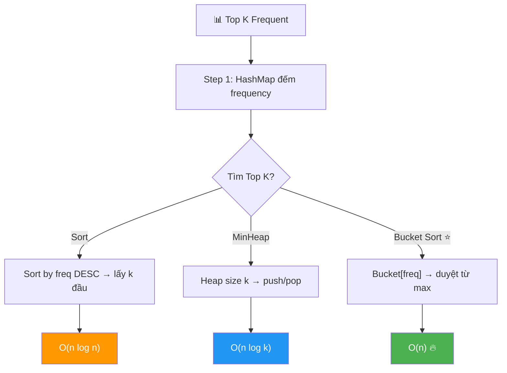
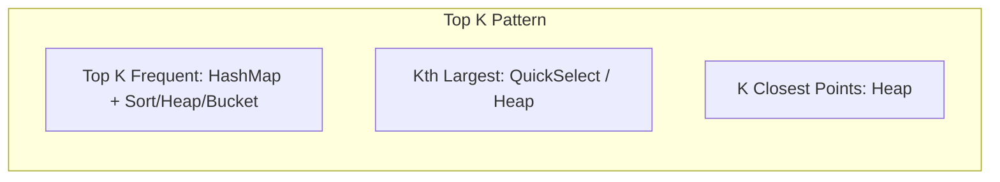

# 📊 Top K Frequent Elements — GfG / LeetCode #347 (Medium)

> 📖 Code: [Top K Frequent Elements.js](./Top%20K%20Frequent%20Elements.js)





---

## R — Repeat & Clarify

🧠 *"Đếm frequency mỗi phần tử → Tìm K phần tử có frequency CAO NHẤT. Cùng frequency → ưu tiên phần tử LỚN HƠN."*

> 🎙️ *"Given an array and k, find the k elements with the highest frequency. When frequencies are tied, prefer the larger value."*

### Clarification Questions

```
Q: "Top K" = K phần tử frequency cao nhất?
A: ĐÚNG! Trả về K phần tử (giá trị), KHÔNG phải frequency!

Q: Thứ tự output?
A: GfG: giảm dần theo frequency (freq cao trước).
   LeetCode #347: thứ tự BẤT KỲ!

Q: Cùng frequency thì sao?
A: ƯU TIÊN phần tử LỚN HƠN (GfG rule)!
   VD: freq(10)=1, freq(8)=1 → 10 trước 8!

Q: k luôn hợp lệ?
A: ĐÚNG! k ≤ số unique elements.

Q: Có số âm không?
A: CÓ THỂ! Không ảnh hưởng logic.
```

### Tại sao bài này quan trọng?

```
  ⭐ KINH ĐIỂN phỏng vấn — LeetCode #347!
  (Amazon, Facebook, Google — hỏi RẤT NHIỀU!)

  BẠN PHẢI hiểu:
  1. HashMap đếm frequency → BƯỚC 1 luôn giống nhau!
  2. 3 cách tìm Top K:
     Sort → O(n log n) — đơn giản
     MinHeap → O(n log k) — tối ưu hơn
     Bucket Sort → O(n) — NHANH NHẤT! ⭐

  ┌───────────────────────────────────────────────────┐
  │  "Top K" = HashMap + Selection Problem!            │
  │  Bài này = NỀN TẢNG cho tất cả bài "Top K"!      │
  │  → Top K Frequent Words (#692)                    │
  │  → K Closest Points (#973)                        │
  │  → Sort Characters By Frequency (#451)            │
  └───────────────────────────────────────────────────┘
```

---

## 🧠 Bản chất bài toán — Hiểu để NHỚ, không chỉ để GIẢI

### CHIA BÀI THÀNH 2 PHẦN!

```
  ⭐ Bài này = 2 bài con:

  PHẦN 1: ĐẾM frequency → HashMap → O(n) → LUÔN GIỐNG NHAU!
  PHẦN 2: TÌM Top K → đây là phần KHÁC NHAU!

  ┌─────────────────────────────────────────────────────┐
  │  Phần 2 có 3 approaches:                            │
  │                                                      │
  │  a) SORT entries by frequency → lấy k đầu           │
  │     → O(n log n) — đơn giản nhất!                  │
  │                                                      │
  │  b) MIN-HEAP size k → push, pop nếu > k             │
  │     → O(n log k) — tốt hơn khi k << n!             │
  │                                                      │
  │  c) BUCKET SORT → buckets[freq] = [...elements]    │
  │     → O(n) — NHANH NHẤT!                           │
  │     → freq max = n → tạo n+1 buckets!              │
  └─────────────────────────────────────────────────────┘
```

### Bucket Sort — TẠI SAO O(n)?

```
  ⭐ INSIGHT: Frequency tối đa = n (toàn mảng giống nhau!)

  Tạo MẢNG BUCKETS: buckets[0..n]
    buckets[freq] = danh sách phần tử có frequency = freq

  VÍ DỤ: arr = [3, 1, 4, 4, 5, 2, 6, 1], n=8

  HashMap: {3:1, 1:2, 4:2, 5:1, 2:1, 6:1}

  Buckets (index = frequency):
    buckets[0] = []
    buckets[1] = [3, 5, 2, 6]    ← freq = 1
    buckets[2] = [1, 4]           ← freq = 2  ⭐
    buckets[3..8] = []

  Duyệt buckets TỪ CUỐI (freq cao nhất):
    buckets[2] = [1, 4] → lấy 4, 1 (sort giảm → 4 trước!)
    → Đủ k=2! DONE! → [4, 1] ✅

  → O(n) time! (tạo buckets + duyệt)
```

### So sánh trực quan

```
  arr = [3, 1, 4, 4, 5, 2, 6, 1], k=2

  ═══ Approach 1: Sort ═══════════════════════════════
  HashMap: {3:1, 1:2, 4:2, 5:1, 2:1, 6:1}
  Sort by freq DESC: [(4,2), (1,2), (3,1), (5,1), (2,1), (6,1)]
  → Lấy k=2 đầu: [4, 1] ✅
  → O(n log n)

  ═══ Approach 2: Bucket Sort ═══════════════════════
  HashMap: {3:1, 1:2, 4:2, 5:1, 2:1, 6:1}
  Buckets: [2] = [4, 1],  [1] = [6, 5, 3, 2]
  Duyệt từ cuối: lấy [4, 1] → đủ k=2! ✅
  → O(n) 🔥
```

---

## 🧭 Luồng Suy Nghĩ — Từ đọc đề đến solution

### Bước 1: Keywords

```
  "frequency" → ĐẾM → HashMap!
  "top k" → CHỌN K lớn nhất → Sort / Heap / Bucket!
  "highest frequency" → freq DESC!
  "tie-break: larger value" → cùng freq → giá trị lớn trước!

  🧠 "HashMap + Sort → O(n log n). Có tốt hơn không?"
    → Bucket Sort → O(n)!
```

### Bước 2: HashMap — luôn là bước 1

```
  const map = {};
  for (num of arr): map[num]++

  → Đếm frequency mỗi phần tử → O(n)
```

### Bước 3: Tìm Top K

```
  Sort: sort entries by freq DESC → O(n log n)
  Bucket Sort: buckets[freq] → duyệt từ max → O(n) ⭐
```

---

## E — Examples

```
VÍ DỤ 1: arr = [3, 1, 4, 4, 5, 2, 6, 1], k = 2

  HashMap: {3:1, 1:2, 4:2, 5:1, 2:1, 6:1}
  Top 2 by freq: 4 (freq=2), 1 (freq=2)
  Tie-break: 4 > 1 → 4 trước!
  → [4, 1] ✅
```

```
VÍ DỤ 2: arr = [7, 10, 11, 5, 2, 5, 5, 7, 11, 8, 9], k = 4

  HashMap: {7:2, 10:1, 11:2, 5:3, 2:1, 8:1, 9:1}

  Sorted by (freq DESC, value DESC):
    5  (freq=3)
    11 (freq=2)   ← tie → 11 > 7 → 11 trước!
    7  (freq=2)
    10 (freq=1)   ← tie → 10 > 9 > 8 > 2 → 10 trước!
    9  (freq=1)
    8  (freq=1)
    2  (freq=1)

  → Top 4: [5, 11, 7, 10] ✅
```

```
VÍ DỤ 3: arr = [1, 1, 1, 2, 2, 3], k = 1

  HashMap: {1:3, 2:2, 3:1}
  → Top 1: [1] ✅ (freq cao nhất!)
```

### Minh họa BUCKET SORT

```
  arr = [7, 10, 11, 5, 2, 5, 5, 7, 11, 8, 9], k=4
  n = 11

  HashMap: {7:2, 10:1, 11:2, 5:3, 2:1, 8:1, 9:1}

  Buckets (index = frequency):
    [0]: []
    [1]: [10, 2, 8, 9]    ← freq = 1 (sort desc: [10, 9, 8, 2])
    [2]: [7, 11]           ← freq = 2 (sort desc: [11, 7])
    [3]: [5]               ← freq = 3
    [4..11]: []

  Duyệt từ cuối (freq cao nhất):
    bucket[3] = [5]     → lấy 5    (collected: 1, need 4)
    bucket[2] = [11, 7] → lấy 11,7 (collected: 3, need 4)
    bucket[1] = [10,..]  → lấy 10  (collected: 4 → ĐỦ!)

  → [5, 11, 7, 10] ✅
```

---

## A — Approach

### Approach 1: HashMap + Sort — O(n log n)

```
💡 Đếm frequency → Sort entries by (freq DESC, value DESC)

  ✅ Đơn giản, dễ code!
  ❌ O(n log n) — sort!
```

### Approach 2: HashMap + Bucket Sort — O(n) ⭐

```
💡 Đếm frequency → Bucket[freq] → duyệt từ max freq

  ✅ O(n) time — NHANH NHẤT!
  ❌ O(n) space — tạo n+1 buckets

  ⚠️ freq tối đa = n → tạo array size n+1
  ⚠️ Trong mỗi bucket: sort giảm dần cho tie-break!
```

### So sánh

```
  ┌────────────────────────┬──────────────┬──────────┬──────────────┐
  │                        │ Time         │ Space    │ Ghi chú       │
  ├────────────────────────┼──────────────┼──────────┼──────────────┤
  │ HashMap + Sort         │ O(n log n)   │ O(n)     │ Dễ nhất       │
  │ HashMap + MinHeap      │ O(n log k)   │ O(n+k)   │ Tốt khi k<<n │
  │ HashMap + Bucket ⭐    │ O(n)         │ O(n)     │ Nhanh nhất!   │
  └────────────────────────┴──────────────┴──────────┴──────────────┘

  ⚠️ LeetCode #347 không yêu cầu tie-break
     → Bucket Sort KHÔNG cần sort trong bucket!
     → GfG yêu cầu tie-break → sort trong bucket!
```

---

## C — Code

### Solution 1: HashMap + Sort — O(n log n)

```javascript
function topKFrequentSort(arr, k) {
  // Step 1: Đếm frequency
  const map = {};
  for (const num of arr) {
    map[num] = (map[num] || 0) + 1;
  }

  // Step 2: Sort by (freq DESC, value DESC)
  const entries = Object.entries(map).map(([key, freq]) => [
    Number(key),
    freq,
  ]);

  entries.sort((a, b) => {
    if (b[1] !== a[1]) return b[1] - a[1]; // freq DESC
    return b[0] - a[0]; // value DESC (tie-break)
  });

  // Step 3: Lấy k phần tử đầu
  return entries.slice(0, k).map(([val]) => val);
}
```

### Giải thích Sort

```
  Step 1: HashMap đếm — O(n)
    {3:1, 1:2, 4:2, 5:1, 2:1, 6:1}

  Step 2: Sort entries — O(m log m), m = unique elements
    Sort by: freq GIẢM DẦN → tie: value GIẢM DẦN
    [(4,2), (1,2), (6,1), (5,1), (3,1), (2,1)]

  Step 3: Slice k đầu — O(k)
    → [4, 1]

  ⚠️ Object.entries() trả về [string, value]
     → Cần Number(key) để convert về số!
```

### Solution 2: HashMap + Bucket Sort — O(n) ⭐

```javascript
function topKFrequent(arr, k) {
  const n = arr.length;

  // Step 1: Đếm frequency
  const map = {};
  for (const num of arr) {
    map[num] = (map[num] || 0) + 1;
  }

  // Step 2: Tạo buckets — buckets[freq] = [elements]
  const buckets = new Array(n + 1).fill(null).map(() => []);
  for (const [num, freq] of Object.entries(map)) {
    buckets[freq].push(Number(num));
  }

  // Step 3: Duyệt từ freq cao nhất → lấy k phần tử
  const result = [];
  for (let freq = n; freq >= 1 && result.length < k; freq--) {
    if (buckets[freq].length > 0) {
      // Tie-break: sort giảm dần cho bucket cùng freq
      buckets[freq].sort((a, b) => b - a);
      for (const num of buckets[freq]) {
        result.push(num);
        if (result.length === k) break;
      }
    }
  }

  return result;
}
```

### Giải thích Bucket Sort — CHI TIẾT

```
  STEP 1: HashMap — O(n)
    Đếm frequency mỗi phần tử.

  STEP 2: Tạo buckets — O(n)
    buckets = array size n+1 (freq tối đa = n!)
    Với mỗi entry (num, freq):
      → Push num vào buckets[freq]

  STEP 3: Duyệt từ cuối — O(n)
    for freq = n → 1:
      → buckets[freq] chứa elements có frequency = freq
      → Sort giảm dần (tie-break: giá trị lớn trước!)
      → Lấy cho đến khi đủ k!

  ⚠️ Tại sao size n+1?
     freq tối đa = n (tất cả giống nhau!)
     → cần index 0..n → size = n+1!

  ⚠️ Sort TRONG bucket:
     Chỉ sort các phần tử CÙNG frequency!
     → Sort nhỏ, thường rất ít elements!
     → Tổng sort: O(n) amortized (mỗi element 1 bucket!)

  ⚠️ LeetCode #347: không cần tie-break
     → BỎ sort trong bucket → pure O(n)!
```

### Trace CHI TIẾT: arr = [3, 1, 4, 4, 5, 2, 6, 1], k=2

```
  n = 8

  ═══ Step 1: HashMap ═════════════════════════════════

  3→1, 1→1, 4→1, 4→2, 5→1, 2→1, 6→1, 1→2
  map = {3:1, 1:2, 4:2, 5:1, 2:1, 6:1}

  ═══ Step 2: Buckets ═════════════════════════════════

  buckets[1] = [3, 5, 2, 6]   (freq = 1)
  buckets[2] = [1, 4]          (freq = 2)
  buckets[3..8] = []

  ═══ Step 3: Duyệt từ cuối ══════════════════════════

  freq=8: [] → skip
  freq=7: [] → skip
  ...
  freq=2: [1, 4] → sort DESC: [4, 1]
    → push 4: result = [4]    (1/2)
    → push 1: result = [4, 1] (2/2 → ĐỦ!)

  → [4, 1] ✅
```

### Trace: arr = [7, 10, 11, 5, 2, 5, 5, 7, 11, 8, 9], k=4

```
  n = 11
  map = {7:2, 10:1, 11:2, 5:3, 2:1, 8:1, 9:1}

  Buckets:
    [1] = [10, 2, 8, 9]
    [2] = [7, 11]
    [3] = [5]

  Duyệt từ freq=11:
    freq=3: [5] → push 5
      result = [5] (1/4)

    freq=2: [7, 11] → sort DESC: [11, 7]
      → push 11: result = [5, 11] (2/4)
      → push 7:  result = [5, 11, 7] (3/4)

    freq=1: [10, 2, 8, 9] → sort DESC: [10, 9, 8, 2]
      → push 10: result = [5, 11, 7, 10] (4/4 → ĐỦ!)

  → [5, 11, 7, 10] ✅
```

> 🎙️ *"I first count frequencies with a HashMap in O(n). Then I use bucket sort — creating an array where index equals frequency. I iterate from the highest bucket downward, collecting elements until I have k. This gives O(n) overall. For tie-breaking on equal frequencies, I sort within each bucket by value descending, which is amortized O(n) since all elements across buckets sum to n."*

---

## O — Optimize

```
                        Time          Space     Ghi chú
  ──────────────────────────────────────────────────────
  HashMap + Sort        O(n log n)    O(n)      Dễ nhất
  HashMap + MinHeap     O(n log k)    O(n+k)    Tốt khi k<<n
  HashMap + Bucket ⭐   O(n)          O(n)      Nhanh nhất!

  ⚠️ Bucket Sort = O(n):
    HashMap: O(n)
    Tạo buckets: O(n) — mỗi entry 1 lần
    Duyệt buckets: O(n) — tổng elements = n
    → Total: O(n)!

  ⚠️ LeetCode #347: "better than O(n log n)" → Bucket Sort!
```

---

## T — Test

```
Test Cases:
  [3, 1, 4, 4, 5, 2, 6, 1],  k=2   → [4, 1]           ✅
  [7,10,11,5,2,5,5,7,11,8,9], k=4  → [5, 11, 7, 10]   ✅
  [1, 1, 1, 2, 2, 3],        k=1   → [1]               ✅ rõ ràng
  [1, 1, 1, 2, 2, 3],        k=2   → [1, 2]            ✅
  [1],                        k=1   → [1]               ✅ 1 phần tử
  [5, 5, 5, 5],              k=1   → [5]               ✅ toàn giống
  [1, 2],                    k=2   → [2, 1]            ✅ tie → lớn trước
```

---

## 🗣️ Interview Script

### Think Out Loud

```
  🧠 BƯỚC 1: Keywords
    "frequency" → HashMap đếm!
    "top k" → selection problem!

  🧠 BƯỚC 2: Chia bài
    "Part 1: đếm freq → HashMap O(n)"
    "Part 2: tìm top K → Sort O(n log n) / Bucket O(n)"

  🧠 BƯỚC 3: Code
    "HashMap + bucket sort → O(n)!"
    "buckets[freq] = [elements], duyệt từ max"

  🧠 BƯỚC 4: Tie-break
    "Cùng freq → sort giảm dần → giá trị lớn trước"

  🎙️ Interview phrasing:
    "This is essentially two sub-problems: counting frequencies
     with a HashMap, then selecting the top K. For O(n log n)
     I can sort the entries. For O(n), I use bucket sort where
     the bucket index is the frequency — frequency is bounded
     by n, so I iterate backwards from the highest frequency
     bucket, collecting k elements."
```

### Biến thể & Mở rộng

```
  1. Top K Frequent Words — LeetCode #692
     → Giống! Nhưng tie-break: LEXICOGRAPHIC ORDER!
     → Bucket + sort trong bucket alphabetically!

  2. Sort Characters By Frequency — LeetCode #451
     → Bucket sort → build string từ freq cao → thấp!

  3. K Closest Points to Origin — LeetCode #973
     → Không dùng HashMap! Dùng Heap / QuickSelect!

  4. Kth Largest Element — LeetCode #215
     → QuickSelect O(n) average!

  5. Top K in Data Stream
     → HashMap + MinHeap (vì data stream → không biết n!)
     → Không dùng được Bucket Sort!
```

### So sánh với bài liên quan

```
  ┌──────────────────────────────────────────────────────────┐
  │  Bài toán              Technique           Complexity    │
  │  ────────────────────────────────────────────────        │
  │  Top K Frequent ⭐     HashMap + Bucket     O(n)        │
  │  Top K Frequent Words  HashMap + Bucket     O(n)        │
  │  Sort by Frequency     HashMap + Bucket     O(n)        │
  │  Kth Largest           QuickSelect          O(n) avg    │
  │  K Closest Points      Heap                 O(n log k)  │
  └──────────────────────────────────────────────────────────┘

  ⭐ QUY TẮC VÀNG:
    "Frequency" → HashMap TRƯỚC!
    "Top K" → Bucket Sort (nếu bounded) hoặc Heap!
    "Kth" → QuickSelect hoặc MinHeap!
```

---

## 🧩 Sai lầm phổ biến

```
❌ SAI LẦM #1: Quên tie-break!

   GfG: cùng freq → giá trị LỚN trước!
   arr = [1, 2], k=2: freq đều = 1
   → [2, 1] KHÔNG PHẢI [1, 2]!

   ✅ Sort: (freq DESC, value DESC)
   ✅ Bucket: sort giảm trong bucket!

─────────────────────────────────────────────────────

❌ SAI LẦM #2: Bucket array size sai!

   freq tối đa = n → buckets = new Array(n + 1)!
   KHÔNG PHẢI max(freq)! Vì chưa biết max freq trước!

─────────────────────────────────────────────────────

❌ SAI LẦM #3: Object.entries() trả về STRING key!

   Object.entries({3: 1}) → [["3", 1]]
   → Key là STRING "3" không phải NUMBER 3!
   → PHẢI Number(key) khi push vào bucket/result!

─────────────────────────────────────────────────────

❌ SAI LẦM #4: Dùng MaxHeap thay vì MinHeap!

   MinHeap size k: pop MIN → giữ TOP K (lớn nhất)!
   MaxHeap size k: KHÔNG giữ top K!

   → MinHeap: push all, pop khi size > k
   → Top = min trong heap = phần tử thứ K!
```

---

## 📝 Flashcard — Tự kiểm tra

| ❓ Câu hỏi | ✅ Đáp án |
|---|---|
| Bước 1 luôn là gì? | **HashMap** đếm frequency! |
| 3 cách tìm Top K? | Sort O(n log n), MinHeap O(n log k), **Bucket O(n)** |
| Bucket Sort: index = ? | **Frequency!** buckets[freq] = [elements] |
| Bucket array size? | **n + 1** (freq tối đa = n) |
| Duyệt bucket theo chiều nào? | **Từ cuối** (freq cao nhất → thấp nhất) |
| Tie-break (GfG)? | Giá trị **lớn hơn** trước! |
| Object.entries() key type? | **String!** Cần Number() convert! |
| LeetCode nào? | **#347** Top K Frequent Elements |
| Bài nào cùng pattern? | #692 (Words), #451 (Sort by Freq) |
