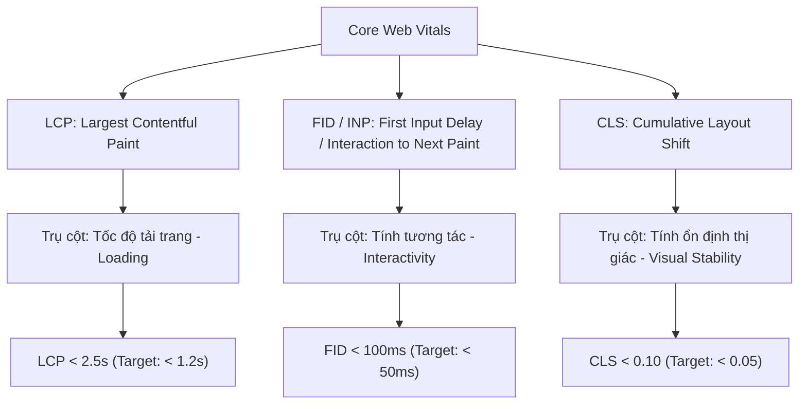
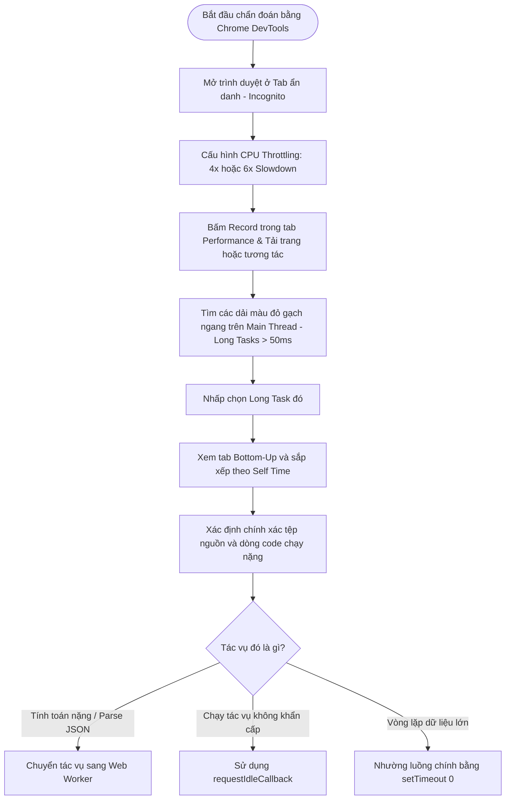
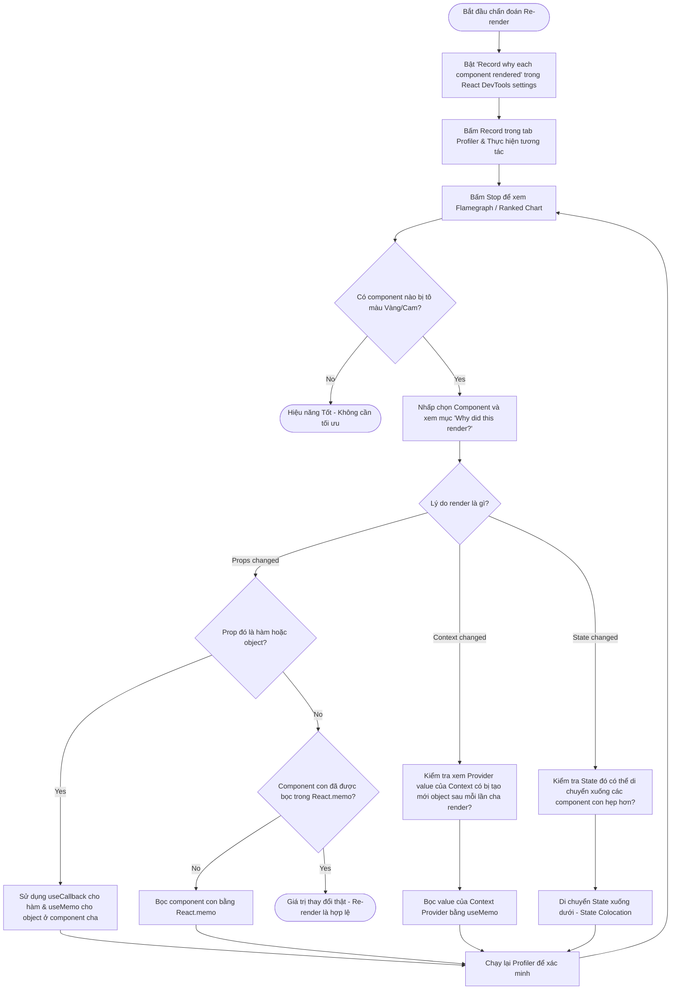
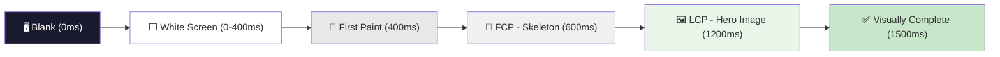
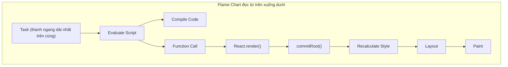
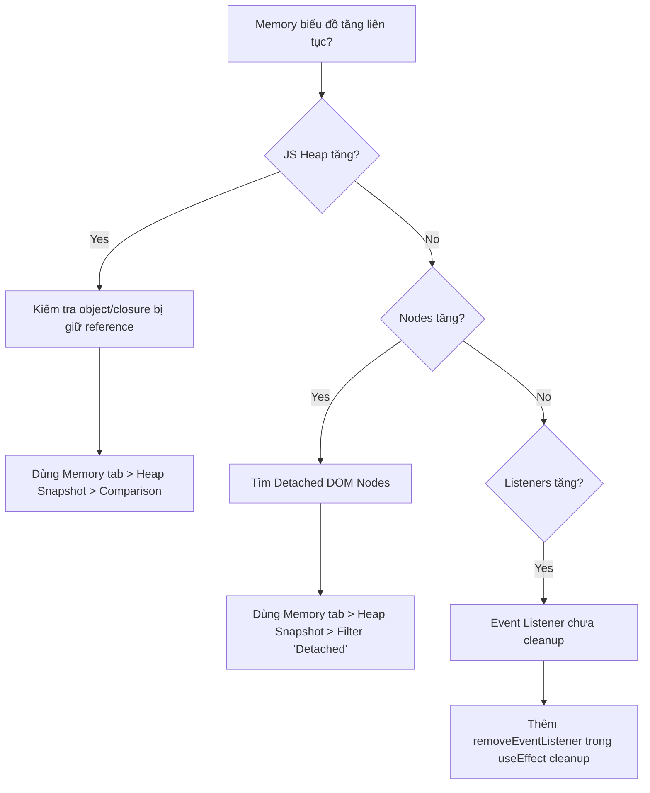
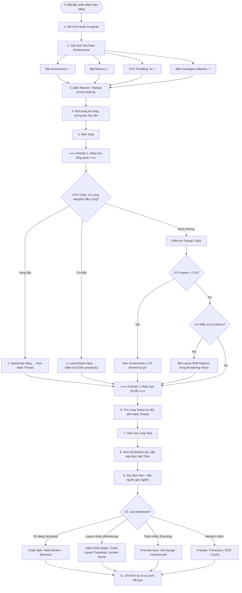

# Tài Liệu Chuyên Sâu: Chiến Dịch Tối Ưu Hóa Core Web Vitals Trong Doanh Nghiệp

Tài liệu này cung cấp các phân tích kỹ thuật sâu sắc, các công thức đo đạc và các quyết định kiến trúc khi thực hiện tối ưu hóa **Core Web Vitals (CWVs)** trên toàn bộ các trang sản xuất (production), đạt chỉ số **LCP < 1.2s, FID < 50ms, và CLS < 0.05**.

---

## 1. MENTAL MODEL: CORE WEB VITALS DƯỚI GÓC NHÌN TRẢI NGHIỆM NGƯỜI DÙNG & SEO

Các chỉ số hiệu năng truyền thống như `DOMContentLoaded` hay `Load Event Time` đo lường thời điểm kỹ thuật khi tài nguyên tải xong. Tuy nhiên, chúng không phản ánh được **cảm nhận thực tế của người dùng** khi tương tác với trang.

Google đưa ra bộ chỉ số Core Web Vitals tập trung vào 3 trụ cột trải nghiệm cốt lõi:



### Tại sao CWVs lại quan trọng với doanh nghiệp?
1. **Tác động trực tiếp tới SEO:** Từ năm 2021, Google chính thức đưa CWVs thành một trong các tín hiệu xếp hạng tìm kiếm (Page Experience Ranking Signals). Trang web có hiệu năng kém sẽ bị đẩy xuống dưới trên kết quả tìm kiếm Google Search.
2. **Tăng tỷ lệ chuyển đổi (Conversion Rate):** Nghiên cứu thực tế chỉ ra rằng cứ mỗi 100ms tải nhanh hơn, tỷ lệ chuyển đổi của các trang thương mại điện tử tăng trung bình 1%. Việc tối ưu hóa FID và LCP giúp giảm tỷ lệ thoát trang (Bounce Rate) rõ rệt.

---

## 2. DEEP DIVE: BA CHỈ SỐ CỐT LÕI & PHƯƠNG PHÁP TỐI ƯU

---

### 2.1. LCP (Largest Contentful Paint) - Tốc độ hiển thị phần tử lớn nhất

LCP đo lường khoảng thời gian từ khi trang bắt đầu tải đến khi phần tử nội dung lớn nhất (thường là ảnh banner Hero, tiêu đề `h1`, hoặc khối văn bản lớn) được dựng hình (render) hoàn chỉnh trên viewport.

#### Phân rã cấu trúc thời gian của LCP (LCP Breakdown):
Để tối ưu hóa LCP một cách khoa học, ta phải chia nó thành 4 giai đoạn nhỏ:

$$\text{LCP} = \text{TTFB} + \text{Resource Load Delay} + \text{Resource Load Duration} + \text{Element Render Delay}$$

1. **TTFB (Time to First Byte):** Thời gian chờ máy chủ phản hồi byte đầu tiên. Mục tiêu: < 800ms.
2. **Resource Load Delay (Độ trễ tải tài nguyên):** Thời gian từ khi nhận byte đầu tiên đến khi trình duyệt bắt đầu tải phần tử LCP. Mục tiêu: Càng gần 0 càng tốt.
3. **Resource Load Duration (Thời gian tải tài nguyên):** Thời gian tải tệp ảnh/font LCP.
4. **Element Render Delay (Độ trễ dựng hình):** Thời gian từ khi tải xong tài nguyên đến khi hiển thị lên màn hình.

#### Chiến thuật tối ưu hóa LCP thực chiến:
*   **Edge Caching & CDN:** Đưa nội dung tĩnh và động ra biên (Edge Servers) bằng Cloudflare/AWS CloudFront. Cấu hình tiêu đề `Cache-Control: public, max-age=31536000, stale-while-revalidate=60`.
*   **Preloading Critical LCP Image:** Hướng dẫn trình duyệt tải ảnh LCP ngay trong thẻ `<head>` trước khi phân tích cú pháp CSS/JS:
    ```html
    <link rel="preload" fetchpriority="high" as="image" href="/hero-optimized.webp" type="image/webp">
    ```
*   **Eager Loading vs Lazy Loading:** Chỉ áp dụng `loading="lazy"` cho các ảnh nằm phía dưới màn hình đầu tiên (Below the Fold). Tuyệt đối KHÔNG lazy load ảnh LCP đầu trang vì sẽ làm tăng *Resource Load Delay* lên tới 1-2 giây.
*   **Tránh Client-Side Rendering (CSR) cho LCP:** Nếu tiêu đề `h1` hoặc ảnh Hero được render thông qua React chạy ở Client (sau khi tải JS về, call API rồi mới mount), *Element Render Delay* sẽ cực lớn. Hãy sử dụng **Server-Side Rendering (SSR)** hoặc **Incremental Static Regeneration (ISR)** của Next.js để HTML chứa sẵn thẻ LCP khi trả về từ server.

---

### 2.2. FID (First Input Delay) / INP (Interaction to Next Paint) - Độ trễ phản hồi tương tác

FID đo lường thời gian từ khi người dùng tương tác lần đầu (click nút, tap màn hình) đến khi trình duyệt thực sự bắt đầu xử lý sự kiện đó. INP (đã thay thế FID từ năm 2024) đo lường độ trễ của tất cả tương tác trong suốt phiên làm việc.

#### Nguyên nhân gây trễ phản hồi: Long Tasks chặn luồng chính (Main Thread)
Trình duyệt xử lý JavaScript, vẽ giao diện, và tính toán bố cục trên cùng một luồng duy nhất: **Main Thread**. Nếu có một tác vụ JavaScript chạy lâu hơn **50ms** (gọi là **Long Task**), luồng chính sẽ bị khóa. Người dùng bấm click vào nút lúc này sẽ phải đợi tác vụ đó chạy xong mới nhận được phản hồi.

```
Main Thread Timeline:
[=== Task 1: 30ms ===] [====== Long Task 2: 180ms (Main Thread Blocked!) ======] [=== Task 3: 20ms ===]
                                 ▲
                     Người dùng Click chuột ở đây
                     (Phải đợi 120ms tiếp theo mới xử lý được sự kiện click này!)
```

#### Chiến thuật tối ưu hóa FID/INP thực chiến:
*   **Sử dụng Web Workers cho tác vụ nặng:** Đưa toàn bộ các xử lý tính toán số học phức tạp, lọc mảng dữ liệu lớn, hoặc định dạng chuỗi nặng ra khỏi luồng chính:
    ```typescript
    // Khởi tạo Web Worker
    const myWorker = new Worker(new URL('./task.worker.ts', import.meta.url), { type: 'module' });
    myWorker.postMessage({ data: heavyPayload });
    myWorker.onmessage = (e) => {
      updateUI(e.data); // Nhận kết quả và cập nhật giao diện mượt mà
    };
    ```
*   **Code Splitting (Phân tách mã nguồn):** Sử dụng `React.lazy` và Dynamic Import để chia tách gói JS khổng lồ thành các module nhỏ. Tránh tải toàn bộ code quản trị viên (Admin Panel) hay biểu đồ nặng khi người dùng chỉ đang xem trang landing page.
*   **Sử dụng `requestIdleCallback`:** Trì hoãn việc gửi log analytics hoặc các tác vụ phụ cho đến khi trình duyệt rảnh rỗi:
    ```javascript
    if ('requestIdleCallback' in window) {
      requestIdleCallback(() => sendTrackingData(analyticsPayload));
    } else {
      setTimeout(() => sendTrackingData(analyticsPayload), 2000);
    }
    ```
*   **Yielding to the Main Thread (Nhường luồng chính):** Chia nhỏ các vòng lặp lớn thành các tác vụ bất tuần tự (asynchronous chunks) sử dụng `setTimeout(..., 0)` hoặc hàm helper `yield`:
    ```javascript
    function yieldToMain() {
      return new Promise(resolve => setTimeout(resolve, 0));
    }
    async function processLargeArray(items) {
      for (let i = 0; i < items.length; i++) {
        process(items[i]);
        if (i % 100 === 0) {
          await yieldToMain(); // Nhường main thread để xử lý các click chuột của người dùng
        }
      }
    }
    ```

---

### 2.3. CLS (Cumulative Layout Shift) - Độ dịch chuyển bố cục bất ngờ

CLS đo lường tổng điểm số của tất cả các thay đổi vị trí bất ngờ (layout shifts) của các phần tử giao diện hiển thị trên viewport trong suốt vòng đời của trang.

#### Công thức tính điểm CLS:
$$\text{Layout Shift Score} = \text{Impact Fraction (Tỷ lệ ảnh hưởng)} \times \text{Distance Fraction (Tỷ lệ khoảng cách)}$$

Ví dụ: Một khối quảng cáo đột ngột xuất hiện ở đầu trang, chiếm 20% chiều cao màn hình (Impact Fraction = 0.20) và đẩy toàn bộ văn bản phía dưới dịch chuyển xuống dưới thêm 25% chiều cao màn hình (Distance Fraction = 0.25). 
Điểm dịch chuyển: $0.20 \times 0.25 = 0.05$.

#### Chiến thuật tối ưu hóa CLS thực chiến:
*   **Thiết lập kích thước cụ thể cho hình ảnh và video:** Luôn khai báo thuộc tính `width`, `height` hoặc sử dụng thuộc tính CSS `aspect-ratio` để trình duyệt biết trước tỉ lệ khung hình của ảnh và giữ chỗ trống trước khi ảnh tải xong:
    ```css
    .hero-img {
      width: 100%;
      aspect-ratio: 16 / 9;
      background-color: var(--color-bg-muted); /* Placeholder xám làm nền */
    }
    ```
*   **Giữ chỗ cho quảng cáo động (Ad Placeholders):** Đặt chiều cao tối thiểu (`min-height`) cho các khung chứa quảng cáo hoặc nội dung tải chậm (lazy-loaded widgets). Tránh trường hợp khung chứa ban đầu có chiều cao `0px`, sau khi tải xong banner quảng cáo nhảy lên `250px` đẩy sập toàn bộ giao diện bên dưới.
*   **Tối ưu hóa Font Loading (Tránh FOUT/FOIT):**
    *   Sử dụng `font-display: swap` để hiển thị ngay văn bản bằng font hệ thống dự phòng trong khi tải font tùy chỉnh.
    *   Sử dụng công cụ điều chỉnh size-adjust của font dự phòng trong CSS để tránh trường hợp font hệ thống và font tùy chỉnh có kích thước chiều ngang ký tự lệch nhau quá nhiều, gây ra co giãn dòng chữ khi hoán đổi.
*   **Tránh chèn nội dung động phía trên nội dung hiện tại:** Ngoại trừ việc tương tác trực tiếp của người dùng (như click mở Accordion), tuyệt đối không chèn động bất kỳ phần tử nào vào đầu trang sau khi trang đã render xong.

---

## 3. CHIẾN LƯỢC CACHING VÀ PHÂN PHỐI Ở BIÊN (EDGE CACHING)

Khi triển khai hệ thống phân phối nội dung quy mô lớn, CDN đóng vai trò quyết định giúp giảm thiểu **TTFB** về mức tối thiểu (< 50ms trên toàn cầu).

```
[User Browser]
       │  (Request)
       ▼
 [Edge Server (Cloudflare CDN)]  ──  Hit? (TTFB < 30ms)  ──► [Return Cached HTML]
       │
       │  Miss? (TTFB > 500ms)
       ▼
 [Origin Server (Next.js / Node.js)]
```

### 3.1. stale-while-revalidate (SWR) Cấp Độ HTTP Caching
Cấu hình tiêu đề `Cache-Control` cho phép trình duyệt hiển thị ngay nội dung cũ đã lưu trong bộ nhớ cache (stale) cực nhanh, đồng thời âm thầm gửi yêu cầu về Origin Server để tải nội dung mới (revalidate) về cập nhật cho lần truy cập sau:
```http
Cache-Control: public, max-age=10, stale-while-revalidate=59
```
*   **Trong vòng 10 giây đầu (max-age):** Trả về bộ nhớ đệm lập tức (Cache Hit - TTFB < 20ms).
*   **Từ giây thứ 11 đến giây thứ 69 (stale-while-revalidate):** Trả về dữ liệu cũ lập tức, đồng thời gửi request ngầm để làm mới cache tại Edge.
*   **Sau 70 giây:** Cache hết hạn hoàn toàn, request tiếp theo sẽ đi trực tiếp về Origin Server để lấy nội dung mới nhất.

### 3.2. Cấu hình DNS Preconnect và Preload
Tại tệp HTML gốc, chèn các chỉ thị mạng sớm để rút ngắn thời gian thiết lập kết nối SSL/TLS với CDN hình ảnh hoặc API bên thứ ba:
```html
<link rel="preconnect" href="https://images.unsplash.com">
<link rel="dns-prefetch" href="https://images.unsplash.com">
```

---

## 4. WAR STORIES: BÀI HỌC ĐẮT GIÁ KHI TỐI ƯU HÓA HIỆU NĂNG

### 4.1. Lỗi LCP Tụt Thê Thảm Do Lazy Load Quá Đà
*   **Bối cảnh:** Nhằm mục tiêu tối ưu hóa dung lượng trang, nhóm phát triển cấu hình một plugin tự động thêm thuộc tính `loading="lazy"` vào toàn bộ thẻ `` tìm thấy trên trang web.
*   **Sự cố:** Ảnh banner chính (Hero Image) nằm ngay đầu trang chủ cũng bị tự động lazy load. Khi người dùng truy cập, trình duyệt phải dựng xong bố cục DOM, tính toán xem ảnh Hero có nằm trong viewport hay không rồi mới bắt đầu gửi request tải ảnh. Điều này làm tăng thời gian *Resource Load Delay* lên thêm 1.5 giây, khiến chỉ số LCP từ mức màu xanh `1.1s` tụt thẳng xuống màu đỏ cảnh báo `2.8s`.
*   **Cách khắc phục:** 
    1. Gỡ bỏ `loading="lazy"` khỏi các ảnh Above the Fold.
    2. Thêm thuộc tính `fetchpriority="high"` để chỉ định đây là tài nguyên quan trọng nhất cần tải trước các file JS phụ:
       ```html
       
       ```

### 4.2. Banner Quảng Cáo Chèn Động Phá Nát Điểm CLS
*   **Bối cảnh:** Đội ngũ Marketing chèn một đoạn mã script quảng cáo tự động của bên thứ ba vào phần đầu trang để tăng doanh thu hiển thị.
*   **Sự cố:** Script quảng cáo này tải bất tuần tự. Mỗi khi tải xong, nó tự động chèn một thẻ iframe chứa hình ảnh quảng cáo có kích thước ngẫu nhiên (lúc thì cao `90px`, lúc thì `250px`) ngay trên đầu thanh điều hướng menu. Toàn bộ nội dung trang web bị đẩy sụt xuống dưới một cách giật cục ngay khi người dùng chuẩn bị bấm click vào liên kết, khiến điểm CLS tăng vọt lên mức `0.35` (mức cực kỳ kém).
*   **Cách khắc phục:** 
    1. Bọc thẻ quảng cáo trong một thẻ `div` có chiều cao tối thiểu cố định (`min-height: 250px`).
    2. Nếu không có quảng cáo trả về, hiển thị một banner mặc định (fallback image) thay vì co sập khung chứa về `0px` để đảm bảo bố cục trang web luôn giữ nguyên tính ổn định thị giác.

---

## 5. PHƯƠNG PHÁP ĐO ĐẠC & QUY TRÌNH CẢI THIỆN TRONG THỰC TẾ (PRODUCTION IMPLEMENTATION)

Trong thực tế dự án doanh nghiệp, việc đo đạc và cải thiện Core Web Vitals được chia làm 2 thế giới song song: **Lab Data** (đo đạc trong môi trường giả lập/thử nghiệm) và **Field Data** (đo đạc từ người dùng thực tế duyệt web - Real User Monitoring).

### 5.1. Làm sao để BIẾT (Đo đạc & Giám sát)

#### A. Đo đạc trong phòng thí nghiệm (Lab Data)
*   **Chrome DevTools (Performance Tab):** Dùng để debug chi tiết.
    *   *Bật tính năng đo Layout Shifts:* Mở DevTools → nhấn tổ hợp phím `Cmd+Shift+P` (Mac) hoặc `Ctrl+Shift+P` (Windows) → nhập `Show Rendering` → Tích chọn **Layout Shift Regions**. Các phần tử bị giật khung hình sẽ được tô màu xanh lam trên màn hình khi tải trang.
    *   *Xem Long Tasks:* Bật ghi hình trong tab **Performance**, các block code JS chạy > 50ms sẽ hiện cờ đỏ ở góc để kiểm tra xem hàm nào ở tệp nào đang chạy nghẽn.
*   **Lighthouse CI:** Tích hợp trực tiếp vào quy trình CI/CD (GitHub Actions / GitLab CI). Khi lập trình viên tạo Pull Request, Lighthouse sẽ tự động chạy kiểm thử không đầu (headless) và trả về điểm số. Nếu hiệu năng tụt dưới ngưỡng cấu hình (ví dụ LCP tụt xuống mức > 2.5s), hệ thống sẽ khóa và không cho phép merge code.
*   **WebPageTest.org:** Công cụ giả lập mạng (3G, 4G) và CPU của thiết bị di động yếu rất chính xác. Nó xuất ra video ghi hình màn hình render từng mili-giây giúp bạn thấy chính xác thời điểm ảnh LCP xuất hiện hoặc font chữ bị chớp tắt (FOUT).

#### B. Đo đạc thực tế người dùng (Field Data / RUM)
*   **Google Search Console (Báo cáo Core Web Vitals):** Đây là dữ liệu thực tế Chrome User Experience Report (CrUX) thu thập từ trình duyệt Chrome của người dùng thật. Báo cáo này chia trang web thành các nhóm URL và chấm điểm LCP, INP, CLS theo phần vị p75 (75th percentile) tích lũy trong 28 ngày gần nhất.
*   **Tự xây dựng hệ thống RUM bằng thư viện `web-vitals` của Google:**
    Tích hợp thư viện vào code ứng dụng để bắt sự kiện hiệu năng trực tiếp từ trình duyệt của khách hàng và gửi về máy chủ phân tích (Real-time). Sử dụng phương thức `navigator.sendBeacon` để gửi log bất tuần tự không chặn luồng tải trang:

```typescript
import { onLCP, onINP, onCLS } from 'web-vitals';

function sendToAnalytics({ name, value, id }) {
  const body = JSON.stringify({
    name,       // 'LCP', 'INP', hoặc 'CLS'
    value,      // Giá trị mili-giây hoặc điểm số shift
    id,         // ID phiên duyệt web
    url: window.location.href,
    userAgent: navigator.userAgent
  });
  
  navigator.sendBeacon('/api/analytics/vitals', body);
}

onLCP(sendToAnalytics);
onINP(sendToAnalytics);
onCLS(sendToAnalytics);
```
*   **Sử dụng dịch vụ APM trả phí:** Đơn giản nhất là tích hợp **Datadog RUM**, **Sentry**, hoặc **New Relic**. Họ tự động chèn script giám sát Web Vitals, vẽ biểu đồ dashboard thời gian thực, phân tích theo vị trí địa lý, thiết bị và phiên bản code.

---

### 5.2. Làm sao để CẢI THIỆN (Quy trình tối ưu hóa)

Quy trình tối ưu hóa thực chiến tuân theo nguyên tắc Pareto (80/20): Tập trung vào một số thay đổi nhỏ nhưng mang lại 80% hiệu quả cải thiện điểm số.

*   **Kế hoạch hành động cải thiện LCP:**
    *   *Giảm TTFB về < 100ms:* Đưa HTML tĩnh lên **Edge CDN** (Cloudflare Pages, Vercel, hoặc CloudFront). Dùng chiến lược **stale-while-revalidate** cho các trang động ít thay đổi.
    *   *fetchpriority="high" cho LCP Image:* Gắn thuộc tính này vào ảnh banner chính để trình duyệt biết đây là tài nguyên hàng đầu cần ưu tiên băng thông tải ngay lập tức.
    *   *Tuyệt đối không Lazy Load ảnh trên màn hình đầu trang:* Đảm bảo ảnh Hero, logo đầu trang không bị dính class `loading="lazy"` hoặc các hiệu ứng fade-in mờ dần bằng JavaScript.
*   **Kế hoạch hành động cải thiện CLS:**
    *   *Luôn cấu hình aspect-ratio hoặc kích thước cứng cho hình ảnh/video:*
        ```css
        img {
          max-width: 100%;
          height: auto;
          aspect-ratio: 16 / 9;
        }
        ```
    *   *Giữ chỗ cho quảng cáo động:* Các widget chat bên thứ ba, banner quảng cáo Google AdSense phải được đặt trong một thẻ div cha có thuộc tính CSS `min-height` cố định để khi dữ liệu chưa về, bố cục trang web vẫn được giữ chỗ sẵn.
*   **Kế hoạch hành động cải thiện FID/INP (TBT):**
    *   *Chia tách JavaScript (Code Splitting):* Tách router bằng `React.lazy` hoặc Next.js dynamic import.
    *   *Tối ưu hóa các script của bên thứ ba:* Chatbot widget tiêu tốn khoảng 300-800ms CPU main thread. Hãy chỉ tải chatbot khi người dùng di chuột vào hoặc click vào nút bong bóng chat.
    *   *Giải phóng main thread bằng Web Workers:* Đưa các xử lý mảng dữ liệu lớn, tính toán biểu đồ, giải mã JSON kích thước lớn xuống luồng phụ Web Workers.
*   **Thiết lập "Budget" Hiệu năng (Performance Budgets):** Thiết lập Performance Budgets và cam kết giữa các đội (Product, Design, Dev): Kích thước gói JavaScript của trang không vượt quá **150KB** (Gzipped), thiết kế banner bắt buộc phải đi kèm kích thước cố định, và Server Response Time không quá **200ms**.

---

## 6. HƯỚNG DẪN LÀM CHỦ DEVTOOLS & REACT PROFILER (DIAGNOSTICS GUIDE)

Để tối ưu hóa hiệu năng ứng dụng React thực tế, việc nắm vững các công cụ chẩn đoán cục bộ là bước đi quyết định.

### 6.1. Quy trình chẩn đoán Long Tasks trên Chrome DevTools



*   **Incognito Mode:** Luôn ghi hình trong tab ẩn danh để loại bỏ ảnh hưởng của các extension bên thứ ba chèn code ngầm.
*   **Flame Chart Analysis:**
    *   *Màu Vàng:* Đại diện cho tác vụ thực thi JavaScript.
    *   *Màu Tím:* Đại diện cho tác vụ tính toán bố cục layout và render.
    *   *Màu Xanh lá:* Đại diện cho tác vụ vẽ pixel (Painting) lên màn hình.
*   **Bottom-Up & Call Tree:** Sử dụng hai tab này ở bảng dưới cùng để định vị chính xác hàm (function) nào đang chiếm dụng nhiều thời gian chạy CPU trực tiếp nhất (**Self Time**) và nguồn gốc kích hoạt nó.

---

### 6.2. Quy trình tối ưu hóa Re-render trên React DevTools



*   **Bật Highlight Render Updates:** (General Settings -> Highlight updates when components render). Giúp phát hiện nhanh bằng mắt thường phân vùng nào đang bị chớp viền đỏ liên tục khi gõ phím hoặc click chuột.
*   **Đọc báo cáo React Profiler:**
    *   *Flamegraph Chart:* Hiển thị trực quan theo dạng cây. Màu xám là component đứng im (tốt), màu cam/vàng là component bị vẽ lại.
    *   *Ranked Chart:* Sắp xếp component theo thời gian xử lý nặng nhất.
    *   *Cột chi tiết "Why did this render":* Chỉ ra chính xác prop nào thay đổi, state nào thay đổi, hoặc hook nào đã kích hoạt tiến trình render.
*   **Chiến thuật xử lý Re-render thừa:**
    1.  *useCallback / useMemo:* Giữ nguyên tham chiếu hàm hoặc đối tượng truyền xuống component con để tránh làm đứt gãy cơ chế so sánh nông của `React.memo`.
    2.  *State Colocation:* Tách nhỏ state, di chuyển các biến state địa phương (như text input, toggles) xuống sát component con tiêu thụ nó để tránh làm ảnh hưởng tới các nhánh component cha lớn.
    3.  *Context Memoization:* Luôn bọc đối tượng truyền vào `value` của Provider bằng `useMemo` để giữ nguyên tham chiếu giữa các lượt render.

---

## 7. BỘ CÂU HỎI PHỎNG VẤN NÂNG CAO (FE PERFORMANCE INTERVIEW Q&A)

### Q1: Sự khác biệt bản chất giữa LCP (Largest Contentful Paint) và FCP (First Contentful Paint) là gì?
**Trả lời phản biện:**
FCP (First Contentful Paint) đo lường thời điểm trình duyệt vẽ phần tử nội dung **đầu tiên** lên màn hình (có thể là một vệt màu nền, một từ đơn, hoặc một vòng quay spinner loading). LCP (Largest Contentful Paint) đo lường thời điểm phần tử nội dung **lớn nhất** (ảnh Hero, đoạn văn bản mô tả chính) được hiển thị hoàn chỉnh trong khung hình người dùng nhìn thấy.
Một trang web sử dụng mô hình Client-Side Rendering có thể có điểm FCP rất tốt (ví dụ 400ms hiển thị bộ khung xương skeleton hoặc vòng xoay loading) nhưng điểm LCP lại rất tệ (ví dụ 3.5s hiển thị ảnh sản phẩm chính sau khi tải JS và gọi API xong). Do đó LCP là chỉ số đo lường sát hơn cảm nhận thực tế về tốc độ tải trang hữu ích đối với người dùng.

---

### Q2: Tại sao Long Tasks lại làm tăng chỉ số FID và INP? Khái niệm nhường luồng chính (Yielding to Main Thread) hoạt động ra sao?
**Trả lời sâu sắc:**
Main Thread của trình duyệt chịu trách nhiệm xử lý cả tác vụ JavaScript lẫn việc tương tác người dùng. Bất kỳ tác vụ JS nào chạy lâu hơn 50ms (Long Task) sẽ chiếm dụng hoàn toàn luồng chính. Nếu người dùng click chuột vào lúc này, trình duyệt sẽ đưa sự kiện click vào hàng đợi (event queue) và chỉ có thể xử lý nó sau khi Long Task hoàn thành. Thời gian chờ đợi đó chính là FID (First Input Delay).
**Yielding to Main Thread** là kỹ thuật chia nhỏ một tác vụ JavaScript dài thành nhiều tác vụ nhỏ bất tuần tự. Bằng cách sử dụng các Promise kết hợp với `setTimeout(..., 0)` hoặc `requestAnimationFrame`, chúng ta tạo ra các khoảng nghỉ (gaps) ở giữa. Trình duyệt có thể tận dụng các khoảng nghỉ này để xen kẽ xử lý sự kiện click của người dùng trước khi tiếp tục chạy phần tính toán tiếp theo, giúp giao diện không bao giờ bị đơ.

---

### Q3: Làm thế nào bạn phát hiện và đo đạc các vụ dịch chuyển bố cục (Layout Shifts) thực tế của người dùng ở môi trường Production?
**Trả lời chuẩn chỉ:**
Trong môi trường phát triển (Local), ta có thể dùng Chrome DevTools Performance Tab, Lighthouse, hoặc Web Vitals Extension để quan sát Layout Shifts. 
Tuy nhiên ở môi trường Production (Real User Monitoring - RUM), ta phải sử dụng API `PerformanceObserver` được tích hợp sẵn trong trình duyệt của người dùng để thu thập số liệu thực tế:
```typescript
let clsScore = 0;
const observer = new PerformanceObserver((entryList) => {
  for (const entry of entryList.getEntries()) {
    const shiftEntry = entry as any;
    // Chỉ tính toán các dịch chuyển không xuất hiện ngay sau khi click chuột (HadRecentInput = false)
    if (!shiftEntry.hadRecentInput) {
      clsScore += shiftEntry.value;
      console.log('Layout shift detected:', shiftEntry.value, 'Total CLS:', clsScore);
    }
  }
});
observer.observe({ type: 'layout-shift', buffered: true });
```
Dữ liệu này sau đó được gửi về hệ thống giám sát (như Datadog, Google Analytics hoặc Server Log riêng) để tổng hợp và tính toán chỉ số p75 hoặc p90 CLS thực tế của toàn bộ tập khách hàng.

---

### Q4: Nêu các bước tối ưu hóa hình ảnh để cải thiện LCP mà không làm giảm chất lượng ảnh hiển thị mắt thường?
**Trả lời tối ưu:**
1.  **Chuyển đổi định dạng hiện đại:** Chuyển đổi toàn bộ định dạng JPEG/PNG sang WebP hoặc AVIF (giảm dung lượng trung bình 70-80% ở cùng mức chất lượng hiển thị).
2.  **Cắt giảm kích thước vật lý (Resize):** Không tải ảnh có chiều ngang gốc `4000px` trong khi khung hiển thị trên mobile chỉ rộng `375px`. Sử dụng thuộc tính `srcset` và thẻ `<picture>` để trình duyệt tự động tải kích thước ảnh phù hợp với độ phân giải màn hình:
    ```html
    <picture>
      <source srcset="hero-mobile.webp 600w, hero-desktop.webp 1200w" type="image/webp">
      
    </picture>
    ```
3.  **Áp dụng nén thuật toán:** Sử dụng các công cụ build như `imagemin` hoặc các dịch vụ tối ưu hóa ảnh động ở Edge (như Cloudflare Image Resizing hoặc Next.js Image Optimizer) để tự động nén ảnh về mức chất lượng tối ưu (thường là quality = 75-80%, mắt thường không thể phân biệt được).

---

### Q5: Tại sao việc khai báo aspect-ratio lại triệt tiêu hoàn toàn CLS của hình ảnh tải chậm?
**Trả lời sâu sắc:**
Mặc định, nếu ta viết `` mà không khai báo kích thước, trình duyệt ban đầu sẽ cấp cho bức ảnh đó kích thước `0x0` pixel.
Khi dữ liệu ảnh tải về thành công và trình duyệt phân tích xong kích thước gốc (ví dụ `800x450`), trình duyệt buộc phải vẽ lại trang (Reflow & Repaint), đột ngột giãn nở bức ảnh ra chiếm không gian `800x450` pixel. Việc giãn nở này đẩy toàn bộ các đoạn văn bản, nút bấm bên dưới dịch chuyển xuống dưới, gây ra lỗi CLS lớn.
Bằng cách khai báo thuộc tính `aspect-ratio: 16 / 9;` hoặc cung cấp trực tiếp thuộc tính HTML `width="800" height="450"`, trình duyệt sẽ tính toán tỷ lệ khung hình ngay lập tức và **giữ trước một khoảng trống có kích thước tương đương trên trang** trước khi dữ liệu ảnh được tải về. Ảnh khi tải xong chỉ lấp đầy khoảng trống đã chuẩn bị sẵn, đảm bảo không có bất kỳ sự dịch chuyển bố cục nào xảy ra.

---

### Q6: Việc sử dụng `@font-face` chèn font tùy chỉnh thường gây ra lỗi CLS. Cách bạn xử lý vấn đề này thế nào?
**Trả lời chuyên sâu:**
Lỗi CLS do font chữ xảy ra khi font hệ thống (fallback font) và font tùy chỉnh (web font) có các thông số khoảng cách ký tự (character width) và chiều cao (line height) khác nhau. Khi hoán đổi font (Font Swap), khối văn bản sẽ tự động co lại hoặc giãn ra, đẩy các phần tử khác xung quanh dịch chuyển.
**Cách xử lý:**
1. Sử dụng thuộc tính `font-display: swap` để tránh hiện tượng ẩn chữ (FOIT).
2. Sử dụng công cụ chỉnh sửa font trong CSS hiện đại thông qua `@font-face` chi tiết:
   ```css
   @font-face {
     font-family: 'CustomFont';
     src: url('/fonts/custom.woff2') format('woff2');
     font-display: swap;
     /* Tối ưu hóa kích thước font dự phòng */
     size-adjust: 95%;       /* Điều chỉnh thu nhỏ chữ để bằng font hệ thống */
     ascent-override: 90%;   /* Điều chỉnh khoảng cách trên */
   }
   ```
Điều này giúp giữ nguyên không gian chiếm dụng của khối văn bản trước và sau khi hoán đổi font, triệt tiêu CLS.

---

### Q7: Tại sao Next.js khuyên dùng component `<Image>` thay cho thẻ `` truyền thống? Cơ chế bên dưới của nó hoạt động ra sao?
**Trả lời kiến trúc:**
Next.js component `<Image>` tự động hóa 5 việc tối ưu hiệu năng quan trọng nhất của hình ảnh:
1.  **Tự động chuyển đổi định dạng ở Edge:** Nhận diện trình duyệt client có hỗ trợ WebP/AVIF hay không để tự động chuyển đổi định dạng và phục vụ tệp ảnh nhẹ nhất.
2.  **Tự động tạo Srcset:** Tạo ra danh sách các kích thước ảnh khác nhau (responsive images) dựa trên kích thước cấu hình.
3.  **CLS Prevention (Giữ không gian):** Ép buộc khai báo `width`/`height` hoặc sử dụng chế độ `fill` kết hợp cấu hình để đảm bảo giữ trước khoảng trống hiển thị trên DOM.
4.  **Blur-up Placeholder:** Tự động tạo ảnh mờ siêu nhỏ (base64 blur) để làm nền trong khi ảnh chính đang tải, tạo cảm giác tải nhanh hơn cho người dùng.
5.  **Lazy Loading mặc định:** Tự động cấu hình lazy load cho toàn bộ ảnh, ngoại trừ các ảnh được đánh dấu `priority` (ảnh LCP).

---

### Q8: So sánh ưu nhược điểm của `defer` và `async` khi nhúng tệp JavaScript bằng thẻ `<script>` để cải thiện chỉ số TBT/FID?
**Trả lời chi tiết:**
*   **Thẻ script thông thường:** Trình duyệt dừng hoàn toàn việc phân tích cú pháp HTML, tải JS về, thực thi JS xong mới phân tích tiếp HTML. Gây nghẽn nghiêm trọng LCP/TBT.
*   **`async` (Bất tuần tự):** Trình duyệt tải JS song song với phân tích HTML. Nhưng ngay khi JS tải xong, trình duyệt sẽ dừng phân tích HTML để thực thi JS lập tức. Phù hợp cho script độc lập của bên thứ ba (như analytics, tracking). Vẫn có nguy cơ chặn main thread làm tăng FID nếu tệp JS tải xong sớm.
*   **`defer` (Trì hoãn):** Trình duyệt tải JS song song với phân tích HTML. Tuy nhiên, trình duyệt chỉ thực thi JS **sau khi đã phân tích cú pháp HTML hoàn chỉnh** (trước sự kiện `DOMContentLoaded`). Đây là cấu hình tốt nhất cho mã nguồn ứng dụng chính (application bundle) vì nó đảm bảo quá trình render HTML đầu tiên diễn ra trơn tru mà không bị chặn nửa chừng.

---

### Q9: Làm thế nào bạn phát hiện một Long Task cụ thể nào trong mã nguồn đang gây nghẽn main thread bằng Chrome DevTools?
**Trả lời thực tế:**
1. Mở Chrome DevTools, chuyển sang tab **Performance**, bật ghi hình (Record) và thực hiện các tương tác trên trang.
2. Nhìn vào dòng **Main** hiển thị biểu đồ ngọn lửa (Flame Chart) của luồng chính. Các tác vụ dài (Long Tasks > 50ms) sẽ được gắn cờ đỏ nhỏ ở góc phải phần tử.
3. Nhấp vào Long Task đó, xem tab **Bottom-Up** hoặc **Call Tree** bên dưới.
4. Sắp xếp danh sách theo thời gian thực thi (**Self Time** hoặc **Total Time**). Chrome sẽ chỉ ra chính xác tên hàm, tệp tin và dòng code nào trong JavaScript đang tiêu tốn nhiều thời gian chạy CPU nhất để tiến hành refactor hoặc đưa vào Web Worker.

---

### Q10: Prefetch, Preload, và Preconnect khác nhau ra sao? Khi nào nên sử dụng từng loại?
**Trả lời hệ thống:**
*   **Preconnect:** Chỉ thị trình duyệt thiết lập sớm các kết nối mạng (DNS lookup, TCP handshake, TLS negotiation) với một domain khác trước khi có yêu cầu tải tài nguyên thực tế. Thích hợp cho CDN ảnh, API bên thứ ba.
    `Link: rel="preconnect"`
*   **Preload:** Ép trình duyệt phải tải một tài nguyên quan trọng cho trang hiện tại với độ ưu tiên cao nhất (ví dụ: ảnh LCP, tệp CSS chính, font chữ tùy chỉnh). Trình duyệt sẽ tải ngay lập tức.
    `Link: rel="preload"`
*   **Prefetch:** Chỉ thị trình duyệt tải và lưu trữ trong bộ nhớ đệm một tài nguyên cần thiết cho **trang tiếp theo** (khi người dùng chuẩn bị chuyển trang) với độ ưu tiên thấp ở chế độ rảnh rỗi.
    `Link: rel="prefetch"`

---

### Q11: Service Worker hỗ trợ tối ưu hóa Core Web Vitals thế nào?
**Trả lời sâu sắc:**
Service Worker hoạt động như một máy chủ ủy quyền mạng (Network Proxy) chạy ngầm dưới trình duyệt. Nó hỗ trợ:
1.  **Cải thiện TTFB vượt bậc:** Nhờ chiến lược lưu trữ đệm ngoại tuyến (Offline Cache), Service Worker có thể trả về tệp HTML và tài nguyên tĩnh từ Cache cục bộ ngay lập tức (TTFB gần như bằng 0) mà không cần gửi request qua Internet.
2.  **Chiến lược Stale-While-Revalidate ở Client:** Cho phép tải ngay giao diện cũ đã lưu, đồng thời tự động cập nhật phiên bản mới ngầm bên dưới, đảm bảo người dùng truy cập lần thứ hai luôn thấy trang hiển thị tức thì.
3.  **Tối ưu hóa băng thông mạng:** Chủ động bỏ qua các yêu cầu tải trùng lặp hoặc nén dữ liệu cục bộ trước khi render.

---

### Q12: Nêu cách xử lý của bạn khi gặp một thư viện bên thứ ba (ví dụ chatbot widget) làm tăng TBT (Total Blocking Time) của trang chủ?
**Trả lời thực chiến:**
1.  **Trì hoãn tải (Delayed Loading):** Không import trực tiếp script chatbot khi tải trang. Sử dụng sự kiện `load` của window hoặc đợi 3-4 giây sau khi trang chính đã render xong hoàn toàn mới chèn thẻ script chatbot vào DOM.
2.  **Tải theo tương tác (Load on Interaction):** Chỉ hiển thị một nút bong bóng chat giả lập bằng HTML/CSS tĩnh (CLS = 0, JS = 0). Khi người dùng click chuột vào bong bóng chat, lúc đó mới kích hoạt script tải bộ thư viện chat thực tế và kết nối mạng.
3.  **Chạy trong thẻ iframe:** Cô lập chatbot trong một thẻ iframe riêng biệt để mọi tác vụ xử lý JS của nó chạy độc lập và giảm tác động chặn main thread của trang chủ.

---

### Q13: Critical CSS là gì và làm thế nào để tích hợp nó vào luồng build của dự án để tối ưu LCP?
**Trả lời chuyên sâu:**
Critical CSS là tập hợp tất cả các luật CSS tối thiểu cần thiết để dựng hình phần giao diện màn hình đầu tiên (Above the Fold) của trang web.
**Quy trình tích hợp:**
1. Trong quá trình build (ví dụ sử dụng plugin webpack/vite như `Critical` hoặc `MiniCssExtractPlugin`), script sẽ chạy trình duyệt không đầu (headless browser) quét qua trang để lọc ra các rule CSS ảnh hưởng tới Above the Fold.
2. Nhúng trực tiếp phần CSS tối thiểu này vào bên trong thẻ `<style>` nội tuyến (inline CSS) trong thẻ `<head>` của tệp HTML trả về từ server.
3. Tải bất tuần tự toàn bộ tệp CSS lớn còn lại (Non-Critical CSS) bằng cách chuyển đổi thuộc tính:
   ```html
   <link rel="preload" href="large-styles.css" as="style" onload="this.onload=null;this.rel='stylesheet'">
   ```
Việc này giúp trình duyệt có thể render ngay giao diện hữu ích đầu tiên mà không cần đợi tải và phân tích xong tệp CSS dung lượng lớn bên ngoài, cải thiện FCP và LCP đáng kể.

---

### Q14: Cache Control Header `stale-while-revalidate` có điểm yếu nào về bảo mật hoặc tính đồng bộ dữ liệu không?
**Trả lời phản biện:**
Có. 
*   **Tính đồng bộ (Stale Data):** Vì nó luôn trả về dữ liệu cũ (stale) trước rồi mới revalidate ngầm, người dùng sẽ nhìn thấy thông tin cũ của trang. Đối với các trang web hiển thị thông tin thay đổi liên tục và đòi hỏi chính xác tuyệt đối (như số dư tài khoản ngân hàng, bảng giá chứng khoán, hoặc số lượng hàng tồn kho của sản phẩm), **tuyệt đối không được dùng stale-while-revalidate**.
*   **Rủi ro bảo mật thông tin cá nhân:** Nếu Edge Server (CDN) lưu cache một tệp HTML có chứa thông tin cá nhân nhạy cảm của người dùng A (ví dụ do thiết lập thiếu trường `Vary: Cookie` hoặc `private`), người dùng B truy cập sau đó có thể sẽ nhận được bản cache chứa dữ liệu của người dùng A. Phải đảm bảo chỉ áp dụng SWR cho các tài nguyên tĩnh dùng chung hoặc cấu hình phân biệt cache theo token/cookie.

---

### Q15: Làm thế nào bạn thuyết phục được ban giám đốc (Business Stakeholders) phê duyệt tài nguyên để thực hiện chiến dịch tối ưu hóa Core Web Vitals?
**Trả lời tinh tế và thực tế:**
Ban giám đốc và các nhà quản lý sản phẩm thường không quan tâm tới các thông số kỹ thuật như "LCP 1.2s" hay "TBT 50ms". Để thuyết phục họ, chúng ta phải dịch chuyển ngôn ngữ kỹ thuật sang **ngôn ngữ kinh doanh (Business Metrics)**:
1.  **Dẫn chứng dữ liệu doanh nghiệp:** Thu thập dữ liệu phân tích chỉ ra mối tương quan giữa thời gian tải trang và tỷ lệ thoát (ví dụ: "Trang checkout hiện có thời gian tải 3.2s và tỷ lệ hủy đơn hàng là 25%. Các trang tải dưới 1.5s có tỷ lệ hủy đơn chỉ 10%").
2.  **Tác động SEO & Lưu lượng truy cập:** Giải thích rằng Google sẽ hạ bậc xếp hạng trang web nếu CWVs kém, dẫn đến sụt giảm lượng traffic tự nhiên (Organic Traffic) và tăng chi phí chạy quảng cáo thu hút khách hàng (CAC).
3.  **Thử nghiệm quy mô nhỏ (A/B Test):** Đề xuất tối ưu hóa CWVs cho 10% lượng trang (ví dụ trên một phân khúc sản phẩm nhỏ), chứng minh doanh thu và tỷ lệ chuyển đổi của phân khúc đó tăng trưởng trước khi yêu cầu cấp nguồn lực để tối ưu toàn bộ hệ thống.

---

## 8. HƯỚNG DẪN TOÀN DIỆN: CHROME DEVTOOLS PERFORMANCE TAB (TẤT CẢ CHỨC NĂNG & Ý NGHĨA)

Tab **Performance** trong Chrome DevTools là công cụ chẩn đoán hiệu năng mạnh mẽ nhất dành cho Frontend Developer. Phần này mô tả **toàn bộ** các vùng giao diện, nút bấm, biểu đồ, và ý nghĩa của chúng.

### 8.1. BỐ CỤC TỔNG QUAN CỦA TAB PERFORMANCE

Khi mở DevTools (`F12` hoặc `Cmd+Option+I` trên Mac) → chuyển sang tab **Performance**, giao diện chia làm 4 vùng chính xếp theo thứ tự từ trên xuống dưới:

```
┌─────────────────────────────────────────────────────────────────────────────┐
│  ① CONTROLS BAR (Thanh điều khiển)                                        │
│  [⏺ Record] [🔄 Reload] [🗑 Clear] [📥 Import] [📤 Export]                │
│  [✓ Screenshots] [✓ Memory] [Web Vitals] [☐ Paint] [🐢 CPU: No throttle] │
│  [🌐 Network: No throttle]                                                │
├─────────────────────────────────────────────────────────────────────────────┤
│  ② OVERVIEW PANEL (Bảng tổng quan)                                        │
│  ┌── CPU Chart (biểu đồ diện tích) ──────────────────────────────────┐    │
│  │ █▓▒░░▒▓██▓▒░░░░▒▓██▓░░░░░░░░▒▓████▓▒░░░ (vàng/tím/xanh lá)     │    │
│  └───────────────────────────────────────────────────────────────────┘    │
│  ┌── NET Chart ──────────────────────────────────────────────────────┐    │
│  │ ▬▬  ▬▬▬▬  ▬  ▬▬▬ (xanh dương = priority cao, xám = priority thấp)│    │
│  └───────────────────────────────────────────────────────────────────┘    │
│  ┌── Screenshots Filmstrip ──────────────────────────────────────────┐    │
│  │ [📷][📷][📷][📷][📷][📷]  (ảnh chụp từng khung hình của viewport) │    │
│  └───────────────────────────────────────────────────────────────────┘    │
├─────────────────────────────────────────────────────────────────────────────┤
│  ③ DETAILS PANEL (Bảng chi tiết - Flame Chart & các Track)               │
│  ┌─ Network Track ─────────────────────────────────────────────────────┐  │
│  │ ══ style.css ══  ══ app.js ══  ══ hero.webp ══                      │  │
│  ├─ Frames Track ──────────────────────────────────────────────────────┤  │
│  │ [16ms][16ms][33ms⚠][16ms][16ms][50ms🔴][16ms]                      │  │
│  ├─ Timings Track ─────────────────────────────────────────────────────┤  │
│  │ ▼FP  ▼FCP  ▼DCL           ▼LCP          ▼L                         │  │
│  ├─ Web Vitals Track ─────────────────────────────────────────────────┤   │
│  │ ◆LCP(1.2s)  ◆CLS(0.02)  ◆INP(45ms)                               │  │
│  ├─ Main Thread ───────────────────────────────────────────────────────┤  │
│  │ ████ Task ████  ██ Long Task 🔴 ██  ████ Task ████                  │  │
│  │  ├─ evaluateScript                                                  │  │
│  │  │  ├─ compile                                                      │  │
│  │  │  ├─ functionCall                                                 │  │
│  │  │  │  ├─ React.render()                                            │  │
│  │  │  │  │  └─ commitRoot()                                           │  │
│  ├─ Compositor Thread ─────────────────────────────────────────────────┤  │
│  ├─ Raster Threads ────────────────────────────────────────────────────┤  │
│  ├─ GPU Thread ────────────────────────────────────────────────────────┤  │
│  └─────────────────────────────────────────────────────────────────────┘  │
├─────────────────────────────────────────────────────────────────────────────┤
│  ④ BOTTOM TABS (Các tab phân tích chi tiết)                              │
│  [Summary] [Bottom-Up] [Call Tree] [Event Log]                            │
│  ┌─────────────────────────────────────────────────────────────────────┐  │
│  │ (Nội dung thay đổi tùy thuộc tab đang chọn và vùng đang select)    │  │
│  └─────────────────────────────────────────────────────────────────────┘  │
└─────────────────────────────────────────────────────────────────────────────┘
```

---

### 8.2. ① CONTROLS BAR - THANH ĐIỀU KHIỂN (Chi tiết từng nút)

| Nút / Tùy chọn | Phím tắt | Ý nghĩa & Cách sử dụng |
|---|---|---|
| **⏺ Record** | `Cmd+E` (Mac) / `Ctrl+E` (Win) | Bắt đầu ghi hình hiệu năng. Bấm lần nữa để dừng. Ghi lại **mọi hoạt động** trên trang (JS, rendering, network, paint) trong khoảng thời gian ghi. |
| **🔄 Start profiling and reload page** | `Cmd+Shift+E` | Tự động bắt đầu ghi hình **và** reload trang ngay lập tức. Dừng tự động sau khi phát hiện trang tải xong. **Dùng khi muốn đo hiệu năng toàn bộ quá trình tải trang ban đầu (Page Load).** |
| **🗑 Clear** | — | Xóa toàn bộ kết quả ghi hình hiện tại. |
| **📥 Load profile (Import)** | — | Import file `.json` ghi hình Performance đã xuất trước đó. Hữu ích khi đồng nghiệp gửi file profile từ máy khác để debug chung. |
| **📤 Save profile (Export)** | — | Xuất kết quả ghi hình hiện tại thành file `.json`. Chia sẻ với team để phân tích cùng. |
| **☑ Screenshots** | — | Bật/Tắt dải ảnh chụp màn hình (filmstrip). Khi bật, Chrome sẽ chụp từng khung hình viewport tại từng mốc thời gian, giúp bạn **nhìn trực quan trang web đang vẽ gì tại thời điểm nào**. |
| **☑ Memory** | — | Bật/Tắt biểu đồ bộ nhớ. Hiển thị thêm đường biểu đồ **JS Heap**, **Documents**, **Nodes**, **Listeners**, **GPU Memory** theo thời gian. Dùng để phát hiện **Memory Leak**. |
| **☐ Web Vitals** | — | Bật track hiển thị các mốc Core Web Vitals (LCP, CLS, INP) trực tiếp trên timeline. |
| **☐ Paint** (trong More Options) | — | Bật bộ ghi chi tiết Paint profiling. Ghi lại từng lệnh vẽ pixel của trình duyệt. **Lưu ý: Bật sẽ làm chậm quá trình ghi đáng kể, chỉ dùng khi cần debug vấn đề vẽ lại.** |
| **🐢 CPU throttling** | — | Giả lập CPU chậm: `No throttling`, `4x slowdown`, `6x slowdown`, `20x slowdown`. **Luôn dùng 4x-6x khi test** để mô phỏng điện thoại thực tế (CPU yếu hơn laptop). |
| **🌐 Network throttling** | — | Giả lập mạng chậm: `No throttling`, `Fast 3G`, `Slow 3G`, `Offline`. Giúp kiểm tra trải nghiệm người dùng trên mạng kém. |
| **🗑 Collect garbage** (biểu tượng thùng rác nhỏ) | — | Bấm trước khi ghi hình để ép trình duyệt chạy **Garbage Collection** trước, loại bỏ nhiễu bộ nhớ từ các tab/hoạt động trước đó. |

> [!TIP]
> **Quy trình chuẩn trước khi ghi hình:** Mở tab ẩn danh (Incognito) → Bật CPU Throttling 4x → Bật Screenshots → Bật Memory nếu nghi ngờ memory leak → Bấm nút Garbage Collection → Bấm Record hoặc Reload.

---

### 8.3. ② OVERVIEW PANEL - BẢNG TỔNG QUAN

Bảng tổng quan hiển thị toàn cảnh hoạt động theo thời gian. Bạn có thể **kéo chuột để chọn một khoảng thời gian** (time range) trên bảng này để phóng to chi tiết vào vùng bạn muốn phân tích.

#### A. CPU Chart (Biểu đồ diện tích CPU)
Đây là biểu đồ diện tích xếp chồng (stacked area chart) hiển thị tỷ lệ sử dụng CPU theo thời gian. **Mỗi màu sắc tương ứng một loại hoạt động:**

| Màu sắc | Hoạt động | Ý nghĩa |
|---|---|---|
| 🟡 **Vàng (Yellow)** | **Scripting** | Thời gian thực thi mã JavaScript (evaluate, compile, function call). Đây thường là nguyên nhân chính gây nghẽn hiệu năng. |
| 🟣 **Tím (Purple)** | **Rendering / Layout** | Thời gian tính toán bố cục CSS (Recalculate Style, Layout). Xảy ra khi trình duyệt tính lại vị trí/kích thước phần tử. |
| 🟢 **Xanh lá (Green)** | **Painting / Compositing** | Thời gian vẽ pixel thực tế lên màn hình (Paint, Composite Layers). |
| ⬜ **Xám nhạt (Gray)** | **System / Idle** | Thời gian hệ thống xử lý nội bộ hoặc trình duyệt rảnh rỗi. |
| 🔴 **Đỏ (Red) - cờ nhỏ** | **Long Tasks** | Các đoạn CPU chart có cờ đỏ ở trên cùng đánh dấu Long Tasks (> 50ms). |

> [!IMPORTANT]
> **Nguyên tắc đọc:** Nếu biểu đồ CPU chart **đầy cứng màu vàng** xuyên suốt, ứng dụng đang chạy JavaScript quá nặng. Nếu **đầy màu tím**, có quá nhiều reflow/relayout (thường do DOM thay đổi liên tục hoặc CSS không tối ưu).

#### B. NET Chart (Biểu đồ Network tóm tắt)
Hiển thị tải mạng theo thời gian bằng các thanh ngang nhỏ:
*   **Thanh xanh dương đậm (Dark blue):** Tài nguyên có **mức ưu tiên cao** (HTML, CSS, JS chính, ảnh LCP).
*   **Thanh xanh nhạt/xám (Light blue/Gray):** Tài nguyên có **mức ưu tiên thấp** (ảnh lazy, font, script analytics).

#### C. Screenshots Filmstrip (Dải ảnh chụp)
Khi bật tùy chọn **Screenshots**, Chrome hiển thị chuỗi ảnh chụp viewport từng khung hình theo trục thời gian. Di chuột qua từng ảnh để thấy **trang web đang hiển thị gì tại thời điểm đó**:
*   **Màn hình trắng kéo dài:** TTFB quá lâu hoặc CSS/JS chặn render.
*   **Xuất hiện skeleton rồi mới có nội dung:** CSR pattern - cần xem xét SSR.
*   **Giật cục nội dung nhảy vị trí:** CLS đang xảy ra, quan sát kỹ khung hình nào có phần tử thay đổi vị trí.



---

### 8.4. ③ DETAILS PANEL - BẢNG CHI TIẾT (Các Track)

Đây là khu vực chiếm diện tích lớn nhất, hiển thị tất cả các luồng (threads) hoạt động theo trục thời gian ngang. Bạn có thể cuộn lên xuống để xem các track khác nhau, và cuộn ngang để di chuyển theo thời gian.

#### A. Network Track (Luồng mạng)

Hiển thị **waterfall chart** (biểu đồ thác nước) của tất cả các request mạng:

```
Network Track:
├── ══ index.html ══════════════════ (xanh dương đậm = highest priority)
├──      ══ style.css ══════ (tím = stylesheet)
├──      ══ app.bundle.js ══════════════════ (vàng = script)
├──           ══ hero.webp ════ (xanh lá = image)
├──                ══ api/data ════ (xanh dương nhạt = XHR/fetch)
└──                     ══ font.woff2 ══ (xám = font)
```

**Mã màu của từng thanh request:**

| Màu | Loại tài nguyên |
|---|---|
| Xanh dương (Blue) | Document (HTML) |
| Tím (Purple) | Stylesheet (CSS) |
| Vàng (Yellow) | Script (JS) |
| Xanh lá (Green) | Image |
| Xanh dương nhạt (Light Blue) | XHR / Fetch |
| Xám (Gray) | Font / Other |

**Cấu trúc bên trong mỗi thanh request:**
*   **Đoạn mỏng bên trái:** Thời gian chờ (Queuing + Stalled + DNS + SSL + Waiting/TTFB). Đoạn này dài → bottleneck mạng.
*   **Đoạn dày bên phải:** Thời gian tải dữ liệu (Content Download). Đoạn này dài → file quá lớn hoặc băng thông kém.
*   **Viền trái mỏng (nếu có):** Thời gian queuing, trình duyệt xếp hàng chờ kết nối (mỗi domain chỉ mở tối đa 6 kết nối TCP đồng thời trong HTTP/1.1).

> [!TIP]
> Click vào bất kỳ thanh request nào trên Network Track để xem chi tiết thời gian từng giai đoạn (Queuing, Stalled, DNS Lookup, Initial Connection, SSL, TTFB, Content Download) trong tab Summary phía dưới.

#### B. Frames Track (Luồng khung hình / FPS)

Hiển thị từng khung hình (frame) mà trình duyệt vẽ lên màn hình:

| Biểu tượng | Ý nghĩa |
|---|---|
| 🟩 **Khung xanh lá** | Frame tốt, vẽ xong trong ≤ 16.67ms (đạt 60 FPS). |
| 🟨 **Khung vàng** | Frame hơi chậm, vẽ xong trong 16.67ms - 33ms (rớt xuống ~30 FPS). Có thể nhận thấy giật nhẹ. |
| 🟥 **Khung đỏ** | Frame rất chậm, vẽ xong > 33ms (dưới 30 FPS). Giao diện giật cục rõ rệt, hiện tượng "jank". |
| **⬜ Khung trống (dropped)** | Trình duyệt bỏ qua không vẽ frame nào cả (partially presented/dropped frame). Gây hiện tượng đóng băng giao diện. |

**Cách đọc:**
Mục tiêu là 60 FPS (mỗi frame ≤ 16.67ms). Click vào một frame để xem Summary hiển thị thời gian các giai đoạn render của frame đó: *Scripting → Rendering → Painting → Idle*.

```
Lý tưởng (60 FPS smooth):
[16ms][16ms][16ms][16ms][16ms][16ms][16ms][16ms]
  🟩   🟩   🟩   🟩   🟩   🟩   🟩   🟩

Có vấn đề (Jank):
[16ms][16ms][85ms!!!][16ms][16ms][120ms!!!][16ms]
  🟩   🟩    🟥       🟩   🟩    🟥        🟩
              ▲                    ▲
         Long Task              Layout Thrashing
```

#### C. Timings Track (Luồng đánh dấu thời gian)

Hiển thị các mốc thời gian quan trọng bằng các cờ tam giác hoặc đường kẻ dọc trên timeline:

| Cờ / Ký hiệu | Tên đầy đủ | Ý nghĩa |
|---|---|---|
| **FP** (🟢) | First Paint | Thời điểm trình duyệt vẽ **bất kỳ pixel nào** lên màn hình lần đầu tiên (có thể là màu nền). |
| **FCP** (🟢) | First Contentful Paint | Thời điểm trình duyệt vẽ **nội dung đầu tiên có ý nghĩa** (chữ, ảnh, SVG, canvas). |
| **LCP** (🟢) | Largest Contentful Paint | Thời điểm phần tử nội dung **lớn nhất** trong viewport hiển thị xong. Chỉ số CWV quan trọng nhất. |
| **DCL** (🔵) | DOMContentLoaded | Thời điểm HTML đã được phân tích cú pháp hoàn chỉnh và DOM tree sẵn sàng (chưa tính CSS/Image). |
| **L** (🔴) | Load Event | Thời điểm **tất cả** tài nguyên (ảnh, font, stylesheet, iframe) tải xong hoàn toàn. |
| **User Timing** (🟡) | `performance.mark()` | Các mốc thời gian tùy chỉnh mà developer đặt trong code bằng API `performance.mark('ten-moc')` và `performance.measure('ten-do', 'moc-bat-dau', 'moc-ket-thuc')`. |

```
Timeline:
0ms──100ms──200ms──400ms──600ms──800ms──1000ms──1200ms──1500ms──2000ms──3000ms
      │       │                    │                │                    │
     FP      FCP                  DCL              LCP                   L
   (First   (First               (DOM           (Largest              (Load
    Paint)   Contentful)          Content         Contentful)           Event)
                                  Loaded)
```

> [!NOTE]
> Bạn có thể thêm các marker tùy chỉnh vào code để đo đạc chính xác thời gian của các đoạn logic cụ thể:
> ```javascript
> performance.mark('api-fetch-start');
> const data = await fetch('/api/products');
> performance.mark('api-fetch-end');
> performance.measure('API Fetch Duration', 'api-fetch-start', 'api-fetch-end');
> ```
> Các measure này sẽ xuất hiện trên Timings Track trong Performance recording.

#### D. Web Vitals Track

Khi bật tùy chọn **Web Vitals** ở Controls Bar, track này hiển thị các diamond markers:
*   **◆ LCP**: Mốc thời gian Largest Contentful Paint (click để xem phần tử LCP là gì).
*   **◆ CLS**: Mỗi lần xảy ra Layout Shift, hiển thị điểm shift value. Click để thấy phần tử nào bị dịch chuyển.
*   **◆ INP**: Tương tác nào gây độ trễ lớn nhất (nếu có).

#### E. Main Thread Track (Luồng chính - QUAN TRỌNG NHẤT)

Đây là track **quan trọng nhất** cần tập trung phân tích. Hiển thị **Flame Chart** (biểu đồ ngọn lửa) của tất cả tác vụ chạy trên Main Thread:



**Cách đọc Flame Chart:**
*   **Trục ngang (X):** Trục thời gian, càng dài = càng tốn thời gian.
*   **Trục dọc (Y):** Call stack (ngăn xếp gọi hàm). Thanh ở trên gọi thanh ở dưới. Đọc từ trên xuống dưới = đi sâu vào call stack.
*   **Chiều rộng thanh:** Tỷ lệ thuận với thời gian thực thi. Thanh càng rộng = hàm đó chạy càng lâu.
*   **🔴 Cờ đỏ góc phải trên:** Long Task (> 50ms). Phần dư ra vượt 50ms được tô sọc chéo đỏ.

**Mã màu các thanh trên Main Thread:**

| Màu | Loại hoạt động | Các hàm điển hình |
|---|---|---|
| 🟡 Vàng | **Scripting (JavaScript)** | `Evaluate Script`, `Compile Script`, `Function Call`, `Timer Fired`, `XHR Ready State Changed`, `Event: click`, `Event: input`, `requestAnimationFrame`, `GC (Garbage Collection - Minor/Major)` |
| 🟣 Tím | **Rendering (Tính toán bố cục)** | `Recalculate Style`, `Layout`, `Update Layer Tree`, `Pre-Paint`, `Hit Test` |
| 🟢 Xanh lá | **Painting (Vẽ pixel)** | `Paint`, `Composite Layers`, `Rasterize Paint`, `Decode Image` |
| ⚪ Xám | **System / Other** | `Task`, `Run Microtasks`, `Compile Code`, `Parse HTML` |

> [!WARNING]
> **Layout Thrashing Detection:** Nếu bạn thấy một chuỗi xen kẽ liên tục `[Recalculate Style → Layout → Recalculate Style → Layout → ...]` (hàng chục lần liên tiếp, mỗi lần rất ngắn nhưng tổng cộng rất lâu), đây là dấu hiệu của **Forced Synchronous Layout / Layout Thrashing**. Nguyên nhân: code JS đọc thuộc tính layout (như `offsetHeight`, `getBoundingClientRect()`) rồi ngay lập tức ghi thay đổi DOM trong vòng lặp, buộc trình duyệt phải reflow liên tục.

#### F. Các Thread Phụ

| Track | Ý nghĩa |
|---|---|
| **Compositor Thread** | Luồng tổng hợp (compositor) xử lý việc ghép các layer đã vẽ lại với nhau và gửi tới GPU. Các animation CSS `transform` và `opacity` chạy trên luồng này, **không chặn Main Thread**. |
| **Raster Threads** | Các luồng rasterize chuyển đổi các lệnh vẽ (paint commands) thành pixel bitmap thực tế. Nhiều raster thread chạy song song. |
| **GPU Thread** | Luồng xử lý đồ họa GPU, composite các layer cuối cùng và hiển thị lên màn hình. |
| **Worker Threads** | Nếu ứng dụng sử dụng Web Workers, Service Workers, hoặc Worklets, mỗi worker có một track riêng hiển thị flame chart của nó. Dùng để xác nhận tác vụ nặng đã được chuyển khỏi Main Thread thành công. |

---

### 8.5. ④ BOTTOM TABS - CÁC TAB PHÂN TÍCH CHI TIẾT

Khi bạn **click chọn** (select) một vùng thời gian hoặc một hàm cụ thể trên Flame Chart, 4 tab phía dưới cùng sẽ hiển thị thông tin phân tích chi tiết:

#### A. Tab Summary (Tóm tắt)

Hiển thị **biểu đồ tròn (donut chart)** phân bổ thời gian CPU theo loại hoạt động trong vùng đã chọn:

```
┌─ Summary ───────────────────────────────────┐
│                                             │
│   Total Time: 1,240 ms                      │
│                                             │
│   ┌──────────────────┐                      │
│   │  🟡 Scripting    │  780ms  (62.9%)      │
│   │  🟣 Rendering    │  180ms  (14.5%)      │
│   │  🟢 Painting     │   60ms   (4.8%)      │
│   │  ⬜ System       │  120ms   (9.7%)      │
│   │  ⚪ Idle         │  100ms   (8.1%)      │
│   └──────────────────┘                      │
│                                             │
│   Range: 200ms – 1440ms                     │
└─────────────────────────────────────────────┘
```

**Ý nghĩa từng mục:**

| Mục | Ý nghĩa | Khi nào cần lo lắng? |
|---|---|---|
| **Loading** | Thời gian phân tích HTML, parse stylesheet. | Giá trị cao → HTML quá lớn hoặc có quá nhiều CSS inline. |
| **Scripting** | Thời gian chạy JavaScript (compile + execute). | Giá trị cao → JS bundle quá nặng, cần code splitting. |
| **Rendering** | Thời gian tính toán Style + Layout. | Giá trị cao → DOM quá phức tạp, CSS selector nặng, Layout Thrashing. |
| **Painting** | Thời gian vẽ pixel. | Giá trị cao → Vùng paint quá lớn, thiếu layer promotion cho animation. |
| **System** | Overhead hệ thống (GC, internal browser). | Giá trị cao → Garbage Collection chạy quá thường xuyên (tạo quá nhiều object tạm). |
| **Idle** | CPU rảnh rỗi. | Giá trị **thấp** → CPU bận liên tục, giao diện sẽ lag. |

> [!TIP]
> Nếu bạn click vào **một hàm cụ thể** (ví dụ `commitRoot`) trên Flame Chart, tab Summary sẽ hiển thị: tên hàm, tệp nguồn (có link click được), số dòng code, **Total Time** (thời gian bao gồm cả hàm con), và **Self Time** (thời gian chỉ riêng hàm đó, trừ hàm con).

#### B. Tab Bottom-Up (Phân tích từ dưới lên)

Liệt kê **tất cả các hàm** đã chạy trong vùng thời gian đã chọn, **sắp xếp theo thời gian tiêu tốn từ nhiều nhất tới ít nhất**:

```
┌─ Bottom-Up ──────────────────────────────────────────────────────┐
│                                                                  │
│  Self Time    Total Time    Activity                             │
│  ─────────    ──────────    ────────                             │
│  320ms (25%)  450ms (36%)   calculatePrimeNumbers  (app.js:42)  │
│  180ms (14%)  180ms (14%)   Recalculate Style                    │
│  120ms (10%)  360ms (29%)   commitRoot              (react.js)   │
│   80ms  (6%)  280ms (22%)   renderWithHooks          (react.js)  │
│   60ms  (5%)   60ms  (5%)   Layout                               │
│   40ms  (3%)  120ms (10%)   parseJSON              (utils.js:88) │
│  ...                                                             │
│                                                                  │
│  [Group by: ▼ No Grouping] [Filter: ___________]                │
└──────────────────────────────────────────────────────────────────┘
```

**Các cột quan trọng:**
*   **Self Time:** Thời gian CPU **chỉ riêng hàm đó** chạy (không tính hàm con). **Đây là cột quan trọng nhất** để tìm bottleneck.
*   **Total Time:** Thời gian CPU từ khi hàm bắt đầu chạy cho tới khi kết thúc (bao gồm tất cả hàm con bên trong).
*   **Activity:** Tên hoạt động/hàm kèm tệp nguồn và số dòng code (click để mở Sources tab).

**Tùy chọn Group by:**
*   **No Grouping:** Hiển thị từng hàm riêng biệt.
*   **Group by Category:** Gom theo loại (Scripting, Rendering, Painting).
*   **Group by Domain:** Gom theo domain (ứng dụng vs thư viện bên thứ ba).
*   **Group by Frame:** Gom theo iframe.
*   **Group by URL:** Gom theo tệp JavaScript.

> [!IMPORTANT]
> **Chiến thuật tối ưu:** Sắp xếp theo **Self Time** giảm dần. Hàm đứng đầu danh sách chính là hàm đang tiêu tốn CPU nhiều nhất - hãy tập trung refactor hoặc đưa vào Web Worker hàm này trước.

#### C. Tab Call Tree (Cây gọi hàm)

Hiển thị **cấu trúc cây** (tree view) của toàn bộ call stack, bắt đầu từ các hoạt động gốc (root activities) và mở rộng xuống các hàm con. Giống như đọc Flame Chart nhưng dưới dạng danh sách có thể expand/collapse:

```
┌─ Call Tree ──────────────────────────────────────────────────────┐
│                                                                  │
│  Self Time    Total Time    Activity                             │
│  ─────────    ──────────    ────────                             │
│  ▼  0ms       1240ms        Task                                 │
│    ▼  0ms      820ms         Timer Fired                         │
│      ▼  0ms    820ms          Function Call          (app.js:10) │
│        ▼ 320ms  450ms          calculatePrimes       (app.js:42) │
│          ▼ 120ms 120ms          isPrime              (app.js:55) │
│        ▼  80ms  280ms          renderComponent       (react.js)  │
│    ▼  0ms      420ms         Recalculate Style                   │
│      ▼ 180ms   180ms          matchSelectors                     │
│      ▼  60ms   240ms          updateLayerTree                    │
│                                                                  │
└──────────────────────────────────────────────────────────────────┘
```

**Khi nào dùng Call Tree thay vì Bottom-Up?**
*   Dùng **Bottom-Up** khi muốn nhanh chóng tìm "thủ phạm" tiêu tốn CPU nhiều nhất.
*   Dùng **Call Tree** khi muốn hiểu **chuỗi gọi hàm** (context) dẫn tới bottleneck - ai gọi ai gọi ai. Giúp bạn biết hàm nặng đó được kích hoạt từ đâu trong chuỗi logic.

#### D. Tab Event Log (Nhật ký sự kiện)

Liệt kê **tất cả các sự kiện** theo thứ tự thời gian xảy ra (chronological order):

```
┌─ Event Log ──────────────────────────────────────────────────────┐
│                                                                  │
│  Start Time    Self Time    Total Time    Activity                │
│  ──────────    ─────────    ──────────    ────────                │
│   0.2ms        0ms          1240ms        Task                    │
│   0.3ms        0ms           820ms        Timer Fired             │
│   0.5ms        0ms           820ms        Function Call           │
│   0.8ms        320ms         450ms        calculatePrimes         │
│   451ms        180ms         180ms        Recalculate Style       │
│   632ms         60ms          60ms        Layout                  │
│   693ms         40ms          40ms        Paint                   │
│  ...                                                             │
│                                                                  │
│  [Filter: ___________]  [☑ Loading] [☑ Scripting] [☑ Rendering]  │
│  [☑ Painting] [☑ System]                                         │
└──────────────────────────────────────────────────────────────────┘
```

**Khi nào dùng Event Log?**
*   Khi cần xem **trình tự thời gian chính xác** (thứ tự event A xảy ra trước event B bao lâu).
*   Khi debug **race condition** hoặc muốn hiểu chính xác thứ tự các sự kiện DOM (click, input, focus) xảy ra.
*   Có bộ lọc (filter) theo danh mục và chuỗi ký tự để thu hẹp phạm vi tìm kiếm.

---

### 8.6. CHỨC NĂNG MEMORY PROFILING TRONG PERFORMANCE TAB

Khi bật checkbox **Memory** ở Controls Bar, phần Overview Panel sẽ hiển thị thêm các đường biểu đồ bộ nhớ theo thời gian:

| Đường biểu đồ | Ý nghĩa |
|---|---|
| **JS Heap (Xanh dương)** | Dung lượng bộ nhớ JavaScript Heap đang sử dụng. Nếu đường này **tăng liên tục không giảm**, đây là dấu hiệu **Memory Leak**. |
| **Documents (Đỏ)** | Số lượng document (trang/iframe) đang tồn tại. Con số này phải ổn định. Nếu tăng dần → iframe hoặc popup bị leak. |
| **Nodes (Xanh lá)** | Số lượng DOM node đang tồn tại. Nếu tăng liên tục → có DOM node bị giữ tham chiếu sau khi unmount (detached DOM nodes). |
| **Listeners (Vàng)** | Số lượng event listener đang đăng ký. Nếu tăng liên tục → event listener không được `removeEventListener()` khi component unmount. |
| **GPU Memory (Tím)** | Dung lượng bộ nhớ GPU đang sử dụng (cho WebGL, canvas, video). |



> [!CAUTION]
> **Mô hình phát hiện Memory Leak trong Performance Tab:** Nếu bạn ghi hình (Record) trong 30-60 giây và thực hiện thao tác lặp lại (ví dụ mở/đóng modal 10 lần), quan sát biểu đồ JS Heap. Nếu mỗi lần thao tác, đường JS Heap đi lên rồi Garbage Collection chạy (thấy sụt xuống) nhưng **đáy** của mỗi lần sụt vẫn **cao hơn đáy lần trước**, đó chính là Memory Leak. Bộ nhớ "đáy" không bao giờ giải phóng hết được vì có object bị giữ tham chiếu.

---

### 8.7. TÍNH NĂNG BỔ SUNG VÀ PHÍM TẮT

#### A. Các phím tắt thao tác trên Performance Recording

| Phím tắt | Chức năng |
|---|---|
| `W` / Scroll Up | **Phóng to** (Zoom in) theo thời gian trên Flame Chart |
| `S` / Scroll Down | **Thu nhỏ** (Zoom out) theo thời gian |
| `A` | **Di chuyển sang trái** theo thời gian |
| `D` | **Di chuyển sang phải** theo thời gian |
| `Cmd+F` | **Tìm kiếm** tên hàm trong Flame Chart (Search) |
| `Cmd+E` | Bắt đầu / Dừng ghi hình |
| `Cmd+Shift+E` | Ghi hình + Reload trang |

#### B. Context Menu (Click phải trên Flame Chart)

| Tùy chọn | Ý nghĩa |
|---|---|
| **Show Nearest Entry** | Tìm entry gần nhất với vị trí chuột. |
| **Hide function** | Ẩn hàm này khỏi Flame Chart để giảm nhiễu khi phân tích. |
| **Hide children** | Ẩn tất cả hàm con của hàm này. |
| **Hide repeating children** | Ẩn các hàm con lặp lại (hữu ích khi có đệ quy). |
| **Reset children** | Hiện lại các hàm con đã ẩn. |
| **Reset trace** | Reset toàn bộ trace về trạng thái ban đầu. |
| **Load profile...** | Import profile từ file. |
| **Save profile...** | Export profile thành file JSON. |

#### C. Show Rendering Panel (Bảng chẩn đoán vẽ lại)

Mở bằng: `Cmd+Shift+P` → gõ `Show Rendering`:

| Tùy chọn | Ý nghĩa |
|---|---|
| **☑ Paint flashing** | Tô viền xanh lá quanh vùng DOM đang được vẽ lại (repaint). Giúp phát hiện vùng vẽ lại bất thường (ví dụ cả trang bị repaint khi chỉ thay đổi 1 button). |
| **☑ Layout Shift Regions** | Tô viền xanh dương quanh phần tử bị dịch chuyển vị trí (layout shift). **Cực hữu ích** để debug CLS. |
| **☑ Layer borders** | Hiển thị viền cam quanh các layer composited. Giúp kiểm tra xem animation có được promote thành layer riêng hay không. |
| **☑ Frame Rendering Stats** | Hiển thị FPS counter thời gian thực, GPU raster, và GPU memory ở góc trên cùng viewport. |
| **☑ Scrolling Performance Issues** | Đánh dấu các phần tử có thể gây lag khi cuộn (touch/wheel event handlers không passive). |
| **☑ Highlight ad frames** | Tô viền đỏ quanh các iframe được Chrome xác định là quảng cáo. |
| **Core Web Vitals overlay** | Hiển thị overlay LCP, CLS, INP trực tiếp trên viewport. |

---

### 8.8. QUY TRÌNH THỰC CHIẾN: WORKFLOW CHẨN ĐOÁN HIỆU NĂNG TOÀN DIỆN



---

### 8.9. CÁC KỊCH BẢN CHẨN ĐOÁN THỰC TẾ

#### Kịch bản 1: Trang tải chậm (Slow Page Load)
1. Bấm `Cmd+Shift+E` (Record + Reload).
2. Xem **Screenshots filmstrip**: Thời điểm nào viewport còn trắng? Thời điểm nào bắt đầu có nội dung?
3. Xem **Timings Track**: Khoảng cách giữa FP và LCP có quá xa không? (> 1.5s = vấn đề)
4. Xem **Network Track**: File nào đang là bottleneck (thanh dài nhất)? Có file nào bị block bởi file khác?
5. Xem **Main Thread**: Có Long Task nào chạy **trước LCP** không? Nếu có = JS đang chặn render.

#### Kịch bản 2: Giao diện giật lag khi tương tác (Jank / Dropped Frames)
1. Bấm `Cmd+E` (Record), thực hiện thao tác gây lag (scroll, click, type).
2. Xem **Frames Track**: Tìm frame đỏ hoặc frame dropped.
3. Tương ứng với frame đỏ, nhìn xuống **Main Thread** tại cùng thời điểm.
4. Xác định Long Task nào đang chạy trong khoảng frame đỏ đó.
5. Click vào Long Task → **Bottom-Up** → tìm hàm chiếm Self Time cao nhất.

#### Kịch bản 3: Nghi ngờ Memory Leak
1. Bật checkbox **Memory** ở Controls Bar.
2. Bấm `Cmd+E`, thực hiện thao tác lặp lại 10-20 lần (mở/đóng modal, thêm/xóa item, navigate qua lại giữa routes).
3. Quan sát đường **JS Heap**: Sau mỗi chu kỳ GC (sụt xuống), mức đáy có cao hơn lần trước không?
4. Nếu có → Memory Leak. Chuyển sang **Memory Tab** → chụp Heap Snapshot → so sánh (Comparison view) để tìm object bị retained.

#### Kịch bản 4: Animation không mượt (Animation Jank)
1. Bật **Paint flashing** và **Layer borders** trong Rendering Panel.
2. Thực hiện animation. Nếu **cả vùng lớn** bị tô xanh lá (paint flash) → animation đang trigger repaint trên Main Thread.
3. **Giải pháp:** Chỉ animate các thuộc tính `transform` và `opacity` (chạy trên Compositor Thread, không trigger layout/paint). Dùng `will-change: transform` để promote phần tử lên layer riêng.
4. Xác minh: Sau khi sửa, chỉ có layer nhỏ bị paint flash, không phải cả trang.

---

### 8.10. BẢNG TỔNG HỢP: TẤT CẢ HOẠT ĐỘNG TRÊN FLAME CHART & Ý NGHĨA

| Hoạt động (Activity) | Loại | Ý nghĩa chi tiết |
|---|---|---|
| **Parse HTML** | Loading | Trình duyệt đọc và phân tích cú pháp tệp HTML, xây dựng DOM tree. |
| **Parse Stylesheet** | Loading | Trình duyệt phân tích cú pháp CSS và xây dựng CSSOM tree. |
| **Evaluate Script** | Scripting | Trình duyệt biên dịch và thực thi một tệp JavaScript. |
| **Compile Script** | Scripting | V8 Engine biên dịch mã JS thành bytecode. |
| **Compile Code** | Scripting | V8 JIT compiler tối ưu hóa hot code thành mã máy (optimized code). |
| **Function Call** | Scripting | Gọi một hàm JavaScript. Tên hàm và tệp nguồn hiển thị bên cạnh. |
| **Timer Fired** | Scripting | Callback của `setTimeout` hoặc `setInterval` được kích hoạt. |
| **Event: click** | Scripting | Handler sự kiện click được gọi. Tương tự cho `input`, `keydown`, `scroll`, v.v. |
| **XHR Ready State Changed** | Scripting | Callback `XMLHttpRequest` được kích hoạt khi trạng thái thay đổi. |
| **requestAnimationFrame** | Scripting | Callback `rAF` được gọi trước khi trình duyệt vẽ frame tiếp theo. |
| **Run Microtasks** | Scripting | Trình duyệt xử lý hàng đợi microtask (Promise `.then()`, `MutationObserver`). |
| **GC (Minor)** | Scripting | Garbage Collection cấp nhỏ (young generation). Nhanh, thường < 5ms. |
| **GC (Major)** | Scripting | Garbage Collection cấp lớn (full GC). Chậm hơn, có thể gây jank nếu > 50ms. |
| **Recalculate Style** | Rendering | Trình duyệt tính toán lại CSS cho DOM elements bị ảnh hưởng bởi thay đổi. |
| **Layout** | Rendering | Trình duyệt tính toán vị trí và kích thước của tất cả phần tử (reflow). |
| **Update Layer Tree** | Rendering | Trình duyệt cập nhật cây layer (phân chia phần tử thành các lớp compositing). |
| **Pre-Paint** | Rendering | Bước chuẩn bị trước khi vẽ (invalidation checking). |
| **Hit Test** | Rendering | Trình duyệt xác định phần tử nào nằm dưới con trỏ chuột (cho sự kiện mouse). |
| **Scroll** | Rendering | Xử lý sự kiện cuộn trang. |
| **Paint** | Painting | Trình duyệt tạo danh sách lệnh vẽ (paint commands) cho từng layer. |
| **Composite Layers** | Painting | Trình duyệt ghép các layer đã vẽ lại thành hình ảnh cuối cùng (composite). |
| **Rasterize Paint** | Painting | Chuyển đổi paint commands thành pixel bitmap (thường chạy trên Raster Thread). |
| **Decode Image** | Painting | Giải mã dữ liệu ảnh (JPEG, PNG, WebP) thành pixel bitmap. |
| **Resize Image** | Painting | Thay đổi kích thước ảnh decoded cho phù hợp với kích thước hiển thị CSS. |

> [!NOTE]
> **Mẹo thực hành:** Dùng chức năng Search (`Cmd+F`) trong Performance recording để tìm nhanh tên hàm hoặc tệp tin cụ thể. Ví dụ gõ tên component React của bạn (`ProductCard`, `CheckoutForm`) để tìm nhanh vị trí nó chạy trên Flame Chart và thời gian tiêu tốn.

---

### 8.11. PERFORMANCE INSIGHTS PANEL (Panel mới của Chrome)

Chrome 102+ cung cấp thêm tab **Performance Insights** (nằm cạnh tab Performance chính) - đây là phiên bản đơn giản hóa, cung cấp các **gợi ý hành động cụ thể** (actionable insights) thay vì dữ liệu thô:

| Loại Insight | Ý nghĩa |
|---|---|
| **LCP by phases** | Phân rã LCP thành 4 giai đoạn (TTFB, Load Delay, Load Duration, Render Delay) kèm gợi ý tối ưu cụ thể cho từng giai đoạn. |
| **Render-blocking request** | Chỉ ra file CSS/JS nào đang chặn quá trình render ban đầu. |
| **Long task** | Đánh dấu và giải thích Long Tasks kèm link tới code nguồn. |
| **Layout shift cluster** | Nhóm các layout shifts liên tiếp và chỉ ra phần tử DOM gây ra. |
| **Forced reflow** | Cảnh báo khi code JS gây Forced Synchronous Layout (đọc layout property ngay sau khi write). |
| **Font display** | Gợi ý sử dụng `font-display: swap` nếu phát hiện font web gây FOIT/FOUT. |

> [!TIP]
> **Performance Insights là điểm khởi đầu tuyệt vời cho người mới.** Nó tự động phân tích và đưa ra gợi ý dạng "Render blocking request: style.css delayed FCP by 320ms. Consider inlining critical CSS." - giúp bạn hiểu ngay cần sửa gì mà không cần đọc Flame Chart phức tạp.

---

### 8.12. RECORDER TAB (Ghi lại User Flow)

Chrome 97+ cung cấp tab **Recorder** cho phép ghi lại chuỗi tương tác người dùng (user flow) và replay lại để đo hiệu năng:

**Cách sử dụng:**
1. Mở DevTools → Tab **Recorder** → Bấm **Create a new recording**.
2. Đặt tên cho recording (ví dụ: "Checkout Flow").
3. Bấm **Start recording**, thực hiện chuỗi thao tác (click, gõ, navigate).
4. Bấm **End recording**.
5. Bấm **Replay** để chạy lại tự động.
6. Bấm nút **Measure performance** (biểu tượng tốc độ) để tự động replay và mở Performance Tab với kết quả ghi hình.

**Ứng dụng:**
*   Ghi lại luồng checkout 5 bước → Đo hiệu năng → Tối ưu → Replay lại → So sánh trước/sau.
*   Export recording dưới dạng **Puppeteer script** hoặc **Lighthouse user flow** để tích hợp vào CI/CD.
*   Chia sẻ recording file cho team để cùng debug.

---
