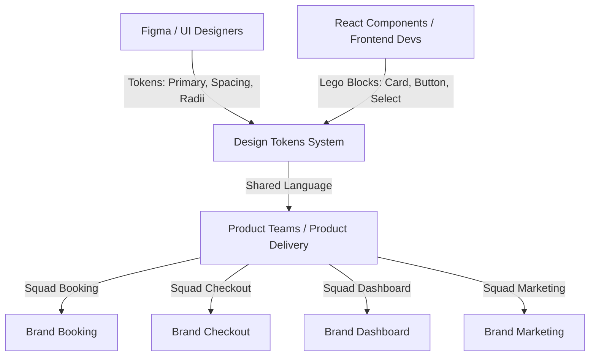
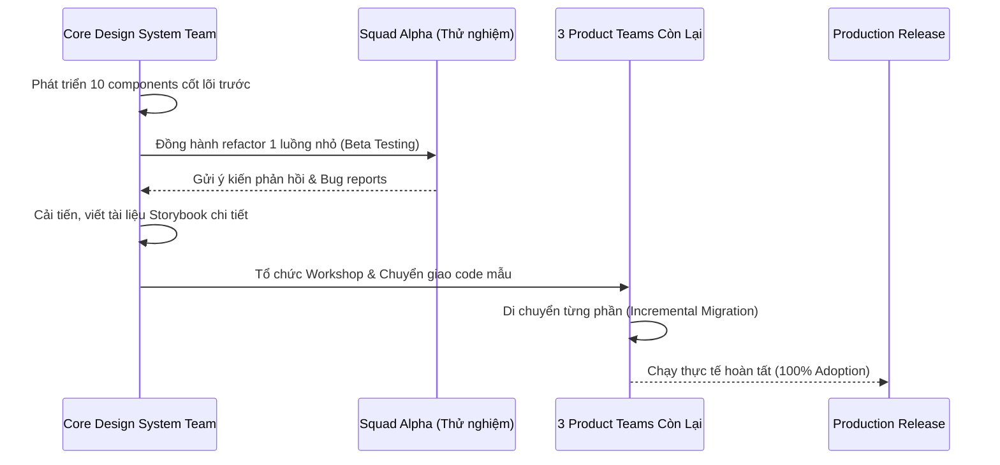

# Phân Tích Chuyên Sâu: Xây Dựng Hệ Thống Thiết Kế Linh Hoạt (Composable Design System) Cho Doanh Nghiệp

Tài liệu này phân tích chi tiết tư duy thiết kế, kiến trúc kỹ thuật và các quyết định cốt lõi khi xây dựng một **Composable Design System** quy mô lớn (50+ components), được áp dụng thực tế bởi 4 đội sản phẩm (Product Teams), giúp giảm **40% thời gian phát triển giao diện** và đảm bảo **tính đồng nhất thương hiệu** (brand consistency).

---

## 1. MENTAL MODEL: DESIGN SYSTEM NHƯ MỘT "SHARED LANGUAGE"

Thông thường, lập trình viên coi Design System chỉ là một thư viện component UI (như Bootstrap hay Material UI). Đây là một sai lầm phổ biến dẫn đến việc hệ thống thiết kế bị thất bại hoặc bị các đội sản phẩm từ chối sử dụng. 

**Mental Model đúng đắn:** Design System không phải là code, cũng không phải là các file Figma. Nó là một **Shared Language (Ngôn ngữ dùng chung)** được chuẩn hóa giữa Designer và Developer nhằm mục đích mô hình hóa thế giới giao diện thành các khái niệm trừu tượng nhất quán.



### Cách thức hoạt động của Ngôn ngữ Dùng chung này:
1. **Design Tokens làm nguyên tử (Atoms):** Thay vì nói "Hãy làm nút bấm màu xanh dương `#3b82f6` và bo góc `8px`", Designer và Dev nói "Hãy sử dụng màu nền `var(--color-primary)` và bo góc `var(--radius-md)`". Cả hai bên đều sử dụng chung một tập hợp tên gọi (naming convention) được lưu trữ trong một tệp nguồn duy nhất.
2. **Cấu trúc dạng Lego (Composition over Configuration):** Thiết kế giao diện không cố định các mẫu khung xương (spaghetti frames). Thay vào đó, nó cung cấp các mảnh ghép độc lập có thể tự do lắp ghép. Khi một product team yêu cầu tùy biến giao diện, họ không cần đợi Core Team chỉnh sửa mã nguồn gốc mà tự ráp nối cấu trúc theo nhu cầu.

---

## 2. KIENT RÚC THÀNH PHẦN (COMPONENT ARCHITECTURE)

Sự khác biệt cốt lõi giữa thư viện component thông thường và một thư viện chất lượng doanh nghiệp (Enterprise-grade) nằm ở cấu trúc dữ liệu truyền tải (data-flow) và cách các thành phần liên kết với nhau.

### 2.1. Compound Component Pattern (Mẫu thành phần ghép nối)

Khi xây dựng các thành phần phức tạp chứa trạng thái (như Tabs, Select, Accordion, Modal), các thư viện truyền thống thường đi theo hướng **Configuration-based (Cấu hình Prop)**:

```tsx
// ❌ ANTI-PATTERN: Monolithic Prop-based Component
<MonolithicSelect 
  options={[{ value: '1', label: 'Option 1' }]} 
  value={value} 
  onChange={onChange} 
  showCheckmarkIcon={true}
  highlightValue="1"
  squadBookingChevron={true}
/>
```

#### Hậu quả của Monolithic Pattern:
1. **Prop Explosion (Bùng nổ tham số):** Khi Squad Booking muốn hiển thị thêm email phụ dưới tên Option, Squad Checkout muốn thêm Badge trạng thái, Core Team buộc phải thêm liên tục các prop như `optionSubtextKey`, `optionBadgeKey`, `optionBadgeColorKey`. Component Select ban đầu chỉ có 3 props nay phình to lên 30+ props.
2. **Thiếu linh hoạt layout:** Product team không thể đưa hình ảnh, icon hoặc thay đổi thứ tự sắp xếp của từng Option mà bắt buộc phải tuân theo giao diện cứng nhắc được render từ vòng lặp `options.map` bên trong component.

#### Giải pháp: Compound Component Pattern sử dụng React Context
Chúng ta chia tách Select thành các mảnh ghép độc lập và giao tiếp với nhau qua một Context ẩn:

```tsx
// ✅ COMPOSABLE PATTERN: Lego-like Compound Component
<Select value={value} onChange={setValue}>
  <Select.Trigger placeholder="Chọn nhân viên..." />
  <Select.List>
    <Select.Option value="1">Engineering</Select.Option>
    {/* Tự do nhúng cấu trúc HTML tùy chỉnh mà không cần xin phép Core Team */}
    <div className="custom-option">
      <Avatar src="/user.png" />
      <div>
        <span>Trung Huỳnh</span>
        <span className="email">trung@singtel.com</span>
      </div>
      <Badge variant="success">Online</Badge>
    </div>
  </Select.List>
</Select>
```

#### Thiết lập Context để chia sẻ State ngầm:
Để các subcomponent như `<Select.Trigger>` biết được Select có đang mở hay không, hoặc `<Select.Option>` biết được mình có đang được chọn hay không, chúng ta tạo một context nội bộ:

```tsx
const SelectContext = createContext<SelectContextType | undefined>(undefined);

export const Select = ({ value, onChange, children }) => {
  const [isOpen, setIsOpen] = useState(false);
  const [selectedLabel, setSelectedLabel] = useState('');
  
  const selectOption = (val: string, label: string) => {
    onChange(val);
    setSelectedLabel(label);
    setIsOpen(false);
  };

  return (
    <SelectContext.Provider value={{ isOpen, setIsOpen, selectedValue: value, selectOption, selectedLabel, setSelectedLabel }}>
      <div className="ds-select-container">{children}</div>
    </SelectContext.Provider>
  );
};
```

Bằng cách này, mã nguồn của component cực kỳ tinh gọn, trách nhiệm phân tách rõ ràng (Single Responsibility Principle) và khả năng mở rộng giao diện là vô hạn đối với các product team.

---

### 2.2. Polymorphic Component Pattern (Thành phần đa hình với `as` prop)

Để đảm bảo tối ưu hóa SEO và cấu trúc ngữ nghĩa HTML (Semantic HTML) trong khi vẫn đồng bộ hóa CSS, component của chúng ta phải hỗ trợ thuộc tính đa hình `as`:

```tsx
// Vừa giữ style nút bấm, nhưng về mặt ngữ nghĩa nó là một thẻ a (link chuyển trang)
<Button as="a" href="https://singtel.com" target="_blank">
  Đi tới Singtel
</Button>
```

#### Hiện thực hóa kiểu dữ liệu TypeScript phức tạp cho Polymorphic Component:
Để TypeScript tự động nhận diện đúng kiểu thuộc tính tương ứng với thẻ HTML được chọn (ví dụ: nếu `as="a"` thì phải hỗ trợ `href`, nếu `as="button"` thì không hỗ trợ `href` nhưng hỗ trợ `type`), ta cấu hình:

```typescript
export type ButtonProps<T extends React.ElementType = 'button'> = {
  as?: T;
  variant?: ButtonVariant;
  size?: ButtonSize;
  isLoading?: boolean;
  children?: React.ReactNode;
} & Omit<React.ComponentPropsWithoutRef<T>, 'as' | 'variant' | 'size'>;

export const Button = <T extends React.ElementType = 'button'>({
  as,
  variant = 'primary',
  children,
  ...props
}: ButtonProps<T>) => {
  const Component = as || 'button';
  return <Component className={`ds-btn-${variant}`} {...props}>{children}</Component>;
};
```

---

## 3. QUẢN LÝ TOKENS & ISOLATION (CÔ LẬP CSS)

Khi chia sẻ thư viện component giữa 4 sản phẩm chạy trên các domain khác nhau (hoặc cùng tích hợp chung vào một trang thông qua kiến trúc Micro-Frontend), việc kiểm soát xung đột CSS là tối quan trọng.

### 3.1. Tránh Xung Đột CSS (CSS Collision)
Nếu ta viết CSS toàn cục đơn giản như `.btn` hay `.card`, khi tích hợp vào trang chủ có sẵn bootstrap hoặc thư viện khác, style chắc chắn sẽ bị đè bẹp (collision).

#### Chiến lược giải quyết:
1. **Namespace Prefixes:** Toàn bộ class của Design System phải được gán tiền tố cố định, ví dụ: `.ds-btn`, `.ds-card`, `.ds-select`.
2. **CSS Modules (Khuyên dùng cho Monorepo thông thường):** Tránh viết CSS thô trực tiếp. CSS Modules sẽ băm tên class thành các chuỗi unique ngẫu nhiên tại thời điểm build (ví dụ: `_btn_1a7bc_1`).
3. **CSS Variables cho Khả năng Thay đổi Theme:** Thiết lập màu sắc dựa trên CSS variables cấp độ cao nhất. Các class chỉ liên kết tới tên biến, không liên kết trực tiếp tới mã màu HEX cứng:
   ```css
   .ds-btn-primary {
     background-color: var(--color-primary);
     color: var(--color-text-on-primary);
   }
   ```

### 3.2. Cấu Trúc Khối Theme Độc Lập Cho 4 Product Teams
Để 4 product teams có thể chạy song song trên cùng một ứng dụng web (ví dụ: trang giỏ hàng của checkout tích hợp widget của booking), chúng ta cấu hình theme thông qua thuộc tính HTML `data-squad` và `data-theme`.

```css
/* Màu mặc định Light Mode */
:root {
  --color-primary: #3b82f6; /* Xanh dương */
  --radius-md: 8px;
}

/* Đè màu cho Squad Booking */
[data-squad="booking"] {
  --color-primary: #2563eb;
  --radius-md: 6px;
}

/* Đè màu cho Squad Checkout */
[data-squad="checkout"] {
  --color-primary: #059669; /* Xanh lá bảo mật */
  --radius-md: 4px;
}

/* Đè màu cho Squad Dashboard */
[data-squad="dashboard"] {
  --color-primary: #7c3aed; /* Tím đậm đà */
  --radius-md: 8px;
}

/* Đè màu cho Squad Marketing */
[data-squad="marketing"] {
  --color-primary: #db2777; /* Hồng rực rỡ */
  --radius-md: 12px;
}
```

Nhờ cơ chế thừa kế (CSS Variable Inheritance) của cây DOM, bất kỳ thành phần con nào nằm bên trong phân vùng `<div data-squad="checkout">` sẽ lập tức tự động nhận diện màu xanh lá của checkout, loại bỏ hoàn toàn việc phải truyền prop `theme="checkout"` hoặc sử dụng nhiều bundle css riêng biệt.

---

## 4. CHIẾN LƯỢC PHỔ CẬP & QUẢN LÝ PHIÊN BẢN (ADOPTION STRATEGY)

Việc viết được 50+ components chỉ chiếm 30% sự thành công của một hệ thống thiết kế. 70% còn lại nằm ở việc **thúc đẩy các team chuyển sang sử dụng hệ thống mới (Adoption Strategy)**. Lập trình viên thường ngại chuyển đổi vì sợ tốn thời gian refactor và lo sợ phá vỡ các chức năng cũ đang chạy ổn định.



### 4.1. Chiến Lược "Mồi Nhử" & Đồng Hành Thực Tế (Pilot Project)
*   **Không ép buộc chuyển đổi đồng loạt:** Đừng yêu cầu cả 4 đội viết lại toàn bộ code ngay lập tức. Hãy chọn ra **1 Squad** đang chuẩn bị xây dựng tính năng mới từ đầu (hoặc chuẩn bị làm lại giao diện - redesign).
*   **Bắt tay làm cùng:** Cử 1 kỹ sư từ Core Team sang làm việc cùng (co-working) trong squad đó suốt 2-3 tuần. Mục tiêu: Nhận diện trực tiếp các lỗ hổng của thư viện và vá trực tiếp tại chỗ trước khi xuất bản rộng rãi.

### 4.2. Chiến Lược Di Cư Từng Bước (Incremental Migration)
*   **Chạy song song cũ & mới:** Cho phép thư viện mới chạy đồng thời cùng hệ thống CSS cũ.
*   **Nguyên tắc 80/20:** 80% giao diện thông thường được dựng từ các nguyên tử cơ bản như Button, Card, Grid, Input. Tập trung tối ưu hóa các components này trước để tăng tỷ lệ áp dụng nhanh nhất mà không đòi hỏi viết lại logic nghiệp vụ sâu.

### 4.3. Quản Lý Versioning Không Gây Đổ Vỡ (Semantic Versioning)
Mỗi bản cập nhật cần tuân thủ nghiêm ngặt Semantic Versioning (`MAJOR.MINOR.PATCH`):
*   `PATCH` (1.0.1): Sửa lỗi css, chỉnh sửa a11y, không đổi tên props. Không đòi hỏi product teams nâng cấp cẩn trọng.
*   `MINOR` (1.1.0): Thêm component mới, thêm các biến thể prop không bắt buộc.
*   `MAJOR` (2.0.0): Thay đổi thiết kế props (ví dụ chuyển từ Monolithic sang Composable Card).

#### Cách phân phối mượt mà:
*   Sử dụng **Monorepo (Lerna / Turborepo)** giúp xuất bản các component độc lập (như `@orbit/button`, `@orbit/select`) thay vì một cục to đùng `@orbit/components`. Các team chỉ tải đúng thứ họ cần, giảm thiểu tối đa bundle size.
*   Thiết lập cảnh báo **Deprecation Warnings** trong code của phiên bản cũ bằng `@deprecated` JSDoc để lập trình viên tự động nhận diện trên VSCode và thay thế dần dần trước khi lên Major nâng cấp lớn.

---

## 5. WAR STORIES: BÀI HỌC ĐẮT GIÁ KHI TRIỂN KHAI THỰC TẾ

### 5.1. Breaking Change Nổ Tung Trang Thanh Toán (Checkout)
*   **Bối cảnh:** Trong phiên bản v1.2.0, Core Team quyết định sửa lại component `<Button>` để tích hợp spinner loading bên trong và đổi tên prop `showLoadingSpinner` thành `isLoading` để ngắn gọn hơn.
*   **Sự cố:** Một product team đã nâng cấp thư viện bằng `npm update` tự động trên hệ thống CI/CD mà không kiểm tra kỹ. Prop cũ `showLoadingSpinner` không còn tồn tại khiến nút thanh toán mất hiệu ứng quay vòng khi bấm, dẫn đến việc người dùng tưởng hệ thống đơ và bấm click 10 lần liên tục, gửi 10 transaction thanh toán lên server làm quá tải và lỗi cơ sở dữ liệu.
*   **Cách khắc phục:** 
    1. Thiết lập tệp cấu hình **Eslint custom rule** cảnh báo lập tức nếu phát hiện prop cũ.
    2. Viết logic bọc tương thích ngược (Backward Compatibility) trong mã nguồn nút bấm:
       ```typescript
       // Cảnh báo deprecated và tự động map sang prop mới
       const isLoading = props.isLoading || props.showLoadingSpinner;
       if (props.showLoadingSpinner) {
         console.warn("Prop 'showLoadingSpinner' đã bị loại bỏ. Vui lòng chuyển sang 'isLoading'.");
       }
       ```

### 5.2. Rò Rỉ Focus Trap & Treo Trình Duyệt Khi Mở Nhiều Modal
*   **Bối cảnh:** Để đảm bảo tiêu chuẩn tiếp cận (accessibility - a11y) cho người khiếm thị, component `<Modal>` sử dụng thư viện Focus Trap để khoá phím Tab chỉ di chuyển quanh các nút bấm trong Modal khi đang mở.
*   **Sự cố:** Khi người dùng mở một Modal xác nhận đè lên trên một Modal thông tin (Nested Modals), hai Focus Trap tranh chấp quyền điều khiển sự kiện `keydown`. Việc này tạo ra một vòng lặp sự kiện vô tận (infinite event loop) chiếm dụng 100% dung lượng CPU của trình duyệt, gây đơ toàn bộ tab trang web và khiến khách hàng mất toàn bộ giỏ hàng thanh toán.
*   **Cách khắc phục:** 
    1. Thiết lập cơ chế **Focus Trap Stack** (quản lý ngăn xếp). Chỉ cho phép Modal lớp trên cùng kích hoạt Focus Trap, tạm thời vô hiệu hóa Focus Trap của Modal nằm dưới.
    2. Gỡ bỏ toàn bộ sự kiện khi unmount component (Clean-up event listeners) trong hook `useEffect`:
       ```typescript
       useEffect(() => {
         const handleKeyDown = (e: KeyboardEvent) => {
           if (e.key === 'Escape' && isOpen) onClose();
         };
         window.addEventListener('keydown', handleKeyDown);
         return () => window.removeEventListener('keydown', handleKeyDown); // 📌 QUAN TRỌNG
       }, [isOpen, onClose]);
       ```

### 5.3. CSS Variables Bị Ghi Đè Chéo Do Thứ Tự Load Bundle
*   **Bối cảnh:** Squad Booking sử dụng theme xanh dương, Squad Dashboard sử dụng theme tím. Cả hai đều được import chung vào một ứng dụng Micro-Frontend tại trang chủ.
*   **Sự cố:** Tùy thuộc vào việc người dùng nhấn vào tab nào trước, bundle CSS tương ứng của team đó được chèn động (dynamic inject) vào thẻ `<head>`. Nếu CSS của Dashboard được tải sau cùng, định nghĩa màu sắc của nó đè lên các style cũ khiến toàn bộ ứng dụng Booking đang hiển thị bình thường bỗng dưng chuyển sang màu tím của Dashboard.
*   **Cách khắc phục:** Loại bỏ hoàn toàn việc định nghĩa biến màu sắc đè trực tiếp lên `:root` ở các ứng dụng con. Thay vào đó, áp dụng cơ chế cô lập tuyệt đối thông qua bộ chọn cụ thể (CSS Specifity) như `[data-squad="booking"]` hoặc sử dụng **CSS Shadow DOM** để cô lập hoàn toàn môi trường hiển thị của từng micro-app.

---

## 6. BỘ CÂU HỎI PHỎNG VẤN NÂNG CAO (FE INTERVIEW Q&A)

### Q1: Tại sao chúng ta nên chọn Compound Component Pattern thay vì cấu hình qua JSON props?
**Trả lời phản biện:** 
JSON props configuration (ví dụ truyền danh sách tùy chọn qua `options={[...]}`) làm giảm khả năng kiểm soát giao diện của bên sử dụng (consumer). Nếu consumer muốn chèn một Badge, một Avatar, hay một dòng chú thích nhỏ dưới từng phần tử, ta buộc phải thay đổi mã nguồn thư viện gốc để hỗ trợ định dạng dữ liệu mới đó, vi phạm nguyên tắc **Open-Closed Principle** (Mở rộng thoải mái nhưng hạn chế sửa đổi mã nguồn gốc).
Compound Component chuyển giao quyền định đoạt giao diện (Layout Authority) lại cho người sử dụng thông qua composition. Nó cung cấp các "khe cắm" (Slots) tự nhiên dưới dạng các thẻ con (`<Select.Option>`). Sự kết hợp trạng thái ngầm qua React Context giúp duy trì chức năng cốt lõi (như điều hướng bàn phím, trạng thái đóng mở) trong khi giao diện hoàn toàn do product team thiết lập tự do.

---

### Q2: Làm thế nào bạn xử lý tính năng "Đóng dropdown khi click ra ngoài" (Click outside) một cách hiệu quả và tránh rò rỉ bộ nhớ?
**Trả lời sâu sắc:**
Ta lắng nghe sự kiện `mousedown` hoặc `pointerdown` toàn cục trên `document`. Để kiểm tra xem vị trí click có nằm ngoài component hay không, ta sử dụng một React `useRef` gắn vào container bọc ngoài cùng của dropdown, sau đó gọi phương thức `ref.current.contains(event.target)`.
Để tránh rò rỉ bộ nhớ (memory leaks) và các lỗi rác không đáng có, sự kiện listener này bắt buộc phải được gỡ bỏ (cleaned up) trong hàm trả về của hook `useEffect` khi component bị hủy (unmounted):
```typescript
useEffect(() => {
  const listener = (event: MouseEvent) => {
    if (!ref.current || ref.current.contains(event.target as Node)) return;
    setIsOpen(false);
  };
  document.addEventListener('mousedown', listener);
  return () => document.removeEventListener('mousedown', listener); // Giải phóng tài nguyên
}, [ref]);
```
Nếu không giải phóng sự kiện này, trình duyệt sẽ lưu giữ tham chiếu tới hàm listener này cùng toàn bộ cây DOM bên trong closure, gây rò rỉ bộ nhớ kéo dài qua các trang.

---

### Q3: Polymorphic Components là gì và làm thế nào để gõ kiểu TypeScript cho nó mà không sử dụng kiểu dữ liệu `any`?
**Trả lời chi tiết:**
Polymorphic Component là component có khả năng thay đổi cấu trúc thẻ HTML vật lý của nó (ví dụ: nút `<Button>` có lúc render thành thẻ `<button>`, lúc render thành thẻ `<a>` hoặc thành component `Link` của React Router) nhưng vẫn giữ nguyên diện mạo (style) và các thuộc tính tương thích.
Để gõ kiểu TypeScript an toàn (type-safety) mà không dùng `any`, ta sử dụng kỹ thuật **TypeScript Generics** kết hợp với kiểu tiện ích `React.ComponentPropsWithoutRef`:
```typescript
type ButtonProps<T extends React.ElementType = 'button'> = {
  as?: T;
  variant?: ButtonVariant;
} & Omit<React.ComponentPropsWithoutRef<T>, 'as' | 'variant'>;
```
Bằng cách chỉ định Generic `T` kế thừa `React.ElementType` và đặt mặc định là `'button'`, TypeScript sẽ tự động suy luận các prop bổ sung hợp lệ cho thẻ HTML đó (ví dụ nếu truyền `as="a"`, compiler sẽ tự động hỗ trợ tự động gợi ý `href` và cảnh báo lỗi nếu truyền nhầm prop của thẻ input).

---

### Q4: Việc sử dụng React Context trong các Compound Components lớn có gây ra vấn đề hiệu năng do re-render không? Làm thế nào để tối ưu?
**Trả lời phản biện & thực chiến:**
Có, việc sử dụng React Context có nhược điểm là bất cứ khi nào giá trị của `Provider` thay đổi (ví dụ: `isOpen` thay đổi từ `false` sang `true`), toàn bộ các component con tiêu thụ (consume) Context đó thông qua `useContext` sẽ bị buộc phải re-render, kể cả khi các component con đó chỉ cần giá trị tĩnh (như danh sách các options không đổi).
**Cách tối ưu hóa hiệu quả:**
1. **Chia tách Context (Split Contexts):** Tách trạng thái thay đổi thường xuyên (như `value`, `isOpen`) và trạng thái tĩnh (như các hàm callback `selectOption`) thành hai Context riêng biệt.
2. **Component trung gian Memoization:** Bọc nội dung bên trong các component con phức tạp bằng `React.memo` để tránh re-render những phần UI tĩnh không liên quan.
3. **Sử dụng CSS để ẩn hiện thay vì hủy mount:** Thay vì render có điều kiện `{isOpen && <Select.List>}` (làm hủy/tạo liên tục các nút DOM), ta có thể ẩn hiện bằng class CSS (`display: none` hoặc `visibility: hidden`) để giữ nguyên cấu trúc DOM và giảm chi phí vẽ lại của trình duyệt.

---

### Q5: Khi chạy trong môi trường Micro-Frontend, làm thế nào để đảm bảo biến CSS (CSS Variables) của Design System không bị đè chéo chéo nhau giữa các app?
**Trả lời sâu sắc:**
CSS Variables mặc định được kế thừa theo cấu trúc phân cấp DOM (DOM Inheritance). Nếu định nghĩa biến màu sắc đè trực tiếp lên `:root`, biến của app này chắc chắn sẽ gây tác động chéo sang app khác trên cùng một trang.
**Phương pháp giải quyết triệt để:**
1. **Scope biến CSS theo tiền tố hoặc phân vùng:** Thay vì khai báo biến ở `:root`, hãy khai báo biến trong phạm vi bộ chọn đại diện (Class hoặc Data Attribute) của component cha bọc ứng dụng (ví dụ: `[data-squad="booking"]`).
2. **Sử dụng Shadow DOM:** Bọc micro-frontend ứng dụng con trong một Shadow Root. Mọi định nghĩa style và CSS variables thông thường bên trong Shadow DOM sẽ được cô lập hoàn toàn và không bao giờ rò rỉ ra cây DOM bên ngoài (tuy nhiên phương pháp này cần chú ý xử lý đồng bộ fonts và một số thư viện portal).

---

### Q6: Nếu Designer đổi hệ thống lưới (Spacing Grid) từ 8px sang 6px, bạn cập nhật Design System thế nào mà không phải sửa thủ công hàng trăm component?
**Trả lời chuẩn chỉ:**
Đây là lý do hệ thống **Design Tokens** ra đời. Khoảng cách không bao giờ được viết cứng (hardcode) là `8px` hay `16px`. Thay vào đó, toàn bộ components đều sử dụng biến CSS trỏ tới spacing scale:
```css
.ds-card {
  padding: var(--spacing-md);
}
```
Tại tệp Design Tokens trung tâm, ta chỉ cần sửa giá trị biến `--spacing-md: 12px;` (phát sinh từ scale 6px). Toàn bộ hệ thống components sẽ tự động co giãn theo tỷ lệ tương ứng trên toàn cục ngay lập tức mà không cần chỉnh sửa bất kỳ dòng code logic React nào.

---

### Q7: Tại sao bạn chọn sử dụng Pure CSS (hoặc CSS Modules) thay vì cài đặt các thư viện CSS-in-JS như Styled-Components cho Design System của dự án?
**Trả lời phản biện và bảo vệ ý kiến:**
Đối với thư viện component dùng chung cấp doanh nghiệp (Enterprise Design System), ta nên ưu tiên **Pure CSS/CSS Modules** hoặc **Tailwind CSS compiled** vì các lý do sau:
1. **Zero Runtime Overhead (Hiệu năng vượt trội):** Các thư viện CSS-in-JS (như styled-components) phải phân tích cú pháp (parse) và chèn thẻ style động vào head của tài liệu tại runtime (khi JavaScript đang chạy). Việc này gây trễ và tốn tài nguyên CPU của thiết bị di động yếu. Pure CSS được trình duyệt biên dịch cực nhanh ở tầng native.
2. **Framework Agnostic (Không phụ thuộc Framework):** Nếu ta xây dựng CSS thuần, sau này các đội dự án khác viết ứng dụng bằng Angular, Vue, hay thậm chí HTML tĩnh cũng có thể tái sử dụng file CSS đó mà không bị bó buộc vào React runtime.
3. **Hỗ trợ Server-Side Rendering (SSR) tự nhiên:** CSS thuần không gặp vấn đề rò rỉ style (style hydration mismatch) trên Next.js hoặc Remix, giúp trang tải nhanh hơn và đạt điểm SEO tốt hơn.

---

### Q8: Hãy nêu quy trình xử lý của bạn khi cần cập nhật một Breaking Change (thay đổi gây đổ vỡ) cho một component đang được 4 teams sử dụng rộng rãi?
**Trả lời có tư duy hệ thống:**
1. **Lập kế hoạch Deprecation (Tương thích ngược):** Không được xóa ngay API cũ. Ta thêm prop mới và đánh dấu prop cũ bằng `@deprecated` trong JSDoc để IDE của các lập trình viên hiện cảnh báo gạch ngang màu xám.
2. **Vá logic khẩn cấp:** Viết mã bọc tạm thời để ánh xạ prop cũ sang prop mới nếu phát hiện lập trình viên chưa refactor kịp.
3. **Phát hành phiên bản Beta:** Phát hành tag thử nghiệm `npm version 2.0.0-beta.0` và mời 1 team chạy thử để kiểm thử thực tế.
4. **Viết công cụ hỗ trợ di cư (Codemods):** Nếu thay đổi quá lớn, hãy viết một script nhỏ sử dụng công cụ **jscodeshift** (Codemods) quét mã nguồn tự động đổi tên prop cho các product teams, giảm thiểu thời gian refactor tay của họ về con số 0.

---

### Q9: Storybook có vai trò gì ngoài việc làm tài liệu giao diện tĩnh? Bạn đã cấu hình các Addon nâng cao nào?
**Trả lời thực chiến:**
Storybook không đơn thuần là tài liệu tĩnh, nó là **môi trường cô lập để phát triển và kiểm thử tự động (Isolated Development Environment)**.
Các Addon nâng cao tôi đã áp dụng gồm:
1. **`@storybook/addon-a11y`:** Tự động chạy quét tiêu chuẩn tiếp cận WCAG (màu tương phản, thẻ aria-label) trên từng component và báo cáo vi phạm trực tiếp trên giao diện Storybook.
2. **`@storybook/addon-docs` (MDX):** Cho phép kết hợp tài liệu Markdown và các component sống (live stories) giúp Designer có thể xem trực quan thông số padding, font chữ thực tế.
3. **Visual Regression Testing (Ví dụ Chromatic):** Tự động chụp ảnh màn hình (screenshot) các component trước và sau mỗi pull request để cảnh báo nếu vô tình làm lệch pixel (pixel shifting) giao diện ở đâu đó.

---

### Q10: Làm thế nào bạn đảm bảo các thành phần dạng Portal (như Modal, Tooltip) hoạt động đúng tiêu chuẩn Accessibility (a11y) và điều hướng bằng bàn phím (Keyboard Navigation)?
**Trả lời chuyên nghiệp:**
Một Modal tiếp cận chuẩn (accessible modal) phải tuân thủ hướng dẫn WAI-ARIA:
1. **Focus Trap:** Khi Modal mở, phím `Tab` chỉ được phép di chuyển tiêu điểm (focus) giữa các nút bấm có trong Modal và không được rò rỉ tiêu điểm ra các đường dẫn ẩn phía sau trang web chính.
2. **Restore Focus:** Khi Modal đóng lại, tiêu điểm phải tự động trả về vị trí nút bấm đã kích hoạt nó ban đầu để người dùng sử dụng máy đọc màn hình không bị mất phương hướng.
3. **Keyboard Dismissal:** Nhấn phím `Escape` phải lập tức kích hoạt sự kiện đóng Modal.
4. **ARIA Attributes:** Gán `role="dialog"`, `aria-modal="true"`, và liên kết tiêu đề modal thông qua thuộc tính `aria-labelledby`.

---

### Q11: Tại sao chúng ta cần tránh việc chèn các thẻ CSS @import bên trong các component file riêng lẻ?
**Trả lời sâu sắc:**
Sử dụng `@import` trong các tệp CSS của component riêng lẻ khiến trình duyệt không thể tải song song các tệp CSS. Thay vào đó, trình duyệt phải tải xong file CSS thứ nhất, phân tích cú pháp thấy dòng `@import`, rồi mới gửi tiếp request để tải file CSS thứ hai. Việc này tạo ra chuỗi chặn tài nguyên liên tiếp (Request Waterfall), làm tăng nghiêm trọng chỉ số **First Contentful Paint (FCP)** và trì hoãn thời gian render trang của người dùng.
**Giải pháp:** Hãy gom toàn bộ định nghĩa CSS và nhập khẩu chúng một lần tại entry point đầu tiên hoặc cấu hình webpack/vite để tự động gom cụm (bundle) toàn bộ CSS thành một file duy nhất tại thời điểm build.

---

### Q12: Làm thế nào để quản lý các trạng thái "Trống" (Empty state) hoặc lỗi hiển thị của các thành phần con một cách thanh lịch thông qua hệ thống thiết kế?
**Trả lời kiến trúc:**
Ta thiết lập cơ chế **Slot Composition** hoặc cấu hình **Fallback Elements**. Thay vì dựng cứng hình ảnh mặc định hay dòng chữ cảnh báo lỗi bên trong component gốc, ta cho phép truyền một component trống tùy chọn.
Nếu consumer không truyền gì, component sẽ sử dụng fallback mặc định. Nếu consumer truyền, component con sẽ ghi đè vị trí đó.
```tsx
const EmptyStatePlaceholder = () => (
  <div className="ds-empty-state">
    <InboxIcon />
    <p>Không có dữ liệu hiển thị</p>
  </div>
);

export const Table = ({ data, children, emptyState = <EmptyStatePlaceholder /> }) => {
  if (data.length === 0) return emptyState;
  return <table>{children}</table>;
};
```

---

### Q13: Bạn tối ưu hóa Font Loading trong Design System như thế nào để tránh hiệu ứng FOUT (Flash of Unstyled Text) hoặc FOIT (Flash of Invisible Text)?
**Trả lời tối ưu:**
Hiệu ứng FOUT xảy ra khi font tùy chỉnh chưa tải xong, trình duyệt sẽ dùng font hệ thống để hiển thị tạm thời rồi giật màn hình khi font mới được áp dụng. FOIT xảy ra khi trình duyệt ẩn chữ đi cho tới khi tải xong font tùy chỉnh.
**Cách tối ưu hóa:**
1. Khai báo thuộc tính `font-display: swap;` trong chỉ thị `@font-face` để ép trình duyệt render ngay bằng font hệ thống dự phòng và hoán đổi sau khi font tùy chỉnh tải xong, tránh ẩn chữ gây ức chế cho người đọc.
2. Sử dụng thẻ `<link rel="preload">` ở phần đầu của tệp HTML chính để tải trước tệp font có độ ưu tiên cao trước khi CSS được phân tích cú pháp.
3. Khai báo danh sách các font hệ thống dự phòng (fallback fonts) có thông số chiều rộng tương đồng với font tùy chỉnh để giảm thiểu hiện tượng giật cục layout (Cumulative Layout Shift - CLS) khi hoán đổi chữ.

---

### Q14: Việc sử dụng CSS Modules làm giảm khả năng ghi đè CSS (CSS Override) của product team khi họ cần chỉnh sửa một chút style đặc biệt. Bạn giải quyết bài toán này thế nào?
**Trả lời phản biện thực tế:**
CSS Modules băm class khiến bên ngoài không thể chọn trực tiếp bằng tên class tĩnh thông thường. Nhưng đây chính là mục đích để bảo vệ tính đồng nhất của hệ thống thiết kế.
**Nếu thực sự cần override một cách an toàn:**
1. **Cung cấp thuộc tính `className`:** Tiếp nhận prop `className` truyền từ ngoài vào và ghép nối nó vào class gốc bằng thư viện `clsx` hoặc `classnames`.
2. **Tận dụng CSS Variables:** Cho phép tùy biến thông số thông qua inline-style variables:
   ```tsx
   <Card style={{ '--color-bg-surface': '#fff0f0' } as React.CSSProperties}>
     Nội dung card có màu nền đỏ nhạt tuỳ biến
   </Card>
   ```
3. **Bộ chọn `:global`:** Đối với những trường hợp đặc biệt, ta viết luật override bên trong khối `:global(.ds-btn)` để cho phép tác động có kiểm soát lên class gốc.

---

### Q15: Làm thế nào để giải quyết mâu thuẫn khi Product Team muốn thêm 1 component rất đặc thù vào thư viện dùng chung, trong khi Core Team thấy nó không mang tính tái sử dụng cao?
**Trả lời tinh tế và chuyên nghiệp:**
Ta áp dụng quy trình **Component Lifecycle & Promotion (Nâng cấp dần)**:
1. **Phân vùng Sandbox:** Cho phép product team đó tự viết component đặc thù kia ngay trong thư mục mã nguồn dự án của họ.
2. **Theo dõi tỷ lệ sử dụng:** Nếu sau 2-3 tháng, phát hiện có thêm 2 sản phẩm khác sao chép (copy-paste) mã nguồn component đó về sử dụng, Core Team sẽ chủ động tiến hành tái cấu trúc (refactor) component đó để chuẩn hóa các quy tắc a11y, viết câu chuyện trong Storybook và "nhận nuôi" (Promote) nó lên thành component chính thức trong Design System.
Quy trình này giúp Core Team không bị quá tải bởi các yêu cầu vụn vặt, đồng thời không làm tắc nghẽn tốc độ bàn giao sản phẩm của product teams.
