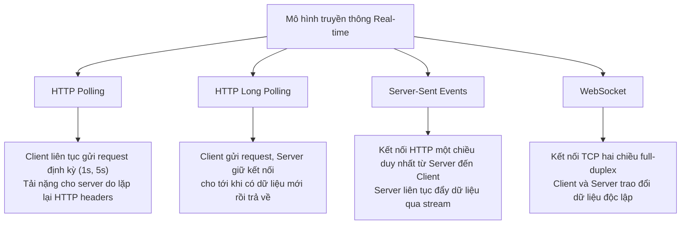
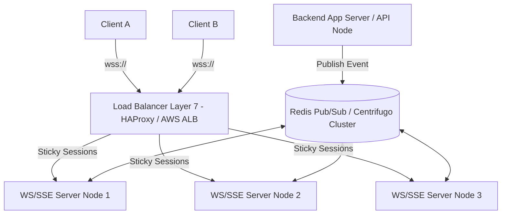

# Tài liệu chuyên sâu: Tích hợp và Tối ưu hóa Giao thức Thời gian thực (WebSocket & Server-Sent Events)

Tài liệu này cung cấp cái nhìn chi tiết về các giải pháp truyền dữ liệu thời gian thực (Real-time data stream) trên Web, tập trung vào hai công nghệ phổ biến nhất: **Server-Sent Events (SSE)** và **WebSocket**, kết hợp với các kỹ thuật tối ưu hóa phía Client và Server để phục vụ quy mô **5M+ người đăng ký đồng thời (Subscribers)** với chu kỳ làm mới dưới 1 giây (Sub-second refresh rate).

---

## 1. Bản chất & Mental Model của các giải pháp Real-time

Trong phát triển Web hiện đại, việc cập nhật thông tin tức thời lên giao diện mà không cần người dùng tải lại trang là yêu cầu bắt buộc đối với các dashboard giám sát, ứng dụng tài chính, chat hoặc thông báo. Có 4 mô hình truyền thông chính:



### Bảng so sánh tổng quan các phương thức truyền thông:

| Tiêu chí | HTTP Polling | HTTP Long Polling | Server-Sent Events (SSE) | WebSocket |
| :--- | :--- | :--- | :--- | :--- |
| **Kiểu kết nối** | Độc lập, ngắn hạn | Giữ lâu (Long-lived) | Persistent stream | Persistent full-duplex |
| **Chiều truyền** | Một chiều (Client pull) | Một chiều (Client pull) | Một chiều (Server push) | Hai chiều (Bi-directional) |
| **Giao thức** | HTTP/1.1 or HTTP/2 | HTTP/1.1 or HTTP/2 | HTTP/1.1 or HTTP/2 | WebSocket Protocol |
| **Overhead** | Rất cao (Mỗi request gửi kèm Cookie, Headers) | Trung bình (Chỉ gửi header khi tạo lại request) | Rất thấp (Chỉ gửi header 1 lần lúc handshake) | Cực kỳ thấp (Khung tin nhắn chỉ tốn 2-8 bytes overhead) |
| **Latency** | Cao (Tùy thuộc khoảng thời gian poll) | Thấp (Trả về ngay khi có data) | Sub-millisecond | Sub-millisecond |
| **Khả năng Cache** | Rất tốt (HTTP chuẩn) | Không nên | Khó (Cần Edge push CDN) | Không thể |
| **Hỗ trợ Reconnect** | Mặc định (Request mới) | Thủ công | Tự động bởi EventSource | Thủ công phía Client |
| **Giới hạn kết nối** | Không giới hạn | Giới hạn 6 conns/domain (HTTP/1.1) | Giới hạn 6 conns/domain (HTTP/1.1), vô hạn với HTTP/2 | Vô hạn (Phụ thuộc tài nguyên Server) |

---

## 2. Đi sâu vào cơ chế kỹ thuật (Deep-dive Protocols)

### 2.1. Server-Sent Events (SSE)

SSE là công nghệ cho phép server chủ động đẩy dữ liệu (text stream) tới client thông qua một kết nối HTTP duy nhất được duy trì liên tục. 

#### Cơ chế hoạt động:
1. **Client khởi tạo:** Sử dụng đối tượng `EventSource` của trình duyệt.
   ```javascript
   const eventSource = new EventSource('/api/sse');
   ```
2. **HTTP Request Headers:**
   ```http
   GET /api/sse HTTP/1.1
   Host: example.com
   Accept: text/event-stream
   Cache-Control: no-cache
   Connection: keep-alive
   ```
3. **HTTP Response Headers từ Server:** Server trả về status `200 OK` nhưng không đóng kết nối mà duy trì stream với định dạng nội dung đặc biệt:
   ```http
   HTTP/1.1 200 OK
   Content-Type: text/event-stream
   Cache-Control: no-cache
   Connection: keep-alive
   Access-Control-Allow-Origin: *
   ```
4. **Định dạng dữ liệu (Event Format):** Dữ liệu truyền đi dưới dạng plain-text UTF-8, phân tách bằng hai ký tự xuống dòng liên tiếp (`\n\n`).
   ```text
   id: 12345
   event: message
   retry: 5000
   data: {"subscribers": 5124930, "tps": 14250}
   
   id: 12346
   event: message
   data: {"subscribers": 5124982, "tps": 14265}
   ```
   - `id`: Định danh bản tin. Trình duyệt sẽ lưu lại ID này. Nếu mất kết nối, trình duyệt tự động gửi header `Last-Event-ID` trong request kết nối lại để server gửi bù các tin nhắn bị thiếu.
   - `event`: Tên sự kiện (giúp client bắt các event tùy chỉnh bằng `addEventListener('tên_sự_kiện', callback)`).
   - `retry`: Thời gian chờ (ms) trước khi client tự động thử kết nối lại nếu kết nối bị đứt.
   - `data`: Nội dung thông điệp dạng chuỗi.

---

### 2.2. WebSocket

WebSocket là một giao thức độc lập (chuẩn RFC 6455) xây dựng trên nền tảng TCP, cung cấp kênh giao tiếp song công (full-duplex) qua một kết nối socket duy nhất.

#### Quy trình bắt tay (Handshake Upgrade):
1. **Client gửi HTTP Upgrade Request:**
   ```http
   GET /api/ws HTTP/1.1
   Host: example.com
   Upgrade: websocket
   Connection: Upgrade
   Sec-WebSocket-Key: dGhlIHNhbXBsZSBub25jZQ==
   Sec-WebSocket-Version: 13
   ```
2. **Server phản hồi 101 Switching Protocols:**
   ```http
   HTTP/1.1 101 Switching Protocols
   Upgrade: websocket
   Connection: Upgrade
   Sec-WebSocket-Accept: s3pPLMBiTxaQ9kYGzzhZRbK+xOo=
   ```
   *Giải thích thuật toán:* Server lấy `Sec-WebSocket-Key` từ client, nối chuỗi GUID chuẩn toàn cầu (`258EAFA5-E914-47DA-95CA-C5AB0DC85B11`), băm SHA-1 rồi mã hóa Base64 để trả về trong `Sec-WebSocket-Accept`. Điều này giúp đảm bảo server thực sự hỗ trợ WebSocket và không phải là cache proxy phản hồi nhầm.

3. **Cấu trúc Khung dữ liệu (WebSocket Frame):**
   Sau khi bắt tay thành công, dữ liệu được truyền dưới dạng các Frame (Khung nhị phân) chứ không còn là text thô của HTTP:
   ```text
    0                   1                   2                   3
    0 1 2 3 4 5 6 7 8 9 0 1 2 3 4 5 6 7 8 9 0 1 2 3 4 5 6 7 8 9 0 1
   +-+-+-+-+-------+-+-------------+-------------------------------+
   |F|R|R|R| opcode|M|     payload |    extended payload length    |
   |I|S|S|S|  (4b) |A|  len (7b)   |             (16/64)           |
   |N|V|V|V|       |S|             |   (if payload len==126/127)   |
   | |1|2|3|       |K|             |                               |
   +-+-+-+-+-------+-+-------------+ - - - - - - - - - - - - - - - +
   |     Extended payload length continued, if payload len == 127  |
   + - - - - - - - - - - - - - - - - - - - - - - - - - - - - - - - +
   |                               |Masking-key, if MASK set to 1  |
   +-------------------------------+-------------------------------+
   | Payload Data (tin nhắn thực tế) ...                           |
   +---------------------------------------------------------------+
   ```
   - **FIN (1 bit):** Báo hiệu đây có phải là frame cuối cùng của tin nhắn hay không (hỗ trợ phân mảnh tin nhắn lớn).
   - **Opcode (4 bits):** Định nghĩa loại frame:
     - `0x1`: Text frame
     - `0x2`: Binary frame
     - `0x8`: Connection close
     - `0x9`: Ping
     - `0xA`: Pong
   - **Mask (1 bit):** Bắt buộc phải là `1` đối với frame gửi từ Client lên Server để bảo mật (tránh lỗi cache poisoning thông qua proxy). Phải là `0` đối với frame gửi từ Server xuống Client.
   - **Masking-Key (4 bytes):** Khóa giải mã ngẫu nhiên được client sử dụng để XOR dữ liệu trước khi truyền. Server dùng khóa này để XOR ngược lại lấy dữ liệu gốc.

---

## 3. Kiến trúc hệ thống mở rộng quy mô lớn (Scaling Architecture for 5M+ Subscribers)

Để duy trì đồng thời **5.000.000+ kết nối mở** (Long-lived connections) với chu kỳ đẩy tin nhắn dưới 1 giây, một server đơn lẻ không bao giờ gánh nổi. Chúng ta cần triển khai kiến trúc hệ thống phân tán:



### 3.1. Phân phối tải bằng Load Balancers
- **Layer 4 vs Layer 7:** Load Balancer ở L4 (TCP level) như HAProxy hoặc AWS NLB phân phối kết nối rất nhanh bằng cách chia đều luồng TCP raw. Tuy nhiên, L7 Load Balancer (HTTP level) như Nginx hoặc AWS ALB cho phép đọc Header, xử lý SSL termination và hỗ trợ cấu hình định tuyến thông minh.
- **Sticky Sessions (Session Affinity):** Đối với WebSocket, bắt tay nâng cấp ban đầu là HTTP. Do đó, LB cần cấu hình Sticky Session để đảm bảo toàn bộ vòng đời bắt tay và duy trì TCP connection của client đều trỏ về đúng 1 Server Node duy nhất.

### 3.2. Pub/Sub Layer (Trái tim của Cluster)
Khi hệ thống có nhiều Node, làm thế nào để gửi tin nhắn đến đúng Server Node mà Client đang kết nối?
- **Giải pháp:** Sử dụng một Pub/Sub Broker trung tâm (như **Redis Pub/Sub**, **Apache Kafka** hoặc giải pháp chuyên dụng **Centrifugo**).
- **Luồng hoạt động:**
  1. Client kết nối vào Node 2 và đăng ký kênh (channel) `"live-dashboard"`.
  2. Một giao dịch mới phát sinh, hệ thống Core Engine publish sự kiện này vào kênh `"live-dashboard"` trên Redis.
  3. Tất cả Server Nodes (1, 2, 3) đang lắng nghe Redis sẽ nhận được thông điệp.
  4. Node 2 kiểm tra danh sách client nội bộ của mình, thấy Client A đang đăng ký kênh này liền đẩy tin nhắn qua socket. Node 1 và Node 3 không có client nào đăng ký thì bỏ qua.

### 3.3. Tối ưu hệ điều hành & Connection Pool
- **File Descriptors Limit (`ulimit`):** Mặc định Linux chỉ cho phép một tiến trình mở tối đa 1024 tệp tin (mỗi socket kết nối TCP là một file descriptor). Cần nâng thông số này trong `/etc/security/limits.conf`:
  ```text
  * soft nofile 1000000
  * hard nofile 1000000
  ```
- **Tuning TCP IP Stack:** Cấu hình `/etc/sysctl.conf` để tăng dải cổng cục bộ (local port range) và tối ưu hóa thời gian tái sử dụng socket (`TIME_WAIT`):
  ```ini
  net.ipv4.ip_local_port_range = 1024 65535
  net.ipv4.tcp_tw_reuse = 1
  net.ipv4.tcp_fin_timeout = 15
  ```
- **Heartbeat & Zombie Connection Cleanup:** Nhiều thiết bị di động mất mạng đột ngột (đi vào đường hầm, mất sóng) mà không hề gửi tín hiệu ngắt TCP đóng socket. Server vẫn tưởng kết nối còn sống, dẫn tới rò rỉ bộ nhớ.
  - **Giải pháp:** Sử dụng cơ chế Ping-Pong định kỳ (ví dụ: mỗi 30 giây Server gửi Ping, nếu quá 2 chu kỳ client không phản hồi Pong thì Server chủ động hủy socket).

---

## 4. Các chiến thuật tối ưu dữ liệu & băng thông (Bandwidth & Data Optimization)

Nếu mỗi tin nhắn có kích thước 1KB, việc gửi cho 5 triệu subscriber mỗi 200ms sẽ tiêu tốn băng thông:
$$\text{Băng thông} = 5,000,000 \times \frac{1 \text{KB}}{0.2 \text{s}} = 25,000,000 \text{ KB/s} = 25 \text{ GB/s} = 200 \text{ Gbps}$$
Đây là con số khổng lồ, chi phí cực kỳ đắt đỏ. Chúng ta phải giảm kích thước dữ liệu bằng mọi giá.

### 4.1. Message Batching (Gom nhóm bản tin)
Thay vì server gửi 1 tin nhắn ngay khi có một giao dịch phát sinh (ví dụ: 100 giao dịch/giây = 100 tin nhắn/giây), server sẽ gom dữ liệu lại thành một mảng (batch) và gửi định kỳ mỗi 200ms hoặc 500ms.
- **Ưu điểm:** Giảm số lượng gói tin truyền đi trên mạng, giảm tải cho CPU của card mạng phía Server và Client.

### 4.2. Delta Updates (Chỉ gửi phần thay đổi)
Tránh gửi đi toàn bộ cục State lớn của Dashboard mỗi lần cập nhật.
- **Ví dụ lỗi:** Gửi toàn bộ danh sách 50 cổ phiếu chứng khoán mỗi giây.
- **Tối ưu:** Chỉ gửi thông tin về ID cổ phiếu nào thay đổi giá trị kèm giá trị mới (`{id: "AAA", price: 105.2}`). Client sẽ tự động cập nhật vào bản sao cục bộ.

### 4.3. Thay thế JSON bằng Binary Protocols
JSON là định dạng text, dễ đọc nhưng rất tốn tài nguyên do chứa nhiều ký tự lặp lại (dấu ngoặc, nháy kép, tên key).
- **Giải pháp:** Sử dụng **MessagePack** hoặc **Protocol Buffers (Protobuf)** để mã hóa nhị phân trước khi gửi.
- **So sánh thực tế:**
  - JSON Payload: `{"timestamp":1781102116126,"cpu":45,"memory":4.82,"active":5023928}` (76 bytes)
  - Protobuf Payload: Chỉ tốn khoảng **22 bytes** (giảm 70% băng thông!).

---

## 5. Chiến thuật tối ưu hóa phía Client (Frontend Performance)

Nếu không tối ưu phía Front-End, dòng dữ liệu đổ về liên tục ở tốc độ cao (50ms - 200ms) sẽ khiến ứng dụng React bị thắt nút cổ chai ở giai đoạn Reconciliation (so khớp DOM), dẫn đến hiện tượng treo cứng CPU trình duyệt và lag giao diện (Frame drops).

### 5.1. Render Throttling sử dụng requestAnimationFrame (rAF)
Tránh gọi `setState` trực tiếp ngay khi nhận được tin nhắn từ Socket. Thay vào đó, đưa tin nhắn vào một Buffer (bằng `useRef`) và sử dụng `requestAnimationFrame` để giới hạn tần suất vẽ UI khớp với tần số quét của màn hình (thường là 60Hz - 16.6ms).

```javascript
// useRef lưu giữ giá trị mới nhất mà không trigger re-render
const metricsBuffer = useRef(null);
const rafPending = useRef(false);

const onSocketMessage = (data) => {
  metricsBuffer.current = data;
  
  if (!rafPending.current) {
    rafPending.current = true;
    requestAnimationFrame(() => {
      // Chỉ render dữ liệu mới nhất một lần trong mỗi khung hình của trình duyệt
      setData(metricsBuffer.current);
      rafPending.current = false;
    });
  }
};
```

### 5.2. Cập nhật DOM cục bộ không thông qua Re-render toàn trang
Nếu bạn sử dụng React State thông thường ở component cha, toàn bộ cây component con chứa hàng chục bảng biểu, thẻ KPI sẽ re-render theo mỗi 100ms.
- **Giải pháp:**
  - Sử dụng thư viện quản lý state độc lập (như **Zustand** cấu hình không lắng nghe toàn bộ store).
  - Hoặc cập nhật DOM trực tiếp bằng cách lấy reference (`useRef`) trỏ tới node văn bản cần đổi số và chỉnh thuộc tính `.textContent` hoặc `.innerText` trực tiếp mà không đổi state React.
  - Sử dụng `React.memo` cho các component hiển thị tĩnh để tránh bị tính toán lại.

### 5.3. Sử dụng HTML5 Canvas cho các biểu đồ sóng thời gian thực
Tránh xa các thư viện chart vẽ bằng DOM/SVG thông thường (như Recharts, Chart.js ở chế độ mặc định) khi tần suất render cao. Hàng ngàn phần tử SVG chèn vào DOM mỗi giây sẽ giết chết hiệu năng.
- **Giải pháp:** Vẽ chart bằng đồ họa pixel trên thẻ `<canvas>`. Canvas vẽ trực tiếp lên GPU trình duyệt, cho hiệu năng cực cao và mượt mà ở tốc độ 60fps.

---

## 6. War Stories: Bài học đắt giá triển khai thực tế

### 6.1. Thảm họa Reconnection Storm (Cơn bão kết nối lại)
- **Tình huống:** Một Node Server bị sập vật lý dẫn đến 1.000.000 client bị ngắt kết nối đồng thời. Hệ thống phát hiện kết nối đóng và ngay lập tức gửi lệnh kết nối lại (`ws = new WebSocket(...)`).
- **Hậu quả:** 1.000.000 request bắt tay gửi dồn dập vào Load Balancer và các Node server còn lại trong cùng 1 giây. Việc này gây quá tải CPU của LB, sập dây chuyền toàn bộ cụm server còn lại (Cascading Failure).
- **Giải pháp xử lý:** Triển khai cơ chế **Exponential Backoff với Jitter** (Thời gian kết nối lại tăng dần theo cấp số nhân và cộng thêm một khoảng ngẫu nhiên để phân rã thời gian gửi request của các client).
  $$\text{Thời gian chờ} = 2^{\text{số lần thử}} \times 1000 \text{ ms} + \text{random\_jitter}$$

### 6.2. Lỗi rò rỉ bộ nhớ (Memory Leak) do Zombie Connection
- **Tình huống:** Khi người dùng chuyển trang hoặc đóng một component Dashboard, lập trình viên quên hủy bỏ EventSource hoặc đóng socket.
- **Hậu quả:** Dù component biến mất khỏi DOM, luồng callback nhận tin nhắn từ SSE/WS vẫn chạy ngầm. Đối tượng chứa dữ liệu cũ không được Garbage Collector dọn dẹp, dung lượng RAM trình duyệt tăng liên tục cho đến khi tab bị Crash (Out of Memory).
- **Giải pháp:** Luôn return hàm cleanup trong hook `useEffect` của React:
  ```javascript
  useEffect(() => {
    const ws = new WebSocket(url);
    // ...
    return () => {
      ws.close(); // Giải phóng socket ngay khi unmount!
    };
  }, []);
  ```

---

## 7. 25+ Câu hỏi phỏng vấn Front-End nâng cao về Real-Time Performance


#### Q1: Kể tên các điểm khác biệt lớn nhất giữa WebSocket và Server-Sent Events? Khi nào chọn cái nào?

**Trả lời:**
- WebSocket hỗ trợ truyền dữ liệu song công (2 chiều), chạy trên giao thức riêng TCP, tốn nhiều công sức để thiết lập bảo mật và tự reconnect.
- SSE là một chiều (chỉ Server đẩy về Client), chạy trên HTTP chuẩn, tích hợp sẵn reconnect và Last-Event-ID, rất dễ deploy qua Firewall.
- **Quy tắc lựa chọn:** Chọn SSE cho các dữ liệu luồng 1 chiều (như thông báo, bảng giá chứng khoán, feeds mạng xã hội). Chọn WebSocket khi bắt buộc phải giao tiếp 2 chiều độ trễ cực thấp (như Chat app, Game nhiều người chơi, vẽ collab thời gian thực).

---


#### Q2: Tại sao HTTP Polling thông thường lại ngốn nhiều băng thông hơn WebSocket dù truyền cùng một lượng dữ liệu?

**Trả lời:**
Bởi vì mỗi request HTTP Polling là một chu kỳ Request-Response độc lập, bắt buộc phải gửi đi toàn bộ HTTP Header (Cookie, User-Agent, Accept, v.v., kích thước từ 500B - 1KB). Trong khi đó, WebSocket sau khi handshake thành công chỉ truyền dữ liệu thô đóng gói trong các WebSocket Frames với overhead cực nhỏ (chỉ từ 2 đến 8 bytes). Ở tần suất cao, overhead của Polling chiếm đến 90% tổng băng thông tiêu thụ.

---


#### Q3: Reconnection Storm là gì và làm thế nào để phòng chống nó phía Front-End?

**Trả lời:**
Reconnection Storm xảy ra khi cụm server bị mất điện hoặc sập tạm thời, khiến hàng triệu kết nối của người dùng bị ngắt cùng lúc. Khi server phục hồi, toàn bộ client đồng loạt kết nối lại trong cùng một khoảnh khắc, tạo ra một đợt tấn công từ chối dịch vụ vô ý (DDoS) tự phát.
Để phòng chống, phía client cần triển khai thuật toán **Exponential Backoff kèm Jitter**:
- Lần thử 1: Chờ 1s + ngẫu nhiên 0.2s.
- Lần thử 2: Chờ 2s + ngẫu nhiên 0.5s.
- Lần thử 3: Chờ 4s + ngẫu nhiên 1s.
Việc này làm giãn đều thời gian kết nối lại của hàng triệu thiết bị trong vòng vài phút, giúp server không bị quá tải.

---


#### Q4: Làm thế nào để giải quyết vấn đề rò rỉ bộ nhớ (Memory Leak) khi sử dụng WebSocket trong React?

**Trả lời:**
Nguyên nhân chủ yếu do không đóng kết nối socket hoặc không xóa bỏ event listener khi component unmount. Điều này giữ lại tham chiếu (reference) tới component trong bộ nhớ.
Cách giải quyết: Luôn dọn dẹp (cleanup) socket trong hàm clean của `useEffect`:
```javascript
useEffect(() => {
  const ws = new WebSocket(WS_URL);
  ws.onmessage = (e) => handleData(e.data);
  return () => {
    ws.onmessage = null;
    ws.close();
  };
}, []);
```

---


#### Q5: requestAnimationFrame (rAF) giúp ích gì trong việc tối ưu hóa hiệu năng render Dashboard real-time?

**Trả lời:**
Khi server đẩy dữ liệu quá nhanh (ví dụ 50ms/lần = 20 lần/giây), nếu ta render ngay lập tức, trình duyệt sẽ phải tính toán lại layout và paint 20 lần/giây. Tuy nhiên, màn hình người dùng thông thường chỉ quét ở tần số 60Hz (16.6ms/khung hình).
rAF giúp chúng ta đồng bộ hóa việc cập nhật DOM với tần số quét của màn hình. Dữ liệu nhận được sẽ đưa vào một Buffer tạm thời. Mỗi khi màn hình chuẩn bị làm mới, rAF sẽ lấy bản tin mới nhất trong Buffer để render, loại bỏ các render thừa và giữ vững tốc độ mượt mà 60fps mà không vắt kiệt CPU.

---


#### Q6: Sticky Sessions là gì và tại sao nó quan trọng đối với WebSocket Cluster?

**Trả lời:**
Vì quá trình bắt tay (handshake) của WebSocket bắt đầu bằng một HTTP request, sau đó mới nâng cấp lên giao thức WebSocket. Nếu Load Balancer không bật Sticky Session (hoặc Session Affinity), HTTP Upgrade request có thể bị gửi tới Server Node A, nhưng request tiếp theo lại được gửi tới Server Node B, dẫn đến lỗi handshake thất bại. Sticky Session đảm bảo tất cả request từ một client cụ thể luôn đi đến cùng một server vật lý duy nhất để thiết lập và duy trì TCP socket.

---


#### Q7: Làm sao để gửi tin nhắn đến đúng Client khi Client đó kết nối ở Server Node A, nhưng sự kiện kích hoạt lại phát sinh ở Server Node B?

**Trả lời:**
Cần sử dụng một Pub/Sub Broker trung gian (như Redis Pub/Sub, RabbitMQ hoặc Centrifugo). Tất cả các Server Node trong Cluster đều đăng ký lắng nghe một kênh chung. Khi Server Node B phát sinh sự kiện, nó publish sự kiện đó lên Redis. Redis sẽ broadcast tin nhắn đến tất cả Server Node (bao gồm cả Node A). Node A nhận được tin nhắn từ Redis, kiểm tra thấy Client đích đang kết nối trực tiếp với mình liền gửi qua WebSocket xuống thiết bị.

---


#### Q8: Sự khác biệt giữa WebTransport và WebSocket là gì?

**Trả lời:**
- WebSocket dựa trên giao thức TCP, bị ảnh hưởng bởi vấn đề nghẽn đầu dòng (Head-of-Line Blocking) - tức là nếu một gói tin bị mất, toàn bộ các gói tin sau phải đợi gói tin đó được gửi lại thành công.
- WebTransport chạy trên nền tảng **HTTP/3 (QUIC over UDP)**. Nó hỗ trợ truyền dữ liệu đa luồng (multi-streaming) và không bị nghẽn đầu dòng, cho phép gửi dữ liệu không tin cậy (unreliable datagrams) tốc độ cực cao, thích hợp cho game online hoặc livestream.

---


#### Q9: Làm thế nào để authentication (xác thực) người dùng khi kết nối WebSocket hoặc SSE?

**Trả lời:**
- **WebSocket:** Giao thức WebSocket không cho phép truyền Custom Headers lúc bắt tay trong trình duyệt. Do đó, ta có hai cách:
  1. Gửi token qua query parameter (ví dụ: `wss://example.com/ws?token=jwt_token`). Cách này dễ lộ token qua log server.
  2. Kết nối nặc danh trước, sau đó gửi một tin nhắn JSON đầu tiên chứa Token xác thực (`{"type": "auth", "token": "jwt_token"}`). Server sẽ xác thực và đóng kết nối nếu token không hợp lệ.
- **SSE:** `EventSource` nguyên bản của trình duyệt cũng không hỗ trợ custom headers. Ta phải dùng Query params hoặc sử dụng các thư viện thay thế (`fetch-event-source`) để gửi token trong Auth Header.

---


#### Q10: Khái niệm Backpressure (Nghẽn cổ chai dữ liệu) là gì và cách xử lý?

**Trả lời:**
Backpressure xảy ra khi nguồn phát dữ liệu (Server) đẩy đi quá nhanh, vượt quá khả năng xử lý và tiêu thụ của nơi nhận (Client). Ở phía Client, nếu CPU không kịp vẽ chart hoặc xử lý logic, hàng đợi tin nhắn phình to gây tràn bộ nhớ và treo trình duyệt.
Cách xử lý:
1. Client gửi tin nhắn điều khiển yêu cầu Server giảm tần suất gửi (Throttle rate), như trong demo của chúng ta.
2. Server chủ động bỏ qua các bản tin cũ nếu client chưa xác nhận đã xử lý xong.
3. Client thực hiện hủy bớt dữ liệu cũ (chỉ giữ lại 50 ticks mới nhất trên chart và xóa các tick cũ).

---


#### Q11: Làm sao để đo đạc được lượng băng thông tiêu thụ thực tế của kết nối WebSocket trong Chrome DevTools?

**Trả lời:**
Mở Chrome DevTools -> tab **Network** -> chọn filter **WS** -> F5 tải lại trang để bắt kết nối -> click vào tên connection -> chọn tab **Messages**. Tại đây, DevTools hiển thị chi tiết kích thước (Size) của từng frame gửi và nhận, cùng với tổng dung lượng dữ liệu truyền qua socket.

---


#### Q12: Kể tên các cơ chế dọn dẹp zombie socket trên Server?

**Trả lời:**
Server sử dụng cơ chế **Ping-Pong Heartbeat**:
- Định kỳ mỗi 30-60 giây, Server gửi một Ping frame trống xuống Client.
- Client (nếu còn hoạt động bình thường) bắt buộc phải phản hồi bằng một Pong frame.
- Server lưu trữ timestamp nhận Pong cuối cùng của từng socket. Một tiến trình chạy ngầm quét danh sách socket, nếu socket nào không phản hồi Pong quá 2 chu kỳ sẽ bị coi là zombie và Server thực hiện `.terminate()` socket đó để thu hồi tài nguyên RAM và File Descriptor.

---


#### Q13: Trình bày cơ chế multiplexing kết nối SSE qua HTTP/2?

**Trả lời:**
Trong HTTP/1.1, trình duyệt bị giới hạn tối đa 6 kết nối đồng thời cho một domain. Nếu bạn mở 6 tab có kết nối SSE độc lập, tab thứ 7 sẽ bị block và không thể load được trang.
Khi sử dụng **HTTP/2**, nhờ cơ chế **Multiplexing** (Đa luồng trên 1 kết nối TCP), trình duyệt có thể gộp hàng chục kết nối SSE từ nhiều tab khác nhau chạy trên cùng một kết nối TCP duy nhất, giải quyết hoàn toàn giới hạn 6 kết nối của HTTP/1.1 và tiết kiệm tài nguyên mạng.

---


#### Q14: Giao thức WebSocket có hỗ trợ nén dữ liệu không? Làm sao để bật tính năng này?

**Trả lời:**
Có. WebSocket hỗ trợ nén dữ liệu thông qua extension **permessage-deflate**.
Để bật tính năng này, cả Client và Server phải thống nhất trong quá trình bắt tay.
- Phía Server Node.js (thư viện `ws`): Cấu hình `permessageDeflate: true` khi khởi tạo `WebSocketServer`.
Trình duyệt sẽ tự động gửi header đề xuất nén, server đồng ý sẽ trả về header nén. Dữ liệu truyền đi sẽ được nén bằng thuật toán Deflate giúp tiết kiệm 50-70% băng thông cho dữ liệu dạng text/JSON.

---


#### Q15: Last-Event-ID trong SSE hoạt động như thế nào?

**Trả lời:**
Khi server đẩy tin nhắn SSE, nó có thể đính kèm trường `id:` trước dòng dữ liệu.
Nếu kết nối mạng bị gián đoạn, Client EventSource sẽ tự động kết nối lại. Khi gửi request kết nối lại, trình duyệt tự động đính kèm header HTTP `Last-Event-ID` chứa giá trị ID mới nhất mà nó nhận được trước khi đứt mạng. Server đọc header này, tìm kiếm trong cache/database các message được sinh ra sau ID đó và gửi trả lại cho client, giúp client không bị mất mát dữ liệu do mất mạng ngắn hạn.

---


#### Q16: Sự khác biệt giữa WS và WSS là gì? Tại sao luôn phải dùng WSS trong production?

**Trả lời:**
- `ws://` là kết nối WebSocket không mã hóa (chạy qua TCP thông thường ở port 80).
- `wss://` là kết nối WebSocket bảo mật (chạy qua TLS/SSL ở port 443).
**Lý do phải dùng WSS:**
1. **Bảo mật:** Tránh bị nghe trộm hoặc giả mạo dữ liệu trên đường truyền (Man-in-the-middle attack).
2. **Khả năng tương thích Proxy/Firewall:** Rất nhiều proxy mạng doanh nghiệp hoặc nhà mạng di động sẽ chặn hoặc ngắt các kết nối `ws://` lạ vì chúng không hiểu giao thức. Kết nối `wss://` được bọc trong lớp TLS mã hóa, proxy sẽ thấy nó giống hệt như request HTTPS thông thường ở port 443 và cho phép truyền qua dễ dàng.

---


#### Q17: Làm sao cấu hình Nginx làm Reverse Proxy hỗ trợ WebSocket?

**Trả lời:**
Cần chỉ định cấu hình Nginx chuyển tiếp các Header nâng cấp kết nối:
```nginx
location /api/ws {
    proxy_pass http://backend_server;
    proxy_http_version 1.1;
    proxy_set_header Upgrade $http_upgrade;
    proxy_set_header Connection "Upgrade";
    proxy_set_header Host $host;
}
```
Thiếu cấu hình `Upgrade` và `Connection` sẽ khiến Nginx từ chối chuyển tiếp request nâng cấp giao thức và trả về lỗi 400 Bad Request.

---


#### Q18: JSON.parse() và JSON.stringify() có thể trở thành bottleneck (nút cổ chai) trong ứng dụng real-time không?

**Trả lời:**
Có, rất lớn. Các hàm xử lý JSON của JavaScript là đồng bộ (synchronous) và chạy trên main thread. Nếu tần suất nhận message quá cao (ví dụ: nhận 200 message/giây, mỗi message chứa cục JSON lớn khoảng 50KB), việc gọi liên tục `JSON.parse` sẽ chiếm dụng luồng chính trong thời gian dài, gây ra hiện tượng giật lag giao diện (Long Tasks).
**Giải pháp:**
1. Giảm kích thước payload.
2. Dùng Web Workers để parse JSON ở luồng phụ (background thread) trước khi đẩy dữ liệu sạch về main thread.
3. Chuyển sang dùng định dạng nhị phân như MessagePack với thư viện giải mã hiệu năng cao.

---


#### Q19: SSE có hỗ trợ gửi dữ liệu nhị phân (Binary) không?

**Trả lời:**
Không. SSE được thiết kế dựa trên đặc tả `text/event-stream`, chỉ hỗ trợ truyền ký tự UTF-8 (text). Nếu muốn gửi dữ liệu nhị phân qua SSE, ta buộc phải mã hóa dữ liệu nhị phân đó sang định dạng text (ví dụ: mã hóa Base64). Tuy nhiên, việc mã hóa Base64 sẽ làm tăng kích thước dữ liệu lên khoảng 33%, gây tốn băng thông. Nếu dữ liệu nhị phân là cốt lõi (như stream file, âm thanh, hình ảnh), nên dùng WebSocket.

---


#### Q20: Làm sao để kiểm tra lượng kết nối WebSocket tối đa mà trình duyệt của client có thể mở đồng thời?

**Trả lời:**
Khác với SSE bị giới hạn nghiêm ngặt ở HTTP/1.1 (6 kết nối), giao thức WebSocket không có giới hạn cứng chuẩn toàn cầu mà phụ thuộc vào từng trình duyệt (thường dao động từ 30 đến 256 kết nối mở đồng thời cho mỗi host/domain). Ta có thể kiểm tra bằng cách viết một đoạn mã JS chạy vòng lặp tạo mới liên tục các kết nối WebSocket đến server cho đến khi bắt đầu xuất hiện lỗi kết nối bị từ chối hoặc đóng ngay lập tức.

---

