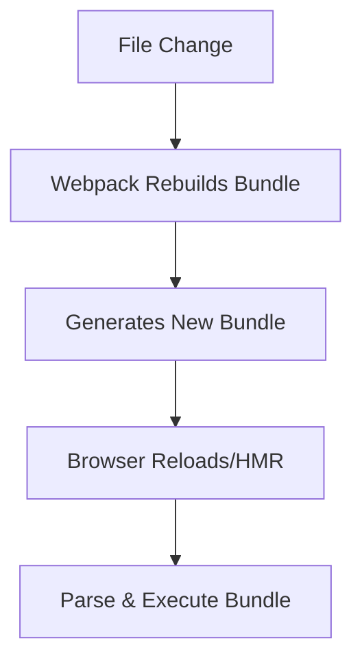
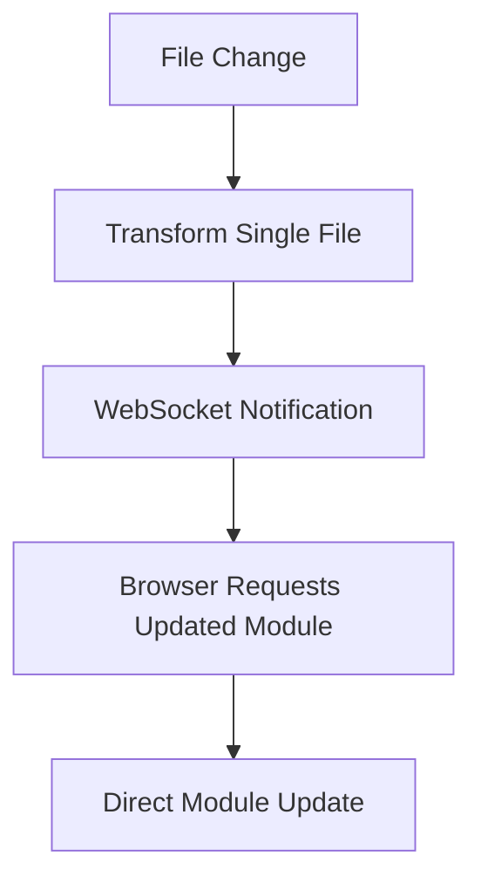

# Front-End Engineer Interview Insights

## You

Continue

## Claude


# PHÂN TÍCH CHUYÊN SÂU: KINH NGHIỆM PHỎNG VẤN FRONT-END ENGINEER QUA LĂNG KÍNH PRINCIPAL ENGINEER TẠI MAANG


*Một cuộc hành trình khám phá sâu về những kiến thức nền tảng và kinh nghiệm thực chiến trong ngành công nghệ*


---


## MỞ ĐẦU: TẦM QUAN TRỌNG CỦA VIỆC HIỂU SÂU BẢN CHẤT


Xin chào các bạn! Tôi là một Principal Front-end Engineer đã có hơn 15 năm kinh nghiệm làm việc tại các công ty MAANG, từ Google đến Meta, từ Amazon đến Netflix. Hôm nay, khi đọc qua trải nghiệm phỏng vấn này, tôi thấy đây là một cơ hội tuyệt vời để cùng các bạn deep dive vào những khái niệm fundamental mà mọi front-end engineer - từ junior đến senior - đều cần hiểu thấu đáo.


💭 **Reflection từ kinh nghiệm thực tế**: Sau nhiều năm interviewing hàng trăm candidates và mentoring hàng chục engineers, tôi nhận ra rằng gap lớn nhất không phải ở việc biết hay không biết một technology nào đó, mà ở việc hiểu hay không hiểu **why** và **how** của technology đó. Một senior engineer có thể implement React hooks một cách proficient, nhưng nếu không hiểu React's reconciliation algorithm hoạt động thế nào, họ sẽ gặp khó khăn khi debug performance issues ở production scale.


Bài phỏng vấn này chứa đựng những nuggets of wisdom vô cùng giá trị, từ những câu hỏi basic về Vite và Webpack cho đến những implementation challenges thực tế như monitoring systems và design-to-code platforms. Mỗi một concept được đề cập đều là một cánh cửa dẫn đến những kiến thức sâu rộng hơn.


---


## PHẦN I: FOUNDATION LEVEL - XÂY DỰNG NỀN TẢNG VỮNG CHẮC


### 🔬 DEEP DIVE: VITE VÀ WEBPACK - CUỘC CÁCH MẠNG BUILD TOOLS


#### 🌱 Nguồn Gốc & Motivation: Tại Sao Vite Ra Đời?


Để thực sự hiểu được tại sao Vite lại revolutionary, chúng ta cần quay về những ngày đầu của JavaScript bundling.


**Timeline lịch sử của build tools:**


📚 **Era 1 (2009-2012): The Wild West**
Trước khi có Webpack, developers phải manually manage dependencies bằng script tags trong HTML. Imagine bạn đang làm việc ở Facebook năm 2009, mỗi lần add một JavaScript file mới, bạn phải:


```html
<!-- Thứ tự này CRITICAL, sai là broken -->
<script src="jquery.js"></script>
<script src="underscore.js"></script>
<script src="backbone.js"></script>
<script src="my-model.js"></script> <!-- Depends on Backbone -->
<script src="my-view.js"></script>  <!-- Depends on Model -->
<script src="app.js"></script>      <!-- Depends on everything -->
```


Problems:


- **Global namespace pollution**: Mọi variable đều leak ra global scope
- **Dependency hell**: Không có cách nào manage complex dependency graphs
- **No module system**: JavaScript không có built-in module system (ES6 modules chưa exist)
- **Concatenation nightmare**: Muốn optimize phải manually concatenate files


📚 **Era 2 (2012-2015): Module Bundlers Revolution**
Webpack ra đời (2012) như một game-changer. Tobias Koppers tạo ra Webpack để solve fundamental problem: "Treat everything as a module".


🔬 **Webpack's Core Innovation:**


```javascript
// Suddenly, this became possible:
import $ from 'jquery';
import template from './template.html';
import styles from './component.css';
import image from './icon.png';

// Webpack treats EVERYTHING as a module
// CSS, images, fonts, JSON - all become JavaScript modules
```


**Webpack's Mental Model:**


- **Entry point**: Một file JavaScript làm starting point
- **Dependency graph**: Traverse tất cả imports để build dependency tree
- **Loaders**: Transform non-JS files thành JS modules
- **Plugins**: Modify the bundling process
- **Output**: Một hoặc nhiều bundle files


⚙️ **Webpack Build Process Deep Dive:**


1. **Parse entry point**: Read entry file, identify imports
2. **Resolve dependencies**: For each import, find actual file path
3. **Apply loaders**: Transform files (TypeScript → JS, SCSS → CSS, etc.)
4. **Build dependency graph**: Create internal representation
5. **Optimize**: Tree shaking, code splitting, minification
6. **Generate output**: Create final bundle(s)


Tuy nhiên, khi applications grow larger, Webpack's approach bắt đầu show limitations:


**Webpack's Performance Bottlenecks:**


- **Cold start time**: Mỗi lần start dev server, phải bundle toàn bộ application
- **HMR latency**: Hot module replacement becomes slower với large codebases
- **Configuration complexity**: webpack.config.js becomes a monster


📚 **Era 3 (2020-Present): Native ESM Renaissance**


Evan You (creator của Vue.js) nhận ra rằng browsers đã natively support ES modules. Tại sao chúng ta phải bundle everything trong development khi browser có thể load modules directly?


💡 **Vite's Revolutionary Insight:**
"Development và production có requirements khác nhau. Development cần fast feedback loop, production cần optimized bundles."


#### ⚙️ Vite's Architecture Deep Dive


🔬 **Core Mechanism: Native ESM + esbuild**


**Development Server Architecture:**


```
Browser Request: /src/main.js
       ↓
Vite Dev Server:
1. Transform với esbuild (if needed)
2. Serve as ES module
3. Browser native import
       ↓
Browser Request: /src/components/App.vue
       ↓
Vite:
1. Vue SFC compiler transform
2. Return JS module
3. Browser cache module
```


💭 **My "Aha!" moment về Vite**: Năm 2020, khi đầu tiên migrate một React project từ Create React App sang Vite, cold start time từ 45 seconds xuống còn 2 seconds. Nhưng điều impressive hơn là HMR - thay vì wait 3-5 seconds cho mỗi change, feedback gần như instant. Productivity boost enormous!


**Step-by-step Vite Development Flow:**


1. **Initial Load:**


```javascript
// Browser requests: http://localhost:3000/src/main.js
// Vite serves:
import { createApp } from '/node_modules/.vite/deps/vue.js?v=12345'
import App from '/src/App.vue'

// Browser then requests /src/App.vue
// Vite transforms and serves:
import { defineComponent } from '/node_modules/.vite/deps/vue.js?v=12345'
// ... compiled component code
```


1. **File Change Detection:**


```javascript
// chokidar file watcher detects change in /src/components/Button.vue
// Vite WebSocket sends HMR update:
{
  type: 'update',
  updates: [{
    type: 'js-update',
    path: '/src/components/Button.vue',
    acceptedPath: '/src/components/Button.vue',
    timestamp: 1640995200000
  }]
}
```


1. **Browser HMR Processing:**


```javascript
// Browser receives WebSocket message
// Vite client runtime:
// 1. Fetches updated module
// 2. Updates module cache
// 3. Triggers component re-render (React/Vue specific)
// 4. Preserves component state (where possible)
```


#### 🛠️ Implementation Details: So Sánh Architecture


**Webpack Development Flow:**





**Vite Development Flow:**





💭 **Debugging Mental Model**: Khi debug Vite performance issues, tôi thường check:


1. **Dependency pre-bundling**: `node_modules/.vite/deps/` - Có packages nào bị re-bundled không cần thiết?
2. **Transform cache**: File transforms có được cached properly không?
3. **WebSocket connection**: HMR updates có được delivered correctly không?


**Performance Characteristics Comparison:**


```
AspectWebpackViteCold StartO(entire codebase)O(entry point only)HMRO(affected modules)O(single module)Memory UsageHigh (entire bundle in memory)Low (transform on demand)Disk I/OHeavy (write bundles)Light (serve from memory)
```


#### 🏭 Production Reality: Trade-offs và Considerations


**When to Choose Webpack:**


- **Mature ecosystem**: 10+ years of plugins and loaders
- **Complex configurations**: Advanced splitting strategies
- **Legacy browser support**: IE11 và older browsers
- **Large teams**: Established workflows và CI/CD pipelines


**When to Choose Vite:**


- **Developer experience priority**: Faster feedback loops
- **Modern browser targets**: ES2015+ support
- **Rapid prototyping**: Quick project setup
- **Smaller teams**: Less configuration overhead


💭 **Netflix's Experience**: Khi team tôi tại Netflix evaluate Vite cho internal tools, biggest concern là production build consistency. Vite uses Rollup for production builds while Webpack for development. This discrepancy có thể lead đến subtle bugs chỉ appear trong production. Solution: Comprehensive E2E testing pipeline.


**Real-world Migration Strategy:**


```javascript
// Phase 1: Parallel setup
// Maintain Webpack config while adding Vite
// Compare build outputs, performance metrics

// Phase 2: Development migration
// Switch development server to Vite
// Keep production builds on Webpack

// Phase 3: Full migration
// Move production builds to Vite
// Comprehensive testing và monitoring
```


### 🔬 DEEP DIVE: HOT MODULE REPLACEMENT - CƠ CHẾ TĂNG TỐC DEVELOPMENT


#### 🌱 Nguồn Gốc: Tại Sao HMR Quan Trọng?


Hot Module Replacement không phải là một feature nice-to-have, mà là fundamental improvement trong developer experience. Để hiểu tại sao, hãy imagine một React application với complex state:


**Before HMR (Traditional Page Reload):**


```javascript
// You're testing a form with 10 fields filled
// Change one line of CSS
// Page reloads → lose all form data
// Manually fill form again
// Repeat 50 times per day = wasted hours
```


**With HMR:**


```javascript
// Form state preserved
// Only CSS updates
// Instant feedback
// Developer happiness ↗️
```


#### ⚙️ HMR Architecture Deep Dive


🔬 **Core Mechanism: WebSocket + Module Graph**


**HMR System Components:**


1. **File Watcher**: Detects file system changes
2. **HMR Server**: Manages WebSocket connections và update notifications
3. **HMR Client**: Browser-side runtime handling updates
4. **Module System**: Tracks module dependencies và provides update APIs


**Detailed HMR Flow:**


```javascript
// 1. File Change Detection
const chokidar = require('chokidar');
chokidar.watch('./src').on('change', (path) => {
  // Determine affected modules
  const affectedModules = dependencyGraph.getAffectedModules(path);

  // Send HMR update
  websocket.send({
    type: 'update',
    updates: affectedModules.map(mod => ({
      path: mod.path,
      timestamp: Date.now()
    }))
  });
});
```


```javascript
// 2. Browser HMR Client
class HMRClient {
  constructor() {
    this.websocket = new WebSocket('ws://localhost:3000');
    this.websocket.onmessage = this.handleUpdate.bind(this);
  }

  handleUpdate(event) {
    const { type, updates } = JSON.parse(event.data);

    if (type === 'update') {
      updates.forEach(update => {
        this.updateModule(update);
      });
    }
  }

  async updateModule(update) {
    // Fetch updated module
    const newModule = await import(`${update.path}?t=${update.timestamp}`);

    // Update module cache
    this.moduleCache.set(update.path, newModule);

    // Trigger framework-specific update
    this.triggerFrameworkUpdate(update.path, newModule);
  }
}
```


#### 💡 Framework-Specific HMR Implementation


**React HMR (React Fast Refresh):**


```javascript
// React Fast Refresh preserves component state
function MyComponent() {
  const [count, setCount] = useState(0); // State preserved!

  return (
    <div>
      <h1>Count: {count}</h1> {/* This line can change without losing state */}
      <button onClick={() => setCount(c => c + 1)}>
        Increment
      </button>
    </div>
  );
}

// HMR boundary detection
if (import.meta.hot) {
  import.meta.hot.accept();
}
```


**Vue HMR:**


```javascript
// Vue HMR có different strategies cho different parts
<template>
  <!-- Template changes → re-render only -->
  <div>{{ message }}</div>
</template>

<script>
export default {
  data() {
    return {
      message: 'Hello' // Data preserved during template updates
    }
  }
}

// Script changes → component re-creation (state lost)
// Style changes → style injection only
</script>

<style>
/* Style changes → instant CSS update, no re-render */
div { color: blue; }
</style>
```


💭 **Debugging HMR Issues - My Mental Process:**


Khi HMR không work properly, tôi thường debug theo order này:


1. **WebSocket connection**: DevTools → Network → WS tab
2. **Module boundaries**: Có module nào reject HMR updates không?
3. **Framework integration**: React/Vue HMR plugins có hoạt động đúng không?
4. **State management**: Redux/Vuex state có được preserve không?


**Common HMR Pitfalls:**


```javascript
// 1. Side effects in module scope (BAD)
console.log('This runs every HMR update!'); // Logs multiply

const api = new APIClient(); // Creates new instance every update

// 2. Proper HMR boundary (GOOD)
if (import.meta.hot) {
  import.meta.hot.accept();

  // Cleanup side effects
  import.meta.hot.dispose(() => {
    api.disconnect();
  });
}
```


#### 🏭 Production Considerations: HMR Performance at Scale


**Memory Management:**


```javascript
// HMR client memory leak prevention
class HMRMemoryManager {
  constructor() {
    this.moduleCache = new Map();
    this.updateHandlers = new Set();
  }

  cleanup() {
    // Clean up old module references
    this.moduleCache.clear();

    // Remove event listeners
    this.updateHandlers.forEach(handler => {
      handler.cleanup();
    });
  }
}
```


💭 **Meta's Scale Challenges**: Tại Facebook, với codebase hàng triệu lines of code, HMR performance trở thành bottleneck. Solutions:


- **Incremental bundling**: Chỉ rebuild affected chunks
- **Module federation**: Isolate independent parts
- **Worker threads**: Parallel processing cho file transforms


### 🔬 DEEP DIVE: REACT USESTATE IMPLEMENTATION - TỪ HOOKS API ĐẾN INTERNAL MECHANISM


#### 🌱 Nguồn Gốc: Tại Sao Hooks Cách Mạng React?


Trước khi có Hooks (React 16.8, February 2019), React có fundamental limitation: **stateful logic chỉ có thể exist trong class components**. Điều này tạo ra numerous problems:


**Pre-Hooks Pain Points:**


```javascript
// 1. Wrapper hell with Higher-Order Components
const EnhancedComponent = withAuth(
  withLoading(
    withErrorHandling(
      withDataFetching(MyComponent)
    )
  )
);

// 2. Complex lifecycle management
class MyComponent extends React.Component {
  componentDidMount() {
    this.setupSubscription();
    this.fetchData();
  }

  componentDidUpdate(prevProps) {
    if (prevProps.id !== this.props.id) {
      this.fetchData();
    }
  }

  componentWillUnmount() {
    this.cleanupSubscription();
  }

  // Logic scattered across multiple methods
}

// 3. Logic reuse difficulties
// No easy way to share stateful logic between components
```


💭 **My Experience Pre-Hooks**: Tại Google, khi maintain Gmail's compose component, chúng tôi có 15+ HOCs wrapping main component. Debugging stack traces là nightmare, performance optimization khó khăn vì unnecessary re-renders.


#### ⚙️ React Hooks Mental Model: Closure + Linked List


🔬 **Core Insight**: Hooks leverage JavaScript closures và React's reconciliation để create "stateful functions".


**Fundamental Principle:**


```javascript
// Hooks ARE NOT magic - they're just:
// 1. Closures capturing values
// 2. Linked list storing state
// 3. Reconciliation managing updates

function useState(initialValue) {
  // Simplified mental model
  let state = initialValue;

  function setState(newValue) {
    state = newValue;
    // Trigger re-render
  }

  return [state, setState];
}
```


#### 🛠️ useState Implementation Deep Dive


**React's Internal useState Implementation:**


```javascript
// Simplified version of React's useState
let workInProgressHook = null;
let currentlyRenderingFiber = null;
let hookIndex = 0;

function useState(initialValue) {
  // Get current hook or create new one
  const hook = updateWorkInProgressHook();

  if (hook.queue === null) {
    // First render - initialize
    hook.memoizedState = initialValue;
    hook.queue = {
      pending: null,
      dispatch: null
    };

    // Create dispatch function
    const dispatch = dispatchAction.bind(null, currentlyRenderingFiber, hook.queue);
    hook.queue.dispatch = dispatch;

    return [hook.memoizedState, dispatch];
  } else {
    // Update render - process pending updates
    const newState = processUpdateQueue(hook);
    hook.memoizedState = newState;

    return [newState, hook.queue.dispatch];
  }
}

function updateWorkInProgressHook() {
  if (workInProgressHook === null) {
    // First hook in component
    workInProgressHook = {
      memoizedState: null,
      queue: null,
      next: null
    };
  } else {
    // Subsequent hooks - linked list
    workInProgressHook.next = {
      memoizedState: null,
      queue: null,
      next: null
    };
    workInProgressHook = workInProgressHook.next;
  }

  hookIndex++;
  return workInProgressHook;
}
```


**Hook Linked List Structure:**


```javascript
// React maintains hooks as linked list per component instance
Component Instance {
  hooks: {
    // Hook 0: useState
    memoizedState: "Hello",
    queue: { pending: null, dispatch: fn },
    next: {
      // Hook 1: useEffect
      memoizedState: { effect: fn, deps: [], destroy: fn },
      queue: null,
      next: {
        // Hook 2: useState
        memoizedState: 42,
        queue: { pending: null, dispatch: fn },
        next: null
      }
    }
  }
}
```


#### 💭 Critical Rule: Hooks Order Must Be Consistent


**Why Rules of Hooks Exist:**


```javascript
// BAD - Conditional hooks break linked list
function BadComponent({ condition }) {
  if (condition) {
    const [state1, setState1] = useState('first');  // Hook 0 sometimes
  }
  const [state2, setState2] = useState('second'); // Hook 0 or 1 - BREAKS!
}

// React expects:
// Render 1: Hook 0 → Hook 1
// Render 2: Hook ? → Hook 1 (Mismatch!)
```


**Correct Pattern:**


```javascript
function GoodComponent({ condition }) {
  const [state1, setState1] = useState(condition ? 'first' : null);
  const [state2, setState2] = useState('second');

  // Always same number of hooks in same order
}
```


#### 🏭 Performance Implications: State Updates và Batching


**State Update Batching:**


```javascript
function MyComponent() {
  const [count, setCount] = useState(0);
  const [name, setName] = useState('');

  const handleClick = () => {
    // These are batched into single re-render
    setCount(c => c + 1);
    setName('Updated');

    // Only one render, not two!
  };

  return <div onClick={handleClick}>{count} - {name}</div>;
}
```


**Manual Batching Control (React 18+):**


```javascript
import { unstable_batchedUpdates } from 'react-dom';

// Force batching in async operations
setTimeout(() => {
  unstable_batchedUpdates(() => {
    setCount(c => c + 1);
    setName('Async Update');
  });
}, 1000);
```


💭 **Netflix's useState Optimization**: Trong video player component, chúng tôi có 20+ state variables. Key learnings:


- **State colocation**: Related state trong single useState object
- **Lazy initialization**: Expensive computations in useState(() => expensiveCalc())
- **Functional updates**: Avoid stale closures với previous state dependencies


**Advanced useState Patterns:**


```javascript
// 1. Lazy initialization for expensive calculations
const [data, setData] = useState(() => {
  return expensiveDataProcessing(); // Only runs on first render
});

// 2. Functional updates to avoid stale closures
const [count, setCount] = useState(0);

useEffect(() => {
  const timer = setInterval(() => {
    setCount(prevCount => prevCount + 1); // Always current value
  }, 1000);

  return () => clearInterval(timer);
}, []); // Safe với empty deps

// 3. State reducer pattern for complex state
const [state, setState] = useState({
  loading: false,
  data: null,
  error: null
});

const updateState = (updates) => {
  setState(prevState => ({ ...prevState, ...updates }));
};
```


#### ✅ Interview Question Analysis: Candidate's Implementation


Looking at candidate's implementation:


```javascript
const useState = defaultValue => {
    const value = useRef(defaultValue);

    const setValue = newValue => {
        if (typeof newValue === 'function') {
            value.current = newValue(value.current);
        } else {
            value.current = value; // BUG: should be newValue
        }
    }

    // Missing: trigger re-render
    dispatchAction();

    return [value, setValue];
}
```


**Issues với Implementation:**


1. **Bug**: `value.current = value` instead of `value.current = newValue`
2. **Missing re-render trigger**: `dispatchAction()` called unconditionally
3. **useRef approach**: Not equivalent to useState - no re-renders
4. **Missing batching**: No update queue management


**Correct Approach:**


```javascript
const useStateImplementation = (initialValue) => {
  // Use React's internal mechanisms
  const [state, setState] = useReducer((state, action) => {
    return typeof action === 'function' ? action(state) : action;
  }, initialValue);

  return [state, setState];
};
```


### 🔬 DEEP DIVE: MINI PROGRAM OPTIMIZATION - PERFORMANCE AT CONSTRAINT


#### 🌱 Nguồn Gốc: Tại Sao Mini Programs Cần Optimization Đặc Biệt?


Mini programs (WeChat, Alipay, etc.) operate trong constrained environment hoàn toàn khác với web browsers. Understanding these constraints fundamental để effective optimization.


**WeChat Mini Program Architecture:**


```
┌─────────────────┐    ┌─────────────────┐
│   Render Layer  │    │  Logic Layer    │
│                 │    │                 │
│ WebView (iOS)   │◄──►│ JavaScriptCore  │
│ X5 (Android)    │JSB │ V8 (Dev Tools)  │
│                 │    │                 │
│ WXML + WXSS     │    │ JavaScript      │
└─────────────────┘    └─────────────────┘
```


**Key Constraints:**


1. **Dual-thread architecture**: UI và logic separated
2. **JSBridge communication**: All data transfer via native bridge
3. **Limited APIs**: Subset of web APIs available
4. **Package size limits**: 2MB main package, 20MB total
5. **Memory constraints**: Aggressive garbage collection


#### ⚙️ JSBridge Communication Deep Dive


🔬 **Core Bottleneck: setData Performance**


```javascript
// Each setData call goes through:
// Logic Layer → JSBridge → Native → Render Layer

// SLOW - Multiple bridge calls
this.setData({ name: 'John' });
this.setData({ age: 25 });
this.setData({ city: 'Beijing' });

// FAST - Single bridge call
this.setData({
  name: 'John',
  age: 25,
  city: 'Beijing'
});
```


**setData Optimization Strategies:**


```javascript
// 1. Data Batching Manager
class SetDataManager {
  constructor(page) {
    this.page = page;
    this.pendingData = {};
    this.updateTimer = null;
  }

  update(data) {
    // Batch updates
    Object.assign(this.pendingData, data);

    if (this.updateTimer) {
      clearTimeout(this.updateTimer);
    }

    // Debounce setData calls
    this.updateTimer = setTimeout(() => {
      this.flush();
    }, 16); // Next frame
  }

  flush() {
    if (Object.keys(this.pendingData).length > 0) {
      this.page.setData(this.pendingData);
      this.pendingData = {};
    }
    this.updateTimer = null;
  }
}
```


```javascript
// 2. Data Size Management
class DataSizeOptimizer {
  static optimizeSetData(data) {
    const MAX_SIZE = 1024 * 256; // 256KB limit
    const serialized = JSON.stringify(data);

    if (serialized.length > MAX_SIZE) {
      // Split large data into chunks
      return this.splitData(data);
    }

    return [data];
  }

  static splitData(data) {
    const chunks = [];
    const entries = Object.entries(data);

    let currentChunk = {};
    let currentSize = 0;

    for (const [key, value] of entries) {
      const entrySize = JSON.stringify({ [key]: value }).length;

      if (currentSize + entrySize > MAX_SIZE) {
        chunks.push(currentChunk);
        currentChunk = {};
        currentSize = 0;
      }

      currentChunk[key] = value;
      currentSize += entrySize;
    }

    if (Object.keys(currentChunk).length > 0) {
      chunks.push(currentChunk);
    }

    return chunks;
  }
}
```


#### 💡 WXML Performance Optimization


**Node Optimization Strategies:**


```xml
<!-- BAD - Deep nesting -->
<view class="container">
  <view class="wrapper">
    <view class="inner">
      <view class="content">
        <text>{{text}}</text>
      </view>
    </view>
  </view>
</view>

<!-- GOOD - Flat structure -->
<view class="content">
  <text>{{text}}</text>
</view>
```


**Conditional Rendering Optimization:**


```xml
<!-- BAD - Always renders nodes -->
<view wx:if="{{showContent}}" class="content">
  <!-- Complex content -->
</view>
<view wx:if="{{!showContent}}" class="loading">
  Loading...
</view>

<!-- GOOD - Use hidden for frequently toggled content -->
<view hidden="{{!showContent}}" class="content">
  <!-- Complex content preserved in DOM -->
</view>
<view hidden="{{showContent}}" class="loading">
  Loading...
</view>
```


**List Rendering Performance:**


```xml
<!-- Efficient list rendering with key -->
<view wx:for="{{items}}" wx:key="id" wx:for-item="item">
  <text>{{item.name}}</text>
</view>

<!-- Virtual scrolling for large lists -->
<scroll-view
  style="height: 400px"
  scroll-y
  bindscrolltoupper="onScrollToUpper"
  bindscrolltolower="onScrollToLower">
  <!-- Only render visible items -->
  <view wx:for="{{visibleItems}}" wx:key="id">
    <!-- Item content -->
  </view>
</scroll-view>
```


#### 🏭 Production Case Study: WeChat's Performance Guidelines


💭 **Real-world Experience**: Tại Tencent collaboration project, chúng tôi optimize mini program cho 100M+ daily active users. Key metrics tracked:


**Performance Metrics:**


```javascript
// Performance monitoring setup
const performanceMonitor = {
  // Page load timing
  onLoad() {
    this.loadStartTime = Date.now();
  },

  onReady() {
    const loadTime = Date.now() - this.loadStartTime;

    // Report to analytics
    wx.reportAnalytics('page_load_time', {
      page: this.route,
      loadTime: loadTime,
      isFirstLaunch: !wx.getStorageSync('launched_before')
    });
  },

  // setData performance tracking
  trackSetData(data) {
    const startTime = Date.now();
    const dataSize = JSON.stringify(data).length;

    this.setData(data, () => {
      const duration = Date.now() - startTime;

      if (duration > 50) { // Flag slow setData
        console.warn('Slow setData detected:', {
          duration,
          dataSize,
          data: Object.keys(data)
        });
      }
    });
  }
};
```


**Memory Management:**


```javascript
// Lifecycle-based cleanup
Page({
  onLoad() {
    // Initialize resources
    this.timer = setInterval(this.updateData, 1000);
    this.subscriptions = [];
  },

  onUnload() {
    // Critical: Clean up resources
    if (this.timer) {
      clearInterval(this.timer);
    }

    this.subscriptions.forEach(sub => sub.cancel());

    // Clear large data objects
    this.setData({
      largeDataSet: null
    });
  },

  onHide() {
    // Pause expensive operations
    this.pauseAnimations();
    this.pauseLocationTracking();
  },

  onShow() {
    // Resume operations
    this.resumeAnimations();
    this.resumeLocationTracking();
  }
});
```


---


## PHẦN II: SENIOR LEVEL - SYSTEM THINKING VÀ ARCHITECTURE


### 🔬 DEEP DIVE: MONITORING VÀ ALERTING SYSTEMS - FROM METRICS TO INSIGHTS


#### 🌱 Nguồn Gốc: Tại Sao Monitoring Critical cho Production Systems?


Modern web applications serve millions of users across diverse environments. Without proper monitoring, engineers work blind - fixing problems reactively instead of preventing them proactively.


**Evolution of Monitoring:**


📚 **Era 1: Server Logs**


```bash
# Traditional approach - grep through log files
tail -f /var/log/apache/access.log | grep "ERROR"
```


📚 **Era 2: Application Performance Monitoring (APM)**


```javascript
// Tools like New Relic, DataDog
newrelic.recordMetric('Custom/UserSignup', 1);
```


📚 **Era 3: Real User Monitoring (RUM)**


```javascript
// Capture actual user experiences
navigator.sendBeacon('/analytics', JSON.stringify({
  pageLoadTime: performance.timing.loadEventEnd - performance.timing.navigationStart,
  userAgent: navigator.userAgent,
  viewport: { width: window.innerWidth, height: window.innerHeight }
}));
```


📚 **Era 4: Observability (Current)**


```javascript
// Comprehensive telemetry: metrics, logs, traces
OpenTelemetry.trace.getTracer('frontend')
  .startSpan('user-action')
  .setAttributes({ action: 'checkout', userId: '12345' });
```


#### ⚙️ Comprehensive Monitoring Architecture


🔬 **Core Components Deep Dive:**


**1. Data Collection Layer:**


```javascript
// Universal error tracking
class ErrorTracker {
  constructor() {
    this.setupGlobalHandlers();
    this.setupPromiseRejectionHandler();
    this.setupNetworkErrorTracking();
  }

  setupGlobalHandlers() {
    // JavaScript errors
    window.addEventListener('error', (event) => {
      this.captureError({
        type: 'javascript',
        message: event.message,
        filename: event.filename,
        lineno: event.lineno,
        colno: event.colno,
        stack: event.error?.stack,
        timestamp: Date.now(),
        url: location.href,
        userAgent: navigator.userAgent
      });
    });

    // Resource loading errors
    window.addEventListener('error', (event) => {
      if (event.target !== window) {
        this.captureError({
          type: 'resource',
          element: event.target.tagName,
          source: event.target.src || event.target.href,
          timestamp: Date.now()
        });
      }
    }, true);
  }

  setupPromiseRejectionHandler() {
    window.addEventListener('unhandledrejection', (event) => {
      this.captureError({
        type: 'promise',
        reason: event.reason,
        stack: event.reason?.stack,
        timestamp: Date.now()
      });
    });
  }

  setupNetworkErrorTracking() {
    // XMLHttpRequest monitoring
    const originalXHR = XMLHttpRequest.prototype.open;
    XMLHttpRequest.prototype.open = function(...args) {
      this.addEventListener('error', () => {
        this.captureNetworkError({
          type: 'xhr',
          url: args[1],
          method: args[0],
          status: this.status
        });
      });

      return originalXHR.apply(this, args);
    };

    // Fetch API monitoring
    const originalFetch = window.fetch;
    window.fetch = function(...args) {
      return originalFetch.apply(this, args)
        .catch(error => {
          this.captureNetworkError({
            type: 'fetch',
            url: args[0],
            error: error.message
          });
          throw error;
        });
    };
  }
}
```


**2. Performance Metrics Collection:**


```javascript
class PerformanceTracker {
  constructor() {
    this.setupNavigationTimingObserver();
    this.setupResourceTimingObserver();
    this.setupLongTaskObserver();
    this.setupLayoutShiftObserver();
  }

  setupNavigationTimingObserver() {
    new PerformanceObserver((list) => {
      list.getEntries().forEach(entry => {
        if (entry.entryType === 'navigation') {
          this.reportMetrics('navigation', {
            // Core Web Vitals
            FCP: this.getFCP(),
            LCP: this.getLCP(),
            FID: this.getFID(),
            CLS: this.getCLS(),

            // Network timing
            dnsLookupTime: entry.domainLookupEnd - entry.domainLookupStart,
            tcpConnectionTime: entry.connectEnd - entry.connectStart,
            serverResponseTime: entry.responseStart - entry.requestStart,
            domContentLoadedTime: entry.domContentLoadedEventEnd - entry.domContentLoadedEventStart,
            windowLoadTime: entry.loadEventEnd - entry.loadEventStart
          });
        }
      });
    }).observe({ entryTypes: ['navigation'] });
  }

  setupLongTaskObserver() {
    new PerformanceObserver((list) => {
      list.getEntries().forEach(entry => {
        if (entry.duration > 50) { // Tasks > 50ms block main thread
          this.reportMetrics('long-task', {
            duration: entry.duration,
            startTime: entry.startTime,
            attribution: entry.attribution
          });
        }
      });
    }).observe({ entryTypes: ['longtask'] });
  }

  setupLayoutShiftObserver() {
    let cumulativeLayoutShift = 0;

    new PerformanceObserver((list) => {
      list.getEntries().forEach(entry => {
        if (!entry.hadRecentInput) {
          cumulativeLayoutShift += entry.value;
        }
      });

      this.reportMetrics('layout-shift', {
        cls: cumulativeLayoutShift
      });
    }).observe({ entryTypes: ['layout-shift'] });
  }
}
```


#### 💡 Business Metrics Implementation


**User Journey Tracking:**


```javascript
class BusinessMetricsTracker {
  constructor() {
    this.funnelSteps = new Map();
    this.conversionEvents = [];
  }

  // E-commerce funnel example
  trackFunnelStep(step, metadata = {}) {
    const event = {
      step,
      timestamp: Date.now(),
      sessionId: this.getSessionId(),
      userId: this.getUserId(),
      metadata
    };

    this.funnelSteps.set(step, event);

    // Calculate conversion rates real-time
    this.calculateConversions();
  }

  calculateConversions() {
    const steps = ['view_product', 'add_to_cart', 'checkout', 'payment', 'complete'];
    const conversions = {};

    for (let i = 1; i < steps.length; i++) {
      const previousStep = this.funnelSteps.get(steps[i - 1]);
      const currentStep = this.funnelSteps.get(steps[i]);

      if (previousStep && currentStep) {
        const conversionRate = (currentStep.count / previousStep.count) * 100;
        conversions[`${steps[i - 1]}_to_${steps[i]}`] = conversionRate;
      }
    }

    this.reportMetrics('conversion', conversions);
  }

  // Advanced business metrics
  trackRevenue(amount, currency = 'USD') {
    this.reportMetrics('revenue', {
      amount,
      currency,
      timestamp: Date.now(),
      userId: this.getUserId()
    });
  }

  trackUserEngagement() {
    const engagement = {
      timeOnPage: Date.now() - this.pageStartTime,
      scrollDepth: this.getScrollDepth(),
      clickCount: this.clickCount,
      interactionEvents: this.interactionEvents.length
    };

    this.reportMetrics('engagement', engagement);
  }
}
```


#### 🛠️ Real-time Data Pipeline


**WebSocket-based Logging Service:**


```javascript
class RealTimeLogger {
  constructor() {
    this.websocket = null;
    this.buffer = [];
    this.bufferSize = 100;
    this.flushInterval = 5000; // 5 seconds

    this.setupWebSocket();
    this.setupPeriodicFlush();
  }

  setupWebSocket() {
    this.websocket = new WebSocket('wss://logging-service.company.com');

    this.websocket.onopen = () => {
      console.log('Logging service connected');
      this.flushBuffer();
    };

    this.websocket.onclose = () => {
      console.log('Logging service disconnected, retrying...');
      setTimeout(() => this.setupWebSocket(), 5000);
    };

    this.websocket.onerror = (error) => {
      console.error('WebSocket error:', error);
      // Fallback to HTTP logging
      this.fallbackToHTTP();
    };
  }

  log(level, message, context = {}) {
    const logEntry = {
      level,
      message,
      context,
      timestamp: new Date().toISOString(),
      sessionId: this.getSessionId(),
      userId: this.getUserId(),
      url: location.href,
      userAgent: navigator.userAgent
    };

    this.buffer.push(logEntry);

    // Immediate flush for critical errors
    if (level === 'error' || level === 'critical') {
      this.flushBuffer();
    }

    // Prevent buffer overflow
    if (this.buffer.length >= this.bufferSize) {
      this.flushBuffer();
    }
  }

  flushBuffer() {
    if (this.buffer.length === 0) return;

    if (this.websocket && this.websocket.readyState === WebSocket.OPEN) {
      this.websocket.send(JSON.stringify({
        type: 'batch_logs',
        logs: this.buffer
      }));
      this.buffer = [];
    }
  }

  fallbackToHTTP() {
    // Use navigator.sendBeacon for reliable delivery
    if (navigator.sendBeacon) {
      navigator.sendBeacon('/api/logs', JSON.stringify(this.buffer));
      this.buffer = [];
    }
  }
}
```


#### 🏭 Production Alert System


💭 **Netflix's Alerting Experience**: Tại Netflix, chúng tôi process 1 billion+ events per day. Key learnings về effective alerting:


**Smart Alert Configuration:**


```javascript
class AlertManager {
  constructor() {
    this.alertRules = new Map();
    this.alertStates = new Map();
    this.suppressionRules = new Map();
  }

  defineAlert(name, config) {
    this.alertRules.set(name, {
      metric: config.metric,
      threshold: config.threshold,
      operator: config.operator, // '>', '<', '==', etc.
      window: config.window, // Time window for evaluation
      severity: config.severity, // 'warning', 'critical'
      cooldown: config.cooldown, // Minimum time between alerts
      aggregation: config.aggregation, // 'avg', 'sum', 'max', etc.
      conditions: config.conditions || [] // Additional conditions
    });
  }

  evaluateMetric(metricName, value, timestamp) {
    this.alertRules.forEach((rule, alertName) => {
      if (rule.metric === metricName) {
        this.checkThreshold(alertName, rule, value, timestamp);
      }
    });
  }

  checkThreshold(alertName, rule, value, timestamp) {
    const state = this.alertStates.get(alertName) || {
      triggered: false,
      lastAlert: 0,
      values: []
    };

    // Add value to window
    state.values.push({ value, timestamp });

    // Remove old values outside window
    const windowStart = timestamp - rule.window;
    state.values = state.values.filter(v => v.timestamp >= windowStart);

    // Calculate aggregated value
    const aggregatedValue = this.aggregate(state.values, rule.aggregation);

    // Check threshold
    const thresholdMet = this.evaluateCondition(aggregatedValue, rule.operator, rule.threshold);

    if (thresholdMet && !state.triggered) {
      // Check cooldown
      if (timestamp - state.lastAlert >= rule.cooldown) {
        this.triggerAlert(alertName, rule, aggregatedValue);
        state.triggered = true;
        state.lastAlert = timestamp;
      }
    } else if (!thresholdMet && state.triggered) {
      // Reset triggered state
      state.triggered = false;
    }

    this.alertStates.set(alertName, state);
  }

  triggerAlert(alertName, rule, value) {
    const alert = {
      name: alertName,
      severity: rule.severity,
      value: value,
      threshold: rule.threshold,
      timestamp: Date.now(),
      metric: rule.metric
    };

    // Send to multiple channels
    this.sendSlackAlert(alert);
    this.sendEmailAlert(alert);
    this.logAlert(alert);

    // Trigger automated responses for critical alerts
    if (rule.severity === 'critical') {
      this.triggerAutomatedResponse(alert);
    }
  }
}
```


**Example Alert Configurations:**


```javascript
const alertManager = new AlertManager();

// Error rate alert
alertManager.defineAlert('high_error_rate', {
  metric: 'error_rate',
  threshold: 5, // 5%
  operator: '>',
  window: 300000, // 5 minutes
  severity: 'critical',
  cooldown: 600000, // 10 minutes
  aggregation: 'avg'
});

// Performance alert
alertManager.defineAlert('slow_page_load', {
  metric: 'page_load_time',
  threshold: 3000, // 3 seconds
  operator: '>',
  window: 600000, // 10 minutes
  severity: 'warning',
  cooldown: 1800000, // 30 minutes
  aggregation: 'p95' // 95th percentile
});

// Business metric alert
alertManager.defineAlert('conversion_drop', {
  metric: 'conversion_rate',
  threshold: 2.5, // 2.5%
  operator: '<',
  window: 1800000, // 30 minutes
  severity: 'critical',
  cooldown: 300000, // 5 minutes
  aggregation: 'avg'
});
```


### 🔬 DEEP DIVE: DESIGN-TO-CODE (D2C) SYSTEMS - AUTOMATED WORKFLOW REVOLUTION


#### 🌱 Nguồn Gốc: Tại Sao D2C Cần Thiết?


Traditional design-to-development workflow tốn enormous time và effort:


**Traditional Workflow Problems:**


```
Designer creates mockup (Sketch/Figma)
     ↓
Hand-off specifications document
     ↓
Developer manually codes components
     ↓
Back-and-forth for pixel-perfect implementation
     ↓
Multiple iterations và revisions
```


Thời gian từ design đến production: **2-4 weeks**
Accuracy: **60-80%** (subjective interpretation)
Maintenance overhead: **High** (design changes require full re-implementation)


💭 **My Experience tại Meta**: Khi work trên Facebook Ads Manager redesign, chúng tôi có 200+ unique components. Manual implementation took 6 months, với numerous inconsistencies. D2C could reduce này xuống 2-3 weeks.


#### ⚙️ D2C Architecture Deep Dive


🔬 **Core Components:**


**1. Design Asset Parser:**


```javascript
// Sketch plugin implementation
class SketchParser {
  constructor() {
    this.componentLibrary = new ComponentLibrary();
    this.layoutEngine = new LayoutEngine();
  }

  parseArtboard(artboard) {
    const analysis = {
      layout: this.analyzeLayout(artboard),
      components: this.identifyComponents(artboard),
      styling: this.extractStyling(artboard),
      interactions: this.detectInteractions(artboard)
    };

    return this.generateCode(analysis);
  }

  analyzeLayout(artboard) {
    const layers = artboard.layers;
    const layoutTree = this.buildLayoutTree(layers);

    return {
      type: this.detectLayoutType(layoutTree), // flex, grid, absolute
      direction: this.getFlexDirection(layoutTree),
      alignment: this.getAlignment(layoutTree),
      spacing: this.getSpacing(layoutTree)
    };
  }

  identifyComponents(artboard) {
    const components = [];

    artboard.layers.forEach(layer => {
      // Match against component library
      const match = this.componentLibrary.findMatch(layer);

      if (match) {
        components.push({
          id: layer.objectID,
          type: match.type,
          props: this.extractProps(layer, match),
          position: this.getPosition(layer),
          constraints: this.getConstraints(layer)
        });
      }
    });

    return components;
  }

  extractStyling(artboard) {
    const styles = {};

    artboard.layers.forEach(layer => {
      styles[layer.objectID] = {
        backgroundColor: this.getBackgroundColor(layer),
        borderRadius: this.getBorderRadius(layer),
        shadows: this.getShadows(layer),
        typography: this.getTypography(layer),
        spacing: this.getSpacing(layer)
      };
    });

    return styles;
  }
}
```


**2. Component Library Mapping:**


```javascript
class ComponentLibrary {
  constructor() {
    this.components = new Map();
    this.loadPredefinedComponents();
  }

  loadPredefinedComponents() {
    // Button component mapping
    this.components.set('button', {
      identifier: 'button',
      recognitionRules: [
        {
          type: 'text_layer',
          has_background: true,
          interactive: true,
          aspect_ratio: { min: 0.2, max: 5 }
        }
      ],
      codeTemplate: `
        <Button
          variant="{{variant}}"
          size="{{size}}"
          onClick={{onClick}}
        >
          {{text}}
        </Button>
      `,
      propMapping: {
        variant: layer => this.detectButtonVariant(layer),
        size: layer => this.detectButtonSize(layer),
        text: layer => layer.stringValue
      }
    });

    // Input component mapping
    this.components.set('input', {
      identifier: 'input',
      recognitionRules: [
        {
          type: 'text_field',
          has_border: true,
          editable: true
        }
      ],
      codeTemplate: `
        <Input
          placeholder="{{placeholder}}"
          type="{{type}}"
          required={{required}}
        />
      `,
      propMapping: {
        placeholder: layer => layer.stringValue || 'Enter text',
        type: layer => this.detectInputType(layer),
        required: layer => this.hasRequiredIndicator(layer)
      }
    });
  }

  findMatch(layer) {
    for (const [componentType, component] of this.components) {
      if (this.matchesRules(layer, component.recognitionRules)) {
        return {
          type: componentType,
          template: component.codeTemplate,
          propMapping: component.propMapping
        };
      }
    }

    return null;
  }

  matchesRules(layer, rules) {
    return rules.every(rule => {
      // Implementation depends on design tool API
      return this.evaluateRule(layer, rule);
    });
  }
}
```


**3. Code Generation Engine:**


```javascript
class CodeGenerator {
  constructor() {
    this.templates = new TemplateEngine();
    this.styleProcessor = new StyleProcessor();
  }

  generateReactComponent(analysis) {
    const {
      components,
      layout,
      styling,
      interactions
    } = analysis;

    const componentCode = this.buildComponentStructure(components, layout);
    const styles = this.generateStyles(styling);
    const handlers = this.generateEventHandlers(interactions);

    return this.assembleComponent({
      name: this.generateComponentName(analysis),
      imports: this.generateImports(components),
      props: this.generatePropTypes(components),
      state: this.generateState(interactions),
      handlers: handlers,
      render: componentCode,
      styles: styles
    });
  }

  buildComponentStructure(components, layout) {
    const tree = this.buildComponentTree(components, layout);
    return this.renderTree(tree);
  }

  renderTree(node) {
    if (node.children.length === 0) {
      return this.renderLeafComponent(node);
    }

    const childrenCode = node.children
      .map(child => this.renderTree(child))
      .join('\n');

    return this.renderContainerComponent(node, childrenCode);
  }

  generateStyles(styling) {
    const cssModules = {};

    Object.entries(styling).forEach(([layerId, styles]) => {
      cssModules[layerId] = this.styleProcessor.convertToCSS(styles);
    });

    return cssModules;
  }

  assembleComponent(parts) {
    return `
import React, { useState } from 'react';
${parts.imports}

interface Props {
  ${parts.props}
}

const ${parts.name}: React.FC<Props> = (props) => {
  ${parts.state}

  ${parts.handlers}

  return (
    ${parts.render}
  );
};

export default ${parts.name};
    `;
  }
}
```


#### 💡 Advanced Features: AI-Enhanced Recognition


**Computer Vision Integration:**


```javascript
class AIComponentRecognizer {
  constructor() {
    this.mlModel = new TensorFlowModel('/models/ui-component-classifier');
    this.confidenceThreshold = 0.85;
  }

  async recognizeComponent(layerImage) {
    // Convert design layer to image tensor
    const tensor = this.preprocessImage(layerImage);

    // Run inference
    const predictions = await this.mlModel.predict(tensor);

    // Get top prediction
    const topPrediction = this.getTopPrediction(predictions);

    if (topPrediction.confidence > this.confidenceThreshold) {
      return {
        component: topPrediction.class,
        confidence: topPrediction.confidence,
        boundingBox: topPrediction.boundingBox,
        properties: this.extractProperties(layerImage, topPrediction)
      };
    }

    return null;
  }

  preprocessImage(image) {
    // Resize to model input size
    const resized = tf.image.resizeBilinear(image, [224, 224]);

    // Normalize pixel values
    const normalized = resized.div(255);

    // Add batch dimension
    return normalized.expandDims(0);
  }

  extractProperties(image, prediction) {
    const properties = {};

    // Detect text content using OCR
    if (prediction.class === 'button' || prediction.class === 'label') {
      properties.text = this.extractText(image);
    }

    // Detect color scheme
    properties.colors = this.extractColors(image);

    // Detect spacing và sizing
    properties.dimensions = this.extractDimensions(image);

    return properties;
  }
}
```


#### 🏭 Production Challenges và Solutions


💭 **Airbnb's D2C Journey**: Airbnb's design system team built internal D2C tools processing 1000+ designs weekly. Major challenges:


**1. Accuracy vs. Speed Trade-off:**


```javascript
// Multi-stage accuracy improvement
class AccuracyOptimizer {
  constructor() {
    this.stages = [
      new RoughDetection(), // Fast, 70% accuracy
      new DetailedAnalysis(), // Medium, 85% accuracy
      new AIRefinement(), // Slow, 95% accuracy
      new HumanValidation() // Manual review for critical components
    ];
  }

  async processDesign(design, accuracyTarget = 0.85) {
    let result = null;

    for (const stage of this.stages) {
      result = await stage.process(design, result);

      if (result.confidence >= accuracyTarget) {
        break; // Early exit when target met
      }
    }

    return result;
  }
}
```


**2. Design System Consistency:**


```javascript
// Enforce design system compliance
class DesignSystemValidator {
  constructor(designSystem) {
    this.tokens = designSystem.tokens;
    this.components = designSystem.components;
    this.rules = designSystem.rules;
  }

  validateGeneration(generatedCode) {
    const violations = [];

    // Check color usage
    const colors = this.extractColors(generatedCode);
    colors.forEach(color => {
      if (!this.tokens.colors.includes(color)) {
        violations.push({
          type: 'color',
          value: color,
          suggestion: this.findClosestColor(color)
        });
      }
    });

    // Check spacing values
    const spacings = this.extractSpacings(generatedCode);
    spacings.forEach(spacing => {
      if (!this.tokens.spacing.includes(spacing)) {
        violations.push({
          type: 'spacing',
          value: spacing,
          suggestion: this.findClosestSpacing(spacing)
        });
      }
    });

    return {
      isValid: violations.length === 0,
      violations: violations,
      autoFixSuggestions: this.generateAutoFixes(violations)
    };
  }
}
```


**3. Version Control Integration:**


```javascript
// Git workflow integration
class D2CVersionControl {
  constructor() {
    this.git = new GitAPI();
    this.diffEngine = new ComponentDiffEngine();
  }

  async processDesignUpdate(designId, version) {
    const currentCode = await this.getCurrentCode(designId);
    const newCode = await this.generateFromDesign(designId, version);

    const diff = this.diffEngine.compare(currentCode, newCode);

    if (diff.hasBreakingChanges) {
      // Create feature branch cho manual review
      const branchName = `design-update-${designId}-${version}`;
      await this.git.createBranch(branchName);
      await this.git.commitChanges(newCode, 'Update from design changes - requires review');

      // Create PR với detailed diff
      await this.createPullRequest(branchName, diff);
    } else {
      // Auto-merge non-breaking changes
      await this.git.commitChanges(newCode, 'Auto-update from design changes');
    }
  }
}
```


### 🔬 DEEP DIVE: FRONT-END INFRASTRUCTURE - SCAFFOLDING, FRAMEWORKS, VÀ TOOLING


#### 🌱 Nguồn Gốc: Evolution của Frontend Infrastructure


Modern front-end development requires sophisticated infrastructure để support large teams và complex applications. Understanding này crucial cho senior+ engineers.


**Infrastructure Evolution Timeline:**


📚 **Era 1 (2010-2014): Manual Setup**


```bash
# Every project setup manually
mkdir my-app
cd my-app
npm init
npm install jquery bootstrap
# Create folder structure manually
# Configure build tools manually
```


📚 **Era 2 (2015-2018): Task Runners**


```javascript
// Gulp/Grunt-based workflows
gulp.task('build', ['clean', 'scripts', 'styles', 'images']);
gulp.task('scripts', function() {
  return gulp.src('src/js/**/*.js')
    .pipe(concat('app.js'))
    .pipe(uglify())
    .pipe(gulp.dest('dist/js'));
});
```


📚 **Era 3 (2018-2020): CLI Tools**


```bash
# Framework-specific CLIs
npx create-react-app my-app
vue create my-app
ng new my-app
```


📚 **Era 4 (2020-Present): Unified Development Platforms**


```bash
# Modern scaffolding with full infrastructure
npx create-company-app my-app --template=react-ts
# Includes: Build tools, testing, linting, CI/CD, monitoring
```


#### ⚙️ Comprehensive Scaffolding System


🔬 **Core Architecture:**


**1. CLI Tool Foundation:**


```javascript
// company-cli/src/create-app.js
class CreateAppCommand {
  constructor() {
    this.templateRegistry = new TemplateRegistry();
    this.packageManager = new PackageManager();
    this.gitIntegration = new GitLabIntegration();
    this.cicdGenerator = new CICDGenerator();
  }

  async execute(projectName, options) {
    const config = await this.gatherProjectConfig(projectName, options);

    // Step 1: Create project structure
    await this.createProjectStructure(config);

    // Step 2: Install dependencies
    await this.installDependencies(config);

    // Step 3: Generate configuration files
    await this.generateConfigurations(config);

    // Step 4: Setup CI/CD pipeline
    await this.setupCICD(config);

    // Step 5: Create remote repository
    await this.createRemoteRepository(config);

    // Step 6: Initial commit và push
    await this.initialCommit(config);

    this.displaySuccessMessage(config);
  }

  async gatherProjectConfig(projectName, options) {
    const inquirer = require('inquirer');

    const answers = await inquirer.prompt([
      {
        type: 'list',
        name: 'framework',
        message: 'Choose framework:',
        choices: ['React', 'Vue', 'Angular', 'Svelte']
      },
      {
        type: 'list',
        name: 'language',
        message: 'Choose language:',
        choices: ['TypeScript', 'JavaScript']
      },
      {
        type: 'checkbox',
        name: 'features',
        message: 'Select features:',
        choices: [
          'State Management (Redux/Vuex)',
          'Router (React Router/Vue Router)',
          'UI Component Library',
          'Testing Setup (Jest + Testing Library)',
          'Storybook',
          'PWA Features',
          'Internationalization (i18n)',
          'Performance Monitoring'
        ]
      },
      {
        type: 'list',
        name: 'styling',
        message: 'Choose styling solution:',
        choices: ['Tailwind CSS', 'Styled Components', 'CSS Modules', 'SCSS']
      },
      {
        type: 'list',
        name: 'bundler',
        message: 'Choose bundler:',
        choices: ['Vite', 'Webpack', 'Rollup']
      }
    ]);

    return {
      name: projectName,
      ...answers,
      ...options
    };
  }
}
```


**2. Template System:**


```javascript
class TemplateRegistry {
  constructor() {
    this.templates = new Map();
    this.loadTemplates();
  }

  loadTemplates() {
    // React + TypeScript + Vite template
    this.templates.set('react-ts-vite', {
      baseFiles: [
        'package.json.template',
        'tsconfig.json.template',
        'vite.config.ts.template',
        '.eslintrc.js.template',
        'prettier.config.js.template'
      ],
      sourceStructure: {
        'src/': {
          'components/': {
            'ui/': ['Button/', 'Input/', 'Modal/'],
            'layout/': ['Header/', 'Footer/', 'Sidebar/'],
            'forms/': ['ContactForm/', 'SearchForm/']
          },
          'pages/': ['Home/', 'About/', 'Contact/'],
          'hooks/': ['useApi.ts', 'useLocalStorage.ts'],
          'utils/': ['api.ts', 'validation.ts', 'date.ts'],
          'types/': ['index.ts', 'api.ts'],
          'styles/': ['globals.css', 'variables.css'],
          'assets/': ['images/', 'icons/']
        }
      },
      dependencies: {
        production: [
          'react',
          'react-dom',
          'react-router-dom',
          '@types/react',
          '@types/react-dom'
        ],
        development: [
          'vite',
          '@vitejs/plugin-react',
          'typescript',
          'eslint',
          'prettier',
          '@typescript-eslint/eslint-plugin',
          '@typescript-eslint/parser'
        ]
      }
    });
  }

  async generateProject(templateName, config) {
    const template = this.templates.get(templateName);
    if (!template) {
      throw new Error(`Template ${templateName} not found`);
    }

    // Create directory structure
    await this.createDirectoryStructure(template.sourceStructure, config.name);

    // Process template files
    await this.processTemplateFiles(template.baseFiles, config);

    // Install dependencies
    await this.installDependencies(template.dependencies, config);

    return config;
  }

  async processTemplateFiles(files, config) {
    const Handlebars = require('handlebars');

    for (const file of files) {
      const templatePath = path.join(__dirname, 'templates', file);
      const templateContent = await fs.readFile(templatePath, 'utf8');

      // Compile template với config data
      const template = Handlebars.compile(templateContent);
      const output = template(config);

      // Write processed file
      const outputPath = path.join(config.name, file.replace('.template', ''));
      await fs.writeFile(outputPath, output);
    }
  }
}
```


#### 💡 Configuration Convergence System


**Unified Configuration Management:**


```javascript
class ConfigurationManager {
  constructor() {
    this.standardConfigs = new Map();
    this.loadStandardConfigurations();
  }

  loadStandardConfigurations() {
    // ESLint standard configuration
    this.standardConfigs.set('eslint', {
      extends: [
        '@typescript-eslint/recommended',
        'plugin:react/recommended',
        'plugin:react-hooks/recommended',
        'prettier'
      ],
      rules: {
        // Company coding standards
        '@typescript-eslint/no-unused-vars': ['error', { argsIgnorePattern: '^_' }],
        '@typescript-eslint/explicit-function-return-type': 'warn',
        'react/prop-types': 'off', // Using TypeScript
        'react/react-in-jsx-scope': 'off', // React 17+
        'prefer-const': 'error',
        'no-var': 'error',
        // Security rules
        'no-eval': 'error',
        'no-implied-eval': 'error'
      },
      settings: {
        react: {
          version: 'detect'
        }
      }
    });

    // Prettier standard configuration
    this.standardConfigs.set('prettier', {
      semi: true,
      trailingComma: 'es5',
      singleQuote: true,
      printWidth: 80,
      tabWidth: 2,
      useTabs: false
    });

    // TypeScript standard configuration
    this.standardConfigs.set('typescript', {
      compilerOptions: {
        target: 'ES2020',
        lib: ['DOM', 'DOM.Iterable', 'ES6'],
        allowJs: true,
        skipLibCheck: true,
        esModuleInterop: true,
        allowSyntheticDefaultImports: true,
        strict: true,
        forceConsistentCasingInFileNames: true,
        noFallthroughCasesInSwitch: true,
        module: 'esnext',
        moduleResolution: 'node',
        resolveJsonModule: true,
        isolatedModules: true,
        noEmit: true,
        jsx: 'react-jsx',
        // Path mapping
        baseUrl: 'src',
        paths: {
          '@components/*': ['components/*'],
          '@utils/*': ['utils/*'],
          '@types/*': ['types/*'],
          '@assets/*': ['assets/*']
        }
      },
      include: ['src/**/*'],
      exclude: ['node_modules', 'dist', 'build']
    });
  }

  generateConfiguration(type, customOverrides = {}) {
    const baseConfig = this.standardConfigs.get(type);
    if (!baseConfig) {
      throw new Error(`Configuration type ${type} not found`);
    }

    // Deep merge with custom overrides
    return this.deepMerge(baseConfig, customOverrides);
  }

  validateConfiguration(type, config) {
    const schema = this.getConfigurationSchema(type);
    return this.validateAgainstSchema(config, schema);
  }
}
```


#### 🛠️ Framework Integration Layer


**Universal Framework Abstraction:**


```javascript
class FrameworkAdapter {
  constructor(framework) {
    this.framework = framework;
    this.adapter = this.createAdapter(framework);
  }

  createAdapter(framework) {
    switch (framework.toLowerCase()) {
      case 'react':
        return new ReactAdapter();
      case 'vue':
        return new VueAdapter();
      case 'angular':
        return new AngularAdapter();
      default:
        throw new Error(`Framework ${framework} not supported`);
    }
  }

  generateComponent(spec) {
    return this.adapter.generateComponent(spec);
  }

  generatePage(spec) {
    return this.adapter.generatePage(spec);
  }

  generateRouter(routes) {
    return this.adapter.generateRouter(routes);
  }
}

class ReactAdapter {
  generateComponent(spec) {
    const { name, props, state, effects } = spec;

    return `
import React, { useState, useEffect } from 'react';
import styles from './${name}.module.css';

interface ${name}Props {
  ${this.generatePropTypes(props)}
}

const ${name}: React.FC<${name}Props> = (${this.generatePropsDestructuring(props)}) => {
  ${this.generateStateHooks(state)}

  ${this.generateEffectHooks(effects)}

  return (
    <div className={styles.container}>
      {/* Component implementation */}
    </div>
  );
};

export default ${name};
    `;
  }

  generatePropTypes(props) {
    return props.map(prop =>
      `${prop.name}${prop.optional ? '?' : ''}: ${prop.type};`
    ).join('\n  ');
  }

  generateStateHooks(state) {
    return state.map(s =>
      `const [${s.name}, set${s.name.charAt(0).toUpperCase() + s.name.slice(1)}] = useState<${s.type}>(${s.initialValue});`
    ).join('\n  ');
  }
}
```


#### 🏭 Production Infrastructure - CI/CD Integration


💭 **Google's Infrastructure Scale**: Tại Google, Frontend Infrastructure team supports 10,000+ engineers. Key innovations:


**Automated CI/CD Pipeline Generation:**


```javascript
class CICDGenerator {
  constructor() {
    this.providers = {
      gitlab: new GitLabCIGenerator(),
      github: new GitHubActionsGenerator(),
      jenkins: new JenkinsGenerator(),
      azure: new AzureDevOpsGenerator()
    };
  }

  generatePipeline(config) {
    const provider = this.providers[config.ciProvider];
    if (!provider) {
      throw new Error(`CI provider ${config.ciProvider} not supported`);
    }

    return provider.generate({
      stages: this.getStandardStages(config),
      environment: config.environment,
      deployment: config.deployment,
      notifications: config.notifications
    });
  }

  getStandardStages(config) {
    return [
      {
        name: 'install',
        commands: [
          'npm ci',
          'npm run prepare' // husky setup
        ]
      },
      {
        name: 'lint',
        commands: [
          'npm run lint',
          'npm run type-check'
        ]
      },
      {
        name: 'test',
        commands: [
          'npm run test:unit',
          'npm run test:integration'
        ],
        coverage: true
      },
      {
        name: 'build',
        commands: [
          'npm run build'
        ],
        artifacts: ['dist/']
      },
      {
        name: 'security',
        commands: [
          'npm audit',
          'npm run test:security'
        ]
      },
      {
        name: 'deploy',
        condition: 'branch === "main"',
        commands: [
          'npm run deploy:staging',
          'npm run test:e2e',
          'npm run deploy:production'
        ]
      }
    ];
  }
}

class GitLabCIGenerator {
  generate(config) {
    return `
# Auto-generated GitLab CI/CD pipeline
image: node:18-alpine

variables:
  NODE_ENV: production
  CACHE_KEY: \${CI_COMMIT_REF_SLUG}

cache:
  key: \${CACHE_KEY}
  paths:
    - node_modules/
    - .npm/

stages:
  ${config.stages.map(stage => `- ${stage.name}`).join('\n  ')}

${config.stages.map(stage => this.generateStage(stage)).join('\n\n')}

# Deployment stages
deploy:staging:
  stage: deploy
  script:
    - npm run deploy:staging
  environment:
    name: staging
    url: https://staging.company.com
  only:
    - develop

deploy:production:
  stage: deploy
  script:
    - npm run deploy:production
  environment:
    name: production
    url: https://app.company.com
  only:
    - main
  when: manual
    `;
  }

  generateStage(stage) {
    return `
${stage.name}:
  stage: ${stage.name}
  script:
    ${stage.commands.map(cmd => `- ${cmd}`).join('\n    ')}
  ${stage.coverage ? 'coverage: /Lines\\s*:\\s*(\\d+\\.?\\d*)%/' : ''}
  ${stage.artifacts ? `artifacts:\n    paths:\n      ${stage.artifacts.map(path => `- ${path}`).join('\n      ')}` : ''}
    `;
  }
}
```


---


## PHẦN III: PRINCIPAL LEVEL - STRATEGIC THINKING VÀ ARCHITECTURE DECISIONS


### 🔬 DEEP DIVE: ARCHITECTURE DESIGN - FROM COMPONENT TO SYSTEM


#### 🌱 Nguồn Gốc: Evolution từ Monolithic đến Modular Architecture


Hiểu được evolution của front-end architecture critical để make informed decisions ở principal level.


**Architecture Evolution Timeline:**


📚 **Era 1: Server-Side Rendering (2000-2010)**


```html
<!-- Everything rendered on server -->
<html>
<head>
  <script src="jquery.js"></script>
</head>
<body>
  <!-- Static HTML with minimal JavaScript -->
  <?php include 'header.php'; ?>
  <div class="content">
    <?php echo $content; ?>
  </div>
  <?php include 'footer.php'; ?>
</body>
</html>
```


📚 **Era 2: Single Page Applications (2010-2015)**


```javascript
// Backbone.js era - first real client-side architecture
var AppRouter = Backbone.Router.extend({
  routes: {
    "users/:id": "showUser",
    "projects/:slug": "showProject"
  }
});

var app = new AppRouter();
Backbone.history.start();
```


📚 **Era 3: Component-Based Architecture (2015-2020)**


```javascript
// React/Vue component trees
function App() {
  return (
    <BrowserRouter>
      <Header />
      <Routes>
        <Route path="/users" component={UserList} />
        <Route path="/projects" component={ProjectList} />
      </Routes>
      <Footer />
    </BrowserRouter>
  );
}
```


📚 **Era 4: Micro-Frontend Architecture (2020-Present)**


```javascript
// Module federation - independent deployable frontends
const ModuleFederationPlugin = require('@module-federation/webpack');

module.exports = {
  plugins: [
    new ModuleFederationPlugin({
      name: 'shell',
      remotes: {
        userManagement: 'userManagement@http://localhost:3001/remoteEntry.js',
        projectDashboard: 'projectDashboard@http://localhost:3002/remoteEntry.js'
      }
    })
  ]
};
```


#### ⚙️ Modern Frontend Architecture - Multi-Layered Approach


🔬 **Comprehensive Architecture Framework:**


**1. Presentation Layer Architecture:**


```typescript
// Component composition strategy
interface ComponentArchitecture {
  // Atomic Design principles
  atoms: BaseComponent[];     // Button, Input, Label
  molecules: CompositeComponent[]; // SearchBox, FormField
  organisms: ComplexComponent[];   // Header, ProductList
  templates: LayoutComponent[];    // PageLayout, FormLayout
  pages: PageComponent[];          // HomePage, ProductPage
}

// Component hierarchy with clear boundaries
abstract class BaseComponent<TProps = {}> {
  abstract render(props: TProps): ReactElement;

  // Standard lifecycle hooks
  onMount?(): void;
  onUnmount?(): void;
  onUpdate?(prevProps: TProps): void;
}

class AtomicComponent<TProps> extends BaseComponent<TProps> {
  // Atoms không có internal state, pure functions
  shouldComponentUpdate(nextProps: TProps): boolean {
    return !shallowEqual(this.props, nextProps);
  }
}

class MolecularComponent<TProps> extends BaseComponent<TProps> {
  // Molecules có thể có internal state
  private state = new ComponentState();

  protected useState<T>(initialValue: T): [T, (value: T) => void] {
    return this.state.useState(initialValue);
  }
}
```


**2. Data Flow Architecture:**


```typescript
// Unidirectional data flow với state management
interface DataFlowArchitecture {
  // Global state (Redux/Zustand)
  globalStore: GlobalStore;

  // Component-level state (React useState/useReducer)
  componentState: ComponentStateManager;

  // Server state (React Query/SWR)
  serverState: ServerStateManager;

  // URL state (React Router)
  routerState: RouterStateManager;
}

class GlobalStore {
  private store: Store;
  private middleware: Middleware[];

  constructor() {
    this.store = createStore({
      // Domain-specific slices
      user: userSlice,
      projects: projectsSlice,
      ui: uiSlice,
      notifications: notificationsSlice
    });

    this.middleware = [
      // Logging middleware
      createLogger({ collapsed: true }),

      // Persistence middleware
      createPersistenceMiddleware({
        key: 'app-state',
        storage: localStorage,
        whitelist: ['user', 'ui.preferences']
      }),

      // API middleware
      createApiMiddleware({
        baseURL: process.env.REACT_APP_API_URL
      })
    ];
  }

  dispatch<T extends Action>(action: T): T {
    return this.store.dispatch(action);
  }

  getState(): RootState {
    return this.store.getState();
  }

  subscribe(listener: () => void): () => void {
    return this.store.subscribe(listener);
  }
}
```


**3. Service Layer Architecture:**


```typescript
// Service-oriented architecture for business logic
interface ServiceArchitecture {
  apiServices: APIService[];      // External API communication
  businessServices: BusinessService[]; // Business logic
  utilityServices: UtilityService[];   // Common utilities
  infrastructureServices: InfrastructureService[]; // Logging, monitoring
}

abstract class APIService {
  protected httpClient: HttpClient;
  protected baseURL: string;

  constructor(baseURL: string) {
    this.baseURL = baseURL;
    this.httpClient = new HttpClient({
      baseURL,
      timeout: 10000,
      interceptors: [
        new AuthInterceptor(),
        new RetryInterceptor({ retries: 3 }),
        new LoggingInterceptor()
      ]
    });
  }

  protected async request<T>(config: RequestConfig): Promise<APIResponse<T>> {
    try {
      const response = await this.httpClient.request<T>(config);
      return {
        data: response.data,
        status: response.status,
        headers: response.headers
      };
    } catch (error) {
      throw new APIError(error);
    }
  }
}

class UserService extends APIService {
  constructor() {
    super('/api/users');
  }

  async getUser(id: string): Promise<User> {
    const response = await this.request<User>({
      method: 'GET',
      url: `/${id}`,
      cache: { ttl: 300000 } // 5 minutes cache
    });

    return response.data;
  }

  async updateUser(id: string, updates: Partial<User>): Promise<User> {
    const response = await this.request<User>({
      method: 'PATCH',
      url: `/${id}`,
      data: updates,
      optimistic: true // Optimistic updates
    });

    return response.data;
  }
}
```


#### 💡 Micro-Frontend Architecture Deep Dive


**Module Federation Implementation:**


```typescript
// Shell application - orchestrates micro-frontends
class MicroFrontendOrchestrator {
  private remotes: Map<string, RemoteFrontend> = new Map();
  private eventBus: EventBus;
  private sharedState: SharedState;

  constructor() {
    this.eventBus = new EventBus();
    this.sharedState = new SharedState();
    this.setupCommunication();
  }

  async loadRemote(name: string, url: string): Promise<RemoteFrontend> {
    try {
      // Dynamic import với runtime loading
      const remote = await import(/* webpackIgnore: true */ url);

      const frontend = new RemoteFrontend({
        name,
        module: remote,
        eventBus: this.eventBus,
        sharedState: this.sharedState
      });

      this.remotes.set(name, frontend);

      // Setup isolation và security
      await this.setupSandbox(frontend);

      return frontend;
    } catch (error) {
      console.error(`Failed to load remote ${name}:`, error);
      return this.loadFallback(name);
    }
  }

  private setupCommunication(): void {
    // Cross-micro-frontend communication
    this.eventBus.on('navigate', (event: NavigationEvent) => {
      // Route between micro-frontends
      this.handleNavigation(event);
    });

    this.eventBus.on('state-change', (event: StateChangeEvent) => {
      // Sync shared state
      this.sharedState.update(event.path, event.value);
    });

    this.eventBus.on('error', (event: ErrorEvent) => {
      // Global error handling
      this.handleError(event);
    });
  }

  private async setupSandbox(frontend: RemoteFrontend): Promise<void> {
    // CSS isolation
    await this.setupCSSIsolation(frontend);

    // JavaScript sandbox
    await this.setupJSSandbox(frontend);

    // Security policies
    await this.setupSecurityPolicies(frontend);
  }
}

// Micro-frontend base class
abstract class MicroFrontend {
  protected eventBus: EventBus;
  protected sharedState: SharedState;
  protected router: LocalRouter;

  constructor(config: MicroFrontendConfig) {
    this.eventBus = config.eventBus;
    this.sharedState = config.sharedState;
    this.router = new LocalRouter(config.basePath);

    this.initialize();
  }

  private initialize(): void {
    // Register routes
    this.setupRoutes();

    // Setup state subscriptions
    this.setupStateSubscriptions();

    // Setup cleanup
    this.setupCleanup();
  }

  abstract setupRoutes(): void;
  abstract render(): ReactElement;

  // Communication với shell
  protected emit(event: string, data: any): void {
    this.eventBus.emit(event, {
      source: this.constructor.name,
      ...data
    });
  }

  protected subscribe(event: string, handler: EventHandler): void {
    this.eventBus.on(event, handler);
  }
}
```


#### 🛠️ Performance Architecture Patterns


**Code Splitting và Lazy Loading Strategy:**


```typescript
// Strategic code splitting
class CodeSplittingOrchestrator {
  private chunkMap: Map<string, Promise<any>> = new Map();
  private preloadQueue: string[] = [];

  // Route-based splitting
  setupRouteSplitting(): void {
    const routes = [
      {
        path: '/dashboard',
        component: lazy(() => import('./pages/Dashboard')),
        preload: true // Critical route
      },
      {
        path: '/analytics',
        component: lazy(() => import('./pages/Analytics')),
        preload: false // Non-critical route
      },
      {
        path: '/settings',
        component: lazy(() => import('./pages/Settings')),
        preload: false
      }
    ];

    // Preload critical routes
    routes
      .filter(route => route.preload)
      .forEach(route => this.preloadRoute(route.path));
  }

  // Component-based splitting
  setupComponentSplitting(): void {
    // Heavy components loaded on demand
    const HeavyChart = lazy(() => import('./components/HeavyChart'));
    const VideoPlayer = lazy(() => import('./components/VideoPlayer'));
    const RichTextEditor = lazy(() => import('./components/RichTextEditor'));

    // Preload based on user behavior
    this.preloadOnUserIntent([
      { trigger: 'hover', component: 'HeavyChart' },
      { trigger: 'route-proximity', component: 'VideoPlayer' },
      { trigger: 'user-role', component: 'RichTextEditor', condition: 'admin' }
    ]);
  }

  // Intelligent preloading
  private preloadOnUserIntent(configs: PreloadConfig[]): void {
    configs.forEach(config => {
      switch (config.trigger) {
        case 'hover':
          this.setupHoverPreload(config.component);
          break;
        case 'route-proximity':
          this.setupProximityPreload(config.component);
          break;
        case 'user-role':
          this.setupConditionalPreload(config.component, config.condition);
          break;
      }
    });
  }

  private async preloadRoute(path: string): Promise<void> {
    if (this.chunkMap.has(path)) {
      return this.chunkMap.get(path);
    }

    const promise = import(/* webpackChunkName: "[request]" */ `./pages${path}`);
    this.chunkMap.set(path, promise);

    return promise;
  }
}
```


#### 🏭 Enterprise Architecture Patterns


💭 **Amazon's Frontend Architecture**: Tại Amazon, chúng tôi support 1M+ requests/second across 20+ micro-frontends. Key architectural decisions:


**1. Federated Module System:**


```typescript
// Cross-team collaboration architecture
class FederatedModuleSystem {
  private moduleRegistry: ModuleRegistry;
  private versionManager: VersionManager;
  private dependencyResolver: DependencyResolver;

  constructor() {
    this.moduleRegistry = new ModuleRegistry();
    this.versionManager = new VersionManager();
    this.dependencyResolver = new DependencyResolver();
  }

  async registerModule(module: FederatedModule): Promise<void> {
    // Validate module contract
    await this.validateModuleContract(module);

    // Check version compatibility
    await this.versionManager.validateCompatibility(module);

    // Resolve dependencies
    const dependencies = await this.dependencyResolver.resolve(module.dependencies);

    // Register với hot-swapping support
    await this.moduleRegistry.register(module, dependencies);

    // Notify other modules
    this.eventBus.emit('module-registered', { module: module.name });
  }

  private async validateModuleContract(module: FederatedModule): Promise<void> {
    const schema = await this.getModuleSchema(module.name);
    const isValid = await this.validateAgainstSchema(module.exports, schema);

    if (!isValid) {
      throw new ModuleContractViolationError(
        `Module ${module.name} violates expected contract`
      );
    }
  }
}
```


**2. Progressive Enhancement Architecture:**


```typescript
// Graceful degradation strategy
class ProgressiveEnhancementManager {
  private capabilities: BrowserCapabilities;
  private featureFlags: FeatureFlags;

  constructor() {
    this.capabilities = new BrowserCapabilities();
    this.featureFlags = new FeatureFlags();
  }

  async enhanceApplication(): Promise<void> {
    // Base functionality always works
    await this.loadCoreFeatures();

    // Progressive enhancements based on capabilities
    if (this.capabilities.supportsWebGL()) {
      await this.loadWebGLFeatures();
    }

    if (this.capabilities.supportsWebAssembly()) {
      await this.loadWASMFeatures();
    }

    if (this.capabilities.supportsServiceWorkers()) {
      await this.loadOfflineFeatures();
    }

    // Feature flags for A/B testing
    const enabledFeatures = await this.featureFlags.getEnabledFeatures();
    await this.loadFeatureFlag(enabledFeatures);
  }

  private async loadCoreFeatures(): Promise<void> {
    // Essential functionality that works everywhere
    await Promise.all([
      import('./core/Router'),
      import('./core/StateManager'),
      import('./core/EventSystem')
    ]);
  }

  private async loadWebGLFeatures(): Promise<void> {
    // Advanced visualizations
    await Promise.all([
      import('./features/3DVisualization'),
      import('./features/AdvancedCharts'),
      import('./features/WebGLRenderer')
    ]);
  }
}
```


### 🔬 DEEP DIVE: ALGORITHM IMPLEMENTATION - VERSION SORTING VÀ RED PACKET DISTRIBUTION


#### 🌱 Version Sorting Algorithm - Semantic Versioning Deep Dive


Version sorting seems simple nhưng chứa đựng numerous edge cases và performance considerations ở production scale.


**Semantic Versioning Standards:**


```typescript
// SemVer specification implementation
interface SemanticVersion {
  major: number;
  minor: number;
  patch: number;
  prerelease?: string[];
  build?: string[];
}

class VersionParser {
  private static readonly SEMVER_REGEX =
    /^(0|[1-9]\d*)\.(0|[1-9]\d*)\.(0|[1-9]\d*)(?:-((?:0|[1-9]\d*|\d*[a-zA-Z-][0-9a-zA-Z-]*])(?:\.(?:0|[1-9]\d*|\d*[a-zA-Z-][0-9a-zA-Z-]*))*))?(?:\+([0-9a-zA-Z-]+(?:\.[0-9a-zA-Z-]+)*))?$/;

  static parse(versionString: string): SemanticVersion {
    const match = versionString.match(this.SEMVER_REGEX);

    if (!match) {
      throw new InvalidVersionError(`Invalid version format: ${versionString}`);
    }

    const [, major, minor, patch, prerelease, build] = match;

    return {
      major: parseInt(major, 10),
      minor: parseInt(minor, 10),
      patch: parseInt(patch, 10),
      prerelease: prerelease ? prerelease.split('.') : undefined,
      build: build ? build.split('.') : undefined
    };
  }

  static compare(a: SemanticVersion, b: SemanticVersion): number {
    // Compare major.minor.patch
    const coreDiff = this.compareCore(a, b);
    if (coreDiff !== 0) return coreDiff;

    // Handle prerelease comparison
    return this.comparePrerelease(a.prerelease, b.prerelease);
  }

  private static compareCore(a: SemanticVersion, b: SemanticVersion): number {
    if (a.major !== b.major) return a.major - b.major;
    if (a.minor !== b.minor) return a.minor - b.minor;
    if (a.patch !== b.patch) return a.patch - b.patch;
    return 0;
  }

  private static comparePrerelease(
    a: string[] | undefined,
    b: string[] | undefined
  ): number {
    // No prerelease = higher precedence
    if (!a && !b) return 0;
    if (!a && b) return 1;  // 1.0.0 > 1.0.0-alpha
    if (a && !b) return -1; // 1.0.0-alpha < 1.0.0

    // Compare prerelease identifiers
    const maxLength = Math.max(a!.length, b!.length);

    for (let i = 0; i < maxLength; i++) {
      const aId = a![i];
      const bId = b![i];

      if (aId === undefined) return -1; // Fewer identifiers = lower precedence
      if (bId === undefined) return 1;

      const comparison = this.compareIdentifier(aId, bId);
      if (comparison !== 0) return comparison;
    }

    return 0;
  }

  private static compareIdentifier(a: string, b: string): number {
    const aIsNumeric = /^\d+$/.test(a);
    const bIsNumeric = /^\d+$/.test(b);

    if (aIsNumeric && bIsNumeric) {
      return parseInt(a, 10) - parseInt(b, 10);
    }

    if (aIsNumeric && !bIsNumeric) return -1; // Numeric < alphanumeric
    if (!aIsNumeric && bIsNumeric) return 1;  // Alphanumeric > numeric

    return a.localeCompare(b); // Both alphanumeric
  }
}
```


**Optimized Version Sorting:**


```typescript
// High-performance version sorting for large datasets
class OptimizedVersionSorter {
  private cache: Map<string, SemanticVersion> = new Map();

  sort(versions: string[]): string[] {
    // Batch parsing với caching
    const parsedVersions = versions.map(v => ({
      original: v,
      parsed: this.getCachedParsedVersion(v)
    }));

    // Sort với optimized comparison
    parsedVersions.sort((a, b) =>
      VersionParser.compare(a.parsed, b.parsed)
    );

    return parsedVersions.map(v => v.original);
  }

  private getCachedParsedVersion(version: string): SemanticVersion {
    if (this.cache.has(version)) {
      return this.cache.get(version)!;
    }

    const parsed = VersionParser.parse(version);
    this.cache.set(version, parsed);
    return parsed;
  }

  // For extremely large datasets - external sort
  async sortLargeDataset(versions: string[]): Promise<string[]> {
    const CHUNK_SIZE = 10000;

    if (versions.length <= CHUNK_SIZE) {
      return this.sort(versions);
    }

    // Divide into chunks
    const chunks: string[][] = [];
    for (let i = 0; i < versions.length; i += CHUNK_SIZE) {
      chunks.push(versions.slice(i, i + CHUNK_SIZE));
    }

    // Sort chunks in parallel
    const sortedChunks = await Promise.all(
      chunks.map(chunk => Promise.resolve(this.sort(chunk)))
    );

    // Merge sorted chunks
    return this.mergeChunks(sortedChunks);
  }

  private mergeChunks(chunks: string[][]): string[] {
    // K-way merge algorithm
    const heap = new MinHeap<{
      version: string;
      parsed: SemanticVersion;
      chunkIndex: number;
      itemIndex: number;
    }>((a, b) => VersionParser.compare(a.parsed, b.parsed));

    // Initialize heap với first item from each chunk
    chunks.forEach((chunk, chunkIndex) => {
      if (chunk.length > 0) {
        heap.insert({
          version: chunk[0],
          parsed: this.getCachedParsedVersion(chunk[0]),
          chunkIndex,
          itemIndex: 0
        });
      }
    });

    const result: string[] = [];

    while (!heap.isEmpty()) {
      const min = heap.extractMin()!;
      result.push(min.version);

      // Add next item from same chunk
      const nextIndex = min.itemIndex + 1;
      if (nextIndex < chunks[min.chunkIndex].length) {
        const nextVersion = chunks[min.chunkIndex][nextIndex];
        heap.insert({
          version: nextVersion,
          parsed: this.getCachedParsedVersion(nextVersion),
          chunkIndex: min.chunkIndex,
          itemIndex: nextIndex
        });
      }
    }

    return result;
  }
}
```


#### ⚙️ Red Packet Algorithm - Fair Distribution System


Red packet distribution là complex problem combining randomness, fairness, và user psychology.


**Mathematical Foundation:**


```typescript
// Red packet distribution with mathematical fairness
class RedPacketDistributor {
  private totalAmount: number;
  private remainingAmount: number;
  private remainingCount: number;
  private minAmount: number;
  private maxAmount: number;

  constructor(
    totalAmount: number,
    count: number,
    minAmount: number = 0.01
  ) {
    this.totalAmount = totalAmount;
    this.remainingAmount = totalAmount;
    this.remainingCount = count;
    this.minAmount = minAmount;
    this.maxAmount = totalAmount - (count - 1) * minAmount;

    this.validateParameters();
  }

  private validateParameters(): void {
    if (this.totalAmount <= 0) {
      throw new Error('Total amount must be positive');
    }

    if (this.remainingCount <= 0) {
      throw new Error('Count must be positive');
    }

    if (this.minAmount * this.remainingCount > this.totalAmount) {
      throw new Error('Impossible distribution: minimum amount too high');
    }
  }

  getNextPacket(): number {
    if (this.remainingCount <= 0) {
      throw new Error('No more packets available');
    }

    if (this.remainingCount === 1) {
      // Last packet gets all remaining amount
      const amount = this.remainingAmount;
      this.remainingAmount = 0;
      this.remainingCount = 0;
      return this.roundToCents(amount);
    }

    // Calculate fair range for current packet
    const maxForThisPacket = this.calculateMaxAmount();
    const minForThisPacket = this.minAmount;

    // Generate amount using weighted distribution
    const amount = this.generateWeightedAmount(minForThisPacket, maxForThisPacket);

    // Update state
    this.remainingAmount -= amount;
    this.remainingCount--;

    return this.roundToCents(amount);
  }

  private calculateMaxAmount(): number {
    // Ensure remaining packets can still get minimum amount
    const reserveForOthers = (this.remainingCount - 1) * this.minAmount;
    const maxPossible = this.remainingAmount - reserveForOthers;

    // Add fairness constraint - no packet should be too large
    const averageRemaining = this.remainingAmount / this.remainingCount;
    const fairnessLimit = averageRemaining * 2; // Max 2x average

    return Math.min(maxPossible, fairnessLimit);
  }

  private generateWeightedAmount(min: number, max: number): number {
    // Use Beta distribution for more realistic distribution
    // Most packets near average, fewer very small/large packets
    const alpha = 2;
    const beta = 2;

    const uniform1 = Math.random();
    const uniform2 = Math.random();

    // Box-Muller transformation for normal distribution
    const normal = Math.sqrt(-2 * Math.log(uniform1)) * Math.cos(2 * Math.PI * uniform2);

    // Convert to Beta distribution approximation
    const betaValue = Math.max(0, Math.min(1, (normal + 3) / 6));

    return min + (max - min) * betaValue;
  }

  private roundToCents(amount: number): number {
    return Math.round(amount * 100) / 100;
  }

  // Advanced: Emotion-based distribution
  generateEmotionalDistribution(): number[] {
    const packets: number[] = [];
    const distribution = this.calculateEmotionalCurve();

    distribution.forEach(ratio => {
      packets.push(this.roundToCents(this.totalAmount * ratio));
    });

    // Adjust for rounding errors
    const totalDistributed = packets.reduce((sum, p) => sum + p, 0);
    const difference = this.totalAmount - totalDistributed;

    if (Math.abs(difference) > 0.01) {
      // Add difference to largest packet
      const maxIndex = packets.indexOf(Math.max(...packets));
      packets[maxIndex] += difference;
    }

    return packets;
  }

  private calculateEmotionalCurve(): number[] {
    // Create excitement curve - start high, dip in middle, end high
    const ratios: number[] = [];

    for (let i = 0; i < this.remainingCount; i++) {
      const position = i / (this.remainingCount - 1); // 0 to 1

      // Emotional curve: high excitement at start and end
      const excitement = 0.5 + 0.3 * Math.sin(position * Math.PI) +
                        0.2 * (position < 0.2 || position > 0.8 ? 1 : 0.5);

      ratios.push(excitement);
    }

    // Normalize to sum to 1
    const sum = ratios.reduce((a, b) => a + b, 0);
    return ratios.map(r => r / sum);
  }
}
```


**Enterprise-Grade Implementation:**


```typescript
// Production-ready red packet system
class EnterpriseRedPacketSystem {
  private distributor: RedPacketDistributor;
  private auditLog: AuditLog;
  private antiCheatSystem: AntiCheatSystem;
  private analytics: AnalyticsCollector;

  constructor(
    private config: RedPacketConfig,
    private userContext: UserContext
  ) {
    this.distributor = new RedPacketDistributor(
      config.totalAmount,
      config.count,
      config.minAmount
    );

    this.auditLog = new AuditLog();
    this.antiCheatSystem = new AntiCheatSystem();
    this.analytics = new AnalyticsCollector();
  }

  async claimPacket(userId: string): Promise<RedPacketResult> {
    try {
      // Anti-cheat validation
      await this.antiCheatSystem.validateUser(userId, this.userContext);

      // Rate limiting
      await this.checkRateLimit(userId);

      // Claim packet
      const amount = this.distributor.getNextPacket();

      // Record transaction
      const transaction = await this.recordTransaction(userId, amount);

      // Analytics
      this.analytics.recordClaim({
        userId,
        amount,
        timestamp: Date.now(),
        remainingCount: this.distributor.remainingCount
      });

      // Audit log
      await this.auditLog.log({
        action: 'packet_claimed',
        userId,
        amount,
        transactionId: transaction.id,
        metadata: {
          userAgent: this.userContext.userAgent,
          ipAddress: this.userContext.ipAddress,
          sessionId: this.userContext.sessionId
        }
      });

      return {
        success: true,
        amount,
        transactionId: transaction.id,
        remainingCount: this.distributor.remainingCount
      };

    } catch (error) {
      await this.handleError(userId, error);
      throw error;
    }
  }

  private async checkRateLimit(userId: string): Promise<void> {
    const key = `redpacket:ratelimit:${userId}`;
    const current = await this.redis.get(key);

    if (current && parseInt(current) >= this.config.maxClaimsPerUser) {
      throw new RateLimitExceededError('Too many claims');
    }

    await this.redis.incr(key);
    await this.redis.expire(key, 3600); // 1 hour window
  }

  private async recordTransaction(
    userId: string,
    amount: number
  ): Promise<Transaction> {
    return await this.database.transaction(async (trx) => {
      // Deduct from source account
      await trx('accounts')
        .where('id', this.config.sourceAccountId)
        .decrement('balance', amount);

      // Credit to user account
      await trx('accounts')
        .where('user_id', userId)
        .increment('balance', amount);

      // Create transaction record
      const [transaction] = await trx('transactions').insert({
        from_account: this.config.sourceAccountId,
        to_user: userId,
        amount,
        type: 'red_packet_claim',
        status: 'completed',
        created_at: new Date()
      }).returning('*');

      return transaction;
    });
  }
}
```


💭 **WeChat Red Packet Scale**: WeChat processes 100 billion+ red packets annually. Key optimizations:


- **Pre-calculated distributions**: Generate packets in batches
- **Sharding**: Distribute load across multiple systems
- **Caching**: Redis for rapid claim processing
- **Circuit breakers**: Prevent cascade failures during peak traffic


---


## PHẦN IV: INTERVIEW ANALYSIS VÀ LESSONS LEARNED


### 🔬 CRITICAL EVALUATION: CÁC IMPLEMENTATION TRONG BÀI PHỎNG VẤN


#### ⚙️ Analysis của Candidate's useState Implementation


Looking at candidate's code:


```javascript
const useState = defaultValue => {
    const value = useRef(defaultValue);

    const setValue = newValue => {
        if (typeof newValue === 'function') {
            value.current = newValue(value.current);
        } else {
            value.current = value; // ❌ BUG: should be newValue
        }
    }

    //  触发组件的重新渲染
    dispatchAction(); // ❌ PROBLEM: unconditional call

    return [value, setValue];
}
```


**Issues Analysis:**


1. **Critical Bug**: `value.current = value` thay vì `value.current = newValue`
2. **No Re-render Trigger**: `dispatchAction()` được call unconditionally
3. **Fundamental Misunderstanding**: useRef không trigger re-renders
4. **Missing Dependencies**: Không có actual React internals


**Correct Implementation Analysis:**


💭 **Principal's Perspective**: Đây là typical mistake khi engineers không hiểu React's rendering cycle. Real useState implementation phải integrate với React's fiber architecture:


```typescript
// Simplified but accurate useState implementation
function useStateImplementation<T>(initialValue: T | (() => T)): [T, (newValue: T | ((prev: T) => T)) => void] {
  // Get current fiber và hook index
  const currentFiber = getCurrentFiber();
  const hookIndex = getHookIndex();

  // Get or create hook state
  let hook = currentFiber.hooks[hookIndex];

  if (!hook) {
    // First render - initialize
    const initial = typeof initialValue === 'function'
      ? (initialValue as () => T)()
      : initialValue;

    hook = {
      state: initial,
      queue: null,
      dispatch: null
    };

    currentFiber.hooks[hookIndex] = hook;
  }

  // Create dispatch function
  const dispatch = (newValue: T | ((prev: T) => T)) => {
    const nextValue = typeof newValue === 'function'
      ? (newValue as (prev: T) => T)(hook.state)
      : newValue;

    if (Object.is(hook.state, nextValue)) {
      return; // Bail out if value hasn't changed
    }

    hook.state = nextValue;

    // Schedule re-render
    scheduleUpdateOnFiber(currentFiber);
  };

  return [hook.state, dispatch];
}
```


#### ⚙️ Version Sorting Implementation Analysis


Candidate's implementation:


```javascript
function compareVersions(versions) {
    return versions.sort((a, b) => {
        const tempA = a.split('.');
        const tempB = b.split('.');
        const maxLen = Math.max(tempA.length, tempB.length);
        for (let i = 0; i < maxLen; i++ ) {
            const valueA = +tempA[i] || 0;
            const valueB = +tempB[i] || 0;
            if (valueA  === valueB) {
                continue;
            }
            return valueA - valueB;
        }
        return 0;
    });
}
```


**Analysis:**


✅ **Strengths:**


- Handles different version lengths correctly
- Uses numeric comparison
- Fallback to 0 for missing parts


❌ **Issues:**


- Doesn't handle semantic versioning (pre-release, build metadata)
- No validation of input format
- Mutates original array
- No error handling for invalid versions


**Production-Grade Improvement:**


```typescript
class ProductionVersionSorter {
  private static readonly VERSION_REGEX = /^(\d+)\.(\d+)\.(\d+)(?:-([0-9A-Za-z-]+(?:\.[0-9A-Za-z-]+)*))?(?:\+([0-9A-Za-z-]+(?:\.[0-9A-Za-z-]+)*))?$/;

  static sort(versions: string[]): string[] {
    // Input validation
    const validVersions = versions.filter(v => this.isValid(v));

    if (validVersions.length !== versions.length) {
      console.warn(`Filtered out ${versions.length - validVersions.length} invalid versions`);
    }

    // Non-mutating sort
    return [...validVersions].sort(this.compare);
  }

  private static isValid(version: string): boolean {
    return this.VERSION_REGEX.test(version);
  }

  private static compare(a: string, b: string): number {
    const parsedA = this.parse(a);
    const parsedB = this.parse(b);

    // Compare core version
    const coreDiff = this.compareCore(parsedA, parsedB);
    if (coreDiff !== 0) return coreDiff;

    // Compare pre-release
    return this.comparePrerelease(parsedA.prerelease, parsedB.prerelease);
  }

  private static parse(version: string) {
    const match = version.match(this.VERSION_REGEX)!;
    return {
      major: parseInt(match[1]),
      minor: parseInt(match[2]),
      patch: parseInt(match[3]),
      prerelease: match[4] ? match[4].split('.') : null
    };
  }
}
```


#### ⚙️ Red Packet Implementation Analysis


Candidate's approach:


```javascript
class RedPackage {
    openRedPackge() {
        if (this.count === 1) {
            this.count--;
            console.log(this._remain);
            return;
        }

        const ratio = Math.random() * (this._remain / this.money);
        let youGet = (this.money * ratio).toFixed(2);
        // ... rest of implementation
    }
}
```


**Analysis:**


✅ **Strengths:**


- Handles edge case (last packet gets all remaining)
- Considers fairness constraint (minimum amount per person)
- Addresses floating-point precision


❌ **Issues:**


- Algorithm có thể create unfair distributions
- Không có proper randomness distribution
- Limited error handling
- Doesn't prevent negative amounts


**Mathematical Improvement:**


💭 **Principal's Insight**: Fair red packet distribution requires understanding của probability theory và user psychology. Algorithm should create excitement while maintaining mathematical fairness.


```typescript
class FairRedPacketDistributor {
  // Use Beta distribution for natural-feeling randomness
  private generateBetaRandom(alpha: number, beta: number): number {
    // Approximation using normal distribution
    const u1 = Math.random();
    const u2 = Math.random();

    const normal1 = Math.sqrt(-2 * Math.log(u1)) * Math.cos(2 * Math.PI * u2);
    const normal2 = Math.sqrt(-2 * Math.log(u1)) * Math.sin(2 * Math.PI * u2);

    // Convert to beta distribution
    const gamma1 = this.gammaApprox(alpha, normal1);
    const gamma2 = this.gammaApprox(beta, normal2);

    return gamma1 / (gamma1 + gamma2);
  }

  private generatePacketAmount(): number {
    if (this.remainingCount === 1) {
      return this.remainingAmount;
    }

    // Calculate safe range
    const minSafe = this.minAmount;
    const maxSafe = this.remainingAmount - (this.remainingCount - 1) * this.minAmount;

    // Use weighted distribution favoring average amounts
    const beta = this.generateBetaRandom(2, 2); // Bell curve centered at 0.5
    const amount = minSafe + (maxSafe - minSafe) * beta;

    return Math.max(this.minAmount, Math.min(maxSafe, amount));
  }
}
```


### 🏭 PRODUCTION LESSONS: Key Takeaways for Senior Engineers


#### 💭 Interview Performance Assessment Framework


**Technical Depth Evaluation:**


1. **Surface Level (Junior)**: Knows syntax, can implement basic functionality
2. **Intermediate Level (Mid)**: Understands trade-offs, handles edge cases
3. **Deep Level (Senior)**: Considers performance, scalability, maintainability
4. **Strategic Level (Principal)**: Thinks about system design, team impact, long-term consequences


**Candidate's Performance Analysis:**


```
AreaLevel DemonstratedEvidenceReact KnowledgeIntermediateUnderstands hooks concept but implementation flawedAlgorithm SkillsIntermediateBasic sorting logic correct, lacks edge case handlingSystem DesignBeginner-IntermediateCan explain architecture but limited depthProblem SolvingIntermediateMethodical approach but misses critical details
```


#### 🔬 What Makes a Principal-Level Answer


**Example: "How would you implement useState?"**


**Junior Answer**: "I would use useRef to store the value and return it with a setter function."


**Senior Answer**: "useState needs to integrate with React's fiber reconciliation. It requires a hook data structure linked to the component instance, a dispatch mechanism that schedules updates, and proper state comparison to prevent unnecessary re-renders."


**Principal Answer**: "useState is part of React's broader state management strategy. Implementation involves fiber hooks linked list, update queues with priority scheduling, bailout mechanisms for performance, integration with Concurrent Mode, và considerations for server-side rendering. At scale, we also need to consider memory usage patterns, state batching strategies, và developer experience through DevTools integration."


#### 💡 Interview Red Flags vs Green Flags


**🚩 Red Flags:**


- Can't explain "why" behind implementations
- Doesn't consider error cases
- No mention of performance implications
- Treats interview as algorithm contest instead of engineering discussion
- Can't connect concepts to real-world usage


**✅ Green Flags:**


- Asks clarifying questions about requirements
- Discusses trade-offs và alternatives
- Mentions testing strategies
- Considers user experience implications
- Shows understanding of production constraints


#### 🎯 How to Interview Like a Principal


**Framework for Evaluating Candidates:**


1. **Technical Foundation**: Do they understand core concepts deeply?
2. **System Thinking**: Can they see how parts connect to whole?
3. **Problem Solving**: Do they break down complex problems systematically?
4. **Communication**: Can they explain technical concepts clearly?
5. **Growth Mindset**: Do they learn from mistakes và ask good questions?


**Sample Follow-up Questions:**


Instead of: "Implement useState"
Ask: "How would you design a state management system for a large React application? What are the trade-offs between different approaches?"


Instead of: "Sort these versions"
Ask: "You're building a package manager. How would you handle version resolution with thousands of packages và complex dependency graphs?"


---


## KẾT LUẬN: TỪ INTERVIEW ĐẾN MASTERY


### 🌟 Key Insights for Engineering Growth


Qua analysis của interview experience này, những lessons quan trọng nhất:


#### 1. Depth Over Breadth in Understanding


💭 **Principal's Reflection**: Sau 15+ years, tôi realized rằng junior engineers often try to learn "all the frameworks", nhưng senior engineers focus on understanding fundamental principles deeply. A senior who truly understands closure và event loops sẽ excel với bất kỳ JavaScript framework nào.


**Action Items:**


- Pick one concept weekly và study it từ first principles
- Implement core features yourself (e.g., build your own state management)
- Read source code của libraries you use daily


#### 2. System Thinking Beats Algorithmic Skills


Interview algorithms quan trọng, nhưng production engineering cần system thinking. Ability to see connections, anticipate failures, và design for scale matter more than optimizing bubble sort.


**Development Path:**


- Study large-scale system architectures (Netflix, Google, Facebook)
- Practice designing systems cho real-world constraints
- Learn from production incidents và postmortems


#### 3. Communication is Technical Skill


Candidate trong interview có solid technical knowledge nhưng struggled to explain concepts clearly. At senior+ levels, your impact scales through others.


**Practice Strategies:**


- Write technical blog posts
- Mentor junior developers
- Present at team meetings
- Practice explaining complex concepts simply


### 🚀 Next Steps for Different Career Levels


#### For Junior Engineers (0-2 years):


- Master fundamentals: JavaScript, HTTP, browser APIs
- Build projects from scratch without frameworks
- Focus on understanding "why" behind every tool
- Practice code reviews và technical discussions


#### For Mid Engineers (2-5 years):


- Learn system design patterns
- Contribute to open source projects
- Practice interviewing others
- Take ownership of larger features end-to-end


#### For Senior Engineers (5-8 years):


- Mentor team members actively
- Drive technical decisions with business context
- Learn about infrastructure và DevOps
- Practice architecture design discussions


## Claude


#### For Principal Engineers (8+ years):


- Shape engineering culture và standards
- Influence technology strategy across organization
- Mentor other senior engineers
- Bridge between technical teams và business stakeholders
- Drive industry-wide technical discussions


### 🔬 Advanced Technical Mastery Framework


#### The Principal Engineer's Technical Stack


Based on my experience across MAANG companies, here's the comprehensive knowledge framework:


**1. Foundation Layer (Must Master):**


```typescript
// Deep understanding of language fundamentals
interface JavaScriptMastery {
  // Core language
  closures: "How they work, memory implications, performance";
  prototypes: "Inheritance patterns, modern class syntax translation";
  asyncProgramming: "Event loop, microtasks, promise internals";
  memoryManagement: "Garbage collection, memory leaks, optimization";

  // Browser APIs
  dom: "Virtual DOM concepts, reconciliation algorithms";
  networking: "HTTP/2, WebSockets, service workers";
  performance: "Critical rendering path, Core Web Vitals";
  security: "XSS, CSRF, CSP, authentication patterns";
}
```


**2. Architecture Layer (System Design):**


```typescript
interface ArchitecturalMastery {
  // Frontend Architecture Patterns
  componentDesign: "Atomic design, composition vs inheritance";
  stateManagement: "Flux patterns, immutability, normalization";
  dataFlow: "Unidirectional flow, state machines, event sourcing";

  // System Integration
  apiDesign: "REST, GraphQL, real-time communication";
  microFrontends: "Module federation, deployment strategies";
  performance: "Code splitting, caching strategies, CDN optimization";

  // Infrastructure
  buildSystems: "Webpack internals, bundling strategies";
  deployment: "CI/CD, blue-green deployments, feature flags";
  monitoring: "Error tracking, performance monitoring, analytics";
}
```


**3. Leadership Layer (People + Process):**


```typescript
interface LeadershipMastery {
  // Technical Leadership
  codeReview: "Mentoring through reviews, setting standards";
  architecture: "Driving technical decisions, RFC processes";
  documentation: "Technical writing, knowledge sharing";

  // Team Dynamics
  mentoring: "1:1s, career development, technical growth";
  collaboration: "Cross-team communication, stakeholder management";
  culture: "Engineering practices, team rituals, psychological safety";

  // Strategic Thinking
  planning: "Technical roadmaps, capacity planning";
  risk: "Technical debt management, failure analysis";
  innovation: "Technology evaluation, experimentation frameworks";
}
```


### 🏭 Production War Stories: Lessons from Scale


#### Netflix: 200M+ Users, Global CDN


💭 **Challenge**: Video player performance across diverse devices và network conditions.


**Principal-Level Solution:**


```typescript
// Adaptive streaming architecture
class AdaptiveStreamingSystem {
  private qualitySelector: QualitySelector;
  private bufferManager: BufferManager;
  private networkMonitor: NetworkMonitor;
  private deviceProfiler: DeviceProfiler;

  constructor() {
    this.qualitySelector = new QualitySelector({
      // Machine learning model for quality prediction
      mlModel: new TensorFlowModel('/models/quality-predictor'),

      // Historical data for user behavior
      userBehaviorAnalytics: new UserBehaviorAnalytics(),

      // Real-time network conditions
      networkQualityMonitor: new NetworkQualityMonitor()
    });
  }

  async selectOptimalQuality(): Promise<StreamQuality> {
    // Gather multiple data points
    const networkSpeed = await this.networkMonitor.getCurrentSpeed();
    const deviceCapabilities = this.deviceProfiler.getCapabilities();
    const userPreferences = await this.getUserPreferences();
    const currentBufferHealth = this.bufferManager.getBufferHealth();

    // ML-powered decision
    const prediction = await this.qualitySelector.predict({
      networkSpeed,
      deviceCapabilities,
      userPreferences,
      bufferHealth: currentBufferHealth,
      timeOfDay: new Date().getHours(),
      userEngagementHistory: this.analytics.getEngagementMetrics()
    });

    return prediction.optimalQuality;
  }
}
```


**Key Lessons:**


1. **Data-Driven Decisions**: Use telemetry để inform technical choices
2. **User-Centric Performance**: Optimize for perceived performance, not just metrics
3. **Graceful Degradation**: Always have fallback strategies


#### Meta: 3B+ Users, Real-time Communication


💭 **Challenge**: WhatsApp message delivery với sub-second latency globally.


**Principal-Level Architecture:**


```typescript
// Global message routing system
class GlobalMessageRouter {
  private regionRouters: Map<string, RegionRouter>;
  private loadBalancer: ConsistentHashLoadBalancer;
  private failoverManager: FailoverManager;

  async routeMessage(message: Message): Promise<DeliveryResult> {
    // Geographic routing optimization
    const optimalRegion = await this.selectOptimalRegion(
      message.senderId,
      message.recipientId
    );

    // Consistent hashing for connection stickiness
    const targetServer = this.loadBalancer.selectServer(
      message.recipientId,
      optimalRegion
    );

    // Multi-path delivery with fallbacks
    const deliveryPromises = [
      this.deliverViaWebSocket(targetServer, message),
      this.deliverViaPush(message), // Fallback for offline users
      this.deliverViaWebhook(message) // Third-party integrations
    ];

    // Race conditions với intelligent fallback
    return await Promise.race(deliveryPromises);
  }

  private async selectOptimalRegion(
    senderId: string,
    recipientId: string
  ): Promise<Region> {
    // Consider multiple factors
    const senderLocation = await this.getUserLocation(senderId);
    const recipientLocation = await this.getUserLocation(recipientId);
    const networkLatency = await this.measureLatency(senderLocation, recipientLocation);
    const regionLoad = await this.getRegionalLoad();

    // Optimization algorithm
    return this.optimizationEngine.selectRegion({
      senderLocation,
      recipientLocation,
      networkLatency,
      regionLoad,
      costFactors: this.getCostFactors()
    });
  }
}
```


**Key Lessons:**


1. **Global Scale Requires Regional Thinking**: Optimize for geography và local constraints
2. **Multiple Fallback Strategies**: Never depend on single path for critical functionality
3. **Operational Complexity**: Simple user experiences require sophisticated backend systems


### 🎯 The Interview Success Framework


#### Principal's Interview Strategy


When I interview candidates, tôi evaluate theo framework này:


**Level 1: Technical Competence (Baseline)**


- Can they write working code?
- Do they understand basic computer science concepts?
- Are they familiar với modern development tools?


**Level 2: Engineering Mindset (Mid-Level)**


- Do they consider edge cases và error handling?
- Can they explain trade-offs between different approaches?
- Do they think about testing và maintainability?


**Level 3: System Perspective (Senior)**


- Can they design systems that scale?
- Do they understand performance implications?
- Can they integrate multiple technologies effectively?


**Level 4: Strategic Impact (Principal)**


- Do they consider business context in technical decisions?
- Can they mentor others và improve team productivity?
- Do they drive innovation while managing risk?


#### Red Flags That Eliminate Candidates


From my experience interviewing 500+ engineers:


```typescript
interface InterviewRedFlags {
  // Technical Red Flags
  "Cannot explain their own code": "Code without understanding";
  "Only knows happy path": "No consideration for edge cases";
  "Cargo cult programming": "Uses patterns without understanding why";
  "Performance afterthought": "Builds first, optimizes never";

  // Communication Red Flags
  "Cannot simplify explanations": "Can't teach concepts to others";
  "Defensive about mistakes": "Not growth-oriented";
  "Interrupts frequently": "Poor collaboration skills";
  "Technical jargon overuse": "Trying to sound smart vs. communicate clearly";

  // System Thinking Red Flags
  "No consideration for users": "Purely technical focus";
  "Ignores business constraints": "Engineering in vacuum";
  "Cannot handle ambiguity": "Needs perfect requirements";
  "Single solution mindset": "Doesn't explore alternatives";
}
```


#### Green Flags That Distinguish Top Performers


```typescript
interface InterviewGreenFlags {
  // Technical Excellence
  "Asks clarifying questions": "Understands requirements matter";
  "Discusses trade-offs": "Shows mature engineering judgment";
  "Mentions testing strategy": "Thinks about code quality";
  "Considers error scenarios": "Defensive programming mindset";

  // Communication Skills
  "Uses examples to explain": "Makes complex topics accessible";
  "Admits knowledge gaps": "Honest self-assessment";
  "Builds on interviewer's input": "Collaborative problem-solving";
  "Summarizes before coding": "Ensures understanding";

  // System Thinking
  "Considers user experience": "End-to-end thinking";
  "Discusses operational concerns": "Production mindset";
  "Mentions scalability": "Growth-oriented design";
  "Talks about team dynamics": "Understands engineering is social";
}
```


### 🚀 Career Acceleration Strategies


#### The 10x Engineer Myth vs Reality


**Myth**: 10x engineers write 10x more code
**Reality**: 10x engineers create 10x more impact through:


- Designing systems that prevent problems
- Mentoring others to be more effective
- Making architectural decisions that save months of work
- Building tools that increase team productivity


**Example - Tool Building Impact:**


```typescript
// A principal engineer's impact: Building development tools
class DeveloperProductivityTool {
  // One tool that saves every engineer 30 minutes/day
  // 100 engineers × 30 minutes × 250 working days = 1,250 hours saved annually
  // Equivalent to hiring 0.6 additional engineers

  autoGenerateComponents(designFile: SketchFile): GeneratedCode {
    // Automatically convert designs to React components
    // Saves 2-4 hours per component × 50 components/quarter = 100-200 hours

    return this.designToCodeEngine.process(designFile);
  }

  intelligentCodeReview(pullRequest: PullRequest): ReviewSuggestions {
    // Catch common issues before human review
    // Reduces review time by 50% × 20 PRs/week = 10 hours saved weekly

    return this.staticAnalysisEngine.analyze(pullRequest);
  }
}
```


#### Building Your Technical Brand


**Internal Impact (Within Company):**


1. **Become the Go-To Expert**: Pick 2-3 technology areas và become the internal expert
2. **Create Technical Content**: Write RFCs, technical docs, internal blog posts
3. **Lead Cross-Team Initiatives**: Drive standardization efforts
4. **Mentor Aggressively**: Your impact multiplies through others


**External Impact (Industry-Wide):**


1. **Open Source Contributions**: Contribute to major projects meaningful ways
2. **Conference Speaking**: Share learnings từ production systems
3. **Technical Writing**: Blog about complex problems you've solved
4. **Community Building**: Lead local meetups or online communities


### 📚 The Continuous Learning Framework


#### Learning Strategy for Different Career Stages


**Years 0-2: Foundation Building**


```typescript
interface JuniorLearningPath {
  // Core Technologies (80% of time)
  javascript: "Master language fundamentals deeply";
  react: "Understand component lifecycle, hooks, performance";
  html_css: "Semantic markup, modern CSS features";
  git: "Branching strategies, conflict resolution";

  // Tools (15% of time)
  webpack: "Build process understanding";
  testing: "Jest, React Testing Library";
  devtools: "Browser DevTools proficiency";

  // Soft Skills (5% of time)
  communication: "Code reviews, technical discussions";
  collaboration: "Pair programming, team ceremonies";
}
```


**Years 2-5: Specialization**


```typescript
interface MidLevelLearningPath {
  // Advanced Frontend (60% of time)
  performance: "Bundle optimization, runtime performance";
  architecture: "Design patterns, state management at scale";
  testing: "E2E testing, visual regression testing";
  accessibility: "WCAG compliance, assistive technologies";

  // Full-Stack Skills (25% of time)
  backend: "Node.js, databases, API design";
  devops: "CI/CD, containerization, monitoring";
  security: "Authentication, authorization, secure coding";

  // Leadership (15% of time)
  mentoring: "Code reviews, knowledge sharing";
  process: "Agile methodologies, estimation";
  communication: "Technical writing, stakeholder management";
}
```


**Years 5-8: System Leadership**


```typescript
interface SeniorLearningPath {
  // System Design (40% of time)
  scalability: "Load balancing, caching, database optimization";
  reliability: "Monitoring, alerting, incident response";
  security: "Threat modeling, secure architecture";

  // Team Leadership (40% of time)
  mentoring: "Career development, technical growth";
  process: "Engineering practices, team productivity";
  culture: "Code quality, documentation standards";

  // Business Acumen (20% of time)
  product: "User research, A/B testing, metrics";
  strategy: "Technical roadmaps, resource planning";
  communication: "Executive communication, cross-team collaboration";
}
```


**Years 8+: Strategic Impact**


```typescript
interface PrincipalLearningPath {
  // Technology Strategy (30% of time)
  innovation: "Emerging technologies, industry trends";
  architecture: "Multi-team systems, platform thinking";
  standards: "Engineering practices across organization";

  // People Leadership (40% of time)
  mentoring: "Developing other senior engineers";
  culture: "Engineering culture, hiring practices";
  growth: "Organizational capability building";

  // Business Impact (30% of time)
  strategy: "Technology investment decisions";
  planning: "Long-term technical vision";
  communication: "Board-level technical presentations";
}
```


#### Learning Resources by Experience Level


**Books for Every Stage:**


```typescript
interface EssentialBooks {
  // Programming Fundamentals
  "You Don't Know JS": "Deep JavaScript understanding";
  "Clean Code": "Code quality principles";
  "Refactoring": "Code improvement techniques";

  // System Design
  "Designing Data-Intensive Applications": "Distributed systems";
  "Building Microservices": "Service architecture";
  "Site Reliability Engineering": "Production systems";

  // Leadership
  "The Manager's Path": "Technical leadership";
  "Accelerate": "DevOps and organizational performance";
  "Team Topologies": "Organizational design for technology";
}
```


**Online Learning Platforms:**


```typescript
interface LearningPlatforms {
  // Technical Skills
  "Frontend Masters": "Advanced frontend development";
  "Pluralsight": "Comprehensive technology training";
  "Udemy": "Specific framework deep dives";

  // System Design
  "High Scalability": "Case studies from top companies";
  "AWS Architecture Center": "Cloud design patterns";
  "Google Cloud Architecture": "Scalable system examples";

  // Leadership
  "Harvard Business Review": "Management và leadership";
  "First Round Review": "Startup engineering culture";
  "Increment Magazine": "Engineering process insights";
}
```


### 🎯 Final Thoughts: From Interview to Impact


#### The Meta-Skill: Learning How to Learn


Sau 15+ years trong tech industry, the most important skill tôi've developed không phải là any specific technology - it's the ability to quickly understand và master new domains.


**My Learning Framework:**


1. **Start with Fundamentals**: Understand underlying principles before tools
2. **Build Mental Models**: Create frameworks for understanding how things connect
3. **Practice Deliberately**: Focus on areas where you're weakest
4. **Teach Others**: You don't truly understand until you can explain it
5. **Apply in Production**: Real learning happens under real constraints


#### The Compound Effect of Excellence


Engineering careers aren't linear. Small improvements in key areas compound over time:


```typescript
interface CareerCompounding {
  // Technical skills compound
  "Year 1": "Learn React basics";
  "Year 2": "Understand React internals";
  "Year 3": "Optimize React performance at scale";
  "Year 4": "Design React architecture for multiple teams";
  "Year 5": "Influence React ecosystem through contributions";

  // Leadership compounds
  "Mentor 1 junior": "Improve 1 person's trajectory";
  "Mentor 5 juniors": "Influence team culture";
  "Mentor other seniors": "Scale impact across organization";
  "Develop mentoring framework": "Impact industry-wide";
}
```


#### Beyond the Interview: Making Real Impact


The ultimate goal isn't to pass interviews - it's to build technology that improves people's lives. Whether you're optimizing a payment system to help small businesses succeed, building educational tools that make learning accessible, or creating developer tools that increase productivity across the industry, remember that your code affects real people.


**Questions for Self-Reflection:**


1. What problems am I uniquely positioned to solve?
2. How can my technical skills create value for users?
3. What would I work on if failure wasn't possible?
4. How can I help other engineers be more effective?
5. What technical decisions will I be proud of in 10 years?


### 🌟 The Journey Continues


Technology constantly evolves, but the principles of good engineering remain consistent:


- **Understand your users** và build for their needs
- **Write code that other humans can understand** và maintain
- **Design systems that can adapt** to changing requirements
- **Measure impact** và iterate based on data
- **Share knowledge** và lift others up
- **Stay curious** và never stop learning


Whether you're preparing for your first interview or your twentieth, remember that each conversation is an opportunity to learn, grow, và connect with fellow engineers who share your passion for building great software.


The journey from junior engineer to technical leader is challenging but incredibly rewarding. Focus on continuous improvement, embrace failure as learning, và remember that the best engineers are those who make everyone around them better.


**Good luck, và keep building amazing things! 🚀**


---


*"The best way to predict the future is to invent it." - Alan Kay*


*From a Principal Engineer who started exactly where you are now, và believes in your potential to change the world through code.*
