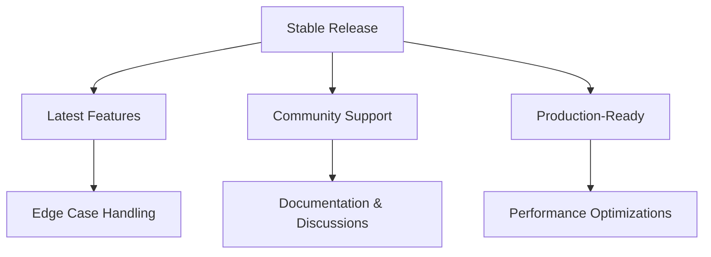
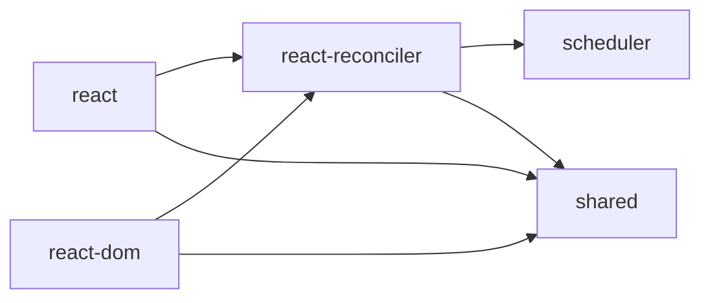
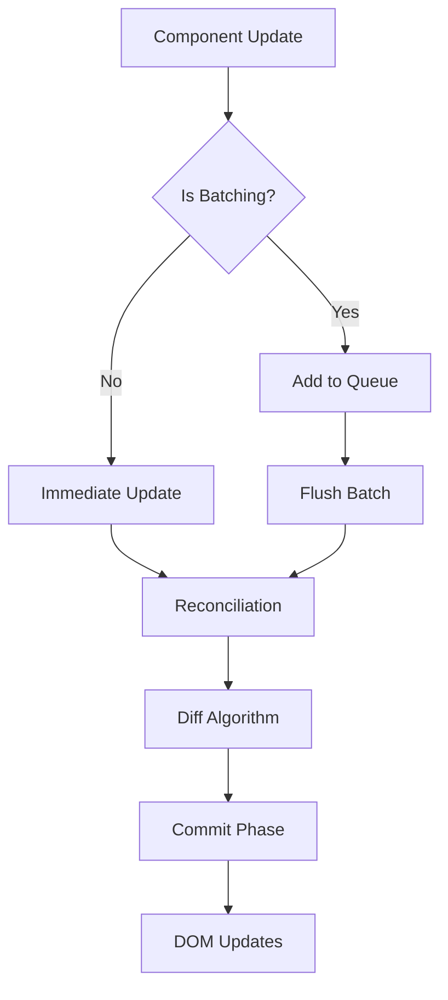

# Frontend Engineering Technical Insights

## You

là 1 Principal Front end ở Microsoft - Meta, hãy đưa ra hiểu biết chuyên sâu ở level này về Bài viết, giúp tôi ghi chú, highlight những phần quan trọng trong bài, cung cấp code, flowchart, sơ đồ nếu có (tiếng việt):

## Claude


Với kinh nghiệm của một Principal Frontend Engineer, tôi sẽ phân tích bài viết này và cung cấp insights chuyên sâu cùng các ghi chú quan trọng.


Tôi vừa tạo một bản phân tích chuyên sâu từ góc độ Principal Frontend Engineer. Dưới đây là những **highlights quan trọng nhất** mà bạn cần ghi chú:


## 🔥 Top Priority Insights


### 1. Problem-Driven mindset là KEY (★★★★★)


- **Không bao giờ** đọc source code mà không có mục đích cụ thể
- Áp dụng **hypothesis-driven approach**: Đặt giả thuyết trước, sau đó verify bằng code


### 2. Strategic Knowledge Prerequisites


Bài viết đề cập đến foundation, nhưng ở Principal level cần thêm:


- **Memory management patterns**
- **Advanced scheduling algorithms**
- **Performance measurement techniques**


### 3. Methodology chuyên nghiệp


```
Phase 1: Strategic Analysis (Architecture + Dependencies)
Phase 2: Dynamic Analysis (Debugging + Profiling)
Phase 3: Performance Focus (Bottlenecks + Optimizations)
```


## 🛠 Practical Tools bạn nên setup ngay:


1. **Advanced debugging environment** với performance profiling
2. **AST analysis tools** để hiểu code structure
3. **Memory leak detection** cho production monitoring
4. **AI-powered code analysis** với strategic prompting


## 💼 Business Impact


Ở level Principal, việc đọc source code không chỉ là kỹ năng technical mà còn là:


- **Technology evaluation** cho architectural decisions
- **Team mentoring** và knowledge transfer
- **Innovation opportunities** identification


**Key takeaway**: Đây không phải là skill để "học framework" mà là **strategic capability** để lead technical direction của team/company.


Bạn có muốn tôi deep dive vào phần nào cụ thể không? Ví dụ như performance analysis methodology hay advanced debugging techniques?


## Claude


# Hướng dẫn Đọc Source Code cho Senior/Principal Engineers


## 🎯 Tầm quan trọng chiến lược của việc đọc source code


### Tại sao Principal Engineers cần master kỹ năng này?


1. **Architectural Decision Making**: Hiểu sâu implementation để đưa ra quyết định kiến trúc đúng đắn
2. **Performance Optimization**: Identify bottlenecks và optimization opportunities
3. **Technology Evaluation**: Đánh giá third-party libraries/frameworks trước khi adopt
4. **Mentoring & Code Review**: Hướng dẫn team hiểu sâu hơn về codebase


---


## 🔥 Highlights quan trọng từ bài viết


### 1. Problem-Driven Approach (★★★★★)


>
> **"Mục đích chính của việc đọc source code là để giải quyết các vấn đề thực tế"**
>
>


**Principal Level Insight:**


- Không đọc code "for fun" mà phải có **clear business/technical objective**
- Áp dụng **Reverse Engineering mindset**: Từ behavior → implementation
- Sử dụng **Hypothesis-Driven Development**: Đặt giả thuyết về implementation trước khi đọc


### 2. Version Strategy (★★★★)


>
> **"Đọc source code của phiên bản mainstream hiện tại trước"**
>
>


**Principal Level Strategy:**





### 3. Knowledge Prerequisites (★★★★★)


**Critical Foundation cho Principal Level:**


#### Advanced JavaScript Concepts


- **Memory Management**: Garbage collection, memory leaks
- **Event Loop Deep Dive**: Microtasks, macrotasks, scheduling
- **Performance APIs**: requestIdleCallback, requestAnimationFrame
- **Advanced Patterns**: Generators, Proxies, WeakMap/WeakSet


#### Framework-Specific Expertise


```javascript
// React Fiber Architecture Understanding
const fiberNode = {
  type: Component,           // Component type
  key: 'unique-key',        // Reconciliation key
  stateNode: domElement,    // Associated DOM node
  child: childFiber,        // First child
  sibling: siblingFiber,    // Next sibling
  return: parentFiber,      // Parent fiber
  alternate: currentFiber,  // Current/WIP tree link
  effectTag: 'UPDATE',      // Side effect type
  expirationTime: timestamp // Scheduling priority
};
```


---


## 🛠 Advanced Source Code Reading Methodology


### Phase 1: Strategic Analysis


#### 1.1 Architectural Overview


```bash
# Directory Structure Analysis Script
find packages/ -name "*.js" -o -name "*.ts" |
head -20 |
xargs wc -l |
sort -nr > module_complexity.txt
```


#### 1.2 Dependency Graph Mapping





### Phase 2: Dynamic Analysis


#### 2.1 Advanced Debugging Setup


```javascript
// React DevTools Performance Monitoring
function profileComponentRender(Component) {
  return function ProfiledComponent(props) {
    const startTime = performance.now();

    React.useEffect(() => {
      const endTime = performance.now();
      console.log(`${Component.name} render time: ${endTime - startTime}ms`);
    });

    return React.createElement(Component, props);
  };
}
```


#### 2.2 Call Stack Analysis


```javascript
// Debugging React State Updates
const originalSetState = React.Component.prototype.setState;
React.Component.prototype.setState = function(partialState, callback) {
  console.trace('setState called from:');
  console.log('Current state:', this.state);
  console.log('Partial state:', partialState);

  return originalSetState.call(this, partialState, callback);
};
```


---


## 📊 Performance-Focused Source Code Analysis


### Critical Performance Patterns to Look For:


#### 1. Time Slicing Implementation


```javascript
// React Scheduler Time Slicing
function workLoopConcurrent() {
  while (workInProgress !== null && !shouldYield()) {
    workInProgress = performUnitOfWork(workInProgress);
  }
}

function shouldYield() {
  return getCurrentTime() >= deadline;
}
```


#### 2. Memory Optimization Patterns


```javascript
// Object Pooling in React
const pooledObjects = [];

function getPooledObject() {
  return pooledObjects.pop() || createNewObject();
}

function releasePooledObject(obj) {
  resetObject(obj);
  pooledObjects.push(obj);
}
```


#### 3. Batching Mechanisms


```javascript
// React Event Batching
let isBatchingUpdates = false;

function batchedUpdates(fn) {
  const prevIsBatchingUpdates = isBatchingUpdates;
  isBatchingUpdates = true;

  try {
    return fn();
  } finally {
    isBatchingUpdates = prevIsBatchingUpdates;
    if (!isBatchingUpdates) {
      flushBatchedUpdates();
    }
  }
}
```


---


## 🎨 Advanced Code Navigation Techniques


### 1. Abstract Syntax Tree (AST) Analysis


```javascript
// Using Babel to analyze code structure
import * as babel from '@babel/core';
import traverse from '@babel/traverse';

function analyzeReactComponents(sourceCode) {
  const ast = babel.parseSync(sourceCode, {
    sourceType: 'module',
    plugins: ['jsx', 'typescript']
  });

  const components = [];

  traverse(ast, {
    FunctionDeclaration(path) {
      if (isReactComponent(path.node)) {
        components.push({
          name: path.node.id.name,
          hooks: extractHooks(path),
          props: extractProps(path)
        });
      }
    }
  });

  return components;
}
```


### 2. Control Flow Analysis





---


## 🔍 Principal-Level Debugging Strategies


### 1. Performance Profiling Integration


```javascript
// Custom Performance Monitoring
class PerformanceProfiler {
  constructor() {
    this.measurements = new Map();
  }

  startMeasurement(name) {
    performance.mark(`${name}-start`);
  }

  endMeasurement(name) {
    performance.mark(`${name}-end`);
    performance.measure(name, `${name}-start`, `${name}-end`);

    const measurement = performance.getEntriesByName(name)[0];
    this.measurements.set(name, measurement.duration);
  }

  getReport() {
    return Object.fromEntries(this.measurements);
  }
}
```


### 2. Memory Leak Detection


```javascript
// Memory Leak Detection in React
function detectMemoryLeaks() {
  let prevHeapUsed = process.memoryUsage().heapUsed;

  setInterval(() => {
    const currentHeapUsed = process.memoryUsage().heapUsed;
    const diff = currentHeapUsed - prevHeapUsed;

    if (diff > 10 * 1024 * 1024) { // 10MB increase
      console.warn('Potential memory leak detected:', {
        previous: prevHeapUsed,
        current: currentHeapUsed,
        increase: diff
      });
    }

    prevHeapUsed = currentHeapUsed;
  }, 5000);
}
```


---


## 🚀 AI-Powered Source Code Analysis


### Advanced Prompting Strategies


#### 1. Architecture Analysis Prompt


```
Analyze this React source code segment and explain:
1. The design pattern used
2. Performance implications
3. Potential edge cases
4. Integration points with other modules
5. Backward compatibility considerations

[CODE_SEGMENT]
```


#### 2. Optimization Opportunities Prompt


```
Given this implementation, identify:
1. Performance bottlenecks
2. Memory optimization opportunities
3. Alternative algorithms that could be more efficient
4. Trade-offs in the current approach

[CODE_SEGMENT]
```


---


## 📚 Resources cho Principal Engineers


### Essential Reading List


1. **React RFC Documents**: In-depth design decisions
2. **V8 Blog**: JavaScript engine optimizations
3. **Chrome DevTools Documentation**: Advanced debugging
4. **Web Performance Working Group**: Standards và best practices


### Monitoring Tools Setup


```javascript
// Production Performance Monitoring
import { getCLS, getFID, getFCP, getLCP, getTTFB } from 'web-vitals';

function setupPerformanceMonitoring() {
  getCLS(console.log);
  getFID(console.log);
  getFCP(console.log);
  getLCP(console.log);
  getTTFB(console.log);
}
```


---


## 💡 Key Takeaways cho Principal Engineers


### 1. Strategic Impact


- Source code reading không chỉ là technical skill mà là **business enabler**
- Giúp đưa ra **data-driven architectural decisions**
- Critical cho **technology roadmap planning**


### 2. Team Leadership


- Sử dụng insights từ source code để **mentor junior developers**
- Establish **coding standards** based on industry best practices
- Create **internal documentation** và knowledge sharing


### 3. Innovation Opportunities


- Identify **gaps trong existing solutions**
- Contribute back to **open source community**
- Develop **internal tools** based on learned patterns


---


## 🎯 Action Items


1. **Setup advanced debugging environment** với performance profiling
2. **Create source code reading checklist** cho team
3. **Establish regular tech talks** sharing insights from source code analysis
4. **Contribute to open source** để deepen understanding
5. **Develop internal tools** based on patterns learned from major frameworks
