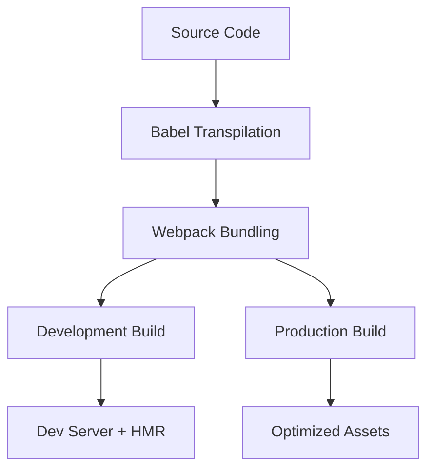

# React Framework Development Tutorial

## Claude


# 🚀 Phân Tích Bài Viết: "Xây Dựng React Framework Từ Đầu"


## 📝 1. TÓM TẮT CHÍNH


Bài viết này là một **complete tutorial** hướng dẫn xây dựng một React application từ con số 0, không sử dụng Create React App hay bất kỳ boilerplate nào. Tác giả step-by-step setup toàn bộ development environment bao gồm webpack, babel, React, React Router, Redux, và các optimizations cho production. **Đây là kiến thức fundamental mà mọi senior developer cần hiểu** để master được React ecosystem và troubleshoot được complex build issues.


## 🔍 2. KHÁI NIỆM CỐT LÕI


### 🔧 Webpack - Module Bundler


```javascript
// Webpack configuration cơ bản
module.exports = {
    entry: './src/index.js',     // Điểm vào của app
    output: {                    // Output configuration
        path: path.join(__dirname, './dist'),
        filename: 'bundle.js'    // File JS được generate
    },
    module: {
        rules: []               // Rules để process các file types
    }
};
```


### 🔄 Babel - JavaScript Transpiler


```javascript
// .babelrc - Configuration file
{
  "presets": [
    "es2015",      // ES6 → ES5
    "react",       // JSX → JavaScript
    "stage-0"      // ES7+ features
  ]
}
```


### 🌐 Hot Module Replacement (HMR)


```javascript
// Enable hot reloading cho React
if (module.hot) {
    module.hot.accept('./router/router', () => {
        const getRouter = require('./router/router').default;
        renderWithHotReload(getRouter());
    });
}
```


### 🗂️ Code Splitting với Bundle Loader


```javascript
// Dynamic import cho lazy loading
import Home from 'bundle-loader?lazy&name=home!pages/Home/Home';

// Wrapper component cho loading state
const createComponent = (component) => (props) => (
    <Bundle load={component}>
        {(Component) => Component ? <Component {...props} /> : <Loading/>}
    </Bundle>
);
```


## 💡 3. HIỂU BẢN CHẤT


### 🎯 Pain Points Được Giải Quyết:


1. **Build Process Control**: Hiểu rõ từng step trong build pipeline thay vì dùng magic commands
2. **Performance Optimization**: Code splitting, caching, minification tự control được
3. **Development Experience**: Hot reloading, source maps, dev server configuration
4. **Production Readiness**: Environment-specific builds, asset optimization


### ⚙️ Cơ Chế Hoạt Động:





### 🔄 Tại Sao Approach Này:


- **Full Control**: Customize mọi aspect của build process
- **Learning**: Hiểu sâu về React ecosystem
- **Troubleshooting**: Có thể debug và fix build issues
- **Scalability**: Setup cho large-scale applications


## 🛠️ 4. CODE EXAMPLES THỰC TẾ


### 📦 Webpack Development vs Production Config:


### 🔗 Redux Middleware Pattern:


### 🎨 React Hot Module Replacement Setup:


## 🔄 5. SO SÁNH & PHÂN BIỆT


### ⚡ Manual Setup vs Create React App:


```
AspectManual Setup (Bài viết)Create React AppLearning CurveCao - cần hiểu webpack, babelThấp - abstract complexityCustomizationHoàn toàn control đượcLimited, cần ejectBundle SizeOptimize được tối đaCó overhead không cần thiếtBuild PerformanceFine-tune được theo needsGood defaults nhưng không tối ưuDebuggingHiểu rõ build pipelineBlack box khi có issuesTeam OnboardingKhó cho junior developersDễ dàng start ngay
```


### 🎯 Webpack vs Vite (Modern Alternative):


```javascript
// Webpack approach (như trong bài viết)
const config = {
    entry: './src/index.js',
    output: { filename: '[name].[chunkhash].js' },
    module: { rules: [/* many loaders */] },
    plugins: [/* many plugins */]
};

// Vite approach (hiện đại hơn)
// vite.config.js
export default {
    build: { rollupOptions: {} },  // Simpler config
    server: { hmr: true },         // HMR out of the box
    plugins: [react()]             // Minimal plugins
};
```


### 🔀 Bundle Splitting Strategies:


**Route-based splitting (bài viết sử dụng):**


```javascript
// Pros: Simple, user-centric
// Cons: Có thể duplicate code giữa routes
import Home from 'bundle-loader?lazy&name=home!pages/Home/Home';
```


**Component-based splitting (modern approach):**


```javascript
// Pros: Granular control, better caching
// Cons: Complex dependency management
const LazyChart = lazy(() => import('./Chart'));
```


## 🎯 6. BEST PRACTICES


### ⚠️ Common Mistakes Cần Tránh:


1. **Hash vs ChunkHash Confusion:**
javascript// ❌ SAI: hash thay đổi cho tất cả files
filename: '[name].[hash].js'

// ✅ ĐÚNG: chunkhash chỉ thay đổi khi file đó thay đổi
filename: '[name].[chunkhash].js'
2. **CSS Modules Naming Collision:**
javascript// ❌ SAI: Tên class có thể conflict
localIdentName: '[name]__[local]'

// ✅ ĐÚNG: Include hash để unique
localIdentName: '[local]-[hash:base64:5]'
3. **Bundle Size Monitoring:**
javascript// ✅ Luôn analyze bundle size
plugins: [
    new BundleAnalyzerPlugin({
        analyzerMode: 'server',
        openAnalyzer: false
    })
]


### 🚀 Performance Optimizations:


1. **Tree Shaking Configuration:**
javascript// package.json
{
    "sideEffects": false,  // Enable tree shaking
    // or specify specific files có side effects
    "sideEffects": ["*.css", "*.scss"]
}
2. **Webpack Cache Configuration:**
javascript// webpack 5 persistent caching
cache: {
    type: 'filesystem',
    buildDependencies: {
        config: [__filename]  // Invalidate khi config thay đổi
    }
}


## 🚀 7. ỨNG DỤNG THỰC TẾ


### 🏢 Enterprise Applications:


**E-commerce Platform (Shopify-like):**


```javascript
// Multi-tenant configuration
const generateConfig = (tenant) => ({
    entry: {
        app: `./src/tenants/${tenant}/index.js`,
        vendor: ['react', 'react-dom', 'lodash']
    },
    output: {
        path: path.resolve('dist', tenant),
        publicPath: `/static/${tenant}/`
    }
});
```


**Micro-frontend Architecture:**


```javascript
// Module Federation setup (Webpack 5)
plugins: [
    new ModuleFederationPlugin({
        name: 'shell',
        remotes: {
            products: 'products@http://localhost:3001/remoteEntry.js',
            cart: 'cart@http://localhost:3002/remoteEntry.js'
        }
    })
]
```


### 📱 Mobile-First PWA Setup:


## 📚 8. KIẾN THỨC LIÊN QUAN


### 🎯 Prerequisites Cần Nắm Vững:


**JavaScript ES6+ Fundamentals:**


```javascript
// Module imports/exports
import React from 'react';
export default MyComponent;

// Arrow functions & destructuring
const { useState, useEffect } = React;
const handleClick = (e) => setCount(count + 1);

// Spread operator & template literals
const newState = { ...oldState, updated: true };
const apiUrl = `https://api.example.com/users/${userId}`;
```


**Node.js & NPM Ecosystem:**


- Package.json scripts và dependency management
- Node modules resolution algorithm
- Semantic versioning (semver) principles


### 🚀 Advanced Topics Để Tìm Hiểu Tiếp:


1. **Webpack 5 Module Federation** - Micro-frontends architecture
2. **Vite & ESBuild** - Next-generation build tools
3. **SWC & Rome** - Rust-based tooling alternatives
4. **Web Workers & Service Workers** - Background processing
5. **HTTP/2 Server Push** - Advanced caching strategies


### 🔗 Related Technologies:


**Build Tools Evolution:**


```
Grunt/Gulp → Webpack → Rollup → Vite → Turbopack
```


**State Management Evolution:**


```
jQuery → Redux → Context API → Zustand/Jotai → Server State (React Query)
```


## 💼 9. INTERVIEW PERSPECTIVE


### 🎯 Câu Hỏi Interview Thường Gặp:


**Q: "Giải thích quá trình từ source code React đến browser rendering?"**


**A:** "Quá trình gồm nhiều bước:


1. **Babel transpilation**: JSX → JavaScript, ES6+ → ES5
2. **Webpack bundling**: Module resolution, dependency graphing, code splitting
3. **Optimization**: Tree shaking, minification, compression
4. **Browser parsing**: HTML parsing, JavaScript execution, React reconciliation
5. **Rendering**: Virtual DOM → Real DOM, CSS styling, layout, paint"


**Q: "Tại sao cần Code Splitting và cách implement?"**


**A:** "Code Splitting giải quyết vấn đề bundle size quá lớn:


- **Problem**: Toàn bộ app download ngay lần đầu → slow first load
- **Solution**: Dynamic imports với React.lazy() hoặc webpack dynamic imports
- **Implementation**: Route-based splitting là simplest, component-based splitting là granular hơn
- **Benefits**: Faster initial load, better caching, improved UX"


**Q: "Hot Module Replacement hoạt động như thế nào?"**


**A:** "HMR uses WebSocket connection giữa dev server và browser:


1. **File watcher** detect changes trong source code
2. **Webpack recompiles** chỉ affected modules
3. **HMR runtime** receives update notification
4. **Module replacement** happens without full reload
5. **State preservation** through react-hot-loader patterns"


### 💡 Điểm Cộng Khi Demonstrate:


**Show Deep Understanding:**


```javascript
// Instead of just saying "I use webpack"
// Explain WHY certain configurations
module.exports = {
    // Explain: chunkhash cho long-term caching
    output: { filename: '[name].[chunkhash].js' },

    // Explain: tree shaking configuration
    optimization: { sideEffects: false },

    // Explain: different source map strategies
    devtool: process.env.NODE_ENV === 'production'
        ? 'cheap-module-source-map'  // Smaller, less detailed
        : 'inline-source-map'        // Detailed, larger
};
```


**Demonstrate Problem-Solving:**


- "Khi bundle size quá lớn, tôi sẽ analyze với webpack-bundle-analyzer"
- "Khi build time chậm, tôi optimize với caching strategies và parallel processing"
- "Khi có performance issues, tôi profile với React DevTools và Lighthouse"


## 🎪 10. DEMO INTERACTIVE


## 🎯 TỔNG KẾT VÀ LỘ TRÌNH HỌC TẬP


### 📈 Learning Path Recommendations:


**Beginner Level (0-1 năm):**


1. Nắm vững HTML/CSS/JavaScript fundamentals
2. Học React với Create React App trước
3. Hiểu npm package management
4. Basic Git workflow


**Intermediate Level (1-3 năm):**


1. Học webpack configuration từ tutorial này
2. Deep dive vào Babel transpilation
3. Understand build processes và tooling
4. Practice với different deployment strategies


**Advanced Level (3+ năm):**


1. Customize webpack cho specific needs
2. Build custom tools và automation
3. Optimize performance với advanced techniques
4. Contribute vào open source tools


### 🎯 Key Takeaways từ Bài Viết:


**🔥 Must-Know Concepts:**


- **Webpack** là heart của modern frontend development
- **Build process understanding** critical cho troubleshooting
- **Performance optimization** starts từ build configuration
- **Development experience** greatly impacts team productivity


**⚡ Modern Alternatives để Explore:**


```javascript
// Vite - Next generation build tool
// Faster dev server, simpler config
import { defineConfig } from 'vite';

export default defineConfig({
  plugins: [react()],
  build: {
    rollupOptions: {
      output: {
        manualChunks: {
          vendor: ['react', 'react-dom']
        }
      }
    }
  }
});
```


### 🚀 Practical Action Steps:


1. **Thực hành ngay:** Clone tutorial repo và follow từng bước
2. **Experiment:** Thử modify configuration và observe effects
3. **Build project:** Apply knowledge vào personal project
4. **Share knowledge:** Teach concepts này cho teammates
5. **Stay updated:** Follow webpack releases và community


**🎓 Final Advice từ Senior Engineer Perspective:**


>
> "Understanding build tools deeply là điều phân biệt senior developers từ junior. Khi production issues xảy ra, bạn cần biết exactly what's happening under the hood. Tutorial này provides foundation để become that developer."
>
>


Bài viết này không chỉ là tutorial mà còn là **comprehensive guide** để master React ecosystem. Kiến thức từ đây sẽ applicable cho nhiều năm tới và tạo foundation vững chắc cho career growth! 🚀
