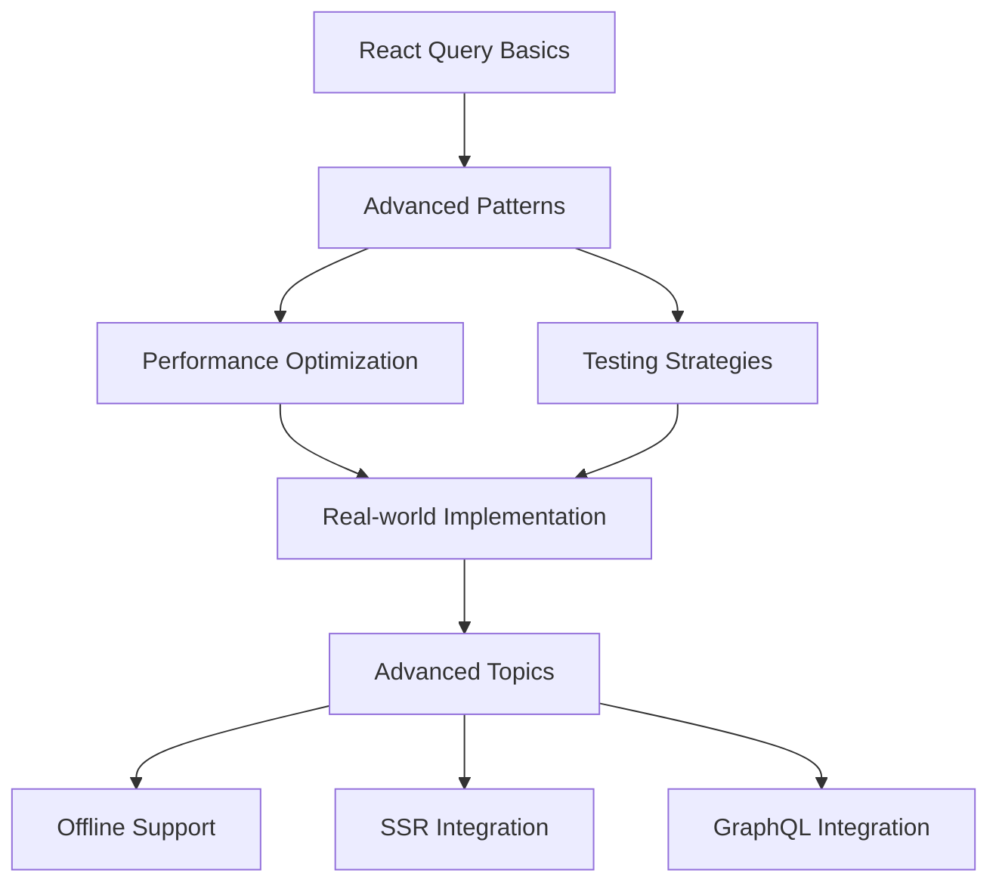

# React Query: Async State Management

## You

React Query as a State Manager

## Claude


# 🚀 React Query: Không phải Data Fetching Library mà là Async State Manager


## 📝 1. TÓM TẮT CHÍNH


**React Query không phải là thư viện fetch data** như nhiều người nghĩ, mà thực chất là một **async state manager** mạnh mẽ. Bài viết làm rõ misconception phổ biến này và giải thích cách React Query hoạt động như một global state manager cho async data, sử dụng cơ chế "Stale While Revalidate" để đồng bộ data giữa frontend và backend một cách thông minh.


**Tại sao quan trọng?** Hiểu đúng bản chất này giúp developers sử dụng React Query hiệu quả hơn, tránh những anti-patterns như disable refetch flags hoặc sync data sang state manager khác.


## 🔍 2. KHÁI NIỆM CỐT LÕI


### 🎯 Async State Manager


- **Định nghĩa đơn giản:** React Query quản lý state của các async operations (như API calls), không quan tâm source data đến từ đâu
- **So sánh với Redux:** Nếu Redux quản lý sync state, thì React Query chuyên về async state với built-in loading, error, caching


### 🔄 Stale While Revalidate (SWR)


- **Cơ chế:** Trả về cached data ngay lập tức (dù có thể outdated), đồng thời fetch fresh data ở background
- **Triết lý:** "Stale data is better than no data" - tránh loading spinners không cần thiết


### 🔑 Query Key


- **Unique identifier** cho mỗi query
- **Global access:** Cùng key = cùng data across components
- **Deduplication:** Multiple components cùng key chỉ tạo 1 network request


### 📡 Smart Refetch Strategy


- **refetchOnMount:** Mount component mới = trigger revalidation
- **refetchOnWindowFocus:** User quay lại tab = fetch fresh data
- **refetchOnReconnect:** Network reconnect = sync lại data


## 💡 3. HIỂU BẢN CHẤT


### 🎯 Pain Points React Query Giải Quyết


**Trước React Query, developers có 2 approaches phổ biến:**


1. **"Fetch once, distribute globally"** (Redux pattern)

❌ Data nhanh outdated, rarely update
❌ Manual cache invalidation phức tạp
❌ Reload browser để get fresh data
2. **"Fetch on every mount"**

❌ Unnecessary loading spinners
❌ Poor UX với repeated fetching
❌ No data persistence between mounts


### 🔧 Cơ Chế Hoạt Động Underlying


```javascript
// Mental model của React Query
const QueryCache = {
  'todos': {
    data: [...],
    status: 'success',
    lastFetched: timestamp,
    staleTime: 20000,
    observers: [Component1, Component2] // Các components đang subscribe
  }
}
```


**Tại sao chọn approach này?**


- **Server state ≠ Client state:** Frontend không "sở hữu" data, chỉ display snapshot
- **Automatic synchronization:** Background refetch để sync với backend
- **Optimistic updates:** Balance giữa performance và data freshness


## 🛠️ 4. CODE EXAMPLES THỰC TẾ


### 📊 Basic Global State Sharing


### 🔧 StaleTime Configuration Pattern


## 🔄 5. SO SÁNH & PHÂN BIỆT


### 📊 React Query vs Redux Toolkit Query


```
Tiêu chíReact QueryRedux Toolkit Query🎯 FocusPure async state managementRedux integration với caching📦 Bundle sizeNhỏ hơn (~13kb)Lớn hơn (requires Redux)🔧 Setup complexityMinimal setupCần setup Redux store🌐 Global stateBuilt-in async stateCombine với Redux sync state🔄 Cache invalidationFlexible query keysTag-based system
```


**Khi nào dùng React Query:**


- ✅ Dự án mới không có Redux
- ✅ Focus chủ yếu vào server state
- ✅ Cần minimal setup và learning curve


**Khi nào dùng RTK Query:**


- ✅ Đã có Redux ecosystem
- ✅ Cần manage complex client state
- ✅ Team đã familiar với Redux patterns


### 🔧 React Query vs SWR


```javascript
// 🟢 React Query - Richer feature set
const { data, error, isLoading, refetch } = useQuery({
  queryKey: ['user', userId],
  queryFn: () => fetchUser(userId),
  staleTime: 5 * 60 * 1000, // 5 phút
  retry: 3,
  retryDelay: (attempt) => Math.min(1000 * 2 ** attempt, 30000)
});

// 🔵 SWR - Simpler API
const { data, error, isLoading, mutate } = useSWR(
  `/api/user/${userId}`,
  fetchUser,
  {
    refreshInterval: 5 * 60 * 1000,
    revalidateOnFocus: true
  }
);
```


**React Query advantages:**


- 🎯 Mutations với optimistic updates
- 🔄 More sophisticated retry logic
- 📊 Better DevTools experience
- 🎨 More flexible query key system


**SWR advantages:**


- 🪶 Lighter weight và simpler API
- 🚀 Faster initial setup
- 📖 Smaller learning curve


## 🎯 6. BEST PRACTICES


### ⚡ Performance Optimization


```javascript
// ❌ BAD: Không set staleTime
const { data } = useQuery({
  queryKey: ['posts'],
  queryFn: fetchPosts
  // staleTime mặc định = 0, refetch mọi mount
});

// ✅ GOOD: Set appropriate staleTime
const { data } = useQuery({
  queryKey: ['posts'],
  queryFn: fetchPosts,
  staleTime: 5 * 60 * 1000, // 5 phút cho content ít thay đổi
  cacheTime: 10 * 60 * 1000 // 10 phút giữ trong memory
});
```


### 🔑 Query Key Best Practices


```javascript
// ❌ BAD: String query keys
useQuery('posts', fetchPosts);

// ✅ GOOD: Array-based hierarchical keys
useQuery(['posts'], fetchPosts);
useQuery(['posts', 'list'], fetchPosts);
useQuery(['posts', postId], fetchPost);
useQuery(['posts', postId, 'comments'], fetchComments);

// 🎯 Pattern: Resource-based key structure
const postKeys = {
  all: ['posts'] as const,
  lists: () => [...postKeys.all, 'list'] as const,
  list: (filters: string) => [...postKeys.lists(), { filters }] as const,
  details: () => [...postKeys.all, 'detail'] as const,
  detail: (id: number) => [...postKeys.details(), id] as const,
}
```


### 🚫 Common Mistakes


```javascript
// ❌ MISTAKE 1: Disable all refetch flags
const { data } = useQuery({
  queryKey: ['user'],
  queryFn: fetchUser,
  refetchOnMount: false,     // ❌ Mất sync với server
  refetchOnWindowFocus: false, // ❌ User không nhận latest data
  refetchOnReconnect: false    // ❌ Network issues không được handle
});

// ✅ BETTER: Customize staleTime instead
const { data } = useQuery({
  queryKey: ['user'],
  queryFn: fetchUser,
  staleTime: 2 * 60 * 1000 // 2 phút, balance giữa UX và freshness
});

// ❌ MISTAKE 2: Sync server state to useState
const [posts, setPosts] = useState([]);
const { data } = useQuery(['posts'], fetchPosts);

useEffect(() => {
  if (data) {
    setPosts(data); // ❌ Duplicate state, source of truth confusion
  }
}, [data]);

// ✅ BETTER: Let React Query manage state
const { data: posts } = useQuery(['posts'], fetchPosts);
```


## 🚀 7. ỨNG DỤNG THỰC TẾ


### 🛒 E-commerce Application Pattern


```javascript
// 🏪 Product catalog với search & filtering
const useProducts = (filters) => {
  return useQuery({
    queryKey: ['products', filters],
    queryFn: () => fetchProducts(filters),
    staleTime: 5 * 60 * 1000, // Products change moderately
    keepPreviousData: true // Smooth UX khi change filters
  });
};

// 🛒 Shopping cart - needs fresh data
const useCart = () => {
  return useQuery({
    queryKey: ['cart'],
    queryFn: fetchCart,
    staleTime: 0, // Always fresh - critical for checkout
    refetchOnWindowFocus: true
  });
};

// 💳 Order history - rarely changes
const useOrderHistory = () => {
  return useQuery({
    queryKey: ['orders'],
    queryFn: fetchOrders,
    staleTime: 10 * 60 * 1000, // 10 phút
    cacheTime: 30 * 60 * 1000  // Keep longer in cache
  });
};
```


### 📊 Dashboard Application


```javascript
// 📈 Real-time metrics
const useMetrics = () => {
  return useQuery({
    queryKey: ['metrics'],
    queryFn: fetchMetrics,
    refetchInterval: 30 * 1000, // Auto-refresh every 30s
    staleTime: 20 * 1000        // Consider stale after 20s
  });
};

// 👤 User activity log
const useActivityLog = (userId, page = 1) => {
  return useQuery({
    queryKey: ['activity', userId, page],
    queryFn: () => fetchActivity(userId, page),
    staleTime: 2 * 60 * 1000,   // 2 phút
    keepPreviousData: true      // Smooth pagination
  });
};
```


### 🔄 Mutation Patterns


```javascript
// 📝 Create post với optimistic update
const useCreatePost = () => {
  const queryClient = useQueryClient();

  return useMutation({
    mutationFn: createPost,

    // 🎯 Optimistic update - instant UI feedback
    onMutate: async (newPost) => {
      await queryClient.cancelQueries(['posts']);

      const previousPosts = queryClient.getQueryData(['posts']);

      queryClient.setQueryData(['posts'], (old) => [
        { ...newPost, id: Date.now(), status: 'pending' },
        ...old
      ]);

      return { previousPosts };
    },

    // ✅ Success: Update với actual server response
    onSuccess: (data) => {
      queryClient.setQueryData(['posts'], (old) =>
        old.map(post =>
          post.status === 'pending' && post.title === data.title
            ? data
            : post
        )
      );
    },

    // ❌ Error: Rollback optimistic update
    onError: (err, variables, context) => {
      queryClient.setQueryData(['posts'], context.previousPosts);
    }
  });
};
```


## 📚 8. KIẾN THỨC LIÊN QUAN


### 🔧 Prerequisites (Cần biết trước)


- **React Hooks:** useState, useEffect, custom hooks
- **Promises & Async/Await:** Understanding async operations
- **HTTP Client Libraries:** fetch, axios
- **React Context:** Global state management concept


### 🎯 Core Concepts cần master


```javascript
// 🔑 Query lifecycle understanding
const queryLifecycle = {
  fresh: 'data mới fetch, trong staleTime',
  stale: 'data cũ hơn staleTime, cần revalidate',
  fetching: 'đang fetch ở background',
  error: 'fetch failed, có error state',
  inactive: 'không có component nào đang observe'
};

// 🎨 Mental model cho caching
const cacheModel = {
  queryKey: 'unique identifier',
  queryFn: 'function to fetch data',
  staleTime: 'thời gian data được coi là fresh',
  cacheTime: 'thời gian data được giữ trong memory sau khi inactive'
};
```


### 📖 Advanced Topics để học tiếp


1. **🔄 Query Invalidation Strategies**
javascript// Selective invalidation
queryClient.invalidateQueries(['posts']); // All post queries
queryClient.invalidateQueries(['posts', 'list']); // Only list queries
2. **🎯 Optimistic Updates Patterns**
javascript// Advanced optimistic update với rollback
const optimisticUpdate = {
  onMutate: updateCacheOptimistically,
  onError: rollbackOptimisticUpdate,
  onSettled: refetchRelatedQueries
};
3. **🌐 Offline Support**
javascript// Background sync khi có network
const offlineQuery = {
  networkMode: 'offlineFirst',
  retry: (failureCount, error) => {
    return error?.code !== 'NETWORK_ERROR' && failureCount < 3;
  }
};


### 🔗 Related Technologies


- **React Suspense:** Data fetching với concurrent features
- **GraphQL với Apollo Client:** Alternative cho REST APIs
- **Zustand/Jotai:** Client-side state kết hợp với React Query
- **Next.js:** SSR/SSG integration patterns


## 💼 9. INTERVIEW PERSPECTIVE


### 🎯 Câu hỏi Interview thường gặp


**Q1: "React Query khác gì với useState + useEffect để fetch data?"**


```javascript
// 🔴 Traditional approach - nhiều boilerplate
const [data, setData] = useState(null);
const [loading, setLoading] = useState(false);
const [error, setError] = useState(null);

useEffect(() => {
  setLoading(true);
  fetchData()
    .then(setData)
    .catch(setError)
    .finally(() => setLoading(false));
}, []);

// 🟢 React Query - clean và feature-rich
const { data, isLoading, error } = useQuery(['data'], fetchData);
```


**Trả lời professional:**


- "React Query không chỉ thay thế useState + useEffect mà còn provide comprehensive async state management với built-in caching, background refetch, error retry, và global state sharing. Nó eliminate boilerplate và provide better UX through stale-while-revalidate strategy."


**Q2: "Khi nào bạn sẽ dùng React Query thay vì Redux?"**


**Trả lời structured:**


```
📊 React Query phù hợp khi:
- Server state chiếm majority của app state
- Cần real-time data synchronization
- Focus vào data fetching optimization

🔧 Redux phù hợp khi:
- Complex client-side state logic
- Need predictable state updates với time-travel debugging
- Heavy business logic requires centralized state management
```


**Q3: "Explain staleTime vs cacheTime"**


```javascript
// 💡 Demonstration answer
const queryConfig = {
  staleTime: 5 * 60 * 1000,  // 5 phút - data considered fresh
  cacheTime: 10 * 60 * 1000  // 10 phút - data kept in memory when inactive
};

// Timeline explanation:
// 0-5 phút: Data FRESH → return từ cache, no network request
// 5+ phút: Data STALE → return cache + background refetch
// 10+ phút (inactive): Data REMOVED từ memory
```


### 🏆 Điểm cộng khi demonstrate


1. **🎯 Hiểu trade-offs:**
"React Query optimize cho user experience với stale-while-revalidate,
nhưng có trade-off là more network requests. Có thể customize
qua staleTime để balance performance vs freshness."
2. **🔧 Practical experience:**
"Trong project e-commerce, tôi set staleTime khác nhau:
- Product catalog: 5 phút (moderate changes)
- Shopping cart: 0 seconds (critical accuracy)
- User profile: 10 phút (rarely changes)"
3. **🚀 Performance awareness:**
"Monitor devtools để identify unnecessary refetches,
use keepPreviousData cho smooth pagination,
và implement proper query key hierarchy cho efficient invalidation."


## 🎪 10. DEMO INTERACTIVE


---


## 🎉 KẾT LUẬN & NEXT STEPS


### 🎯 Takeaways quan trọng nhất:


1. **🧠 Mental Model Shift:** React Query không phải data fetching library mà là **async state manager**
2. **⚡ Performance Philosophy:** "Stale data is better than no data" - optimize cho UX thay vì minimize requests
3. **🔧 Configuration is Key:** `staleTime` là lever chính để balance freshness vs performance
4. **🌐 Global State Made Easy:** Same query key = same data across components, automatic deduplication


### 📈 Learning Roadmap tiếp theo:





### 🚀 Action Items để master React Query:


**Week 1-2: Foundation**


- Setup React Query trong side project
- Experiment với staleTime values khác nhau
- Implement basic queries và mutations


**Week 3-4: Advanced Patterns**


- Practice optimistic updates
- Learn query invalidation strategies
- Master query key hierarchies


**Week 5-6: Production Ready**


- Setup error boundaries
- Implement proper loading states
- Add React Query DevTools


### 💡 Khi nào sẽ thành expert:


**✅ Bạn hiểu React Query khi:**


- Có thể explain được difference giữa `isLoading` vs `isFetching`
- Biết khi nào set `staleTime` vs khi nào disable refetch flags
- Có thể implement complex optimistic updates không cần documentation


**🏆 Bạn master React Query khi:**


- Có thể design query key architecture cho large applications
- Debug performance issues liên quan đến unnecessary refetches
- Contribute được vào React Query ecosystem hoặc tạo custom abstractions


React Query thực sự **game-changer** cho React ecosystem - một khi hiểu đúng mental model, bạn sẽ không thể quay lại cách fetch data cũ! 🚀
