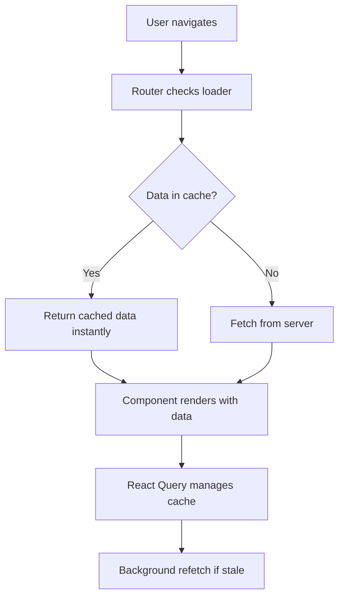

# React Query and Router Integration

## You

React Query meets React Router

## Claude


# 🔄 React Query meets React Router: Sự kết hợp hoàn hảo cho Data Fetching


## 📝 1. TÓM TẮT CHÍNH


Bài viết này giải thích cách kết hợp **React Router 6.4** (với loaders/actions) và **React Query** để tạo ra một data fetching strategy tối ưu. Thay vì coi hai thư viện này là competitors, tác giả chứng minh rằng chúng bổ sung hoàn hảo cho nhau: **React Router đảm nhiệm "WHEN" (khi nào fetch), còn React Query đảm nhiệm "WHAT" (cache và manage data)**.


Vấn đề này quan trọng vì nó solve được pain point lớn nhất của client-side applications: **fetch data càng sớm càng tốt** để giảm loading time, đồng thời vẫn có caching thông minh để tránh redundant requests.


---


## 🔍 2. KHÁI NIỆM CỐT LÕI


### 🎯 Route Loaders (React Router 6.4)


```javascript
// Loader = function được gọi TRƯỚC khi component render
export async function loader({ params }) {
  return getContact(params.contactId)
}
```


**Giải thích đơn giản:** Như một "personal assistant" cho mỗi route, luôn chuẩn bị data sẵn trước khi bạn vào trang.


### 🎯 Actions (React Router 6.4)


```javascript
// Action = function xử lý form submissions và mutations
export const action = async ({ request, params }) => {
  const formData = await request.formData()
  await updateContact(params.contactId, updates)
  return redirect(`/contacts/${params.contactId}`)
}
```


**Giải thích đơn giản:** Như một "event handler" cho tất cả data mutations, tự động invalidate loaders sau khi update.


### 🎯 React Query Cache


```javascript
// Cache = smart storage system cho API responses
const queryClient = new QueryClient()
queryClient.getQueryData(['contacts', 'detail', '1']) // Lấy từ cache
```


**Giải thích đơn giản:** Như một "smart refrigerator" - nhớ data đã fetch, biết khi nào data stale, tự động refetch khi cần.


### 🎯 fetchQuery vs prefetchQuery


- **fetchQuery**: Fetch và return data, throw errors
- **prefetchQuery**: Fetch silently, catch errors internally, không return gì


---


## 💡 3. HIỂU BẢN CHẤT


### 🔨 Pain Points được giải quyết:


1. **🐌 Slow Initial Load**: Thông thường fetch on component mount → user thấy loading spinner
2. **🔄 Redundant Requests**: Navigate back to visited page → fetch lại data đã có
3. **⚡ Poor UX**: Không có stale-while-revalidate strategy


### 🧠 Cơ chế hoạt động underlying:





### 🎯 Tại sao chọn solution này:


- **React Router**: Biết route sớm nhất → fetch sớm nhất
- **React Query**: Cache management + background updates mature nhất
- **Combination**: Early fetching + Smart caching = Best UX


---


## 🛠️ 4. CODE EXAMPLES THỰC TẾ


### 📁 Basic Setup - Kết nối Router với QueryClient


### 📁 Contact Route với Optimized Loader


### 📁 Action với Query Invalidation


---


## 🔄 5. SO SÁNH & PHÂN BIỆT


### 📊 Comparison Table: Các Data Fetching Approaches


```
ApproachEarly FetchingCachingBackground UpdatesComplexityBest For🔄 React Router + React Query✅ Loader fetches✅ Smart cache✅ Auto refetch🟡 MediumUniversal apps⚡ Only React Router✅ Loader fetches❌ No cache❌ Refetch mọi lần🟢 LowSimple apps🔍 Only React Query❌ Fetch on mount✅ Smart cache✅ Auto refetch🟢 LowData-heavy apps🏗️ Server Components✅ Server renders❌ No client cache❌ Full page refresh🔴 HighSSR apps🎯 Custom Solution🤔 Depends🤔 Depends🤔 Depends🔴 Very HighSpecific needs
```


### 🎯 Chi tiết từng approach:


#### 1. 🔄 React Router ONLY (không có React Query)


```javascript
// ✅ Pros: Đơn giản, fetch early
// ❌ Cons: Không có cache, fetch lại mỗi lần navigate
export async function loader({ params }) {
  return getContact(params.contactId) // Luôn hit server
}
```


#### 2. 🔍 React Query ONLY (không có Router loaders)


```javascript
// ✅ Pros: Smart caching, background updates
// ❌ Cons: Fetch on component mount = slower UX
function Contact() {
  const { data } = useQuery({
    queryKey: ['contact', id],
    queryFn: () => getContact(id) // Fetch sau khi component mount
  })
}
```


#### 3. 🏗️ Server Components (Next.js App Router)


```javascript
// ✅ Pros: True SSR, SEO-friendly
// ❌ Cons: Không có client cache, complex setup
async function ContactPage({ params }) {
  const contact = await getContact(params.id) // Server-side
  return <ContactDisplay contact={contact} />
}
```


### 🎯 Khi nào dùng gì?


**🔄 React Router + React Query khi:**


- ✅ Cần balance giữa UX và complexity
- ✅ Client-side routing app
- ✅ Muốn caching thông minh
- ✅ Team đã familiar với React Query


**⚡ Chỉ React Router khi:**


- ✅ App đơn giản, ít navigation
- ✅ Data ít thay đổi
- ✅ Muốn minimize dependencies


**🔍 Chỉ React Query khi:**


- ✅ Không control được routing layer
- ✅ Legacy app migration
- ✅ Data fetching là main concern


---


## 🎯 6. BEST PRACTICES


### ⚠️ Common Mistakes cần tránh:


#### 1. 🚨 Không handle error properly trong loader


```javascript
// ❌ BAD: Error bị swallow
export const loader = (queryClient) => async ({ params }) => {
  try {
    return await queryClient.fetchQuery(contactQuery(params.id))
  } catch (error) {
    return null // Silent failure - user không biết có lỗi
  }
}

// ✅ GOOD: Let error propagate để ErrorBoundary catch
export const loader = (queryClient) => async ({ params }) => {
  return queryClient.fetchQuery(contactQuery(params.id))
  // Error tự động throw, Router sẽ render errorElement
}
```


#### 2. 🚨 Tạo QueryClient multiple times


```javascript
// ❌ BAD: Mỗi lần gọi loader tạo client mới
export const loader = async ({ params }) => {
  const queryClient = new QueryClient() // Tạo mới mỗi lần!
  return queryClient.fetchQuery(contactQuery(params.id))
}

// ✅ GOOD: Singleton pattern
const queryClient = new QueryClient()
export const loader = (queryClient) => async ({ params }) => {
  return queryClient.fetchQuery(contactQuery(params.id))
}
```


#### 3. 🚨 Invalidation quá aggressive


```javascript
// ❌ BAD: Invalidate tất cả mọi thứ
export const action = (queryClient) => async ({ request, params }) => {
  await updateContact(params.contactId, updates)
  await queryClient.invalidateQueries() // Invalidate ALL queries!
  return redirect(`/contacts/${params.contactId}`)
}

// ✅ GOOD: Selective invalidation
export const action = (queryClient) => async ({ request, params }) => {
  await updateContact(params.contactId, updates)
  await queryClient.invalidateQueries({
    queryKey: ['contacts'] // Chỉ contacts related
  })
  return redirect(`/contacts/${params.contactId}`)
}
```


### 🎯 Performance Optimizations:


#### 1. ⚡ Prefetch cho anticipated navigation


```javascript
// Prefetch khi user hover vào link
function ContactLink({ contactId, children }) {
  const queryClient = useQueryClient()

  const handleMouseEnter = () => {
    queryClient.prefetchQuery(contactDetailQuery(contactId))
  }

  return (
    <Link
      to={`/contacts/${contactId}`}
      onMouseEnter={handleMouseEnter}
    >
      {children}
    </Link>
  )
}
```


#### 2. 🔄 Optimize cache size


```javascript
const queryClient = new QueryClient({
  defaultOptions: {
    queries: {
      staleTime: 1000 * 60 * 5, // 5 phút
      cacheTime: 1000 * 60 * 30, // 30 phút
      refetchOnWindowFocus: false, // Tắt auto refetch khi focus
      retry: 3, // Retry failed requests
    },
  },
})
```


#### 3. 🎯 Memory management cho long-running apps


```javascript
// Cleanup old cache periodically
setInterval(() => {
  queryClient.clear() // Clear tất cả cache
}, 1000 * 60 * 60) // Mỗi 1 giờ

// Hoặc selective cleanup
queryClient.removeQueries({
  queryKey: ['contacts'],
  predicate: (query) => {
    return Date.now() - query.state.dataUpdatedAt > 1000 * 60 * 60 // 1 giờ
  }
})
```


---


## 🚀 7. ỨNG DỤNG THỰC TẾ


### 🛒 E-commerce Application


```javascript
// Product catalog với infinite scroll + detail pages
const productListQuery = (page) => ({
  queryKey: ['products', 'list', page],
  queryFn: () => fetchProducts(page),
  staleTime: 1000 * 60 * 10, // Products ít thay đổi
})

const productDetailQuery = (id) => ({
  queryKey: ['products', 'detail', id],
  queryFn: () => fetchProduct(id),
  staleTime: 1000 * 60 * 5, // Chi tiết có thể thay đổi (stock, price)
})

// Loader cho product detail
export const productLoader = (queryClient) => async ({ params }) => {
  const product = queryClient.getQueryData(['products', 'detail', params.id])

  if (product) {
    // Có trong cache → return ngay, fetch background
    queryClient.prefetchQuery(productDetailQuery(params.id))
    return product
  }

  // Không có trong cache → fetch và cache
  return queryClient.fetchQuery(productDetailQuery(params.id))
}
```


### 📊 Dashboard Application


```javascript
// Real-time dashboard với multiple data sources
const dashboardQueries = {
  analytics: () => ({
    queryKey: ['dashboard', 'analytics'],
    queryFn: fetchAnalytics,
    refetchInterval: 1000 * 30, // Auto refetch mỗi 30s
  }),

  users: () => ({
    queryKey: ['dashboard', 'users'],
    queryFn: fetchUsers,
    refetchInterval: 1000 * 60, // Mỗi 1 phút
  }),
}

// Loader fetch tất cả data cần thiết cho dashboard
export const dashboardLoader = (queryClient) => async () => {
  // Parallel fetch multiple queries
  const [analytics, users] = await Promise.all([
    queryClient.fetchQuery(dashboardQueries.analytics()),
    queryClient.fetchQuery(dashboardQueries.users()),
  ])

  return { analytics, users }
}
```


### 🎯 Integration với Authentication


```javascript
// Auth-aware queries với automatic token refresh
const createAuthQuery = (endpoint) => ({
  queryKey: ['api', endpoint],
  queryFn: async () => {
    const token = await getValidToken() // Auto refresh nếu expired
    return fetchWithAuth(endpoint, token)
  },
  retry: (failureCount, error) => {
    // Retry nếu token issue, không retry nếu 403/404
    if (error.status === 401 && failureCount < 2) {
      clearTokenCache() // Clear cached token
      return true
    }
    return false
  },
})

// Loader với auth check
export const protectedLoader = (queryClient) => async ({ params }) => {
  const isAuthenticated = await checkAuth()

  if (!isAuthenticated) {
    throw redirect('/login')
  }

  return queryClient.fetchQuery(createAuthQuery(`/data/${params.id}`))
}
```


---


## 📚 8. KIẾN THỨC LIÊN QUAN


### 🔧 Prerequisites cần biết:


#### Level 1: Fundamentals


- ✅ React Hooks (useState, useEffect)
- ✅ React Router basics (routing, navigation)
- ✅ Promise/async-await
- ✅ HTTP requests (fetch/axios)


#### Level 2: Intermediate


- ✅ React Context API
- ✅ Error boundaries
- ✅ Form handling trong React
- ✅ Browser caching mechanisms


#### Level 3: Advanced


- ✅ React Query core concepts
- ✅ Suspense boundaries
- ✅ Code splitting & lazy loading
- ✅ Performance optimization patterns


### 🎓 Advanced Topics để tìm hiểu tiếp:


#### 1. 🔄 Server State Synchronization


```javascript
// Real-time updates với WebSocket + React Query
const useRealtimeContact = (contactId) => {
  const queryClient = useQueryClient()

  useEffect(() => {
    const ws = new WebSocket(`ws://api/contacts/${contactId}`)

    ws.onmessage = (event) => {
      const updatedContact = JSON.parse(event.data)

      // Update cache với real-time data
      queryClient.setQueryData(
        ['contacts', 'detail', contactId],
        updatedContact
      )
    }

    return () => ws.close()
  }, [contactId, queryClient])
}
```


#### 2. ⚡ Offline-First với React Query


```javascript
// Persist cache để hoạt động offline
import { persistQueryClient } from '@tanstack/react-query-persist-client-core'

const queryClient = new QueryClient({
  defaultOptions: {
    queries: {
      cacheTime: 1000 * 60 * 60 * 24, // 24 hours
      staleTime: 1000 * 60 * 5, // 5 minutes
      networkMode: 'offlineFirst', // Try cache first
    },
  },
})

// Persist to localStorage
persistQueryClient({
  queryClient,
  persister: localStoragePersister,
})
```


#### 3. 🎯 Optimistic Updates Pattern


```javascript
// Advanced optimistic updates với rollback
const useOptimisticUpdate = () => {
  const queryClient = useQueryClient()

  return useMutation({
    mutationFn: updateContact,
    onMutate: async (newContact) => {
      // Cancel outgoing refetches
      await queryClient.cancelQueries(['contacts', 'detail', newContact.id])

      // Snapshot previous value
      const previousContact = queryClient.getQueryData(['contacts', 'detail', newContact.id])

      // Optimistic update
      queryClient.setQueryData(['contacts', 'detail', newContact.id], newContact)

      return { previousContact }
    },
    onError: (err, newContact, context) => {
      // Rollback on error
      queryClient.setQueryData(
        ['contacts', 'detail', newContact.id],
        context.previousContact
      )
    },
    onSettled: () => {
      // Always refetch after error or success
      queryClient.invalidateQueries(['contacts', 'detail'])
    },
  })
}
```


---


## 💼 9. INTERVIEW PERSPECTIVE


### 🎯 Câu hỏi Interview thường gặp:


#### Q1: "Tại sao combine React Router loaders với React Query thay vì chỉ dùng một trong hai?"


**💡 Trả lời Professional:**


>
> "React Router và React Query giải quyết hai vấn đề khác nhau trong data fetching lifecycle. React Router loaders giải quyết vấn đề **WHEN** - fetch data càng sớm càng tốt khi user navigate. Còn React Query giải quyết vấn đề **WHAT** - cache management, background updates, và stale data handling.
>
>
> Nếu chỉ dùng React Router, tôi mất đi caching - mỗi lần navigate lại phải fetch data từ server. Nếu chỉ dùng React Query, tôi mất đi early fetching - phải đợi component mount mới fetch.
>
>
> Combining cả hai cho tôi best of both worlds: fetch early + smart caching."
>
>


#### Q2: "Performance implications của approach này là gì?"


**💡 Trả lời Technical:**


>
> "Về performance, có 3 key benefits:
>
>
> 1. **Reduced Time-to-Interactive**: Loader fetch data parallel với component loading, thay vì sequential
> 2. **Cache Hit Rate**: Subsequent navigations serve data instantly từ cache
> 3. **Background Updates**: User thấy stale data ngay lập tức, fresh data update seamlessly
>
>
> Trade-off là memory usage tăng do caching, và complexity tăng do phải manage 2 systems. Nhưng với proper cache eviction strategy, benefits outweigh costs."
>
>


#### Q3: "Explain data flow khi user navigate từ Contact 1 → Contact 2 → Contact 1?"


**💡 Trả lời với Flow:**


```
1. Navigate to Contact 1:
   ├─ Loader checks cache → không có data
   ├─ fetchQuery() → fetch từ server
   ├─ Cache data với key ['contacts', 'detail', '1']
   └─ Component render với data

2. Navigate to Contact 2:
   ├─ Loader checks cache → không có data cho Contact 2
   ├─ fetchQuery() → fetch Contact 2 từ server
   ├─ Cache data với key ['contacts', 'detail', '2']
   └─ Component render với data

3. Navigate back to Contact 1:
   ├─ Loader checks cache → có data cho Contact 1
   ├─ getQueryData() → return cached data instantly
   ├─ Component render immediately với cached data
   └─ Background refetch nếu data stale
```


### 🏆 Điểm cộng khi demonstrate knowledge:


1. **🎯 Show deep understanding:**

Giải thích được tại sao getQueryData ?? fetchQuery pattern
Hiểu khác biệt giữa fetchQuery vs prefetchQuery
Biết khi nào dùng await vs không await trong actions
2. **⚡ Performance awareness:**

Mention cache eviction strategies
Discuss memory implications
Explain background vs foreground fetching
3. **🔧 Practical experience:**

Provide real-world examples từ projects
Discuss error handling strategies
Show knowledge về testing approach


---


## 🎪 10. DEMO INTERACTIVE


---


## 🎓 KẾT LUẬN & LEARNING PATH


### 🎯 Key Takeaways:


1. **🔄 Best of Both Worlds**: React Router loaders + React Query cache = Optimal data fetching strategy
2. **⚡ Performance Impact**: Early fetching + Smart caching = Better UX than either approach alone
3. **🧠 Mental Model**: Router handles "WHEN to fetch", React Query handles "WHAT to cache"
4. **🎪 Implementation**: Simple pattern `getQueryData ?? fetchQuery` trong loaders
5. **🔧 Flexibility**: `await` vs `non-await` trong actions controls trade-off giữa speed vs freshness


### 📚 Next Steps để Master:


#### Level 1: Practice Implementation (1-2 tuần)


- ✅ Setup basic React Router + React Query project
- ✅ Implement loader pattern với cache check
- ✅ Practice action với invalidation
- ✅ Experiment với await vs non-await strategies


#### Level 2: Advanced Patterns (2-3 tuần)


- ✅ Optimistic updates với rollback
- ✅ Parallel data fetching trong loaders
- ✅ Error boundaries với loader errors
- ✅ TypeScript integration với proper typing


#### Level 3: Production Ready (1 tháng)


- ✅ Performance monitoring và optimization
- ✅ Testing strategies cho loaders/actions
- ✅ Authentication integration
- ✅ Real-time updates với WebSocket


### 🔗 Resources để học tiếp:


1. **📖 Official Docs**: [React Router](https://reactrouter.com/) + [TanStack Query](https://tanstack.com/query)
2. **🎥 Video**: "When To Fetch" talk by Ryan Florence
3. **💻 Practice**: Fork và modify [official examples](https://github.com/remix-run/react-router/tree/dev/examples)
4. **🏗️ Real Project**: Apply pattern trong side project để solidify understanding


### 💡 Pro Tips cho Success:


- **🎯 Start Small**: Implement cho 1-2 routes trước, sau đó scale
- **📊 Measure Impact**: Use React DevTools để track performance improvements
- **🧪 Test Edge Cases**: Network failures, race conditions, concurrent navigation
- **📝 Document Decisions**: Ghi lại lý do choose patterns cụ thể cho team reference


---


**🚀 Chúc bạn implementation success với React Router + React Query! Approach này đã được proven tại nhiều production apps và sẽ significantly improve user experience của app bạn.**


*Có thêm questions về implementation details hay cần clarification về specific use cases, feel free to ask! 💪*
