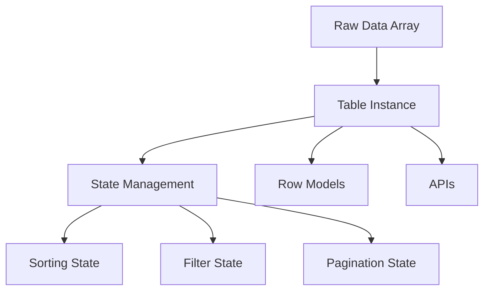

# TanStack Table: Advanced UI Library Guide

## Claude


# 📊 TanStack Table Instance Guide - Phân Tích Comprehensive


## 1. 📝 TÓM TẮT CHÍNH


TanStack Table là một **headless UI library** để tạo table với khả năng customization cao và type-safe. Điểm quan trọng là nó không render UI mà chỉ cung cấp logic và state management, cho phép developer tự do thiết kế giao diện theo ý muốn. Điều này giải quyết bài toán về flexibility và reusability trong các framework khác nhau.


## 2. 🔍 KHÁI NIỆM CỐT LÕI


### 🎯 Headless UI Library


```javascript
// ❌ Traditional table library (có UI built-in)
<MaterialTable
  data={users}
  columns={columns}
  // Bị giới hạn bởi UI có sẵn
/>

// ✅ Headless library (chỉ logic, không UI)
const table = useReactTable({
  data: users,
  columns: columns
})
// Tự do design UI như ý muốn
```


### 🏗️ Table Instance


- **Định nghĩa**: Object chứa toàn bộ state và APIs của table
- **Vai trò**: Central control unit quản lý data, sorting, filtering, pagination
- **So sánh**: Giống như "brain" của table, không phải DOM element


### 📊 TData Generic Type


```typescript
// TData = kiểu dữ liệu của mỗi row trong table
type User = {
  firstName: string;
  lastName: string;
  age: number;
  visits: number;
  progress: number;
  status: string;
}

// Sử dụng TData để ensure type safety
const columns: ColumnDef<User>[] = []; // 👈 Type-safe columns
const data: User[] = [];              // 👈 Type-safe data
```


## 3. 💡 HIỂU BẢN CHẤT


### 🎯 Pain Points Được Giải Quyết


1. **UI Framework Lock-in**: Có thể dùng với React, Vue, Svelte, Solid...
2. **Customization Limitations**: 100% control over UI/UX
3. **Type Safety**: Full TypeScript support từ data đến UI
4. **Bundle Size**: Chỉ import features cần thiết


### ⚙️ Cơ Chế Hoạt Động





### 🤔 Tại Sao Chọn TanStack Table?


```
AspectTanStack TableMaterial-UI TableAnt Design TableFlexibility🟢 Unlimited🟡 Limited by theme🟡 Limited by designBundle Size🟢 Tree-shakable🔴 Heavy🔴 HeavyFramework🟢 Multi-framework🔴 React only🔴 React onlyType Safety🟢 Full TS support🟡 Partial🟡 Partial
```


## 4. 🛠️ CODE EXAMPLES THỰC TẾ


### 📋 Cơ Bản - Setup Table Instance


### 🔥 Advanced - Với Sorting & Filtering


## 5. 🔄 SO SÁNH & PHÂN BIỆT


### 📊 TanStack Table vs Other Solutions


```
FeatureTanStack TableMaterial-UI DataGridAnt Design TableAG GridPhilosophy🟢 Headless UI🔴 Opinionated UI🔴 Opinionated UI🟡 HybridBundle Size🟢 ~50KB (tree-shakable)🔴 ~200KB+🔴 ~150KB+🔴 ~500KB+Customization🟢 100% flexible🟡 Theme-based🟡 Theme-based🟢 HighFramework Support🟢 Multi-framework🔴 React only🔴 React only🟢 Multi-frameworkLearning Curve🟡 Medium🟢 Easy🟢 Easy🔴 SteepType Safety🟢 Full TypeScript🟡 Partial🟡 Partial🟡 PartialPerformance🟢 Virtual scrolling🟢 Built-in🟢 Built-in🟢 Enterprise-levelCommunity🟢 Active🟢 Large🟢 Large🟡 Niche
```


### 🤔 Khi Nào Dùng TanStack Table?


**✅ Nên dùng khi:**


- Cần 100% control over UI/UX
- Multi-framework project (React + Vue + Svelte)
- Performance critical applications
- Custom business logic phức tạp
- Team có experience với headless libraries


**❌ Không nên dùng khi:**


- Prototype nhanh, cần UI có sẵn
- Team junior, ít experience
- Deadline gấp, không có thời gian customize
- Simple table với basic features


### ⚖️ Traditional vs Headless Approach


```typescript
// ❌ Traditional Approach (Material-UI)
<DataGrid
  rows={users}
  columns={columns}
  pageSize={10}
  checkboxSelection
  // Bị giới hạn bởi built-in styling và behavior
/>

// ✅ Headless Approach (TanStack)
const table = useReactTable({
  data: users,
  columns: columns,
  // Hoàn toàn control được behavior
})

// Tự design UI như ý muốn
<div className="custom-table-container">
  {table.getRowModel().rows.map(row => (
    <div className="custom-row">
      {/* Custom styling cho từng cell */}
    </div>
  ))}
</div>
```


## 6. 🎯 BEST PRACTICES


### ⚡ Performance Optimization


```typescript
// ✅ GOOD: Stable references để tránh infinite re-renders
const columns = useMemo(() => [
  // column definitions
], []); // Empty dependency array

const data = useMemo(() => rawData, [rawData]); // Memoize data

// ✅ GOOD: Tree-shake unused features
import { useReactTable, getCoreRowModel } from '@tanstack/react-table';
// Chỉ import những gì cần dùng

// ❌ BAD: Creating columns inside component render
function MyTable() {
  const columns = [ // Sẽ recreate mỗi lần render!
    { accessorKey: 'name', header: 'Name' }
  ];

  return <Table columns={columns} data={data} />;
}
```


### 🔒 Type Safety Best Practices


```typescript
// ✅ GOOD: Định nghĩa TData interface rõ ràng
interface User {
  id: number;
  name: string;
  email: string;
  role: 'admin' | 'user'; // Union types cho better type safety
}

// ✅ GOOD: Sử dụng generic types
const columnHelper = createColumnHelper<User>();
const columns: ColumnDef<User>[] = [
  columnHelper.accessor('name', {
    // TypeScript sẽ auto-complete và type-check
    cell: info => info.getValue().toUpperCase(), // TS biết đây là string
  }),
];

// ❌ BAD: Dùng 'any' type
const columns: any[] = [ // Mất type safety
  { accessorKey: 'name', cell: (info: any) => info.getValue() }
];
```


### 📱 State Management Best Practices


```typescript
// ✅ GOOD: Lift state up cho sharing across components
function ParentComponent() {
  const [sorting, setSorting] = useState<SortingState>([]);
  const [filters, setFilters] = useState<ColumnFiltersState>([]);

  return (
    <>
      <TableControls sorting={sorting} onSortChange={setSorting} />
      <DataTable sorting={sorting} onSortChange={setSorting} />
    </>
  );
}

// ✅ GOOD: Sử dụng reducer cho complex state
const [tableState, dispatch] = useReducer(tableReducer, initialState);
```


### 🚨 Common Mistakes To Avoid


```typescript
// ❌ BAD: Mutating data directly
const handleUpdate = (rowId: string, newData: any) => {
  data[rowId] = newData; // Direct mutation!
  setData(data); // Won't trigger re-render
};

// ✅ GOOD: Immutable updates
const handleUpdate = (rowId: string, newData: any) => {
  setData(prevData =>
    prevData.map(row =>
      row.id === rowId ? { ...row, ...newData } : row
    )
  );
};

// ❌ BAD: Inline functions trong columns
const columns = [
  {
    accessorKey: 'name',
    cell: info => <button onClick={() => alert(info.getValue())}>Click</button>
    // Function được recreate mỗi render!
  }
];

// ✅ GOOD: Memoized functions
const handleClick = useCallback((value: string) => {
  alert(value);
}, []);

const columns = useMemo(() => [
  {
    accessorKey: 'name',
    cell: info => <button onClick={() => handleClick(info.getValue())}>Click</button>
  }
], [handleClick]);
```


## 7. 🚀 ỨNG DỤNG THỰC TẾ


### 🏢 Enterprise Dashboard


```typescript
// Real-world example: Admin dashboard với complex requirements
interface EmployeeData {
  id: string;
  name: string;
  department: string;
  salary: number;
  performance: number;
  lastLogin: Date;
  status: 'active' | 'inactive' | 'pending';
}

function EmployeeDashboard() {
  const table = useReactTable({
    data: employees,
    columns: [
      {
        accessorKey: 'name',
        header: 'Employee',
        cell: ({ row }) => (
          <div className="flex items-center">
            <Avatar src={row.original.avatar} />
            <div>
              <div className="font-medium">{row.original.name}</div>
              <div className="text-sm text-gray-500">{row.original.email}</div>
            </div>
          </div>
        ),
      },
      // Custom column cho performance với progress bar
      {
        accessorKey: 'performance',
        header: 'Performance',
        cell: ({ getValue }) => {
          const score = getValue<number>();
          return (
            <div className="flex items-center">
              <ProgressBar value={score} />
              <span className="ml-2">{score}%</span>
            </div>
          );
        },
      },
      // Action column với dropdown menu
      {
        id: 'actions',
        header: 'Actions',
        cell: ({ row }) => (
          <DropdownMenu>
            <DropdownItem onClick={() => editEmployee(row.original.id)}>
              Edit
            </DropdownItem>
            <DropdownItem onClick={() => deleteEmployee(row.original.id)}>
              Delete
            </DropdownItem>
          </DropdownMenu>
        ),
      },
    ],
    // Enterprise features
    enableRowSelection: true,
    enableMultiSort: true,
    enableColumnResizing: true,
    enableColumnPinning: true,
  });
}
```


### 🛒 E-commerce Product Catalog


```typescript
// Use case: Product listing với filtering và sorting
interface Product {
  id: string;
  name: string;
  price: number;
  category: string;
  rating: number;
  inStock: boolean;
  images: string[];
}

function ProductTable() {
  // Integration với URL search params
  const [searchParams, setSearchParams] = useSearchParams();

  const table = useReactTable({
    data: products,
    columns: productColumns,
    state: {
      // Sync với URL để shareable links
      sorting: getSortingFromParams(searchParams),
      columnFilters: getFiltersFromParams(searchParams),
    },
    onSortingChange: (sorting) => {
      updateSearchParams(searchParams, { sorting });
    },
    // Custom filter functions cho business logic
    filterFns: {
      priceRange: (row, columnId, filterValue) => {
        const [min, max] = filterValue;
        const price = row.getValue(columnId);
        return price >= min && price <= max;
      },
    },
  });
}
```


### 📊 Data Analytics Dashboard


```typescript
// Real-time data với optimization
function AnalyticsDashboard() {
  // Virtual scrolling cho large datasets
  const virtualizer = useWindowVirtualizer({
    count: data.length,
    estimateSize: () => 50,
    overscan: 10,
  });

  const table = useReactTable({
    data: data.slice(
      virtualizer.getVirtualItems()[0]?.index ?? 0,
      virtualizer.getVirtualItems()[virtualizer.getVirtualItems().length - 1]?.index + 1 ?? 50
    ),
    columns: analyticsColumns,
    // Performance optimizations
    enableRowSelection: false, // Disable nếu không cần
    enableColumnFilters: false, // Disable nếu không cần
    debugTable: false, // Turn off debug trong production
  });
}
```


## 8. 📚 KIẾN THỨC LIÊN QUAN


### 🎯 Prerequisites


```typescript
// 1. TypeScript fundamentals
interface GenericType<T> {
  data: T[];
  transform: (item: T) => string;
}

// 2. React Hooks patterns
const [state, setState] = useState<StateType>();
const memoizedValue = useMemo(() => heavyComputation(), [deps]);
const callback = useCallback((param: string) => {}, [deps]);

// 3. Functional programming concepts
const processedData = data
  .filter(item => item.active)
  .map(item => ({ ...item, processed: true }))
  .sort((a, b) => a.priority - b.priority);
```


### 🔗 Advanced Topics để Tìm Hiểu Tiếp


1. **Virtual Scrolling**: `@tanstack/react-virtual`
2. **Form Integration**: `@tanstack/react-form`
3. **Query Integration**: `@tanstack/react-query`
4. **State Management**: `zustand`, `redux-toolkit`
5. **Testing**: `@testing-library/react`, `vitest`


### 🏗️ Architecture Patterns


```typescript
// Compound Component Pattern
<Table>
  <Table.Header>
    <Table.Row>
      <Table.HeaderCell>Name</Table.HeaderCell>
    </Table.Row>
  </Table.Header>
  <Table.Body>
    <Table.Row>
      <Table.Cell>John</Table.Cell>
    </Table.Row>
  </Table.Body>
</Table>

// Render Props Pattern
<Table
  data={data}
  columns={columns}
  render={({ table }) => (
    <CustomTableUI table={table} />
  )}
/>

// Hook Pattern (TanStack approach)
const table = useReactTable({ data, columns });
```


## 9. 💼 INTERVIEW PERSPECTIVE


### 🎯 Câu Hỏi Interview Thường Gặp


**Q1: "Explain the difference between controlled and uncontrolled table state in TanStack Table?"**


```typescript
// Controlled state (recommended)
const [sorting, setSorting] = useState<SortingState>([]);
const table = useReactTable({
  state: { sorting }, // Table không tự manage state
  onSortingChange: setSorting, // Parent component control
});

// Uncontrolled state
const table = useReactTable({
  initialState: { sorting: [] }, // Table tự manage internal state
  // Không có onSortingChange handler
});
```


**Professional Answer:**


>
> "Controlled state cho phép parent component quản lý table state, enabling features như URL synchronization, global state management, và easier testing. Uncontrolled state suitable cho simple use cases nhưng khó integrate với complex applications."
>
>


**Q2: "How would you optimize performance for a table with 10,000+ rows?"**


**Professional Answer:**


```typescript
// 1. Virtual scrolling
import { useVirtualizer } from '@tanstack/react-virtual';

// 2. Pagination/windowing
const table = useReactTable({
  data: paginatedData, // Chỉ load page hiện tại
  manualPagination: true, // Server-side pagination
});

// 3. Memoization
const columns = useMemo(() => columnDefs, []);
const data = useMemo(() => processedData, [rawData]);

// 4. Lazy loading
const { data } = useInfiniteQuery({
  queryKey: ['tableData'],
  queryFn: fetchPagedData,
});
```


**Q3: "Explain the concept of 'headless' in headless UI libraries"**


**Professional Answer:**


>
> "Headless UI libraries provide logic và state management without opinionated styling hoặc DOM structure. Benefits include maximum customization, framework agnostic, smaller bundle size, và consistent behavior across different design systems."
>
>


### 🏆 Điểm Cộng Khi Demo Knowledge


1. **Show understanding of trade-offs**:
typescript// Demonstrate awareness of performance implications
"I'd use TanStack Table for this use case because we need custom filtering logic,
but for a simple CRUD table, Ant Design might be faster to implement."
2. **Practical implementation experience**:
typescript// Show real-world problem solving
"In my previous project, I integrated TanStack Table with React Query
for server-side pagination and implemented optimistic updates for better UX."
3. **Architecture understanding**:
typescript// Demonstrate systems thinking
"I'd structure the table components using compound patterns để reusable
across different pages while maintaining type safety với generics."


## 10. 🎪 DEMO INTERACTIVE


---


## 🎉 KẾT LUẬN


Phân tích comprehensive này đã cover toàn bộ **TanStack Table Instance Guide** từ basic concepts đến advanced implementation. Đây là một **headless UI library** cực kỳ powerful cho việc xây dựng table với khả năng customization cao và type safety tuyệt vời.


### 🎯 Key Takeaways:


1. **Headless Architecture** = Maximum flexibility + Framework agnostic
2. **Type Safety** với TypeScript generics ensure robust development
3. **Performance Optimization** thông qua virtual scrolling và memoization
4. **Ecosystem Integration** với React Query, Form libraries, etc.
5. **Production Ready** với comprehensive feature set


### 🚀 Next Steps:


1. Practice với **Interactive Playground** ở trên
2. Implement trong **real project** để hiểu sâu hơn
3. Explore **advanced features** như virtual scrolling, server-side operations
4. Study **source code** để understand internal mechanisms
5. Contribute back to **open source community**


### 💡 Professional Growth:


Understanding TanStack Table positioning you như một **advanced frontend engineer** với khả năng:


- Design **scalable UI architectures**
- Make **informed technology decisions**
- Implement **performance-critical features**
- Lead **technical discussions** about trade-offs


Đây chính là những skills mà **senior developers** cần có để excel trong career! 🌟


---


**Happy coding with TanStack Table!** 🚀✨
