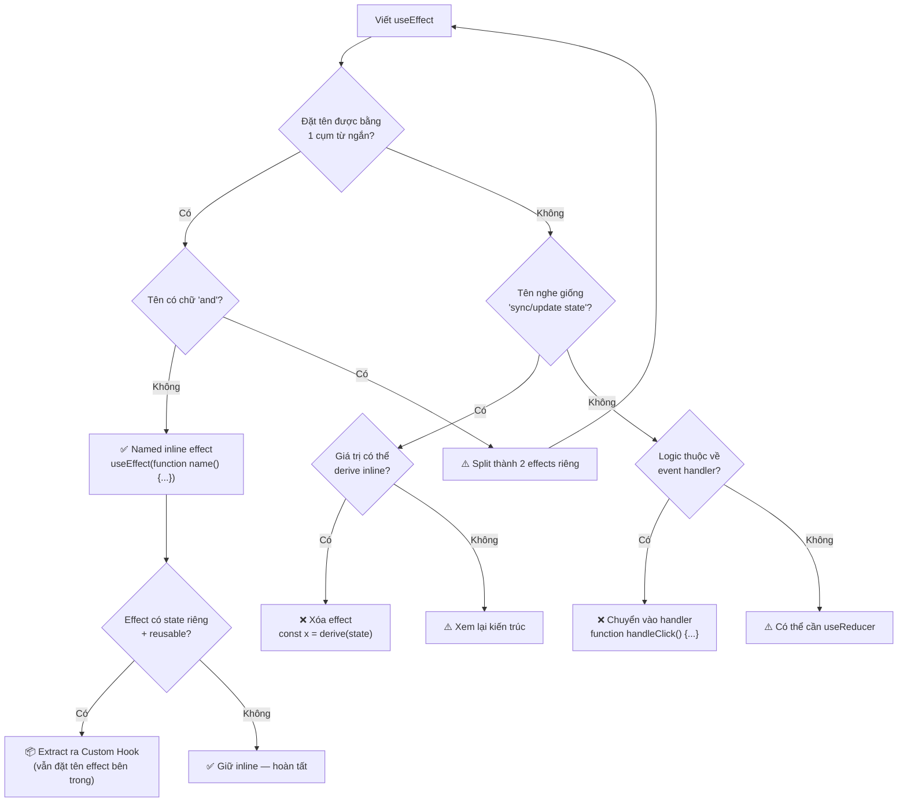
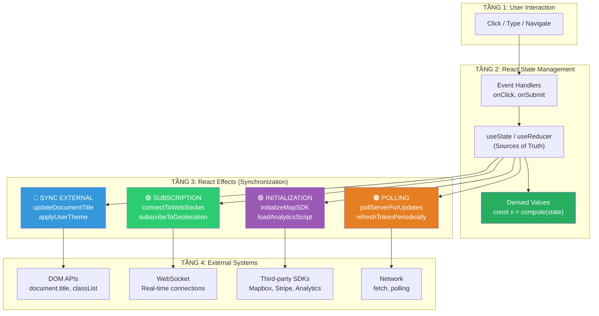
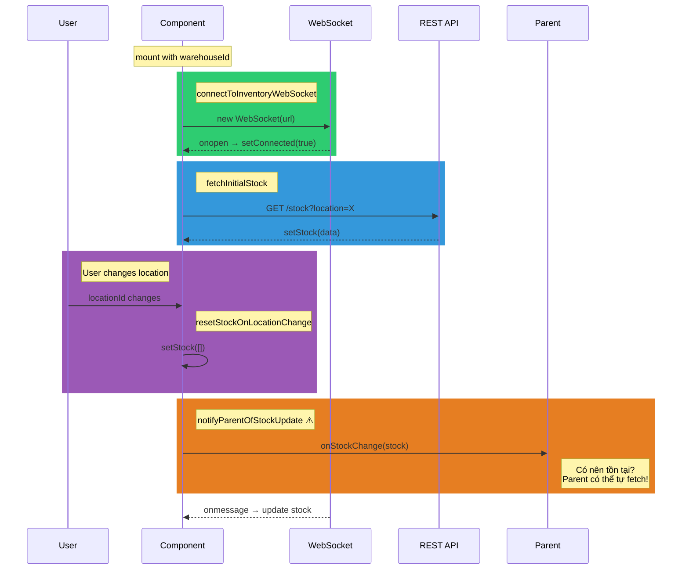
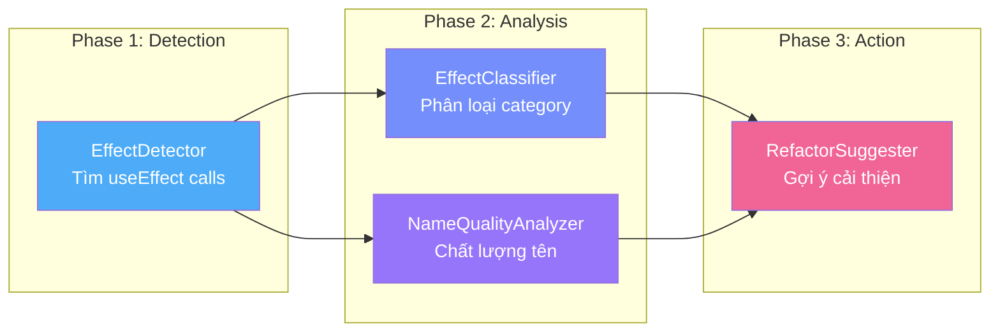
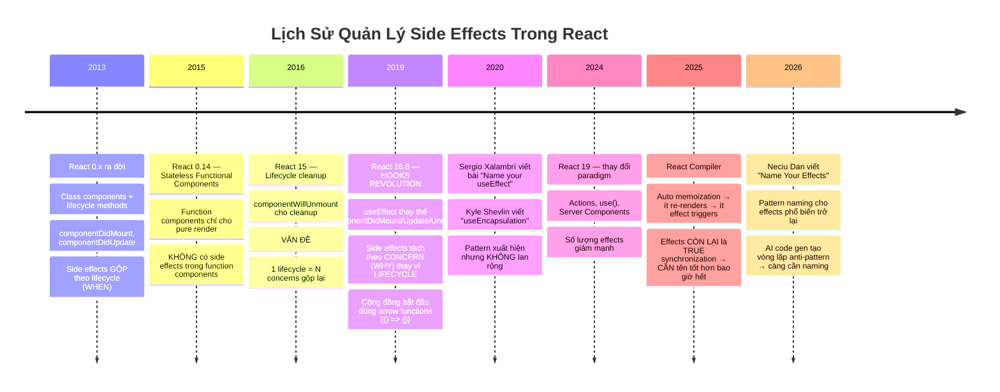
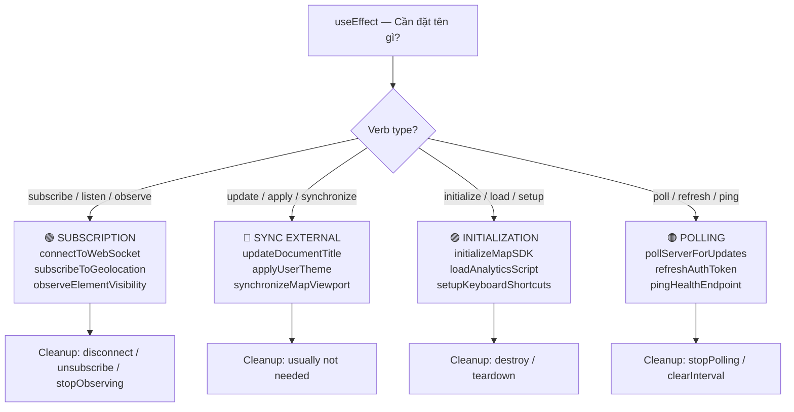

# Name Your Effects — Hướng Dẫn Đặt Tên Cho useEffect

> **Nguồn gốc**: [Start naming your useEffect functions, you will thank me later](https://neciudan.dev/name-your-effects) — Neciu Dan
> **Ngôn ngữ**: Tiếng Việt — phân tích chuyên sâu theo 6 Pattern tư duy
> **Phương pháp**: 5 Whys · First Principles · Trade-off Analysis · Mental Mapping · Reverse Engineering · Contextual History
> **Đối tượng**: React Developer muốn hiểu **tận gốc** tại sao việc đặt tên cho useEffect lại cải thiện triệt để chất lượng code

---

## 📋 Mục Lục Tổng Quan

| # | Phần | Pattern Áp Dụng |
|---|------|-----------------|
| I | [Đệ Quy "Tại Sao" — Truy Vết Đến Cốt Lõi](#phần-i--đệ-quy-tại-sao--5-whys) | 5 Whys |
| II | [Tư Duy Nguyên Bản — Phân Rã Thành Sự Thật Cơ Bản](#phần-ii--tư-duy-nguyên-bản--first-principles) | First Principles |
| III | [Phân Tích Đánh Đổi — Cái Giá Phải Trả](#phần-iii--phân-tích-đánh-đổi--trade-off-analysis) | Trade-off Analysis |
| IV | [Lược Đồ Tinh Thần — Bản Đồ Kiến Thức](#phần-iv--lược-đồ-tinh-thần--mental-mapping) | Mental Mapping |
| V | [Thực Thi Lại — Tự Tay Xây Dựng](#phần-v--thực-thi-lại--reverse-engineering) | Reverse Engineering |
| VI | [Lịch Sử & Sự Tiến Hóa](#phần-vi--lịch-sử--sự-tiến-hóa--contextual-history) | Contextual History |
| VII | [Tổng Hợp & Checklist](#phần-vii--tổng-hợp--checklist-cuối-cùng) | Consolidation |

---

# PHẦN I — Đệ Quy "Tại Sao" (5 Whys)

> *Kỹ thuật kinh điển Toyota: hỏi "Tại sao" ít nhất 5 lần để chạm đến nguyên lý cốt lõi.*

## 1.1. Chuỗi "Tại Sao" #1: Tại sao nên đặt tên cho hàm trong useEffect?

```
Tầng 1: "Tại sao nên đặt tên cho hàm trong useEffect?"
    │
    ▼
Trả lời: Vì useEffect(() => { ... }) KHÔNG NÓI GÌ về mục đích.
         Nó chỉ nói "CÁI GÌ ĐÓ chạy SAU render" — nhưng KHÔNG nói CÁI GÌ
         và TẠI SAO.
    │
    ▼
Tầng 2: "Tại sao việc không biết mục đích lại là vấn đề?"
    │
    ▼
Trả lời: Vì mỗi lần mở component, developer phải ĐỌC TOÀN BỘ implementation
         của effect để hiểu nó làm gì. Với 4-5 effects, đó là 4-5 lần
         "biên dịch trong đầu" (mental compilation).
         
         ┌─────────────────────────────────────────────────────────┐
         │  Component 200 dòng, 4 useEffect:                      │
         │                                                         │
         │  useEffect(() => {          ← CÁI NÀY LÀM GÌ?        │
         │    ... 15 dòng code ...      → Phải đọc 15 dòng       │
         │  }, [warehouseId])                                      │
         │                                                         │
         │  useEffect(() => {          ← CÁI NÀY LÀM GÌ?        │
         │    ... 8 dòng code ...       → Phải đọc 8 dòng        │
         │  }, [connected])                                        │
         │                                                         │
         │  useEffect(() => {          ← CÁI NÀY LÀM GÌ?        │
         │    ... 5 dòng code ...       → Phải đọc 5 dòng        │
         │  }, [locationId])                                       │
         │                                                         │
         │  useEffect(() => {          ← CÁI NÀY LÀM GÌ?        │
         │    ... 4 dòng code ...       → Phải đọc 4 dòng        │
         │  }, [stock])                                            │
         │                                                         │
         │  TỔNG: 32 dòng code phải đọc chỉ để HIỂU ý đồ        │
         └─────────────────────────────────────────────────────────┘
    │
    ▼
Tầng 3: "Tại sao developer phải biên dịch trong đầu từng effect?"
    │
    ▼
Trả lời: Vì anonymous arrow function KHÔNG MANG NGỮ NGHĨA.
         
         () => { ... }  ← đây là AI? Là logic? Là gì?
         
         JavaScript engine cũng gặp vấn đề tương tự:
         - Stack trace hiện: "at (anonymous) @ Component.tsx:14"
         - React DevTools hiện: "anonymous"
         - Sentry error report: không biết effect NÀO crash
         
         → Thông tin bị MẤT ở CẢ developer level VÀ tooling level.
    │
    ▼
Tầng 4: "Tại sao JavaScript cho phép anonymous function ngay từ đầu?"
    │
    ▼
Trả lời: Vì thiết kế ngôn ngữ ưu tiên FLEXIBILITY (linh hoạt).
         JavaScript hỗ trợ first-class functions — function là VALUE:
         
         const x = () => {}               // anonymous arrow
         const y = function() {}            // anonymous expression
         const z = function myName() {}      // NAMED expression ← ĐÂY!
         
         Named function expressions tồn tại từ ES3 (1999!) nhưng KHÔNG AI DÙNG
         vì community đã INTERNALIZE cách viết arrow function.
         
         → Đây là vấn đề CONVENTION (quy ước), không phải LANGUAGE LIMITATION.
    │
    ▼
Tầng 5: "Tại sao convention lại thiên về anonymous?"
    │
    ▼
Trả lời: Vì LỊCH SỬ + ĐÀO TẠO.
         
         1. React docs dùng () => {} trong TẤT CẢ ví dụ
         2. Tutorials copy từ docs
         3. AI models train trên tutorials
         4. Developers copy từ AI
         
         → VÒNG PHẢN HỒI TỰ CỦNG CỐ:
         
         Docs → Tutorials → AI Training → AI Output → New Code → AI Training
              ↑                                                           │
              └───────────── Anonymous pattern truyền tiếp ──────────────┘
         
         "Defaults are hard to escape" — Neciu Dan
```

**🎯 Kết luận Chuỗi #1**: Việc dùng anonymous function trong useEffect là vấn đề **convention**, không phải language limitation. Named function expressions đã tồn tại từ ES3 (1999) nhưng bị bỏ quên bởi vòng phản hồi docs → tutorials → AI.

---

## 1.2. Chuỗi "Tại Sao" #2: Tại sao khó đặt tên effect = dấu hiệu code smell?

```
Tầng 1: "Tại sao có những effect khó đặt tên?"
    │
    ▼
Trả lời: Vì chúng đang làm NHIỀU HƠN MỘT VIỆC.
         Khi bạn phải đặt tên "syncWidthAndApplyTheme" — chữ "and" là
         DẤU HIỆU CẢNH BÁO rằng effect vi phạm Single Responsibility.
    │
    ▼
Tầng 2: "Tại sao effect lại hay bị gộp nhiều việc?"
    │
    ▼
Trả lời: Vì di sản từ CLASS COMPONENT era.
         componentDidMount chỉ có MỘT — mọi initialization phải nhét vào đó.
         Khi chuyển sang hooks, developer GIỮ thói quen "gom hết vào 1 chỗ".
         
         Class:     componentDidMount() { initA(); initB(); initC(); }
         Hooks:     useEffect(() => { initA(); initB(); initC(); }, [])
                    ↑ CÙNG MINDSET, KHÁC SYNTAX
    │
    ▼
Tầng 3: "Tại sao gộp nhiều việc vào 1 effect lại xấu?"
    │
    ▼
Trả lời: Vì dependency array bị NHIỄU.
         
         ┌────────────────────────────────────────────────────────┐
         │  useEffect(() => {                                     │
         │    // Việc 1: Track window width                       │
         │    window.addEventListener('resize', handler)           │
         │                                                        │
         │    // Việc 2: Apply theme                               │
         │    document.body.className = theme                     │
         │                                                        │
         │    return () => window.removeEventListener(...)          │
         │  }, [theme])  ← DEPENDENCIES BỊ TRỘN!                  │
         │                                                        │
         │  VẤN ĐỀ:                                              │
         │  • Khi theme đổi → addEventListener chạy LẠI → THỪA!  │
         │  • resize listener KHÔNG phụ thuộc theme               │
         │  • Nhưng vì gộp chung → chạy lại CẢ HAI               │
         └────────────────────────────────────────────────────────┘
    │
    ▼
Tầng 4: "Tại sao dependency trộn lẫn lại gây overhead?"
    │
    ▼
Trả lời: Vì React chạy LẠI TOÀN BỘ effect khi BẤT KỲ dependency nào
         thay đổi — không thể chạy "một phần" effect.
         
         Effect = ATOMIC UNIT: chạy TẤT CẢ hoặc KHÔNG chạy.
         
         → Cleanup function cũng chạy lại → removeEventListener + addEventListener
         → GC phải dọn closure cũ, tạo closure mới
         → Nhiều effect phụ → nhiều re-subscribe → performance hit
    │
    ▼
Tầng 5: "Suy ra nguyên lý gì?"
    │
    ▼
Trả lời: NGUYÊN LÝ CỐT LÕI:
         
         ╔═══════════════════════════════════════════════════════╗
         ║  "Nếu bạn không thể đặt tên effect                  ║
         ║   bằng MỘT CỤM TỪ NGẮN GỌN,                       ║
         ║   code đó KHÔNG THUỘC VỀ effect."                    ║
         ║                                                       ║
         ║  → Khó đặt tên = quá nhiều trách nhiệm (split it)   ║
         ║  → Tên nghe như "state shuffling" = không nên là      ║
         ║    effect (derive it / move to event handler)          ║
         ╚═══════════════════════════════════════════════════════╝
```

**🎯 Kết luận Chuỗi #2**: Đặt tên không chỉ giúp ĐỌC code — nó là **công cụ phát hiện code smell**. Chữ "and" trong tên = quá nhiều trách nhiệm. Tên mơ hồ = không nên là effect.

---

## 1.3. Chuỗi "Tại Sao" #3: Tại sao có effect KHÔNG NÊN TỒN TẠI?

```
Tầng 1: "Tại sao lại có effect không nên tồn tại?"
    │
    ▼
Trả lời: Vì developer nhầm lẫn giữa SYNCHRONIZATION (đồng bộ với
         hệ thống bên ngoài) và DERIVATION (tính toán từ state).
    │
    ▼
Tầng 2: "Tại sao nhầm lẫn?"
    │
    ▼
Trả lời: Vì useEffect CHO PHÉP làm bất cứ điều gì — nó không phân biệt
         "đồng bộ DOM title" vs. "tính fullName từ firstName + lastName".
         
         ┌───────────────────────────────────────────────────┐
         │  ĐÚNG — Synchronization:                          │
         │  useEffect(function updateDocumentTitle() {       │
         │    document.title = count + ' items'              │
         │  }, [count])                                      │
         │  → document.title là EXTERNAL SYSTEM (DOM API)    │
         │  → React KHÔNG quản lý → CẦN effect              │
         │                                                   │
         │  SAI — Derivation dùng effect:                    │
         │  useEffect(function syncFullName() {              │
         │    setFullName(firstName + ' ' + lastName)        │
         │  }, [firstName, lastName])                        │
         │  → fullName là DERIVED VALUE (tính từ state)      │
         │  → React QUẢN LÝ state → KHÔNG CẦN effect        │
         │  → Chỉ cần: const fullName = firstName + ' '...  │
         └───────────────────────────────────────────────────┘
    │
    ▼
Tầng 3: "Tại sao derivation qua effect lại xấu hơn inline?"
    │
    ▼
Trả lời: Vì effect tạo EXTRA RENDER CYCLE.

         ┌───────────────────────────────────────────────────────┐
         │  TIMELINE — Effect Derivation (XẤU):                  │
         │                                                       │
         │  Render 1: firstName="John", fullName=""   ← SAI!    │
         │      ↓ commit to DOM (hiện fullName trống 1 frame)    │
         │      ↓ useEffect chạy                                 │
         │      ↓ setFullName("John Doe")                        │
         │  Render 2: firstName="John", fullName="John Doe" ✓   │
         │      ↓ commit to DOM (hiện đúng)                      │
         │                                                       │
         │  → 2 renders, 2 DOM commits, 1 frame flicker ⚡       │
         ├───────────────────────────────────────────────────────┤
         │  TIMELINE — Inline Derivation (TỐT):                 │
         │                                                       │
         │  Render 1: const fullName = "John" + " " + "Doe"     │
         │      ↓ commit to DOM (hiện đúng NGAY)                 │
         │                                                       │
         │  → 1 render, 1 DOM commit, 0 flicker ✓               │
         └───────────────────────────────────────────────────────┘
    │
    ▼
Tầng 4: "Tại sao React chạy effect SAU render?"
    │
    ▼
Trả lời: Vì effects KHÔNG CHẶN paint.
         React cố ý chạy useEffect SAU khi browser đã paint:
         
         Render → Commit DOM → Paint (user thấy) → useEffect runs
         
         Nếu effect setState → trigger THÊM 1 cycle:
         Re-render → Re-commit → Re-paint
         
         → User THẤY trạng thái trung gian (stale value) trong 1 frame
         → Đây là GIỚI HẠN KIẾN TRÚC của useEffect, không phải bug
    │
    ▼
Tầng 5: "Cách nhận biết effect không nên tồn tại?"
    │
    ▼
Trả lời: DÙNG BÀI KIỂM TRA ĐẶT TÊN:
         
         ┌───────────────────────────────────────────────────────┐
         │  TÊN EFFECT                    │  NÊN TỒN TẠI?      │
         │  ─────────────────────────────┼────────────────────  │
         │  connectToWebSocket           │  ✅ CÓ (external)   │
         │  initializeMapInstance        │  ✅ CÓ (external)   │
         │  subscribeToGeolocation       │  ✅ CÓ (external)   │
         │  updateDocumentTitle          │  ✅ CÓ (DOM API)    │
         │  pollServerForUpdates         │  ✅ CÓ (network)    │
         │  ─────────────────────────────┼────────────────────  │
         │  syncFullName                 │  ❌ KHÔNG (derive)   │
         │  updateStateBasedOnOtherState │  ❌ KHÔNG (derive)   │
         │  resetFormOnSubmit            │  ❌ KHÔNG (handler)  │
         │  notifyParentOfStockUpdate    │  ⚠️ NGHI VẤN (*)   │
         │                               │                      │
         │  (*) Parent có thể tự fetch, hoặc gọi callback      │
         │      tại nguồn (WebSocket handler / fetch .then)     │
         └───────────────────────────────────────────────────────┘
         
         QUY TẮC ĐỘNG TỪ:
         • subscribe, listen     → Event-based effect      ✅
         • synchronize, apply    → External sync effect    ✅
         • initialize            → One-time setup effect   ✅
         • sync[State]           → Derived value           ❌
         • update[State]Based... → State shuffling         ❌
         • reset[State]On...     → Event handler logic     ❌
```

**🎯 Kết luận Chuỗi #3**: Đặt tên là **bài kiểm tra litmus** cho effect. Tên rõ ràng với động từ mạnh (subscribe, initialize, connect) = effect hợp lệ. Tên mơ hồ (sync, update state) = code KHÔNG thuộc về effect.

---

# PHẦN II — Tư Duy Nguyên Bản (First Principles)

> *Phân rã "Name Your Effects" thành các sự thật cơ bản nhất: Data Structures, Algorithms, Hardware.*

## 2.1. JavaScript Function — Named vs. Anonymous Ở Mức Engine

### 2.1.1. Cấu Trúc Dữ Liệu: Function Object Trong V8

```
JavaScript function thực chất là OBJECT trên Heap:

┌──────────────────────────────────────────────────────────────┐
│                                                              │
│  1. Anonymous Arrow:  () => { ... }                          │
│  ┌────────────────────────────────────────────────────────┐  │
│  │  Function Object on Heap:                              │  │
│  │  ┌─────────────────────────────────────────────────┐   │  │
│  │  │  [[FunctionKind]]: "Arrow"                      │   │  │
│  │  │  [[Code]]:         <bytecode pointer>            │   │  │
│  │  │  [[Environment]]:  <closure scope chain>         │   │  │
│  │  │  name:             ""          ← TRỐNG!         │   │  │
│  │  │  length:           0                             │   │  │
│  │  └─────────────────────────────────────────────────┘   │  │
│  │                                                        │  │
│  │  Stack trace khi throw Error:                          │  │
│  │  → "at (anonymous) @ Component.tsx:14"                 │  │
│  │    ↑ Engine không biết gọi nó là gì!                   │  │
│  └────────────────────────────────────────────────────────┘  │
│                                                              │
│  2. Named Function Expression:  function myName() { ... }    │
│  ┌────────────────────────────────────────────────────────┐  │
│  │  Function Object on Heap:                              │  │
│  │  ┌─────────────────────────────────────────────────┐   │  │
│  │  │  [[FunctionKind]]: "Normal"                     │   │  │
│  │  │  [[Code]]:         <bytecode pointer>            │   │  │
│  │  │  [[Environment]]:  <closure scope chain>         │   │  │
│  │  │  name:             "myName"    ← CÓ TÊN!       │   │  │
│  │  │  length:           0                             │   │  │
│  │  └─────────────────────────────────────────────────┘   │  │
│  │                                                        │  │
│  │  Stack trace khi throw Error:                          │  │
│  │  → "at myName @ Component.tsx:14"                      │  │
│  │    ↑ Engine BIẾT tên function!                         │  │
│  └────────────────────────────────────────────────────────┘  │
│                                                              │
│  3. CẢ HAI có CÙNG [[Code]] — KHÔNG khác performance!       │
│     Chỉ khác METADATA (property `name` trên Function object) │
│                                                              │
└──────────────────────────────────────────────────────────────┘
```

### 2.1.2. Thuật Toán: Function.name Resolution trong V8

```
V8 engine xác định Function.name theo thuật toán sau:

Bước 1: Kiểm tra named function expression
  function foo() {}  →  foo.name === "foo"    ✓ trực tiếp

Bước 2: Kiểm tra variable assignment (Name Inference)
  const bar = () => {}  →  bar.name === "bar"  ✓ suy luận
  
  NHƯNG: useEffect(() => {}, [...])
         ↑ KHÔNG CÓ assignment — chỉ là argument
         → name === ""  ← TRỐNG!

Bước 3: Tại sao useEffect(fn, deps) không giúp?
  Vì function là ARGUMENT, không phải assignment target:
  
  ┌──────────────────────────────────────────────────────┐
  │  const fn = () => {}     // fn.name = "fn"    (OK)   │
  │  useEffect(fn, [])       // nhưng stack trace        │
  │                          // chỉ hiện "fn", không     │
  │                          // hiện "updateDocTitle"     │
  │                                                      │
  │  useEffect(() => {}, []) // name = ""     (TRỐNG)    │
  │                                                      │
  │  useEffect(function updateDocTitle() {}, [])          │
  │                     ↑ name = "updateDocTitle" (TỐT!)  │
  │                                                      │
  │  → Named Function Expression là CÁCH DUY NHẤT        │
  │    đưa tên có ý nghĩa vào stack trace + DevTools     │
  │    mà KHÔNG cần tách function ra biến riêng.          │
  └──────────────────────────────────────────────────────┘

Độ phức tạp: O(1) — name là property, không cần tìm kiếm.
```

### 2.1.3. Hardware: Named Functions Ảnh Hưởng Gì Đến Runtime?

```
┌──────────────────────────────────────────────────────────────┐
│                  HARDWARE IMPACT ANALYSIS                     │
│                                                              │
│  ┌─ CPU ──────────────────────────────────────────────────┐  │
│  │                                                        │  │
│  │  Anonymous:  function() {}                             │  │
│  │  Named:      function connectWS() {}                   │  │
│  │                                                        │  │
│  │  CPU COST: BẰNG NHAU ≈ 0 (chỉ thêm 1 string pointer) │  │
│  │  → V8 optimize cả hai GIỐNG HỆT NHAU                  │  │
│  │  → JIT compilation KHÔNG phân biệt                     │  │
│  │  → Hidden class layout GIỐNG NHAU                      │  │
│  └────────────────────────────────────────────────────────┘  │
│                                                              │
│  ┌─ RAM ──────────────────────────────────────────────────┐  │
│  │                                                        │  │
│  │  Anonymous: Function object = ~200 bytes               │  │
│  │  Named:     Function object = ~200 bytes + 20 bytes    │  │
│  │             (thêm string "connectToWebSocket")          │  │
│  │                                                        │  │
│  │  CHÊNH LỆCH: ~20 bytes per function = KHÔNG ĐÁNG KỂ   │  │
│  │  → 100 effects × 20 bytes = 2KB = bỏ qua              │  │
│  └────────────────────────────────────────────────────────┘  │
│                                                              │
│  ┌─ DEVELOPER BRAIN (Hardware thật!) ─────────────────────┐  │
│  │                                                        │  │
│  │  Anonymous: Đọc 4 effects × 10 dòng = 40 dòng         │  │
│  │  → 40 dòng × ~5 giây/dòng = ~200 giây ≈ 3.3 phút     │  │
│  │                                                        │  │
│  │  Named:     Đọc 4 tên function = 4 cụm từ             │  │
│  │  → 4 tên × ~1 giây/tên = ~4 giây                      │  │
│  │                                                        │  │
│  │  TIẾT KIỆM: ~196 giây = 50x NHANH HƠN!               │  │
│  │  → Cognitive Load giảm từ O(n) xuống O(1)              │  │
│  │     (n = số dòng, 1 = đọc tên)                         │  │
│  │                                                        │  │
│  │  "Hardware" thật sự cần optimize không phải CPU/RAM    │  │
│  │  mà là BỘ NÃO DEVELOPER — tài nguyên hiếm nhất.       │  │
│  └────────────────────────────────────────────────────────┘  │
│                                                              │
└──────────────────────────────────────────────────────────────┘
```

## 2.2. useEffect Lifecycle — Phân Rã Đến Tận Cùng

```
useEffect KHÔNG PHẢI lifecycle method. Nó là SYNCHRONIZATION PRIMITIVE.

┌──────────────────────────────────────────────────────────────────┐
│                  EFFECT LIFECYCLE — CHI TIẾT                     │
│                                                                  │
│  Component mounts:                                               │
│  ┌──────────────────────────────────────────────────────────┐   │
│  │  1. React gọi Component(props)                    [RENDER]│   │
│  │  2. React commit JSX → DOM                        [COMMIT]│   │
│  │  3. Browser paints                                [PAINT] │   │
│  │  4. React gọi effect callback                     [EFFECT]│   │
│  │     → Đây là lần chạy ĐẦU TIÊN                            │   │
│  │     → Setup function thực thi                              │   │
│  │     → cleanup = null (chưa có return trước đó)            │   │
│  └──────────────────────────────────────────────────────────┘   │
│                                                                  │
│  Dependency changes:                                             │
│  ┌──────────────────────────────────────────────────────────┐   │
│  │  1. React gọi Component(props)            [RE-RENDER]    │   │
│  │  2. React so sánh deps: Object.is(prev, next)            │   │
│  │     → NẾU GIỐNG: skip effect ← KHÔNG chạy                │   │
│  │     → NẾU KHÁC:                                           │   │
│  │       3. Commit changes → DOM                             │   │
│  │       4. Browser paints                                   │   │
│  │       5. React gọi CLEANUP từ lần trước                   │   │
│  │       6. React gọi effect callback MỚI                    │   │
│  └──────────────────────────────────────────────────────────┘   │
│                                                                  │
│  Component unmounts:                                             │
│  ┌──────────────────────────────────────────────────────────┐   │
│  │  1. React gọi CLEANUP từ lần cuối                         │   │
│  │  2. Component bị remove khỏi DOM                          │   │
│  │  3. GC dọn closure + references                           │   │
│  └──────────────────────────────────────────────────────────┘   │
│                                                                  │
│  ĐẶT TÊN GIÚP GÌ Ở ĐÂY?                                       │
│  → Bước 4, 5, 6: Khi crash, stack trace hiện TÊN function      │
│  → DevTools profiling: hiện TÊN thay vì "anonymous"             │
│  → Sentry/DataDog: filter errors theo EFFECT NAME                │
│                                                                  │
└──────────────────────────────────────────────────────────────────┘
```

### 2.2.1. Phân Loại Effect — Taxonomy (Bảng Phân Loại)

| Category | Ví dụ tên | Mục đích | Có cleanup? | Nên tồn tại? |
|----------|-----------|----------|-------------|---------------|
| **Subscription** | `subscribeToGeolocation`, `connectToWebSocket` | Lắng nghe sự kiện từ external | ✅ Bắt buộc | ✅ Luôn |
| **Synchronization** | `updateDocumentTitle`, `applyUserTheme` | Sync React state → external system | ❌ Thường không | ✅ Luôn |
| **Initialization** | `initializeMapSDK`, `loadAnalyticsScript` | One-time setup | ⚠️ Tùy | ✅ Luôn |
| **Polling** | `pollServerForUpdates`, `refreshTokenPeriodically` | Interval-based fetch | ✅ Bắt buộc | ✅ Hợp lý |
| **Derivation** | ~~`syncFullName`~~, ~~`updateTotalPrice`~~ | Tính giá trị từ state | ❌ | ❌ **Sai** |
| **Event Reaction** | ~~`resetFormOnSubmit`~~, ~~`notifyParentOfChange`~~ | Phản ứng sự kiện user | ❌ | ❌ **Sai** |

---

# PHẦN III — Phân Tích Đánh Đổi (Trade-off Analysis)

> *Trong phần mềm, không có "giải pháp hoàn hảo", chỉ có "sự đánh đổi tốt nhất". Luôn hỏi: "Cái giá phải trả là gì?"*

## 3.1. Đánh Đổi #1: Named Function Expression vs. Arrow Function

```
┌──────────────────────────────────────────────────────────────────┐
│        NAMED FUNCTION EXPRESSION vs. ANONYMOUS ARROW            │
│                                                                  │
│  ┌─ Arrow (quy ước hiện tại) ────────────────────────────────┐  │
│  │                                                            │  │
│  │  useEffect(() => {                                         │  │
│  │    document.title = `${count} items`;                      │  │
│  │  }, [count]);                                              │  │
│  │                                                            │  │
│  │  ✅ Ưu điểm:                                              │  │
│  │  • Ngắn gọn hơn          (ít ký tự)                       │  │
│  │  • Quen thuộc            (mọi tutorial dùng)              │  │
│  │  • Không bind `this`     (arrow mượn `this` từ scope cha) │  │
│  │                                                            │  │
│  │  ❌ Nhược điểm:                                            │  │
│  │  • Stack trace: "(anonymous)"                              │  │
│  │  • DevTools: "anonymous"                                   │  │
│  │  • Sentry: không biết effect nào crash                    │  │
│  │  • Code review: phải đọc implementation                   │  │
│  └────────────────────────────────────────────────────────────┘  │
│                                                                  │
│  ┌─ Named Function Expression ───────────────────────────────┐  │
│  │                                                            │  │
│  │  useEffect(function updateDocumentTitle() {                │  │
│  │    document.title = `${count} items`;                      │  │
│  │  }, [count]);                                              │  │
│  │                                                            │  │
│  │  ✅ Ưu điểm:                                              │  │
│  │  • Stack trace: "updateDocumentTitle"                      │  │
│  │  • DevTools profiling: hiện tên rõ ràng                   │  │
│  │  • Sentry: filter theo effect name                        │  │
│  │  • Code review: skim tên = hiểu component                │  │
│  │  • Phát hiện code smell (tên có "and" = split)            │  │
│  │                                                            │  │
│  │  ❌ Nhược điểm:                                            │  │
│  │  • Dài hơn ~20 ký tự                                      │  │
│  │  • Khó quen ban đầu (phá convention)                      │  │
│  │  • `this` khác với arrow (nhưng irrelevant trong hooks)   │  │
│  │  • Cần effort đặt tên hay                                 │  │
│  └────────────────────────────────────────────────────────────┘  │
│                                                                  │
│  KẾT LUẬN:                                                       │
│  Nhược điểm named là SUPERFICIAL (bề mặt — dài hơn, khó quen)  │
│  Ưu điểm named là STRUCTURAL (cấu trúc — debug, review, smell) │
│  → Named thắng ở mọi tiêu chí CÓ ÝÝ NGHĨA THỰC TẾ.             │
│                                                                  │
└──────────────────────────────────────────────────────────────────┘
```

### 3.1.1. Bảng So Sánh Chi Tiết

| Tiêu chí | Anonymous Arrow `() => {}` | Named Expression `function name() {}` |
|-----------|--------------------------|---------------------------------------|
| **Ký tự thêm** | 0 | ~15-25 (tên function) |
| **Stack trace** | `(anonymous) @ file:14` | `connectToWS @ file:14` |
| **React DevTools** | "anonymous" | Hiện tên function |
| **Sentry/Monitoring** | Không filter được | Filter theo effect name |
| **Code review speed** | Phải đọc body | Skim tên = hiểu |
| **Code smell detection** | Không tự động | Tên có "and" = split signal |
| **`this` binding** | Mượn từ scope cha | Có `this` riêng (irrelevant cho hooks) |
| **Performance** | Bằng nhau | Bằng nhau |
| **Bundle size** | Nhỏ hơn ~20 bytes | Lớn hơn ~20 bytes (minifier giữ tên) |

## 3.2. Đánh Đổi #2: Named Inline Effect vs. Custom Hook

```
┌──────────────────────────────────────────────────────────────────┐
│          NAMED INLINE EFFECT vs. CUSTOM HOOK                     │
│                                                                  │
│  Câu hỏi: Khi nào nên giữ effect inline? Khi nào nên           │
│  trích xuất thành custom hook?                                   │
│                                                                  │
│  ┌─ Rule of Thumb (Quy tắc ngón cái) ────────────────────────┐  │
│  │                                                            │  │
│  │  1. Effect quản lý STATE RIÊNG + có thể REUSE              │  │
│  │     → Custom Hook                                          │  │
│  │     → Ví dụ: useWindowWidth(), useGeolocation()            │  │
│  │                                                            │  │
│  │  2. Effect ONE-OFF, không state riêng, dùng 1 lần          │  │
│  │     → Named inline effect                                  │  │
│  │     → Ví dụ: updateDocumentTitle, applyUserTheme           │  │
│  │                                                            │  │
│  │  3. Effect tương tác với THIRD-PARTY SDK phức tạp          │  │
│  │     → Extract LOGIC ra module riêng (unit testable)        │  │
│  │     → Hook chỉ gọi module                                 │  │
│  │                                                            │  │
│  │  QUAN TRỌNG: Dù ở đâu, LUÔN ĐẶT TÊN effect function.    │  │
│  │  Custom hook vẫn có thể có NHIỀU effects bên trong!        │  │
│  └────────────────────────────────────────────────────────────┘  │
│                                                                  │
│  ⚠️ ANTI-PATTERN:                                                │
│  ┌────────────────────────────────────────────────────────────┐  │
│  │  // ĐỪNG tạo hook chỉ để wrap 1 effect đơn giản:         │  │
│  │  function useCloseOnEscapeKeyForThisSpecificModal() {      │  │
│  │    useEffect(function closeModalOnEscape() { ... }, [])    │  │
│  │  }                                                         │  │
│  │                                                            │  │
│  │  → Thêm 1 lớp indirection cho NO BENEFIT                  │  │
│  │  → Premature abstraction                                   │  │
│  │  → Component dài hơn ≠ cần refactor ngay                  │  │
│  └────────────────────────────────────────────────────────────┘  │
│                                                                  │
└──────────────────────────────────────────────────────────────────┘
```

## 3.3. Đánh Đổi #3: Khi Nào Pattern Này THẤT BẠI?

```
⚠️ KỊCH BẢN NAMING THẤT BẠI HOẶC KHÔNG ĐỦ:

1. EFFECT QUÁ ĐƠN GIẢN → tên dài hơn code
   ┌────────────────────────────────────────────────────────┐
   │  useEffect(function updateDocumentTitleOnCountChange() {│
   │    document.title = count;                              │
   │  }, [count]);                                           │
   │                                                         │
   │  → Tên = 7 từ, code = 1 dòng                           │
   │  → CÓ HỮU ÍCH KHÔNG? CÓ — cho stack trace & DevTools  │
   │  → Nhưng NAME ÍT QUAN TRỌNG hơn khi context rõ ràng   │
   └────────────────────────────────────────────────────────┘

2. TEAM KHÔNG ĐỒNG THUẬN → naming inconsistent
   ┌────────────────────────────────────────────────────────┐
   │  Dev A:  useEffect(function connectWS() { ... })       │
   │  Dev B:  useEffect(function wsConnection() { ... })    │
   │  Dev C:  useEffect(() => { /* WS connect */ ... })     │
   │                                                         │
   │  → Không có convention thống nhất                       │
   │  → GIẢI PHÁP: ESLint rule hoặc team style guide        │
   └────────────────────────────────────────────────────────┘

3. MINIFIER XÓA TÊN → bundle production không thấy tên
   ┌────────────────────────────────────────────────────────┐
   │  Development:  function connectToWebSocket() { ... }   │
   │  Production:   function a() { ... }                    │
   │                                                         │
   │  → Terser/esbuild MẶC ĐỊNH giữ function names         │
   │  → Nhưng aggressive minification CÓ THỂ xóa           │
   │  → Source maps vẫn ánh xạ được → Sentry vẫn OK        │
   └────────────────────────────────────────────────────────┘
```

## 3.4. Decision Framework — Khi Nào Dùng Gì?



---

# PHẦN IV — Lược Đồ Tinh Thần (Mental Mapping)

> *Hiểu sâu = biết vị trí kiến thức trong "bản đồ" tổng thể.*

## 4.1. Bản Đồ: useEffect Trong Hệ Sinh Thái React



**📍 Vị trí của "Name Your Effects"**: Pattern này hoạt động ở **Tầng 3** — nơi React giao tiếp với External Systems. Mỗi effect là 1 "cầu nối" giữa React state và hệ thống bên ngoài. Đặt tên = gắn nhãn cho cầu nối.

## 4.2. Bản Đồ: Effect ĐÚNG vs. Effect SAI

```
┌──────────────────────────────────────────────────────────────────┐
│           BẢN ĐỒ: ĐÂU LÀ EFFECT HỢP LỆ?                       │
│                                                                  │
│  ┌─────────────────────────────────────────────────────────────┐ │
│  │                    REACT WORLD                               │ │
│  │  ┌────────────────────────────────────────────────┐         │ │
│  │  │                                                │         │ │
│  │  │  State:      useState, useReducer              │         │ │
│  │  │  Derived:    const x = f(state)      ← ĐÚNG   │         │ │
│  │  │  Handlers:   onClick, onSubmit       ← ĐÚNG   │         │ │
│  │  │                                                │         │ │
│  │  │  ❌ useEffect để đồng bộ state→state           │         │ │
│  │  │     (syncFullName, updateTotal)                │         │ │
│  │  │     → KHÔNG CẦN effect — derive inline!        │         │ │
│  │  │                                                │         │ │
│  │  │  ❌ useEffect để react user event               │         │ │
│  │  │     (resetFormOnSubmit)                         │         │ │
│  │  │     → KHÔNG CẦN effect — dùng event handler!   │         │ │
│  │  │                                                │         │ │
│  │  └────────────────────┬───────────────────────────┘         │ │
│  │                       │ BIÊN GIỚI                            │ │
│  │                       │ (effect hợp lệ = CẦU NỐI)           │ │
│  │                       ▼                                      │ │
│  │  ┌────────────────────────────────────────────────┐         │ │
│  │  │              EXTERNAL WORLD                     │         │ │
│  │  │                                                │         │ │
│  │  │  ✅ DOM API:    document.title, body.className  │         │ │
│  │  │  ✅ WebSocket:  new WebSocket(url)              │         │ │
│  │  │  ✅ Timer:      setInterval, setTimeout         │         │ │
│  │  │  ✅ Network:    fetch (polling)                  │         │ │
│  │  │  ✅ SDK:        Mapbox, Stripe, GA              │         │ │
│  │  │  ✅ API:        addEventListener                │         │ │
│  │  │                                                │         │ │
│  │  └────────────────────────────────────────────────┘         │ │
│  └─────────────────────────────────────────────────────────────┘ │
│                                                                  │
│  QUY TẮC: Effect CHỈ HỢP LỆ khi nó VƯỢT QUA BIÊN GIỚI         │
│  từ React World sang External World.                             │
│  Nếu cả input VÀ output đều trong React → KHÔNG CẦN effect.    │
│                                                                  │
└──────────────────────────────────────────────────────────────────┘
```

## 4.3. Data Flow Map — Ví Dụ InventorySync



**📍 Nhận xét**: Khi nhìn sequence diagram với TÊN effect, ta thấy NGAY flow logic. Đặc biệt, `notifyParentOfStockUpdate` nổi lên như **candidate cần xem xét** — tên nó "honest" về việc nó làm, và sự honest đó buộc ta phải hỏi: "Parent có thể tự xử lý không?"

---

# PHẦN V — Thực Thi Lại (Reverse Engineering)

> *"What I cannot create, I do not understand." — Richard Feynman*
> *Thay vì chỉ đặt tên effect, hãy tự tay xây dựng công cụ PHÂN TÍCH effect.*

## 5.1. Tự Viết Effect Analyzer — Không Dùng Thư Viện

Dưới đây là bộ công cụ **viết tay hoàn toàn** giúp phân tích, phân loại và refactor useEffect. Mỗi module giải thích cực chi tiết.

```javascript
/**
 * ╔══════════════════════════════════════════════════════════════╗
 * ║      EFFECT ANALYZER — CÔNG CỤ PHÂN TÍCH useEffect         ║
 * ║                                                              ║
 * ║  Mục tiêu: Phát hiện effects cần đổi tên, cần split,       ║
 * ║  hoặc KHÔNG NÊN TỒN TẠI.                                   ║
 * ║                                                              ║
 * ║  KHÔNG sử dụng bất kỳ thư viện nào.                        ║
 * ╚══════════════════════════════════════════════════════════════╝
 */

// ═══════════════════════════════════════════════════════════════
// MODULE 1: EFFECT DETECTOR (Phát hiện effects trong source)
// ═══════════════════════════════════════════════════════════════
//
// Quét source code và tìm tất cả useEffect calls.
// Phân biệt NAMED vs. ANONYMOUS.
//
// NGUYÊN LÝ:
// - useEffect có 2 dạng:
//   1. useEffect(() => { ... }, [deps])          ← anonymous
//   2. useEffect(function name() { ... }, [deps]) ← named
// - Dùng regex để tìm pattern, trích xuất tên (nếu có)
//   và dependency array.

var EffectDetector = (function () {
  /**
   * Tìm tất cả useEffect calls trong source code.
   *
   * CÁCH HOẠT ĐỘNG:
   *  1. Tìm pattern "useEffect(" trong code
   *  2. Từ vị trí đó, đọc tiếp để xác định:
   *     - Có phải named function không?
   *     - Tên function là gì?
   *     - Body chứa gì?
   *  3. Tìm dependency array
   *
   * TẠI SAO DÙNG REGEX?
   * → AST parsing chính xác hơn nhưng cần thư viện (Babel)
   * → Regex đủ cho phiên bản demo/learning
   * → Compiler thật dùng AST (xem Part I, Section 2.1)
   */
  function findEffects(sourceCode) {
    var effects = [];
    var lines = sourceCode.split("\n");
    var currentEffect = null;
    var braceCount = 0;

    for (var i = 0; i < lines.length; i++) {
      var line = lines[i].trim();

      // Phát hiện bắt đầu useEffect
      if (line.indexOf("useEffect(") >= 0 && currentEffect === null) {
        currentEffect = {
          startLine: i + 1,
          isNamed: false,
          name: null,
          body: [],
          deps: null,
          hasCleanup: false,
        };

        // Kiểm tra named function expression
        var namedMatch = line.match(
          /useEffect\(\s*function\s+([a-zA-Z_$][a-zA-Z0-9_$]*)\s*\(/
        );
        if (namedMatch) {
          currentEffect.isNamed = true;
          currentEffect.name = namedMatch[1];
        }

        // Kiểm tra arrow function
        var arrowMatch = line.match(/useEffect\(\s*\(\s*\)\s*=>/);
        if (arrowMatch) {
          currentEffect.isNamed = false;
          currentEffect.name = null;
        }
      }

      // Đếm dấu ngoặc để theo dõi body
      if (currentEffect !== null) {
        currentEffect.body.push(line);
        for (var c = 0; c < line.length; c++) {
          if (line[c] === "{") braceCount++;
          if (line[c] === "}") braceCount--;
        }

        // Kiểm tra cleanup function
        if (line.indexOf("return ") >= 0 || line.indexOf("return(") >= 0) {
          if (
            line.indexOf("function") >= 0 ||
            line.indexOf("=>") >= 0 ||
            line.indexOf("()") >= 0
          ) {
            currentEffect.hasCleanup = true;
          }
        }

        // Tìm dependency array
        var depsMatch = line.match(
          /\},\s*\[(.*?)\]\s*\)/
        );
        if (depsMatch) {
          var depsStr = depsMatch[1].trim();
          currentEffect.deps =
            depsStr === ""
              ? []
              : depsStr.split(",").map(function (d) {
                  return d.trim();
                });
          currentEffect.endLine = i + 1;
          effects.push(currentEffect);
          currentEffect = null;
          braceCount = 0;
          continue;
        }

        // Dependency array trên dòng riêng
        var closingMatch = line.match(/^\s*\[(.*?)\]\s*\)/);
        if (closingMatch && braceCount <= 0) {
          var depsStr2 = closingMatch[1].trim();
          currentEffect.deps =
            depsStr2 === ""
              ? []
              : depsStr2.split(",").map(function (d) {
                  return d.trim();
                });
          currentEffect.endLine = i + 1;
          effects.push(currentEffect);
          currentEffect = null;
          braceCount = 0;
        }
      }
    }

    return effects;
  }

  return { findEffects: findEffects };
})();

// ═══════════════════════════════════════════════════════════════
// MODULE 2: EFFECT CLASSIFIER (Phân loại effects)
// ═══════════════════════════════════════════════════════════════
//
// Sau khi phát hiện effects, phân loại vào các CATEGORY:
//   ✅ Subscription  → event listeners, WebSocket
//   ✅ Sync External → DOM sync, theme apply
//   ✅ Init          → one-time SDK setup
//   ✅ Polling       → setInterval for data
//   ❌ Derivation    → state → state (KHÔNG NÊN là effect)
//   ❌ Event React   → event handler logic trong effect
//
// NGUYÊN LÝ PHÂN LOẠI:
//   Dùng KEYWORD MATCHING trên body code.
//   Compiler thật analyze AST, nhưng keywords đủ chính xác
//   cho phiên bản heuristic.

var EffectClassifier = (function () {
  // Từ khóa cho mỗi category
  var patterns = {
    subscription: [
      "addEventListener",
      "removeEventListener",
      "WebSocket",
      "onmessage",
      "onopen",
      "onclose",
      "subscribe",
      "observe",
      "IntersectionObserver",
      "MutationObserver",
      "ResizeObserver",
    ],
    syncExternal: [
      "document.title",
      "document.body",
      "classList",
      "className",
      "setAttribute",
      "style.",
      "scrollTo",
      "focus()",
    ],
    initialization: [
      "new Map(",
      "new Stripe(",
      ".init(",
      ".initialize(",
      "loadScript",
      "SDK",
    ],
    polling: ["setInterval", "setTimeout", "clearInterval", "clearTimeout"],
    derivation: ["setState", "set[A-Z]"], // setState inside effect = smell
    eventReaction: ["submitted", "isSubmitted", "wasClicked"],
  };

  /**
   * Phân loại 1 effect dựa trên body code
   *
   * Trả về:
   *   { category: string, confidence: number, keywords: string[] }
   *
   * Confidence = số keywords khớp / tổng keywords category
   * → Confidence cao = phân loại chắc chắn
   */
  function classify(effect) {
    var bodyText = effect.body.join(" ");
    var results = [];

    var categories = Object.keys(patterns);
    for (var c = 0; c < categories.length; c++) {
      var cat = categories[c];
      var keywords = patterns[cat];
      var matches = [];

      for (var k = 0; k < keywords.length; k++) {
        if (bodyText.indexOf(keywords[k]) >= 0) {
          matches.push(keywords[k]);
        }
      }

      if (matches.length > 0) {
        results.push({
          category: cat,
          confidence: matches.length / keywords.length,
          matchedKeywords: matches,
        });
      }
    }

    // Sắp xếp theo confidence giảm dần
    results.sort(function (a, b) {
      return b.confidence - a.confidence;
    });

    return results.length > 0
      ? results[0]
      : { category: "unknown", confidence: 0, matchedKeywords: [] };
  }

  /**
   * Kiểm tra effect có NÊN tồn tại không
   *
   * Quy tắc:
   *   - subscription, syncExternal, init, polling → ✅ HỢP LỆ
   *   - derivation → ❌ Nên là inline derive
   *   - eventReaction → ❌ Nên trong event handler
   *   - unknown → ⚠️ Cần xem xét thêm
   */
  function shouldExist(classification) {
    var validCategories = [
      "subscription",
      "syncExternal",
      "initialization",
      "polling",
    ];
    var invalidCategories = ["derivation", "eventReaction"];

    if (validCategories.indexOf(classification.category) >= 0) {
      return {
        valid: true,
        reason: "Effect đồng bộ với external system",
        suggestion: null,
      };
    }

    if (invalidCategories.indexOf(classification.category) >= 0) {
      var suggestions = {
        derivation: "Chuyển thành inline derived value: const x = compute(state)",
        eventReaction: "Chuyển logic vào event handler: function handleSubmit() {...}",
      };
      return {
        valid: false,
        reason: "Effect này KHÔNG NÊN tồn tại",
        suggestion: suggestions[classification.category],
      };
    }

    return {
      valid: null,
      reason: "Không chắc chắn — cần review thủ công",
      suggestion: "Thử đặt tên effect. Nếu tên mơ hồ → xem lại",
    };
  }

  return { classify: classify, shouldExist: shouldExist };
})();

// ═══════════════════════════════════════════════════════════════
// MODULE 3: NAME QUALITY ANALYZER (Phân tích chất lượng tên)
// ═══════════════════════════════════════════════════════════════
//
// Kiểm tra tên effect có ĐẠT CHUẨN không.
//
// QUY TẮC:
//   1. Bắt đầu bằng ĐỘNG TỪ (connect, subscribe, initialize...)
//   2. KHÔNG chứa "and" (= quá nhiều trách nhiệm)
//   3. KHÔNG chứa "sync" + State name (= derivation)
//   4. Mô tả WHAT, không phải HOW

var NameQualityAnalyzer = (function () {
  // Động từ tốt cho effect names
  var goodVerbs = [
    "connect",
    "subscribe",
    "listen",
    "observe",
    "initialize",
    "load",
    "apply",
    "update",
    "synchronize",
    "poll",
    "fetch",
    "track",
    "register",
    "attach",
  ];

  // Dấu hiệu cảnh báo trong tên
  var warningPatterns = [
    { pattern: /And[A-Z]/, issue: "Multiple responsibilities", severity: "high" },
    { pattern: /^sync[A-Z]/, issue: "Possible derivation — consider inline", severity: "medium" },
    { pattern: /BasedOn/, issue: "State shuffling — likely not needed", severity: "high" },
    { pattern: /OnSubmit$/, issue: "Event handler logic — move to handler", severity: "high" },
    { pattern: /^set[A-Z]/, issue: "Setter as name = too generic", severity: "low" },
    { pattern: /^handle/, issue: "Handler logic should be in event handler", severity: "medium" },
  ];

  /**
   * Phân tích chất lượng tên effect
   *
   * @param name  - tên function (vd: "connectToWebSocket")
   *
   * Trả về:
   *   {
   *     quality: "good" | "warning" | "bad",
   *     score: 0-100,
   *     issues: [...],
   *     suggestion: string | null
   *   }
   */
  function analyze(name) {
    if (!name) {
      return {
        quality: "bad",
        score: 0,
        issues: ["Effect KHÔNG CÓ TÊN — anonymous function"],
        suggestion: "Thêm tên: useEffect(function descriptiveName() {...})",
      };
    }

    var score = 50; // baseline
    var issues = [];

    // Kiểm tra bắt đầu bằng động từ tốt
    var startsWithGoodVerb = false;
    for (var v = 0; v < goodVerbs.length; v++) {
      if (name.toLowerCase().indexOf(goodVerbs[v]) === 0) {
        startsWithGoodVerb = true;
        score += 20;
        break;
      }
    }
    if (!startsWithGoodVerb) {
      issues.push("Nên bắt đầu bằng động từ (connect, subscribe, initialize...)");
      score -= 10;
    }

    // Kiểm tra warning patterns
    for (var w = 0; w < warningPatterns.length; w++) {
      var wp = warningPatterns[w];
      if (wp.pattern.test(name)) {
        issues.push(wp.issue);
        if (wp.severity === "high") score -= 30;
        else if (wp.severity === "medium") score -= 15;
        else score -= 5;
      }
    }

    // Kiểm tra độ dài
    if (name.length < 5) {
      issues.push("Tên quá ngắn — thiếu context");
      score -= 10;
    }
    if (name.length > 40) {
      issues.push("Tên quá dài — có thể quá cụ thể");
      score -= 5;
    }

    // Xác định quality
    var quality;
    if (score >= 60) quality = "good";
    else if (score >= 30) quality = "warning";
    else quality = "bad";

    // Clamp score
    score = Math.max(0, Math.min(100, score));

    return {
      quality: quality,
      score: score,
      issues: issues,
      suggestion:
        issues.length > 0
          ? "Xem lại: " + issues[0]
          : null,
    };
  }

  return { analyze: analyze };
})();

// ═══════════════════════════════════════════════════════════════
// MODULE 4: REFACTOR SUGGESTER (Gợi ý refactor)
// ═══════════════════════════════════════════════════════════════
//
// Dựa trên phân tích effect, đưa ra GỢI Ý cụ thể:
//   - Đặt tên cho anonymous effects
//   - Split effects có "and"
//   - Loại bỏ effects không nên tồn tại
//   - Gom effects liên quan

var RefactorSuggester = (function () {
  /**
   * Tạo tên gợi ý cho anonymous effect
   *
   * CÁCH HOẠT ĐỘNG:
   *   1. Phân loại effect (subscription, sync, etc.)
   *   2. Tìm external system (DOM, WebSocket, etc.)
   *   3. Ghép: verb + target = suggested name
   *
   * Ví dụ:
   *   body chứa "addEventListener('resize')" → "trackWindowResize"
   *   body chứa "document.title"            → "updateDocumentTitle"
   *   body chứa "new WebSocket"             → "connectToWebSocket"
   */
  function suggestName(effect) {
    var bodyText = effect.body.join(" ");
    var nameMappings = [
      { keyword: "WebSocket", name: "connectToWebSocket" },
      { keyword: "addEventListener", name: "attachEventListener" },
      { keyword: "document.title", name: "updateDocumentTitle" },
      { keyword: "document.body.className", name: "applyPageTheme" },
      { keyword: "setInterval", name: "startPollingInterval" },
      { keyword: "IntersectionObserver", name: "observeElementVisibility" },
      { keyword: "ResizeObserver", name: "observeElementResize" },
      { keyword: "fetch(", name: "fetchData" },
      { keyword: ".subscribe(", name: "subscribeToStream" },
    ];

    for (var m = 0; m < nameMappings.length; m++) {
      if (bodyText.indexOf(nameMappings[m].keyword) >= 0) {
        return nameMappings[m].name;
      }
    }

    return "TODO_nameThisEffect";
  }

  /**
   * Phân tích toàn bộ component và đưa ra report
   */
  function analyzeComponent(sourceCode) {
    var effects = EffectDetector.findEffects(sourceCode);

    var report = {
      totalEffects: effects.length,
      named: 0,
      anonymous: 0,
      valid: 0,
      invalid: 0,
      details: [],
    };

    for (var i = 0; i < effects.length; i++) {
      var effect = effects[i];
      var classification = EffectClassifier.classify(effect);
      var validity = EffectClassifier.shouldExist(classification);
      var nameAnalysis = NameQualityAnalyzer.analyze(effect.name);

      var detail = {
        index: i + 1,
        line: effect.startLine,
        isNamed: effect.isNamed,
        name: effect.name || "(anonymous)",
        category: classification.category,
        isValid: validity.valid,
        nameQuality: nameAnalysis.quality,
        nameScore: nameAnalysis.score,
        issues: nameAnalysis.issues.concat(
          validity.valid === false ? [validity.reason] : []
        ),
        suggestions: [],
      };

      if (!effect.isNamed) {
        report.anonymous++;
        detail.suggestions.push(
          "Đặt tên: useEffect(function " +
            suggestName(effect) +
            "() { ... })"
        );
      } else {
        report.named++;
      }

      if (validity.valid === true) report.valid++;
      if (validity.valid === false) {
        report.invalid++;
        detail.suggestions.push(validity.suggestion);
      }

      report.details.push(detail);
    }

    return report;
  }

  return {
    suggestName: suggestName,
    analyzeComponent: analyzeComponent,
  };
})();

// ═══════════════════════════════════════════════════════════════
// MODULE 5: DEMO — Chạy thử trên InventorySync
// ═══════════════════════════════════════════════════════════════

var EffectAnalyzerDemo = (function () {
  function runDemo() {
    console.log("╔══════════════════════════════════════════════════╗");
    console.log("║       EFFECT ANALYZER — DEMO PHÂN TÍCH          ║");
    console.log("╚══════════════════════════════════════════════════╝\n");

    // ── Demo 1: Name Quality ──
    console.log("═══ DEMO 1: Phân Tích Chất Lượng Tên ═══\n");

    var names = [
      "connectToInventoryWebSocket",     // tốt
      "fetchInitialStock",               // tốt
      "resetStockOnLocationChange",      // OK
      "notifyParentOfStockUpdate",       // nghi vấn
      "syncWidthAndApplyTheme",          // xấu — "and"
      "syncFullName",                    // xấu — derivation
      "updateStateBasedOnOtherState",    // xấu — state shuffle
      null,                              // anonymous
    ];

    for (var i = 0; i < names.length; i++) {
      var result = NameQualityAnalyzer.analyze(names[i]);
      var emoji =
        result.quality === "good"
          ? "✅"
          : result.quality === "warning"
          ? "⚠️"
          : "❌";
      console.log(
        emoji +
          " " +
          (names[i] || "(anonymous)") +
          " → Score: " +
          result.score +
          "/100" +
          (result.issues.length > 0
            ? " — " + result.issues[0]
            : "")
      );
    }

    // ── Demo 2: Effect Classification ──
    console.log("\n═══ DEMO 2: Phân Loại Effects ═══\n");

    var mockEffects = [
      {
        body: ["const ws = new WebSocket(url)", "ws.onmessage = handler"],
        name: "connectToWebSocket",
      },
      {
        body: ["document.title = count + ' items'"],
        name: "updateDocumentTitle",
      },
      {
        body: ["setFullName(firstName + ' ' + lastName)"],
        name: "syncFullName",
      },
      {
        body: ["if (submitted) { setName(''); setEmail('') }"],
        name: "resetFormOnSubmit",
      },
      {
        body: ["const id = setInterval(fetchStatus, 5000)"],
        name: "pollServerForUpdates",
      },
    ];

    for (var j = 0; j < mockEffects.length; j++) {
      var cls = EffectClassifier.classify(mockEffects[j]);
      var exists = EffectClassifier.shouldExist(cls);
      var emoji2 = exists.valid === true ? "✅" : exists.valid === false ? "❌" : "⚠️";
      console.log(
        emoji2 +
          " " +
          mockEffects[j].name +
          " → " +
          cls.category +
          " — " +
          exists.reason
      );
      if (exists.suggestion) {
        console.log("   💡 " + exists.suggestion);
      }
    }

    // ── Demo 3: Before/After Comparison ──
    console.log("\n═══ DEMO 3: Before → After Refactor ═══\n");

    console.log("BEFORE (anonymous):");
    console.log("  useEffect(() => { ... }, [warehouseId])       ← CÁI GÌ?");
    console.log("  useEffect(() => { ... }, [connected])         ← CÁI GÌ?");
    console.log("  useEffect(() => { ... }, [locationId])        ← CÁI GÌ?");
    console.log("  useEffect(() => { ... }, [stock])             ← CÁI GÌ?");
    console.log("");
    console.log("AFTER (named):");
    console.log("  useEffect(function connectToInventoryWebSocket() {...})  ← RÕ!");
    console.log("  useEffect(function fetchInitialStock() {...})            ← RÕ!");
    console.log("  useEffect(function resetStockOnLocationChange() {...})   ← RÕ!");
    console.log("  useEffect(function notifyParentOfStockUpdate() {...})    ← ⚠ XEM LẠI");
    console.log("\n→ 4 giây skim tên vs. 3 phút đọc code = 50x nhanh hơn!");
  }

  return {
    EffectDetector: EffectDetector,
    EffectClassifier: EffectClassifier,
    NameQualityAnalyzer: NameQualityAnalyzer,
    RefactorSuggester: RefactorSuggester,
    runDemo: runDemo,
  };
})();

// Chạy demo:
// EffectAnalyzerDemo.runDemo()
```

### 5.1.1. Giải Thích Kiến Trúc Module



| Module | Nhiệm vụ | Tương đương thực tế |
|--------|----------|---------------------|
| `EffectDetector` | Quét source, tìm useEffect | ESLint parser |
| `EffectClassifier` | Phân loại subscription/sync/derive | Custom ESLint rule |
| `NameQualityAnalyzer` | Đánh giá tên — score 0-100 | Code review checklist |
| `RefactorSuggester` | Gợi ý tên + restructure | IDE suggestion |

## 5.2. Ví Dụ Refactor Thực Tế — Five Effects Became Three

Đây là câu chuyện thật từ bài blog gốc: 5 effects trong Mapbox component giảm xuống 3.

```javascript
// ═══════════════════════════════════════════════════════════════
// BEFORE: 5 anonymous effects — khó hiểu
// ═══════════════════════════════════════════════════════════════

function MapComponent({ center, zoom, markers, onMarkerClick }) {
  const mapRef = useRef(null);
  const [mapReady, setMapReady] = useState(false);

  // Effect 1: ??? (phải đọc code để hiểu)
  useEffect(() => {
    const map = new mapboxgl.Map({ container: mapRef.current, zoom, center });
    map.on("load", () => setMapReady(true));
    return () => map.remove();
  }, []);

  // Effect 2: ??? 
  useEffect(() => {
    if (!mapReady) return;
    mapRef.current.setZoom(zoom);
  }, [zoom, mapReady]);

  // Effect 3: ???
  useEffect(() => {
    if (!mapReady) return;
    mapRef.current.setCenter(center);
  }, [center, mapReady]);

  // Effect 4: ???
  useEffect(() => {
    if (!mapReady) return;
    markers.forEach((m) => {
      const el = document.createElement("div");
      new mapboxgl.Marker(el).setLngLat(m.coords).addTo(mapRef.current);
      el.addEventListener("click", () => onMarkerClick(m.id));
    });
  }, [markers, mapReady, onMarkerClick]);

  // Effect 5: ???
  useEffect(() => {
    return () => {
      // cleanup markers event listeners
      document.querySelectorAll(".marker").forEach((el) => {
        el.replaceWith(el.cloneNode(true));
      });
    };
  }, [markers]);

  return <div ref={mapRef} />;
}

// ═══════════════════════════════════════════════════════════════
// STEP 1: Đặt tên → nhìn thấy vấn đề
// ═══════════════════════════════════════════════════════════════

// Tên effects:
// 1. initializeMapSDK               ← ✅ Rõ ràng
// 2. synchronizeZoomLevel            ← ✅ Rõ ràng
// 3. synchronizeCenterPosition       ← ✅ Rõ ràng  
// 4. handleMarkerInteractions        ← ✅ Rõ ràng
// 5. cleanupStaleMarkerListeners     ← ⚠️ Liên quan #4!

// PHÁT HIỆN 1: #5 là CLEANUP CỦA #4 — nên GỘP
// PHÁT HIỆN 2: #2 và #3 cùng deps [mapReady] → GỘP

// ═══════════════════════════════════════════════════════════════
// AFTER: 3 named effects — rõ ràng, ít code
// ═══════════════════════════════════════════════════════════════

function MapComponent({ center, zoom, markers, onMarkerClick }) {
  const mapRef = useRef(null);
  const [mapReady, setMapReady] = useState(false);

  // Effect 1: Một lần duy nhất — khởi tạo SDK
  useEffect(function initializeMapSDK() {
    const map = new mapboxgl.Map({ container: mapRef.current, zoom, center });
    map.on("load", () => setMapReady(true));
    return function destroyMapInstance() {
      map.remove();
    };
  }, []);

  // Effect 2: GỘP zoom + center → cùng concern "viewport"
  useEffect(function synchronizeMapViewport() {
    if (!mapReady) return;
    mapRef.current.setZoom(zoom);
    mapRef.current.setCenter(center);
  }, [zoom, center, mapReady]);

  // Effect 3: GỘP marker setup + cleanup → cùng concern
  useEffect(function manageMapMarkers() {
    if (!mapReady) return;
    
    var markerElements = markers.map(function (m) {
      var el = document.createElement("div");
      new mapboxgl.Marker(el).setLngLat(m.coords).addTo(mapRef.current);
      el.addEventListener("click", function () { onMarkerClick(m.id); });
      return el;
    });

    return function removeMarkerListeners() {
      markerElements.forEach(function (el) {
        el.replaceWith(el.cloneNode(true)); // remove all listeners
      });
    };
  }, [markers, mapReady, onMarkerClick]);

  return <div ref={mapRef} />;
}

// KẾT QUẢ:
// 5 effects → 3 effects
// Cleanup function có TÊN (destroyMapInstance, removeMarkerListeners)
// Mỗi effect có BIÊN GIỚI RÕ RÀNG
```

---

# PHẦN VI — Lịch Sử & Sự Tiến Hóa (Contextual History)

> *Mọi công nghệ sinh ra đều để giải quyết vấn đề của công nghệ tiền nhiệm. Hiểu lịch sử = hiểu "tại sao nó tồn tại".*

## 6.1. Timeline: Sự Tiến Hóa Của Side Effects Trong React



## 6.2. Phân Tích Từng Giai Đoạn

### Giai đoạn 1: Class Components (2013-2019) — Gộp Theo Lifecycle

```javascript
// ═══ CLASS COMPONENT: Side effects gộp theo WHEN ═══

class InventoryComponent extends React.Component {
  componentDidMount() {
    // ┌── Concern 1: WebSocket ──────────────────────────┐
    this.ws = new WebSocket(`wss://api/${this.props.warehouseId}`);
    this.ws.onmessage = this.handleMessage;
    // └──────────────────────────────────────────────────┘

    // ┌── Concern 2: Fetch initial data ─────────────────┐
    fetch(`/api/stock?location=${this.props.locationId}`)
      .then(res => res.json())
      .then(data => this.setState({ stock: data }));
    // └──────────────────────────────────────────────────┘

    // ┌── Concern 3: Window resize ──────────────────────┐
    window.addEventListener('resize', this.handleResize);
    // └──────────────────────────────────────────────────┘

    // 3 CONCERNS KHÁC NHAU → 1 METHOD
    // → Không biết concern nào thuộc dòng nào
    // → Không thể "tắt" 1 concern mà không ảnh hưởng
  }

  componentDidUpdate(prevProps) {
    // PHẢI SO SÁNH THỦ CÔNG — dễ sai
    if (prevProps.locationId !== this.props.locationId) {
      this.setState({ stock: [] });
      this.refetchStock();
    }
    if (prevProps.warehouseId !== this.props.warehouseId) {
      this.ws.close();
      this.connectWebSocket();
    }
  }

  componentWillUnmount() {
    this.ws.close();
    window.removeEventListener('resize', this.handleResize);
  }
}

// VẤN ĐỀ:
// 1. Code cho 1 concern BỊ RẢI RÁC qua 3 methods
//    (mount = setup, update = re-setup, unmount = cleanup)
// 2. KHÔNG CÓ cách đặt tên cho từng concern
// 3. KHÔNG CÓ dependency tracking tự động
```

### Giai đoạn 2: Hooks + Anonymous (2019-2025) — Tách Concern, Mất Tên

```javascript
// ═══ HOOKS: Side effects tách theo WHY — nhưng mất tên ═══

function InventorySync({ warehouseId, locationId }) {
  // Concern 1: WebSocket (setup + cleanup ở CÙNG 1 CHỖ!)
  useEffect(() => {
    const ws = new WebSocket(`wss://api/${warehouseId}`);
    ws.onmessage = handleMessage;
    return () => ws.close();    // ← cleanup ngay đây, không phải WillUnmount
  }, [warehouseId]);            // ← dependency auto-tracked

  // Concern 2: Fetch data
  useEffect(() => {
    fetch(`/api/stock?location=${locationId}`).then(/*...*/);
  }, [locationId]);

  // Concern 3: Window resize
  useEffect(() => {
    window.addEventListener('resize', handleResize);
    return () => window.removeEventListener('resize', handleResize);
  }, []);
}

// CẢI TIẾN so với Class:
// ✅ Mỗi concern ở 1 effect riêng — dễ tách/gỡ
// ✅ Cleanup ngay cạnh setup — không lạc mất
// ✅ Dependency array → React tự quyết re-run
//
// VẪN CÒN VẤN ĐỀ:
// ❌ 3 anonymous closures → phải đọc body mới hiểu
// ❌ Stack trace: (anonymous), (anonymous), (anonymous)
// ❌ Code review: scanning 40 dòng thay vì 3 tên
```

### Giai đoạn 3: Hooks + Named Functions (2026+) — Hoàn Thiện

```javascript
// ═══ HOOKS + NAMED: Best of both worlds ═══

function InventorySync({ warehouseId, locationId }) {
  // Concern 1: NGAY TỪ TÊN → biết làm gì
  useEffect(function connectToInventoryWebSocket() {
    const ws = new WebSocket(`wss://api/${warehouseId}`);
    ws.onmessage = handleMessage;
    return function disconnectWebSocket() {
      ws.close();
    };
  }, [warehouseId]);

  // Concern 2: TÊN = documentation
  useEffect(function fetchStockForLocation() {
    fetch(`/api/stock?location=${locationId}`).then(/*...*/);
  }, [locationId]);

  // Concern 3: setup + cleanup ĐỀU có tên
  useEffect(function trackWindowResize() {
    window.addEventListener('resize', handleResize);
    return function stopTrackingResize() {
      window.removeEventListener('resize', handleResize);
    };
  }, []);
}

// HOÀN THIỆN:
// ✅ Tách concern (từ Hooks)
// ✅ Có tên rõ ràng (từ Named Functions)
// ✅ Stack trace: connectToInventoryWebSocket @ line 5
// ✅ Code review: skim 3 tên = hiểu toàn bộ component
// ✅ cleanup cũng có tên (disconnectWebSocket, stopTrackingResize)
// ✅ Phát hiện code smell qua tên
```

## 6.3. Bảng So Sánh Xuyên Lịch Sử

| Tiêu chí | Class (2013) | Hooks Anonymous (2019) | Hooks Named (2026) |
|-----------|-------------|----------------------|---------------------|
| **Tổ chức** | Theo lifecycle (WHEN) | Theo concern (WHY) | Theo concern (WHY) |
| **Setup + Cleanup** | 2 methods khác nhau | Cùng 1 effect | Cùng 1 effect |
| **Dependencies** | So sánh thủ công | Dependency array | Dependency array |
| **Đọc hiểu** | Đọc lifecycle methods | Đọc body mỗi effect | **Skim tên functions** |
| **Stack trace** | Class method name | `(anonymous)` | **Function name** |
| **Code smell** | Không rõ | Không tự phát hiện | **Tên mơ hồ = smell** |
| **Cognitive load** | Cao (scatter) | Trung bình (scan) | **Thấp (skim)** |

## 6.4. Bài Học Lịch Sử — Pattern Chung

```
┌──────────────────────────────────────────────────────────────────┐
│     PATTERN TIẾN HÓA: TỪ "KHI NÀO" SANG "TẠI SAO"            │
│                                                                  │
│  Giai đoạn 1: TỔ CHỨC THEO THỜI GIAN (When)                    │
│  → componentDidMount: "code này chạy KHI mount"                 │
│  → Developer phải tự suy ra TẠI SAO                             │
│                        │                                         │
│                        ▼                                         │
│  Giai đoạn 2: TỔ CHỨC THEO LÝ DO (Why)                         │
│  → useEffect: "code này chạy VÌ dependency thay đổi"            │
│  → Nhưng LÝ DO vẫn ẩn trong implementation                      │
│                        │                                         │
│                        ▼                                         │
│  Giai đoạn 3: LÝ DO HIỆN RÕ TRONG TÊN                          │
│  → function connectToWebSocket: "code này TỒN TẠI ĐỂ           │
│     kết nối WebSocket"                                           │
│  → Tên function = DOCUMENTATION sống                             │
│                                                                  │
│  ═══════════════════════════════════════════════════              │
│  QUY LUẬT: Code tiến hóa từ IMPLICIT sang EXPLICIT.             │
│  Mỗi bước tiến hóa HIỆN RÕ hơn ý đồ của developer.            │
│  Named effects là bước tiếp theo tự nhiên.                       │
│  ═══════════════════════════════════════════════════              │
│                                                                  │
│  TƯƠNG TỰ TRONG NGÀNH:                                          │
│  • var → let/const    (scope implicit → explicit)                │
│  • callbacks → Promises → async/await (flow explicit)            │
│  • className → CSS Modules (style scope explicit)                │
│  • anonymous → named effects (intent explicit) ← ĐÂY!          │
│                                                                  │
└──────────────────────────────────────────────────────────────────┘
```

---

# PHẦN VII — Tổng Hợp & Checklist Cuối Cùng

## 7.1. Checklist Đặt Tên Effect

### ✅ PHẢI LÀM

| # | Quy tắc | Lý do (từ 5 Whys) |
|---|---------|-------------------|
| 1 | Dùng **named function expression** thay vì arrow | Stack trace, DevTools, Sentry đều hiện tên |
| 2 | Bắt đầu tên bằng **động từ** (connect, subscribe, initialize...) | Động từ = mô tả HÀNH ĐỘNG effect thực hiện |
| 3 | Tên mô tả **WHAT** không phải HOW | "connectToWebSocket" ✅ vs. "setUpWsAndHandleMessages" ❌ |
| 4 | Nếu khó đặt tên → **SPLIT** effect | Chữ "and" = multiple responsibilities |
| 5 | Nếu tên mơ hồ → **XÓA** effect | State shuffling ≠ synchronization |
| 6 | Đặt tên cho **cleanup function** khi logic phức tạp | `return function disconnectWebSocket() {...}` |
| 7 | Áp dụng cho **cả useCallback, useMemo** | Mọi anonymous hook đều hưởng lợi |

### ❌ KHÔNG LÀM

| # | Quy tắc | Lý do (từ Trade-off) |
|---|---------|---------------------|
| 1 | ~~Dùng arrow function trong useEffect~~ | Mất tên trong stack trace |
| 2 | ~~Đặt tên có chữ "and"~~ | Dấu hiệu cần split |
| 3 | ~~Đặt tên "syncXFromY"~~ | Dấu hiệu derivation — xóa effect |
| 4 | ~~Đặt tên "handleXOnY"~~ | Dấu hiệu event handler — chuyển vào handler |
| 5 | ~~Extract MỌI effect ra custom hook~~ | Premature abstraction nếu one-off |
| 6 | ~~Đặt tên quá dài (>40 ký tự)~~ | Quá cụ thể — cần abstract hơn |
| 7 | ~~Bỏ qua naming vì "chỉ 1 dòng code"~~ | Stack trace vẫn cần tên |

## 7.2. Effect Category Quick Reference



## 7.3. Nguyên Tắc Vàng

```
┌──────────────────────────────────────────────────────────────────┐
│                                                                  │
│          🏆 NGUYÊN TẮC VÀNG: NAME YOUR EFFECTS 🏆              │
│                                                                  │
│    ╔══════════════════════════════════════════════════════════╗   │
│    ║                                                          ║   │
│    ║   "Nếu bạn không thể đặt tên effect bằng               ║   │
│    ║    MỘT CỤM TỪ RÕ RÀNG,                                 ║   │
│    ║    code đó KHÔNG THUỘC VỀ effect."                       ║   │
│    ║                                                          ║   │
│    ║   → Tên rõ = effect đúng chỗ                            ║   │
│    ║   → Tên mơ hồ = effect sai chỗ                          ║   │
│    ║   → Tên có "and" = effect cần split                     ║   │
│    ║                                                          ║   │
│    ╚══════════════════════════════════════════════════════════╝   │
│                                                                  │
│   Naming không phải cosmetic — nó là KIẾN TRÚC.                 │
│   Comments rot. Names get read.                                  │
│                                                                  │
└──────────────────────────────────────────────────────────────────┘
```

---

> **📝 Ghi chú cuối**: Tài liệu này phân tích bài blog "Name Your Effects" của Neciu Dan qua 6 góc nhìn tư duy chuyên sâu. Từ "Tại sao" (convention > language limit), đến "Bản chất" (Function.name trong V8), đến "Đánh đổi" (named vs. arrow, inline vs. hook), đến "Bản đồ" (effect là cầu nối React↔External), đến "Tự xây" (EffectAnalyzer toolkit), và cuối cùng "Lịch sử" (lifecycle → hooks → named hooks). Kết luận: **"Comments rot. Names get read."** — đặt tên effect là thay đổi NHỎ NHẤT với tác động LỚN NHẤT bạn có thể áp dụng NGAY hôm nay.
