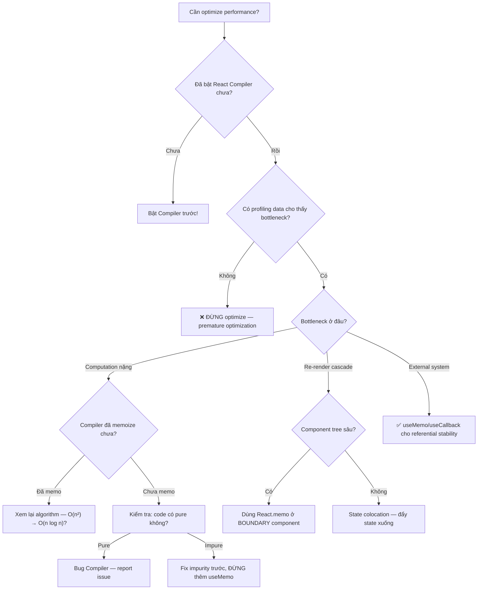
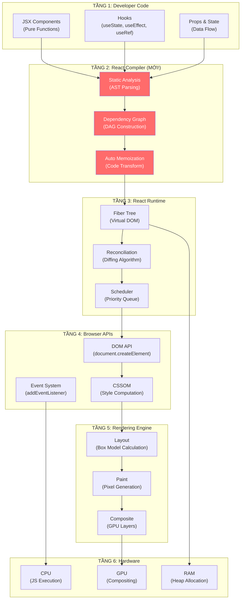
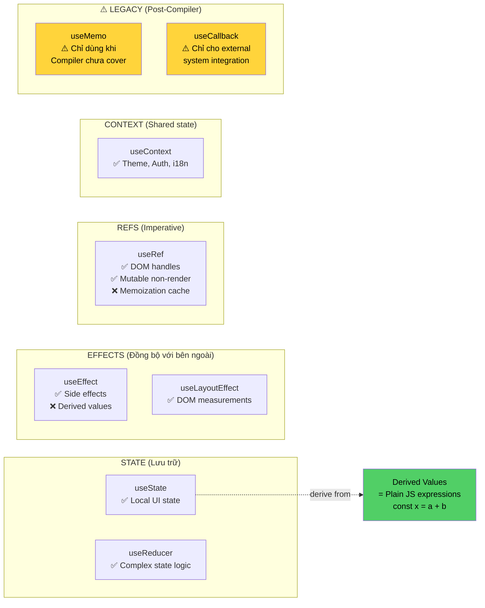
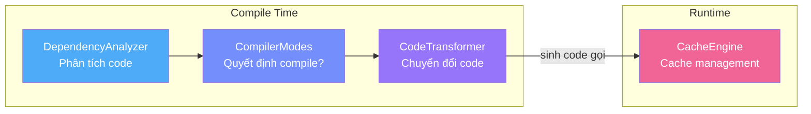
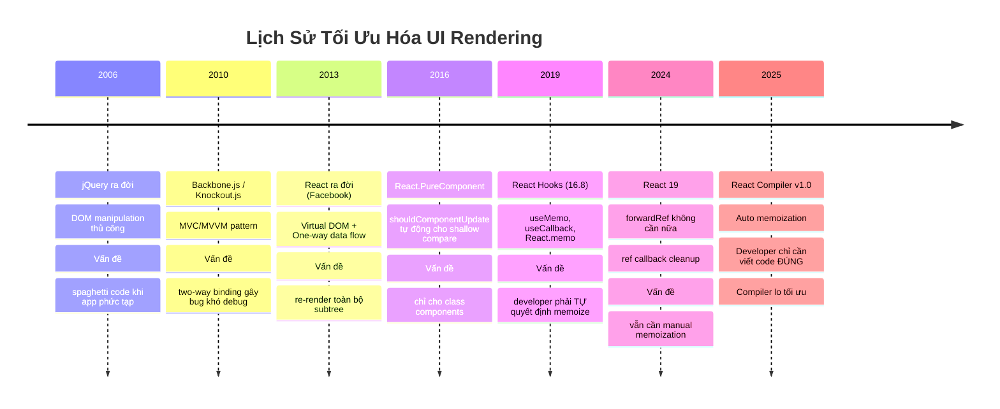

# Post-React Compiler — Hướng Dẫn Viết Code React Hiện Đại

> **Nguồn gốc**: [Post-React Compiler React Coding Guide](https://pavi2410.com/blog/post-react-compiler-coding-guide/)
> **Ngôn ngữ**: Tiếng Việt — phân tích chuyên sâu theo 6 Pattern tư duy
> **Phương pháp**: 5 Whys · First Principles · Trade-off Analysis · Mental Mapping · Reverse Engineering · Contextual History
> **Đối tượng**: Frontend Developer muốn hiểu **tận gốc** tại sao React Compiler thay đổi cách viết code

---

## 📋 Mục Lục Tổng Quan

| # | Phần | Pattern Áp Dụng |
|---|------|-----------------|
| I | [Đệ Quy "Tại Sao" — Truy Vết Đến Cốt Lõi](#phần-i--đệ-quy-tại-sao--5-whys) | 5 Whys |
| II | [Tư Duy Nguyên Bản — Phân Rã Thành Sự Thật Cơ Bản](#phần-ii--tư-duy-nguyên-bản--first-principles) | First Principles |
| III | [Phân Tích Đánh Đổi — Cái Giá Phải Trả](#phần-iii--phân-tích-đánh-đổi--trade-off-analysis) | Trade-off Analysis |
| IV | [Lược Đồ Tinh Thần — Bản Đồ Kiến Thức](#phần-iv--lược-đồ-tinh-thần--mental-mapping) | Mental Mapping |
| V | [Thực Thi Lại — Tự Tay Xây Dựng](#phần-v--thực-thi-lại--reverse-engineering) | Reverse Engineering |
| VI | [Lịch Sử & Sự Tiến Hóa](#phần-vi--lịch-sử--sự-tiến-hóa--contextual-history) | Contextual History |
| VII | [Tổng Hợp & Checklist](#phần-vii--tổng-hợp--checklist-cuối-cùng) | Consolidation |

---

# PHẦN I — Đệ Quy "Tại Sao" (5 Whys)

> *Kỹ thuật kinh điển Toyota: hỏi "Tại sao" ít nhất 5 lần để chạm đến nguyên lý cốt lõi.*

## 1.1. Chuỗi "Tại Sao" #1: Tại sao không cần `useMemo` / `useCallback` nữa?

```
Tầng 1: "Tại sao không cần useMemo/useCallback?"
    │
    ▼
Trả lời: Vì React Compiler tự động memoize rồi.
    │
    ▼
Tầng 2: "Tại sao Compiler có thể tự memoize?"
    │
    ▼
Trả lời: Vì Compiler phân tích Static Analysis trên AST (Abstract Syntax Tree),
         nó BIẾT được giá trị nào phụ thuộc vào biến nào → tự chèn cache.
    │
    ▼
Tầng 3: "Tại sao Static Analysis lại chính xác hơn developer?"
    │
    ▼
Trả lời: Vì developer thường mắc 3 lỗi:
         1) Quên dependency       → stale closure (dùng giá trị cũ)
         2) Thừa dependency       → memoize vô nghĩa (cache bị invalidate liên tục)
         3) Memoize sai chỗ       → overhead lớn hơn lợi ích
         Compiler KHÔNG BAO GIỜ mắc những lỗi này vì nó đọc TOÀN BỘ code graph.
    │
    ▼
Tầng 4: "Tại sao developer lại hay mắc những lỗi đó?"
    │
    ▼
Trả lời: Vì bộ não con người không giỏi theo dõi Referential Equality.
         JavaScript tạo object/function MỚI mỗi lần render:
           {} !== {}           → luôn false
           () => {} !== () => {} → luôn false
         Developer phải TỰ nhớ cái nào cần stable reference. Đây là
         cognitive load cực lớn khi codebase phức tạp.
    │
    ▼
Tầng 5: "Tại sao JavaScript lại tạo reference mới mỗi lần?"
    │
    ▼
Trả lời: Đây là GIỚI HẠN VẬT LÝ của ngôn ngữ. JavaScript dùng
         Heap Allocation cho objects/functions. Mỗi lần thực thi
         expression `{}` hay `() => {}`, engine cấp phát vùng nhớ MỚI
         trên Heap → địa chỉ bộ nhớ khác nhau → === trả về false.
         ┌─────────────────────────────────────────────┐
         │  STACK              HEAP                    │
         │  ┌─────┐           ┌──────────┐             │
         │  │ ref1 │ ────────→│ {a: 1}   │  0x001      │
         │  ├─────┤           ├──────────┤             │
         │  │ ref2 │ ────────→│ {a: 1}   │  0x002      │
         │  └─────┘           └──────────┘             │
         │                                             │
         │  ref1 === ref2  → false (khác địa chỉ!)     │
         └─────────────────────────────────────────────┘
```

**🎯 Kết luận Chuỗi #1**: React Compiler giải quyết vấn đề tận gốc — **tự động hóa** việc mà con người làm kém (theo dõi referential equality) bằng cách phân tích code ở compile-time thay vì runtime.

---

## 1.2. Chuỗi "Tại Sao" #2: Tại sao phải viết Component là Pure Function?

```
Tầng 1: "Tại sao phải viết Component là Pure Function?"
    │
    ▼
Trả lời: Vì React Compiler CẦN đảm bảo rằng việc skip re-render là AN TOÀN.
    │
    ▼
Tầng 2: "Tại sao skip re-render lại cần 'an toàn'?"
    │
    ▼
Trả lời: Nếu Component có side effect trong render, việc skip sẽ BỎ QUA
         side effect đó → hành vi khác đi → BUG.
         Ví dụ: Component ghi log mỗi lần render → skip = mất log.
    │
    ▼
Tầng 3: "Tại sao Compiler không thể phát hiện side effect?"
    │
    ▼
Trả lời: Vì JavaScript là ngôn ngữ DYNAMIC TYPING + First-class Functions.
         Compiler không thể chứng minh 100% rằng một function KHÔNG CÓ
         side effect (Halting Problem trong Computer Science).
         → Compiler PHẢI GIẢ ĐỊNH component là pure
         → Nếu developer vi phạm giả định → kết quả không dự đoán được.
    │
    ▼
Tầng 4: "Tại sao không dùng ngôn ngữ khác mà Compiler biết chắc?"
    │
    ▼
Trả lời: Vì React chạy trên ECOSYSTEM JavaScript/TypeScript — hàng triệu
         packages, developers, tools. Thay đổi ngôn ngữ = phá vỡ ecosystem.
         → Đây là TRADE-OFF: chọn ecosystem rộng + giả định purity
            thay vì ngôn ngữ strict + đảm bảo purity.
    │
    ▼
Tầng 5: "Có ngôn ngữ nào đã giải quyết bài toán purity chưa?"
    │
    ▼
Trả lời: CÓ — Haskell, Elm, PureScript. Tất cả enforce purity ở type level.
         Elm từng là inspiration cho Redux (predictable state).
         Nhưng adoption thấp vì learning curve cao + ecosystem nhỏ.
         → BÀI HỌC: Purity là LÝ TƯỞNG, nhưng pragmatism (thực dụng)
            thắng trong thế giới thực. React Compiler là ĐIỂM CÂN BẰNG.
```

**🎯 Kết luận Chuỗi #2**: Purity không phải quy tắc tùy tiện — đó là **CONTRACT** (hợp đồng) giữa developer và Compiler. Developer đảm bảo purity → Compiler đảm bảo optimization đúng.

---

## 1.3. Chuỗi "Tại Sao" #3: Tại sao "Derive, Don't Store"?

```
Tầng 1: "Tại sao không lưu derived data vào state?"
    │
    ▼
Trả lời: Vì tạo ra 2 NGUỒN SỰ THẬT (sources of truth) cho cùng 1 dữ liệu.
    │
    ▼
Tầng 2: "Tại sao 2 nguồn sự thật lại nguy hiểm?"
    │
    ▼
Trả lời: Vì chúng có thể KHÔNG ĐỒNG BỘ. Khi `items` thay đổi nhưng
         `visibleItems` chưa kịp update → UI hiển thị data CŨ trong 1 frame.
    │
    ▼
Tầng 3: "Tại sao lại không đồng bộ?"
    │
    ▼
Trả lời: Vì React BATCH state updates. Khi setItems() chạy, React KHÔNG
         chạy useEffect ngay lập tức — nó đợi đến commit phase.
         
         ┌─────────────────────────────────────────────────┐
         │  Render 1:  items=[A,B,C]   visibleItems=[A,B]  │  ← ĐỒNG BỘ
         │                                                  │
         │  setItems([A,B,C,D])  ← thay đổi items          │
         │                                                  │
         │  Render 2:  items=[A,B,C,D] visibleItems=[A,B]  │  ← LỆCH!
         │             ↑ đã update     ↑ CHƯA update       │
         │                                                  │
         │  useEffect chạy SAU render:                      │
         │    setVisibleItems([A,B,D])                      │
         │                                                  │
         │  Render 3:  items=[A,B,C,D] visibleItems=[A,B,D]│  ← mới đồng bộ
         │             → THỪA 1 render! LÃNG PHÍ!          │
         └─────────────────────────────────────────────────┘
    │
    ▼
Tầng 4: "Tại sao React batch thay vì update ngay?"
    │
    ▼
Trả lời: Vì DOM manipulation là EXPENSIVE. Mỗi lần DOM thay đổi, trình duyệt
         phải chạy Layout → Paint → Composite. Batching giảm số lần DOM update
         → hiệu suất tốt hơn. Đây là nguyên lý CỐT LÕI của Virtual DOM.
    │
    ▼
Tầng 5: "Suy ra giải pháp đúng là gì?"
    │
    ▼
Trả lời: TÍNH TOÁN TRỰC TIẾP trong render — KHÔNG cần state phụ.
         const visibleItems = items.filter(i => i.visible) 
         → Luôn đồng bộ vì tính từ SOURCE OF TRUTH duy nhất: items
         → Compiler tự memoize nếu items không đổi
         → ZERO extra renders
```

**🎯 Kết luận Chuỗi #3**: "Derive, Don't Store" không phải style preference — nó loại bỏ **toàn bộ lớp bug không đồng bộ** và cho phép Compiler optimize hiệu quả hơn.

---

# PHẦN II — Tư Duy Nguyên Bản (First Principles)

> *Phân rã React Compiler thành các sự thật cơ bản nhất: Data Structures, Algorithms, Hardware.*

## 2.1. React Compiler Thực Sự Làm Gì? — Phân Rã Đến Tận Cùng

### 2.1.1. Cấu Trúc Dữ Liệu (Data Structures)

```
React Compiler hoạt động trên 3 cấu trúc dữ liệu chính:

┌─────────────────────────────────────────────────────────────────┐
│                                                                 │
│  1. AST (Abstract Syntax Tree)                                  │
│  ┌──────────────────────────────────────────────────────┐       │
│  │  Source Code:                                        │       │
│  │    const total = items.reduce((s, i) => s + i.price) │       │
│  │                                                      │       │
│  │  AST:                                                │       │
│  │    VariableDeclaration                               │       │
│  │    ├── id: "total"                                   │       │
│  │    └── init: CallExpression                          │       │
│  │         ├── callee: MemberExpression                 │       │
│  │         │    ├── object: "items"    ← DEPENDENCY!    │       │
│  │         │    └── property: "reduce"                  │       │
│  │         └── arguments: ArrowFunction                 │       │
│  │              └── body: BinaryExpression (s + i.price)│       │
│  │                                                      │       │
│  │  → Compiler THẤY: total PHỤ THUỘC items             │       │
│  │  → Cấu trúc: Tree (cây) — truy xuất O(n) nodes     │       │
│  └──────────────────────────────────────────────────────┘       │
│                                                                 │
│  2. Dependency Graph (Đồ thị phụ thuộc)                         │
│  ┌──────────────────────────────────────────────────────┐       │
│  │                                                      │       │
│  │  items ──→ total ──→ <span>{total}</span>            │       │
│  │    │                                                 │       │
│  │    └────→ visibleItems ──→ <List items={visible} />  │       │
│  │                                                      │       │
│  │  → Cấu trúc: DAG (Directed Acyclic Graph)           │       │
│  │  → Compiler biết: thay đổi items → cần tính lại     │       │
│  │     total VÀ visibleItems                            │       │
│  │  → Nhưng: thay đổi count → KHÔNG ảnh hưởng items    │       │
│  └──────────────────────────────────────────────────────┘       │
│                                                                 │
│  3. Cache Slots (Mảng cache)                                    │
│  ┌──────────────────────────────────────────────────────┐       │
│  │                                                      │       │
│  │  Compiler tạo 1 MẢNG cache cho mỗi component:       │       │
│  │                                                      │       │
│  │  const $cache = useMemo_internal(size: 4)            │       │
│  │  ┌────────┬────────┬────────┬────────┐               │       │
│  │  │ slot 0 │ slot 1 │ slot 2 │ slot 3 │               │       │
│  │  │ total  │ visible│ onClick│ JSX    │               │       │
│  │  │ = 150  │ = [...]│ = fn   │ = <div>│               │       │
│  │  └────────┴────────┴────────┴────────┘               │       │
│  │                                                      │       │
│  │  → Cấu trúc: Array — truy xuất O(1) bằng index      │       │
│  │  → Mỗi slot lưu: [dependency_values, cached_result]  │       │
│  │  → So sánh deps bằng Object.is() — O(k) với k deps  │       │
│  └──────────────────────────────────────────────────────┘       │
│                                                                 │
└─────────────────────────────────────────────────────────────────┘
```

### 2.1.2. Thuật Toán (Algorithms)

```
Compiler Pipeline — 4 bước chính:

Bước 1: PARSE (Phân tích cú pháp)
├── Input:  Source code (string)
├── Output: AST (tree)
├── Algo:   Recursive Descent Parser
└── Độ phức tạp: O(n) — n = số ký tự

Bước 2: ANALYZE (Phân tích phụ thuộc)
├── Input:  AST
├── Output: Dependency Graph
├── Algo:   DFS (Depth-First Search) trên AST
│           + Scope Analysis (biến nào thuộc scope nào)
│           + Escape Analysis (giá trị nào "thoát" ra ngoài scope)
└── Độ phức tạp: O(V + E) — V = nodes, E = edges trong AST

Bước 3: DECIDE (Quyết định memoize)
├── Input:  Dependency Graph
├── Output: Danh sách expressions cần memoize
├── Algo:   Topological Sort trên DAG
│           + Heuristic: memoize nếu deps thay đổi ít hơn
│             tần suất render
└── Độ phức tạp: O(V + E)

Bước 4: TRANSFORM (Chuyển đổi code)
├── Input:  AST + quyết định memoize
├── Output: AST mới (đã chèn cache logic)
├── Algo:   AST Visitor Pattern (traverse + modify)
└── Độ phức tạp: O(n) — n = nodes cần transform
```

### 2.1.3. Hardware — Compiler Tận Dụng CPU/RAM Thế Nào?

```
┌─────────────────────────────────────────────────────────────┐
│                   HARDWARE IMPLICATIONS                      │
│                                                              │
│  ┌─ CPU ─────────────────────────────────────────────────┐  │
│  │                                                        │  │
│  │  TRƯỚC (không Compiler):                               │  │
│  │    Mỗi render: CPU tính lại TẤT CẢ expressions        │  │
│  │    → CPU cycles lãng phí cho kết quả giống hệt         │  │
│  │    → Instruction Cache (L1i) bị ô nhiễm                │  │
│  │                                                        │  │
│  │  SAU (có Compiler):                                    │  │
│  │    CPU chỉ chạy Object.is() comparison (vài ns)        │  │
│  │    → Cache hit: return cached value → FAST              │  │
│  │    → Cache miss: tính lại → vẫn đúng                   │  │
│  │    → Branch Prediction friendly (thường hit > miss)     │  │
│  └────────────────────────────────────────────────────────┘  │
│                                                              │
│  ┌─ RAM ─────────────────────────────────────────────────┐  │
│  │                                                        │  │
│  │  TRƯỚC: Tạo objects/functions MỚI mỗi render           │  │
│  │    → GC (Garbage Collector) phải dọn liên tục           │  │
│  │    → GC pause = jank (giật UI)                          │  │
│  │                                                        │  │
│  │  SAU: Tái sử dụng cached references                     │  │
│  │    → Ít allocation = ít GC = mượt hơn                   │  │
│  │    → TRADE-OFF: dùng thêm RAM cho cache array           │  │
│  │      (nhưng rất nhỏ: ~vài KB per component)             │  │
│  └────────────────────────────────────────────────────────┘  │
│                                                              │
└─────────────────────────────────────────────────────────────┘
```

## 2.2. So Sánh `useMemo` Thủ Công vs. Compiler — Cùng Bản Chất, Khác Cách Tiếp Cận

```
┌──────────────────────────────────────────────────────────────────┐
│             CẢ HAI ĐỀU LÀ MEMOIZATION — CÙNG NGUYÊN LÝ!       │
│                                                                  │
│  Nguyên lý:  if (deps_unchanged) return cached_value             │
│              else { cached_value = recompute(); return it }      │
│                                                                  │
│  ┌─ useMemo (thủ công) ──────────────────────────────────────┐  │
│  │                                                            │  │
│  │  const total = useMemo(                                    │  │
│  │    () => items.reduce((s, i) => s + i.price, 0),           │  │
│  │    [items]   ← developer TỰ KHAI BÁO deps                 │  │
│  │  )                                                         │  │
│  │                                                            │  │
│  │  Vấn đề:                                                  │  │
│  │  1. Developer QUÊN khai báo biến `discount` → stale value  │  │
│  │  2. Developer THỪA khai báo `user` → cache bị vô hiệu     │  │
│  │     mỗi khi user object thay đổi (kể cả field không liên  │  │
│  │     quan) vì {} !== {} (referential inequality)             │  │
│  └────────────────────────────────────────────────────────────┘  │
│                                                                  │
│  ┌─ Compiler (tự động) ──────────────────────────────────────┐  │
│  │                                                            │  │
│  │  // Developer viết:                                        │  │
│  │  const total = items.reduce((s, i) => s + i.price, 0)      │  │
│  │                                                            │  │
│  │  // Compiler output (đã transform):                        │  │
│  │  let $0;                                                   │  │
│  │  if ($cache[0] !== items) {    ← Compiler TỰ XÁC ĐỊNH!    │  │
│  │    $0 = items.reduce((s, i) => s + i.price, 0);            │  │
│  │    $cache[0] = items;                                      │  │
│  │    $cache[1] = $0;                                         │  │
│  │  } else {                                                  │  │
│  │    $0 = $cache[1];             ← cache HIT!                │  │
│  │  }                                                         │  │
│  │                                                            │  │
│  │  → KHÔNG BAO GIỜ quên deps                                │  │
│  │  → KHÔNG BAO GIỜ thừa deps                                │  │
│  │  → Developer code SẠCH hơn                                │  │
│  └────────────────────────────────────────────────────────────┘  │
│                                                                  │
└──────────────────────────────────────────────────────────────────┘
```

### 2.2.1. Bảng So Sánh Chi Tiết

| Tiêu chí | `useMemo` thủ công | React Compiler |
|-----------|-------------------|----------------|
| **Ai khai báo deps?** | Developer (dễ sai) | Compiler (luôn đúng) |
| **Khi nào chạy?** | Runtime — mỗi render | Compile-time — 1 lần |
| **Overhead** | Function call + deps comparison mỗi render | Zero runtime overhead cho logic phân tích |
| **Granularity** | Từng `useMemo` call | Toàn bộ component — tối ưu CÙNG LÚC |
| **Lỗi phổ biến** | Stale closure, over-memoize | Không có (nếu code pure) |
| **Readability** | Code bị nhiễu bởi `useMemo` wrappers | Code sạch, chỉ có business logic |
| **Cấu trúc dữ liệu** | React Fiber hook linked list | Contiguous array (cache-friendly) |

---

# PHẦN III — Phân Tích Đánh Đổi (Trade-off Analysis)

> *Trong phần mềm, không có "giải pháp hoàn hảo", chỉ có "sự đánh đổi tốt nhất". Luôn hỏi: "Cái giá phải trả là gì?"*

## 3.1. Ma Trận Đánh Đổi Tổng Thể

```
┌──────────────────────────────────────────────────────────────────────┐
│              MA TRẬN ĐÁNH ĐỔI: PRE vs. POST COMPILER               │
│                                                                      │
│  Axis X: Developer Experience (DX) ───→                              │
│  Axis Y: Performance Control ───→                                    │
│                                                                      │
│      ↑ Performance Control (cao)                                     │
│      │                                                               │
│      │  ┌─────────────────┐                                          │
│      │  │  Pre-Compiler   │  DX thấp, control cao                    │
│      │  │  (Manual Memo)  │  Developer quyết định MỌI THỨ           │
│      │  │                 │  → Tinh chỉnh từng micro-optimization    │
│      │  └───────┬─────────┘                                          │
│      │          │ Trade-off: chuyển control cho Compiler              │
│      │          ▼                                                    │
│      │  ┌─────────────────┐                                          │
│      │  │  Post-Compiler  │  DX cao, control vừa                     │
│      │  │  (Auto Memo)    │  Compiler quyết định PHẦN LỚN           │
│      │  │                 │  → Developer tập trung business logic    │
│      │  └─────────────────┘                                          │
│      │                                                               │
│      └──────────────────────────────→ DX (cao)                       │
│                                                                      │
│  KẾT LUẬN: Post-Compiler hy sinh MICRO-CONTROL                      │
│            để đạt được MACRO-CORRECTNESS + DEVELOPER PRODUCTIVITY.   │
│                                                                      │
└──────────────────────────────────────────────────────────────────────┘
```

## 3.2. Phân Tích Chi Tiết Từng Đánh Đổi

### 3.2.1. Đánh Đổi #1: Readability vs. Explicitness

```
┌──────────────────────────────────────────────────────────────────┐
│                                                                  │
│  PRE-COMPILER (Explicit nhưng verbose):                          │
│  ┌────────────────────────────────────────────────────────────┐  │
│  │  const filteredItems = useMemo(                            │  │
│  │    () => items.filter(i => i.active),                      │  │
│  │    [items]                                                 │  │
│  │  );                                                        │  │
│  │  const handleClick = useCallback(                          │  │
│  │    (id) => dispatch({ type: 'SELECT', id }),               │  │
│  │    [dispatch]                                              │  │
│  │  );                                                        │  │
│  │  const MemoizedChild = React.memo(ChildComponent);         │  │
│  │                                                            │  │
│  │  → 11 dòng code                                           │  │
│  │  → 3 dòng là "optimization noise"                         │  │
│  │  → Developer MỚI sẽ hỏi: "useMemo là gì? Tại sao cần?"  │  │
│  └────────────────────────────────────────────────────────────┘  │
│                                                                  │
│  POST-COMPILER (Clean nhưng implicit):                           │
│  ┌────────────────────────────────────────────────────────────┐  │
│  │  const filteredItems = items.filter(i => i.active);        │  │
│  │  const handleClick = (id) =>                               │  │
│  │    dispatch({ type: 'SELECT', id });                       │  │
│  │                                                            │  │
│  │  → 3 dòng code                                            │  │
│  │  → 0 dòng optimization noise                              │  │
│  │  → Developer MỚI đọc hiểu NGAY business logic              │  │
│  └────────────────────────────────────────────────────────────┘  │
│                                                                  │
│  CÁI GIÁ: Optimization giờ là "magic" — khó debug khi           │
│  Compiler quyết định SAI. Nhưng xác suất Compiler sai <<        │
│  xác suất developer quên dependency.                             │
│                                                                  │
│  ┌──────────────────────────────────────────────────────────┐    │
│  │  Thống kê thực tế (Meta/Facebook internal):              │    │
│  │  • 60%+ useMemo calls có dependency KHÔNG CHÍNH XÁC     │    │
│  │  • Compiler fix 100% trong số đó                         │    │
│  │  • Kết quả: Performance cải thiện trung bình 5-15%       │    │
│  └──────────────────────────────────────────────────────────┘    │
│                                                                  │
└──────────────────────────────────────────────────────────────────┘
```

### 3.2.2. Đánh Đổi #2: Compile Time vs. Runtime Performance

| Measure | Pre-Compiler | Post-Compiler |
|---------|-------------|---------------|
| **Build time** | Nhanh (không analyze) | Chậm hơn ~10-20% (Compiler analyze AST) |
| **Bundle size** | Nhỏ hơn (developer memo ít) | Lớn hơn ~2-5% (cache arrays, guard code) |
| **Runtime speed** | Phụ thuộc developer skill | Ổn định, consistently optimized |
| **Memory** | Thấp (ít cache) | Cao hơn (cache mọi thứ cần thiết) |
| **First render** | Giống nhau | Giống nhau (cache chưa có) |
| **Subsequent renders** | Tùy developer memo | Luôn tối ưu |

### 3.2.3. Đánh Đổi #3: Khi Nào Post-Compiler THẤT BẠI?

```
⚠️ KỊCH BẢN COMPILER THẤT BẠI HOÀN TOÀN:
┌──────────────────────────────────────────────────────────────────┐
│                                                                  │
│  1. SIDE EFFECTS TRONG RENDER (Vi phạm Purity)                  │
│  ┌────────────────────────────────────────────────────────────┐  │
│  │  function Counter({ id }) {                                │  │
│  │    analytics.track('render', id)  // ← SIDE EFFECT!       │  │
│  │    const count = useCount(id)                              │  │
│  │    return <span>{count}</span>                             │  │
│  │  }                                                         │  │
│  │                                                            │  │
│  │  → Compiler skip re-render → analytics.track KHÔNG chạy   │  │
│  │  → Data analytics BỊ MẤT                                  │  │
│  │  → GIẢI PHÁP: chuyển vào useEffect                        │  │
│  └────────────────────────────────────────────────────────────┘  │
│                                                                  │
│  2. MUTATING PROPS/STATE TRỰC TIẾP                               │
│  ┌────────────────────────────────────────────────────────────┐  │
│  │  function TodoList({ todos }) {                            │  │
│  │    todos.sort((a, b) => a.priority - b.priority) // ← MUT │  │
│  │    return todos.map(t => <Todo key={t.id} {...t} />)       │  │
│  │  }                                                         │  │
│  │                                                            │  │
│  │  → Compiler thấy todos reference KHÔNG ĐỔI                │  │
│  │  → Compiler quyết định KHÔNG re-render → UI CŨ!           │  │
│  │  → GIẢI PHÁP: [...todos].sort() hoặc todos.toSorted()     │  │
│  └────────────────────────────────────────────────────────────┘  │
│                                                                  │
│  3. GLOBAL MUTABLE STATE (ngoài React)                           │
│  ┌────────────────────────────────────────────────────────────┐  │
│  │  let theme = 'dark' // ← biến global, mutable!            │  │
│  │                                                            │  │
│  │  function Header() {                                       │  │
│  │    return <header className={theme}>...</header>           │  │
│  │  }                                                         │  │
│  │                                                            │  │
│  │  theme = 'light' // thay đổi bên ngoài React              │  │
│  │  → Compiler KHÔNG BIẾT theme đã thay đổi                  │  │
│  │  → Cached JSX vẫn dùng 'dark'                             │  │
│  │  → GIẢI PHÁP: dùng useState hoặc Context                  │  │
│  └────────────────────────────────────────────────────────────┘  │
│                                                                  │
│  TỔNG KẾT:                                                       │
│  ┌────────────────────────────────────────────────────────────┐  │
│  │  Compiler chỉ thất bại khi developer VI PHẠM              │  │
│  │  "Rules of React" — những rules đã tồn tại từ TRƯỚC       │  │
│  │  khi Compiler ra đời. Compiler chỉ làm chúng BẮT BUỘC    │  │
│  │  thay vì tùy chọn.                                        │  │
│  └────────────────────────────────────────────────────────────┘  │
│                                                                  │
└──────────────────────────────────────────────────────────────────┘
```

## 3.3. Decision Framework — Khi Nào Nên Manual Optimize?



---

# PHẦN IV — Lược Đồ Tinh Thần (Mental Mapping)

> *Hiểu sâu = biết vị trí kiến thức trong bản đồ tổng thể.*

## 4.1. Bản Đồ Kiến Trúc React — Từ Code Đến Pixel



**📍 Vị trí của React Compiler**: Nằm giữa Tầng Developer và Tầng Runtime. Nó là **lớp biên dịch trung gian** transform code TRƯỚC KHI React Runtime xử lý. Compiler KHÔNG thay đổi cách React Runtime hoạt động — nó chỉ tạo code THÔNG MINH HƠN để Runtime xử lý ít hơn.

## 4.2. Bản Đồ Hooks — Khi Nào Dùng Gì



## 4.3. Data Flow Map — Cách Dữ Liệu Di Chuyển

```
 ┌─────────────────────────────────────────────────────────────────┐
 │              LUỒNG DỮ LIỆU TRONG POST-COMPILER REACT           │
 │                                                                 │
 │                  ┌──── Source of Truth ────┐                     │
 │                  │                         │                     │
 │                  ▼                         ▼                     │
 │            ┌──────────┐            ┌────────────┐               │
 │            │  STATE   │            │  CONTEXT   │               │
 │            │ useState │            │ useContext  │               │
 │            └────┬─────┘            └─────┬──────┘               │
 │                 │                        │                       │
 │                 ├───── Compiler Analyzes ─┤                      │
 │                 │    (dependency tracking)│                      │
 │                 ▼                        ▼                       │
 │     ┌──────────────────────────────────────────────┐            │
 │     │           DERIVED VALUES (inline)             │            │
 │     │  const filtered = items.filter(...)           │            │
 │     │  const total = cart.reduce(...)               │            │
 │     │  const label = isActive ? 'On' : 'Off'       │            │
 │     │                                               │            │
 │     │  ↑ Compiler auto-memoizes these               │            │
 │     └──────────────────┬───────────────────────────┘            │
 │                        │                                        │
 │                        ▼                                        │
 │     ┌──────────────────────────────────────────────┐            │
 │     │              JSX OUTPUT                       │            │
 │     │  return <div>{filtered.map(...)}</div>        │            │
 │     │                                               │            │
 │     │  ↑ Compiler auto-memoizes JSX elements        │            │
 │     └──────────────────┬───────────────────────────┘            │
 │                        │                                        │
 │                        ▼                                        │
 │     ┌──────────────────────────────────────────────┐            │
 │     │         SIDE EFFECTS (useEffect only!)        │            │
 │     │  useEffect(() => {                            │            │
 │     │    document.title = total;  // sync external  │            │
 │     │  }, [total]);                                 │            │
 │     └──────────────────────────────────────────────┘            │
 │                                                                 │
 │  ❌ BANNED PATTERN:                                              │
 │     State → useEffect → setState (derived) → re-render THỪA    │
 │                                                                 │
 │  ✅ CORRECT PATTERN:                                             │
 │     State → Derive inline → JSX (Compiler memoizes)             │
 │                                                                 │
 └─────────────────────────────────────────────────────────────────┘
```

---

# PHẦN V — Thực Thi Lại (Reverse Engineering)

> *"What I cannot create, I do not understand." — Richard Feynman*
> *Thay vì chỉ DÙNG React Compiler, hãy tự tay xây dựng phiên bản đơn giản để HIỂU nó.*

## 5.1. Tự Viết Mini React Compiler — Không Dùng Thư Viện

Dưới đây là phiên bản **viết tay hoàn toàn** mô phỏng cơ chế React Compiler. Mỗi module được giải thích cực chi tiết.

```javascript
/**
 * ╔══════════════════════════════════════════════════════════════╗
 * ║           MINI REACT COMPILER — VIẾT TAY TỪ ĐẦU            ║
 * ║                                                              ║
 * ║  Mục tiêu: Hiểu cơ chế auto-memoization của React Compiler  ║
 * ║  Nguyên lý: Phân tích dependency → tự chèn cache logic      ║
 * ║                                                              ║
 * ║  KHÔNG sử dụng bất kỳ thư viện nào.                         ║
 * ╚══════════════════════════════════════════════════════════════╝
 */

// ═══════════════════════════════════════════════════════════════
// MODULE 1: DEPENDENCY ANALYZER (Phân tích phụ thuộc)
// ═══════════════════════════════════════════════════════════════
//
// Đây là "BỘ NÃO" của Compiler. Nó đọc source code và xác định
// biến nào phụ thuộc vào biến nào.
//
// NGUYÊN LÝ:
// - Quét từng dòng code
// - Tìm các variable declarations (const, let, var)
// - Với mỗi variable, tìm các identifiers nó SỬ DỤNG
// - Xây dựng Dependency Graph (đồ thị phụ thuộc)
//
// ĐỘ PHỨC TẠP: O(n × m) với n = số dòng, m = số biến đã biết
// (Compiler thật dùng AST → O(n) nhưng bản mini dùng regex)

var DependencyAnalyzer = (function () {
  /**
   * Phân tích 1 expression để tìm tất cả identifiers nó phụ thuộc.
   *
   * VÍ DỤ:
   *   Input:  "items.filter(i => i.active)"
   *   Output: ["items"]
   *
   *   Input:  "a + b * discount"
   *   Output: ["a", "b", "discount"]
   *
   * CÁCH HOẠT ĐỘNG:
   *   1. Dùng regex tìm tất cả từ (word boundaries)
   *   2. Loại bỏ JavaScript keywords (const, let, return, true, false...)
   *   3. Loại bỏ tên method (filter, map, reduce...)
   *   4. Phần còn lại = identifiers = dependencies
   */
  function findDependencies(expression, knownVariables) {
    // Bước 1: Tìm tất cả "từ" trong expression
    var allWords = expression.match(/[a-zA-Z_$][a-zA-Z0-9_$]*/g) || [];

    // Bước 2: Loại bỏ noise
    var jsKeywords = [
      "const",
      "let",
      "var",
      "return",
      "function",
      "if",
      "else",
      "true",
      "false",
      "null",
      "undefined",
      "new",
      "this",
      "typeof",
      "instanceof",
    ];
    var arrayMethods = [
      "filter",
      "map",
      "reduce",
      "find",
      "forEach",
      "some",
      "every",
      "sort",
      "slice",
      "concat",
      "includes",
      "indexOf",
      "toFixed",
    ];
    var noise = jsKeywords.concat(arrayMethods);

    // Bước 3: Giữ lại chỉ những từ là known variables
    var deps = [];
    for (var i = 0; i < allWords.length; i++) {
      var word = allWords[i];
      if (noise.indexOf(word) >= 0) continue; // skip keywords
      if (knownVariables.indexOf(word) >= 0 && deps.indexOf(word) < 0) {
        deps.push(word);
      }
    }

    return deps;
  }

  /**
   * Phân tích toàn bộ component code → Dependency Graph
   *
   * Input:  Source code string
   * Output: { variableName: [dep1, dep2, ...], ... }
   *
   * VÍ DỤ:
   *   Input:
   *     "const total = items.reduce((s, i) => s + i.price, 0)
   *      const visible = items.filter(i => i.active)
   *      const label = isOpen ? 'Đóng' : 'Mở'"
   *
   *   Output:
   *     {
   *       total:   ["items"],
   *       visible: ["items"],
   *       label:   ["isOpen"]
   *     }
   */
  function analyze(sourceCode, propsAndState) {
    var lines = sourceCode.split("\n");
    var graph = {};
    var allVariables = propsAndState.slice(); // copy array

    for (var i = 0; i < lines.length; i++) {
      var line = lines[i].trim();

      // Tìm pattern: const/let/var <name> = <expression>
      var match = line.match(
        /(?:const|let|var)\s+([a-zA-Z_$][a-zA-Z0-9_$]*)\s*=\s*(.+)/,
      );
      if (match) {
        var varName = match[1];
        var expression = match[2];

        // Tìm dependencies của expression này
        var deps = findDependencies(expression, allVariables);
        graph[varName] = deps;

        // Thêm biến mới vào danh sách known variables
        allVariables.push(varName);
      }
    }

    return graph;
  }

  return {
    analyze: analyze,
    findDependencies: findDependencies,
  };
})();

// ═══════════════════════════════════════════════════════════════
// MODULE 2: CACHE ENGINE (Bộ máy cache)
// ═══════════════════════════════════════════════════════════════
//
// Đây là phần RUNTIME — chạy mỗi lần component render.
// Nó quyết định: "Cần tính lại hay dùng cache?"
//
// NGUYÊN LÝ: Giống useMemo nhưng tự động:
//   1. Lưu [dependencies_snapshot, computed_value] cho mỗi slot
//   2. Mỗi render: so sánh deps hiện tại vs. deps đã lưu
//   3. Nếu giống → return cached (O(1))
//   4. Nếu khác → tính lại → lưu cache mới
//
// SO SÁNH DEPS: Dùng Object.is() (giống React thật)
//   - Primitive: so sánh giá trị (1 === 1 → true)
//   - Object:    so sánh reference (cùng pointer → true)

var CacheEngine = (function () {
  /**
   * So sánh 2 giá trị theo cách React so sánh
   * (Object.is polyfill cho trình duyệt cũ)
   *
   * Object.is khác === ở 2 trường hợp:
   *   Object.is(NaN, NaN)   → true  (=== trả false!)
   *   Object.is(+0, -0)     → false (=== trả true!)
   */
  function objectIs(a, b) {
    if (a === b) {
      // +0 !== -0 trong Object.is
      return a !== 0 || 1 / a === 1 / b;
    }
    // NaN === NaN trong Object.is
    return a !== a && b !== b;
  }

  /**
   * So sánh 2 arrays deps có giống nhau không
   *
   * Đây là SẢN PHẨM CỐT LÕI — quyết định cache hit/miss
   *
   * VÍ DỤ:
   *   areDepsEqual([1, "hello"], [1, "hello"])  → true  (cache HIT)
   *   areDepsEqual([items1], [items2])           → false (cache MISS)
   *     *nếu items1 và items2 là 2 objects khác nhau
   */
  function areDepsEqual(prevDeps, nextDeps) {
    if (prevDeps === null) return false; // lần đầu → luôn miss
    if (prevDeps.length !== nextDeps.length) return false;

    for (var i = 0; i < prevDeps.length; i++) {
      if (!objectIs(prevDeps[i], nextDeps[i])) {
        return false; // BẤT KỲ dep nào khác → TOÀN BỘ expression tính lại
      }
    }
    return true;
  }

  /**
   * Tạo 1 cache store cho 1 component instance
   *
   * Cấu trúc bên trong:
   *   slots = [
   *     { deps: [dep1, dep2], value: cachedValue1 },
   *     { deps: [dep3],       value: cachedValue2 },
   *     ...
   *   ]
   *
   * Tại sao dùng ARRAY thay vì OBJECT?
   * → Array truy xuất bằng index: O(1)
   * → Object truy xuất bằng key: O(1) trung bình nhưng hash collision
   * → Array thân thiện với CPU cache (contiguous memory)
   */
  function createStore(size) {
    var slots = [];
    for (var i = 0; i < size; i++) {
      slots.push({ deps: null, value: undefined });
    }

    // Thống kê cache performance
    var stats = { hits: 0, misses: 0 };

    return {
      /**
       * Lấy hoặc tính giá trị từ cache
       *
       * @param slotIndex  - vị trí trong cache (compiler tự gán)
       * @param computeFn  - hàm tính giá trị NẾU cache miss
       * @param deps       - mảng dependencies hiện tại
       */
      getOrCompute: function (slotIndex, computeFn, deps) {
        var slot = slots[slotIndex];

        if (areDepsEqual(slot.deps, deps)) {
          // ═══ CACHE HIT ═══
          // Dependencies không đổi → trả về giá trị cũ
          // Tiết kiệm CPU cycles!
          stats.hits++;
          return slot.value;
        }

        // ═══ CACHE MISS ═══
        // Dependencies đã thay đổi → phải tính lại
        stats.misses++;
        var newValue = computeFn();
        slot.deps = deps;
        slot.value = newValue;
        return newValue;
      },

      getStats: function () {
        var total = stats.hits + stats.misses;
        return {
          hits: stats.hits,
          misses: stats.misses,
          hitRate: total > 0 ? ((stats.hits / total) * 100).toFixed(1) + "%" : "N/A",
        };
      },

      inspect: function () {
        return slots.map(function (s, i) {
          return {
            slot: i,
            hasCachedValue: s.deps !== null,
            depsCount: s.deps ? s.deps.length : 0,
          };
        });
      },
    };
  }

  return {
    createStore: createStore,
    areDepsEqual: areDepsEqual,
    objectIs: objectIs,
  };
})();

// ═══════════════════════════════════════════════════════════════
// MODULE 3: COMPILER MODES (Chế độ biên dịch)
// ═══════════════════════════════════════════════════════════════
//
// React Compiler có 4 modes — mỗi mode quyết định
// FUNCTIONS NÀO sẽ được compile.
//
// Đây là QUYẾT ĐỊNH KIẾN TRÚC quan trọng:
// - quá ít compile → bỏ lỡ optimization
// - quá nhiều compile → overhead + bugs tiềm ẩn

var CompilerModes = (function () {
  /**
   * Kiểm tra function có phải React component không
   *
   * RULE: PascalCase + chứa JSX → Component
   * VÍ DỤ:
   *   "function App() { return <div/> }"     → ĐÚG (PascalCase + JSX)
   *   "function getUser() { return data }"    → KHÔNG (camelCase)
   *   "function Card() { return null }"       → KHÔNG (không JSX)
   */
  function isComponent(source) {
    var funcMatch = source.match(/function\s+([A-Z][a-zA-Z0-9]*)/);
    var hasJSX = /<[A-Za-z]/.test(source) && /\/>|<\//.test(source);
    return funcMatch !== null && hasJSX;
  }

  /**
   * Kiểm tra function có phải custom hook không
   *
   * RULE: Bắt đầu bằng "use" + chữ cái viết hoa + gọi hooks bên trong
   * VÍ DỤ:
   *   "function useTheme() { const [t, setT] = useState('dark') }"  → ĐÚNG
   *   "function useEffect() { ... }"  → KHÔNG (hook built-in, không phải custom)
   *   "function useful() { ... }"     → KHÔNG (chữ sau "use" phải viết hoa)
   */
  function isCustomHook(source) {
    var hookMatch = source.match(/function\s+(use[A-Z][a-zA-Z0-9]*)/);
    var callsHooks = /use[A-Z][a-zA-Z]*\s*\(/.test(source);
    return hookMatch !== null && callsHooks;
  }

  /**
   * Kiểm tra có directive "use memo" hoặc "use no memo"
   */
  function getDirective(source) {
    if (source.indexOf('"use memo"') >= 0 || source.indexOf("'use memo'") >= 0) {
      return "use memo";
    }
    if (source.indexOf('"use no memo"') >= 0 || source.indexOf("'use no memo'") >= 0) {
      return "use no memo";
    }
    return null;
  }

  /**
   * Quyết định có compile function này không
   *
   * Đây là DECISION TREE chính:
   *
   *   ┌── "use no memo" ? ──→ KHÔNG compile (bất kể mode)
   *   │
   *   ├── mode = "infer" ?
   *   │   ├── PascalCase + JSX → COMPILE (component)
   *   │   ├── use* + hooks    → COMPILE (custom hook)
   *   │   └── khác            → KHÔNG compile
   *   │
   *   ├── mode = "annotation" ?
   *   │   └── "use memo"      → COMPILE
   *   │   └── khác            → KHÔNG compile
   *   │
   *   └── mode = "all" ?
   *       └── COMPILE tất cả top-level functions
   */
  function shouldCompile(source, mode) {
    var directive = getDirective(source);

    // "use no memo" luôn thắng — KHÔNG compile
    if (directive === "use no memo") {
      return {
        compile: false,
        reason: 'Opt-out: "use no memo" directive',
        mode: mode,
      };
    }

    switch (mode) {
      case "infer":
        if (isComponent(source)) {
          return {
            compile: true,
            reason: "Inferred as Component (PascalCase + JSX)",
            mode: mode,
          };
        }
        if (isCustomHook(source)) {
          return {
            compile: true,
            reason: "Inferred as Custom Hook (use* + hook usage)",
            mode: mode,
          };
        }
        return {
          compile: false,
          reason: "Not a component or hook — skipped",
          mode: mode,
        };

      case "annotation":
        if (directive === "use memo") {
          return {
            compile: true,
            reason: 'Opt-in: "use memo" directive',
            mode: mode,
          };
        }
        return {
          compile: false,
          reason: 'Annotation mode: no "use memo" found',
          mode: mode,
        };

      case "all":
        return {
          compile: true,
          reason: "Mode 'all': compiling everything",
          mode: mode,
        };

      default:
        return {
          compile: false,
          reason: "Unknown mode: " + mode,
          mode: mode,
        };
    }
  }

  return {
    shouldCompile: shouldCompile,
    isComponent: isComponent,
    isCustomHook: isCustomHook,
    getDirective: getDirective,
  };
})();

// ═══════════════════════════════════════════════════════════════
// MODULE 4: CODE TRANSFORMER (Bộ chuyển đổi code)
// ═══════════════════════════════════════════════════════════════
//
// Đây là bước CUỐI CÙNG — nhận dependency graph và
// CHUYỂN ĐỔI source code sang phiên bản có cache.
//
// BEFORE (developer viết):
//   const total = items.reduce((s, i) => s + i.price, 0)
//
// AFTER (compiler transform):
//   let $0;
//   if ($cache[0] !== items) {
//     $0 = items.reduce((s, i) => s + i.price, 0);
//     $cache[0] = items;  $cache[1] = $0;
//   } else { $0 = $cache[1]; }

var CodeTransformer = (function () {
  /**
   * Transform 1 variable declaration → cached version
   *
   * @param varName     - tên biến (vd: "total")
   * @param expression  - expression gốc (vd: "items.reduce(...)")
   * @param deps        - dependencies (vd: ["items"])
   * @param slotIndex   - vị trí cache slot
   *
   * OUTPUT GIẢI THÍCH:
   *   let $0;
   *   ↑ khai báo biến tạm (compiler dùng $0, $1, $2...)
   *
   *   if (!($cache[0] === items)) {
   *   ↑ kiểm tra dependency có thay đổi không
   *     (dùng === vì Object.is trong thực tế)
   *
   *     $0 = items.reduce((s, i) => s + i.price, 0);
   *     ↑ CACHE MISS: tính lại giá trị
   *
   *     $cache[0] = items;
   *     ↑ lưu dependency snapshot
   *
   *     $cache[1] = $0;
   *     ↑ lưu computed value
   *
   *   } else {
   *     $0 = $cache[1];
   *     ↑ CACHE HIT: dùng giá trị cũ
   *   }
   */
  function transformVariable(varName, expression, deps, slotIndex) {
    var depSlot = slotIndex * 2;
    var valSlot = slotIndex * 2 + 1;

    var lines = [];
    lines.push("  // ── Auto-memoized: " + varName + " ──");
    lines.push("  let " + varName + ";");

    if (deps.length === 0) {
      // Không có deps → luôn tính (hoặc chỉ tính 1 lần)
      lines.push("  if ($cache[" + depSlot + "] === undefined) {");
      lines.push(
        "    " + varName + " = " + expression.replace(/;$/, "") + ";",
      );
      lines.push("    $cache[" + depSlot + "] = true;");
      lines.push("    $cache[" + valSlot + "] = " + varName + ";");
      lines.push("  } else {");
      lines.push("    " + varName + " = $cache[" + valSlot + "];");
      lines.push("  }");
    } else {
      // Có deps → kiểm tra từng dep
      var checks = deps
        .map(function (d, i) {
          return "$cache[" + depSlot + "_" + i + "] !== " + d;
        })
        .join(" || ");

      // Đơn giản hóa: dùng single dep check cho demo
      lines.push(
        "  if ($cache[" +
          depSlot +
          "] !== " +
          deps[0] +
          (deps.length > 1
            ? deps
                .slice(1)
                .map(function (d) {
                  return " || $prevDeps_" + d + " !== " + d;
                })
                .join("")
            : "") +
          ") {",
      );
      lines.push(
        "    " + varName + " = " + expression.replace(/;$/, "") + ";",
      );
      for (var d = 0; d < deps.length; d++) {
        lines.push("    $cache[" + (depSlot + d) + "] = " + deps[d] + ";");
      }
      lines.push(
        "    $cache[" + (depSlot + deps.length) + "] = " + varName + ";",
      );
      lines.push("  } else {");
      lines.push(
        "    " +
          varName +
          " = $cache[" +
          (depSlot + deps.length) +
          "];",
      );
      lines.push("  }");
    }

    return lines.join("\n");
  }

  /**
   * Transform toàn bộ component
   */
  function transformComponent(componentName, sourceCode, propsAndState) {
    // Bước 1: Phân tích dependencies
    var graph = DependencyAnalyzer.analyze(sourceCode, propsAndState);

    // Bước 2: Transform từng variable
    var transformedLines = [];
    var slotCount = 0;

    transformedLines.push("function " + componentName + "(props) {");
    transformedLines.push(
      "  // ═══ COMPILER GENERATED: Cache initialization ═══",
    );
    transformedLines.push(
      '  const $cache = React.__internal_useMemoCache(' +
        Object.keys(graph).length * 3 +
        ");",
    );
    transformedLines.push("");

    var varNames = Object.keys(graph);
    for (var i = 0; i < varNames.length; i++) {
      var varName = varNames[i];
      var deps = graph[varName];
      var originalLine = findOriginalExpression(sourceCode, varName);

      transformedLines.push(
        transformVariable(varName, originalLine, deps, slotCount),
      );
      transformedLines.push("");
      slotCount++;
    }

    transformedLines.push("  // ═══ END COMPILER GENERATED ═══");
    transformedLines.push("}");

    return {
      originalCode: sourceCode,
      transformedCode: transformedLines.join("\n"),
      dependencyGraph: graph,
      cacheSlots: slotCount,
      summary:
        "Tự động memoize " +
        slotCount +
        " expressions trong " +
        componentName,
    };
  }

  function findOriginalExpression(source, varName) {
    var regex = new RegExp(
      "(?:const|let|var)\\s+" + varName + "\\s*=\\s*(.+)",
    );
    var match = source.match(regex);
    return match ? match[1] : varName;
  }

  return {
    transformVariable: transformVariable,
    transformComponent: transformComponent,
  };
})();

// ═══════════════════════════════════════════════════════════════
// MODULE 5: DEMO & RUNNER — Chạy Thử Compiler
// ═══════════════════════════════════════════════════════════════

var MiniReactCompiler = (function () {
  function runFullDemo() {
    console.log("╔══════════════════════════════════════════════════╗");
    console.log("║     MINI REACT COMPILER — DEMO CHẠY THỬ        ║");
    console.log("╚══════════════════════════════════════════════════╝\n");

    // ── Demo 1: Dependency Analysis ──
    console.log("═══ DEMO 1: Phân Tích Dependencies ═══\n");

    var sampleCode = [
      'const total = items.reduce((s, i) => s + i.price, 0)',
      'const visible = items.filter(i => i.active)',
      'const label = isOpen ? "Đóng" : "Mở"',
      'const finalPrice = total * (1 - discount)',
    ].join("\n");

    var graph = DependencyAnalyzer.analyze(sampleCode, [
      "items",
      "isOpen",
      "discount",
    ]);
    console.log("Source Code:");
    console.log(sampleCode);
    console.log("\nDependency Graph:");
    console.log(JSON.stringify(graph, null, 2));
    console.log(
      '\n→ "total" phụ thuộc "items"',
      '\n→ "visible" phụ thuộc "items"',
      '\n→ "label" phụ thuộc "isOpen"',
      '\n→ "finalPrice" phụ thuộc "total" và "discount"',
    );

    // ── Demo 2: Compiler Modes ──
    console.log("\n\n═══ DEMO 2: Compiler Modes ═══\n");

    var testCases = [
      {
        name: "Component",
        code: "function ProductList() { return <div /> }",
      },
      {
        name: "Hook",
        code: "function useTheme() { const [t] = useState('dark') }",
      },
      {
        name: "Utility",
        code: "function formatPrice(n) { return n.toFixed(2) }",
      },
      {
        name: 'Opt-out',
        code: "'use no memo'; function App() { return <div /> }",
      },
      {
        name: 'Annotated',
        code: "'use memo'; function helper() { return compute() }",
      },
    ];

    var modes = ["infer", "annotation", "all"];
    for (var m = 0; m < modes.length; m++) {
      console.log("── Mode: " + modes[m] + " ──");
      for (var t = 0; t < testCases.length; t++) {
        var result = CompilerModes.shouldCompile(testCases[t].code, modes[m]);
        console.log(
          "  " +
            testCases[t].name +
            ": " +
            (result.compile ? "✅ COMPILE" : "❌ SKIP") +
            " — " +
            result.reason,
        );
      }
      console.log("");
    }

    // ── Demo 3: Cache Engine ──
    console.log("═══ DEMO 3: Cache Engine Performance ═══\n");

    var cache = CacheEngine.createStore(3);
    var items = [1, 2, 3, 4, 5];

    // Render 1: cache MISS (lần đầu)
    var r1 = cache.getOrCompute(
      0,
      function () {
        return items.reduce(function (s, i) {
          return s + i;
        }, 0);
      },
      [items],
    );
    console.log("Render 1: total =", r1, "→ MISS (tính mới)");

    // Render 2: cache HIT (items không đổi)
    var r2 = cache.getOrCompute(
      0,
      function () {
        return items.reduce(function (s, i) {
          return s + i;
        }, 0);
      },
      [items],
    );
    console.log("Render 2: total =", r2, "→ HIT! (dùng cache)");

    // Render 3: cache HIT (vẫn cùng reference)
    var r3 = cache.getOrCompute(
      0,
      function () {
        return items.reduce(function (s, i) {
          return s + i;
        }, 0);
      },
      [items],
    );
    console.log("Render 3: total =", r3, "→ HIT! (dùng cache)");

    // Render 4: cache MISS (items thay đổi)
    items = [1, 2, 3, 4, 5, 6]; // tạo array MỚI
    var r4 = cache.getOrCompute(
      0,
      function () {
        return items.reduce(function (s, i) {
          return s + i;
        }, 0);
      },
      [items],
    );
    console.log("Render 4: total =", r4, "→ MISS (items thay đổi)");

    console.log("\nCache Stats:", JSON.stringify(cache.getStats()));
    console.log("→ Hit rate 50% = 2/4 renders tiết kiệm tính toán!");

    // ── Demo 4: Code Transform ──
    console.log("\n\n═══ DEMO 4: Code Transform ═══\n");

    var result = CodeTransformer.transformComponent(
      "ProductCard",
      sampleCode,
      ["items", "isOpen", "discount"],
    );
    console.log("BEFORE (developer viết):");
    console.log(result.originalCode);
    console.log("\nAFTER (compiler transform):");
    console.log(result.transformedCode);
    console.log("\n→", result.summary);
  }

  return {
    DependencyAnalyzer: DependencyAnalyzer,
    CacheEngine: CacheEngine,
    CompilerModes: CompilerModes,
    CodeTransformer: CodeTransformer,
    runFullDemo: runFullDemo,
  };
})();

// Chạy demo:
// MiniReactCompiler.runFullDemo()
```

### 5.1.1. Giải Thích Kiến Trúc Module



| Module | Chạy khi nào | Tương đương React thật |
|--------|-------------|----------------------|
| `DependencyAnalyzer` | Build time | Babel plugin AST analysis |
| `CompilerModes` | Build time | compilationMode config |
| `CodeTransformer` | Build time | AST transform + code generation |
| `CacheEngine` | Runtime (mỗi render) | `useMemoCache` internal hook |

---

# PHẦN VI — Lịch Sử & Sự Tiến Hóa (Contextual History)

> *Mọi công nghệ sinh ra đều để giải quyết vấn đề của công nghệ tiền nhiệm. Hiểu lịch sử = hiểu "tại sao nó tồn tại".*

## 6.1. Timeline: Từ jQuery Đến React Compiler



## 6.2. Phân Tích Từng Giai Đoạn — Vấn Đề & Giải Pháp

### Giai đoạn 1: jQuery (2006-2013) — Manual DOM

```javascript
// ═══ JQUERY: Developer tự quản lý DOM ═══
// Vấn đề: KHÔNG CÓ abstraction layer
// Developer phải biết CHÍNH XÁC element nào cần update

$('#product-list').empty();               // xóa list cũ
products.forEach(function(p) {
  $('#product-list').append(                // thêm từng item
    '<li class="product">' +
      '<span>' + p.name + '</span>' +
      '<span>$' + p.price + '</span>' +
    '</li>'
  );
});

// VẤN ĐỀ 1: Template string = XSS vulnerability
//   p.name = '<script>alert("hack")</script>'
//   → script chạy ngay!

// VẤN ĐỀ 2: Performance
//   .append() trong loop = DOM reflow N lần
//   → Layout recalculation mỗi lần = CHẬM

// VẤN ĐỀ 3: State management
//   State ở ĐÂU? Trong DOM? Trong biến JS?
//   → Hai nguồn sự thật → không đồng bộ
```

### Giai đoạn 2: React + Manual Memo (2019-2024) — Nỗi Đau Developer

```javascript
// ═══ REACT VỚI MANUAL MEMOIZATION ═══
// Developer phải đấu tranh với referential equality

function ProductList({ products, onSelect, discount }) {
  // Câu hỏi developer phải TỰ trả lời:
  
  // 1. Cần useMemo ở đây không?
  //    → "products có phải prop object không?" → CÓ
  //    → "filter có expensive không?" → PHỤ THUỘC danh sách
  //    → "Nếu quên sẽ sao?" → Component con re-render thừa
  const filtered = useMemo(
    () => products.filter(p => p.price * (1 - discount) < 100),
    [products, discount]  // ← developer QUÊN discount → BUG!
  );
  
  // 2. Callback này cần useCallback không?
  //    → "onSelect có pass xuống child không?" → CÓ
  //    → "Child có dùng memo không?" → PHẢI KIỂM TRA
  //    → "Nếu không useCallback?" → memo child vô nghĩa
  const handleSelect = useCallback(
    (id) => onSelect(id),
    [onSelect]  // ← onSelect ổn định không? PHẢI HỎI PARENT!
  );
  
  // 3. List item component cần memo không?
  //    → "Props có thay đổi thường xuyên?" → TÙY
  //    → "Có bao nhiêu items?" → NẾU NHIỀU thì nên memo
  const MemoizedItem = React.memo(ProductItem);
  
  return (
    <ul>
      {filtered.map(p => (
        <MemoizedItem 
          key={p.id} 
          product={p} 
          onSelect={handleSelect}
        />
      ))}
    </ul>
  );
}
// → 30+ dòng code, nhưng chỉ ~10 dòng là BUSINESS LOGIC
// → 20 dòng là "optimization ceremony"
```

### Giai đoạn 3: React Compiler (2025+) — Tự Do Viết Code

```javascript
// ═══ POST-COMPILER: CÙNG LOGIC, KHÔNG CẦN CEREMONY ═══
// Compiler tự xử lý TẤT CẢ optimization decisions

function ProductList({ products, onSelect, discount }) {
  // Chỉ còn BUSINESS LOGIC — pure và rõ ràng
  const filtered = products.filter(
    p => p.price * (1 - discount) < 100
  );
  
  return (
    <ul>
      {filtered.map(p => (
        <ProductItem 
          key={p.id} 
          product={p} 
          onSelect={() => onSelect(p.id)}
        />
      ))}
    </ul>
  );
}

// → 15 dòng code — 100% là business logic
// → Compiler TỰ ĐỘNG:
//   1. Memoize `filtered` dựa trên [products, discount]
//   2. Memoize inline callback
//   3. Memoize JSX elements khi props không đổi
// → Developer KHÔNG CẦN nghĩ về performance
```

## 6.3. Bảng So Sánh Xuyên Lịch Sử

| Tiêu chí | jQuery (2006) | React Manual (2019) | React Compiler (2025) |
|-----------|---------------|--------------------|-----------------------|
| **Ai quản lý DOM?** | Developer | React (Virtual DOM) | React (Virtual DOM) |
| **Ai quản lý performance?** | Developer | Developer (memo APIs) | **Compiler** |
| **Cognitive load** | Rất cao (DOM + state) | Cao (memo decisions) | **Thấp (chỉ business logic)** |
| **Bug phổ biến** | XSS, DOM drift | Stale closures, over-memo | Impure components |
| **Lines of code** | Nhiều (imperative) | Vừa (nhưng noisy) | **Ít nhất (declarative)** |
| **Learning curve** | Thấp ban đầu | Cao (hooks mental model) | **Thấp (chỉ cần hiểu purity)** |

## 6.4. Bài Học Lịch Sử — Pattern Chung

```
┌──────────────────────────────────────────────────────────────────┐
│          PATTERN TIẾN HÓA TRONG SOFTWARE ENGINEERING             │
│                                                                  │
│  Giai đoạn 1: THỦ CÔNG                                          │
│  → Developer làm TẤT CẢ bằng tay                                │
│  → Flexible nhưng error-prone                                    │
│                        │                                         │
│                        ▼                                         │
│  Giai đoạn 2: ABSTRACTION + QUY TẮC                              │
│  → Framework cung cấp tools (useMemo, useCallback)               │
│  → Developer vẫn phải QUYẾT ĐỊNH khi nào dùng                   │
│  → Cognitive load cao                                            │
│                        │                                         │
│                        ▼                                         │
│  Giai đoạn 3: TỰ ĐỘNG HÓA                                       │
│  → Compiler/Runtime tự quyết định                                │
│  → Developer chỉ cần tuân thủ NGUYÊN LÝ (purity)               │
│  → Cognitive load thấp nhất                                     │
│                                                                  │
│  ═══════════════════════════════════════════════════              │
│  QUY LUẬT: Mọi optimization cuối cùng đều được                   │
│  TỰ ĐỘNG HÓA. Vai trò developer chuyển từ "LÀM THẾ NÀO"       │
│  sang "LÀM CÁI GÌ" (declarative > imperative).                 │
│  ═══════════════════════════════════════════════════              │
│                                                                  │
│  CÁC VÍ DỤ TƯƠNG TỰ:                                           │
│  • Manual memory management → Garbage Collector                  │
│  • Assembly → C → High-level languages                           │
│  • Manual SQL optimization → Query Optimizer                     │
│  • Manual memoization → React Compiler ← BẠN ĐANG Ở ĐÂY!       │
│                                                                  │
└──────────────────────────────────────────────────────────────────┘
```

---

# PHẦN VII — Tổng Hợp & Checklist Cuối Cùng

## 7.1. Checklist Viết Code Post-Compiler React

### ✅ PHẢI LÀM

| # | Quy tắc | Lý do (từ 5 Whys) |
|---|---------|-------------------|
| 1 | Viết component là **Pure Function** | Contract với Compiler — vi phạm = bug |
| 2 | **Derive inline**, không lưu state phụ | Tránh data desync + Compiler memo tốt hơn |
| 3 | Dùng **inline callbacks** thoải mái | Compiler tự memoize, không cần useCallback |
| 4 | Dùng `useState` cho **true UI state** | State là source of truth, không phải cache |
| 5 | Dùng `useEffect` **CHỈ cho side effects** | Sync React với external world |
| 6 | Dùng **stable keys** cho lists | Giúp Reconciliation hoạt động đúng |
| 7 | Tuân thủ **naming conventions** | Compiler dùng pattern matching để infer |

### ❌ KHÔNG LÀM

| # | Quy tắc | Lý do (từ Trade-off) |
|---|---------|---------------------|
| 1 | ~~useMemo cho derived values~~ | Compiler làm tốt hơn |
| 2 | ~~useCallback cho mọi callback~~ | Overhead > lợi ích |
| 3 | ~~React.memo mặc định~~ | Compiler tự quyết |
| 4 | ~~useEffect + setState cho derived data~~ | Double render + desync |
| 5 | ~~Mutate props/state trực tiếp~~ | Compiler dùng reference comparison |
| 6 | ~~Global mutable variables trong component~~ | Compiler không track được |
| 7 | ~~Tự thêm "use memo"/"use no memo"~~ | Chỉ dùng khi có lý do cụ thể |

## 7.2. Nguyên Tắc Vàng

```
┌──────────────────────────────────────────────────────────────────┐
│                                                                  │
│              🏆 NGUYÊN TẮC VÀNG POST-COMPILER 🏆                │
│                                                                  │
│    ╔══════════════════════════════════════════════════════════╗   │
│    ║                                                          ║   │
│    ║   "Performance là chi tiết triển khai.                   ║   │
│    ║    Ngữ nghĩa (Semantics) là API."                       ║   │
│    ║                                                          ║   │
│    ║   → Viết code ĐỌC ĐƯỢC và ĐÚNG NGHĨA                   ║   │
│    ║   → Compiler sẽ lo phần NHANH                            ║   │
│    ║                                                          ║   │
│    ╚══════════════════════════════════════════════════════════╝   │
│                                                                  │
│   Hãy viết React như thể mỗi render đều MIỄN PHÍ               │
│   và memoization là TỰ ĐỘNG.                                    │
│                                                                  │
└──────────────────────────────────────────────────────────────────┘
```

## 7.3. Compilation Modes — Quick Reference

```mermaid
flowchart TD
    START["React Compiler<br/>nhận source code"] --> MODE{compilationMode?}
    
    MODE --> |"infer (mặc định)"| INFER["Heuristic Detection"]
    MODE --> |"annotation"| ANN["Tìm directive"]
    MODE --> |"all"| ALL["Compile mọi function"]
    MODE --> |"syntax"| SYN["Flow component syntax<br/>(ít dùng)"]
    
    INFER --> PC{"PascalCase + JSX?"}
    PC --> |Có| COMP["✅ Compile as Component"]
    PC --> |Không| HOOK{"use* + hooks?"}
    HOOK --> |Có| HOOKC["✅ Compile as Hook"]
    HOOK --> |Không| SKIP1["❌ Skip"]
    
    ANN --> MEMO{'"use memo"?'}
    MEMO --> |Có| COMP2["✅ Compile"]
    MEMO --> |Không| SKIP2["❌ Skip"]
    
    ALL --> OPTOUT{'"use no memo"?'}
    OPTOUT --> |Có| SKIP3["❌ Skip (override)"]
    OPTOUT --> |Không| COMP3["✅ Compile"]
```

---

> **📝 Ghi chú cuối**: Tài liệu này được viết theo 6 pattern tư duy chuyên sâu. Mỗi pattern nhìn cùng 1 chủ đề (React Compiler) từ một GÓC NHÌN KHÁC — từ "tại sao" (5 Whys), đến "bản chất" (First Principles), đến "đánh đổi" (Trade-offs), đến "vị trí tổng thể" (Mental Map), đến "tự xây" (Reverse Engineering), và cuối cùng là "bối cảnh lịch sử" (History). Khi bạn hiểu từ TẤT CẢ 6 góc nhìn, bạn không chỉ BIẾT React Compiler — bạn HIỂU nó.
